# CHIMERA

Autonomous multi-model AI orchestration system built on [LangGraph](https://github.com/langchain-ai/langgraph). Nine composable execution patterns — from sequential pipelines to parallel swarms to self-evolving loops — exposed as an [MCP](https://modelcontextprotocol.io/) server that plugs into Cursor, Claude Code, or any MCP client.

You describe what you want. CHIMERA decides how to build it — which models to use, whether to research first or build directly, whether to parallelize or serialize, when to loop and when to stop. It pauses for your approval before committing anything.

---

## How It Works

CHIMERA is an MCP server that exposes 16 tools. When you connect it to an AI editor (Cursor, Claude Code), those tools become available in your chat. Behind each tool is a LangGraph state machine that orchestrates multiple AI models, validates output quality, and manages the full lifecycle from research to committed code.

### The Core Flow

Instead of one model doing everything in a single pass, CHIMERA decomposes work across specialized agents with explicit quality gates:

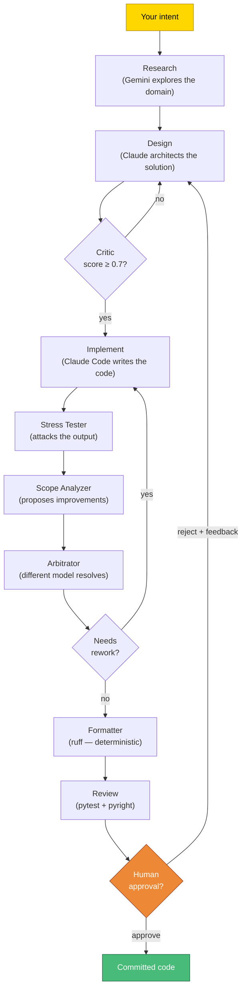

No model evaluates its own output (cross-model arbitration). The pipeline pauses for human approval before anything gets committed.

### The Nine Patterns

Each pattern is optimized for a different workload. They compose — higher-level patterns spawn lower-level ones.

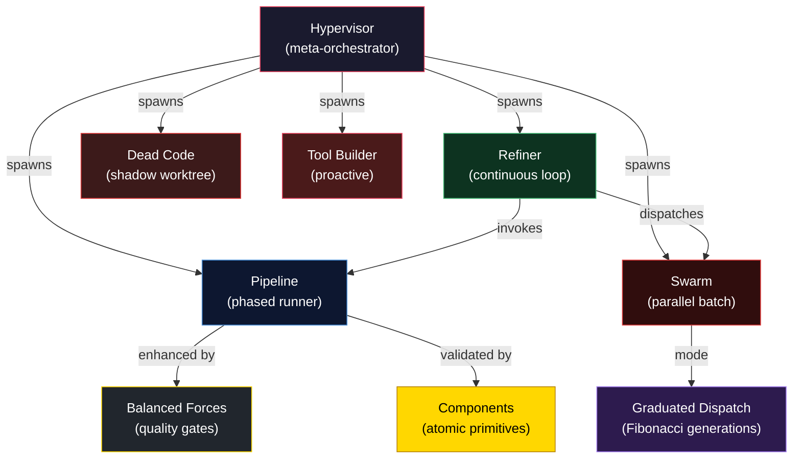

| Pattern | What it does | When to use | MCP tool |
|---|---|---|---|
| **Pipeline** | 4-phase pipeline with critic loops and balanced forces | Complex single tasks needing research + planning | `chain_pipeline` |
| **Balanced Forces** | 6 quality gate nodes inside the pipeline | Always active inside pipeline — stress test, arbitrate, format | (automatic) |
| **Refiner** | Continuous loop: assess health → triage → execute → validate → commit/revert | Autonomous codebase improvement toward a spec | `chain_refiner` |
| **Swarm** | Decompose goal → N parallel workers → merge → test | Batch operations: fix all pyright errors, add tests to 10 modules | `swarm` |
| **Graduated Dispatch** | Fibonacci generations (1→1→2→3→5) for dependent tasks | Layered builds where order matters (schema → API → frontend) | (automatic inside swarm) |
| **Hypervisor** | Monitors repo, dispatches the right pattern, enforces directives | Fully autonomous — set budget and walk away | `chain_hypervisor` |
| **Components** | Validates atomic component library — scans for violations, tests pairwise | Ensure agents use approved primitives, not raw implementations | `chain_components` |
| **Dead Code** | Static analysis in shadow worktree → delete dead code → test → merge | Codebase maintenance when bloat accumulates | `chain_deadcode` |
| **Tool Builder** | Watches your shell/git behavior → identifies friction → builds tools → opens PR | Background — observes what slows you down and fixes it | `chain_toolbuilder` |

---

## Execution Flow Examples

### Pipeline — Single Complex Task

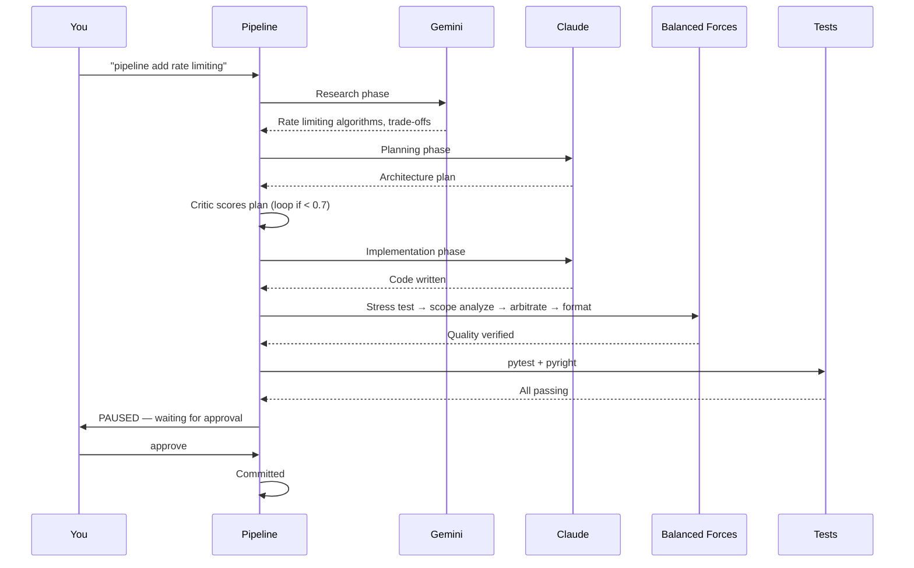

### Swarm — Parallel Batch Fix

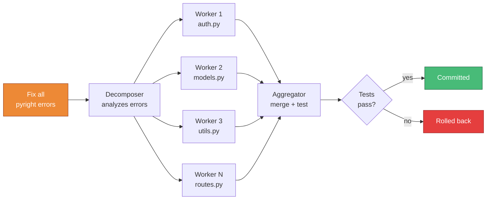

### Refiner — Autonomous Improvement

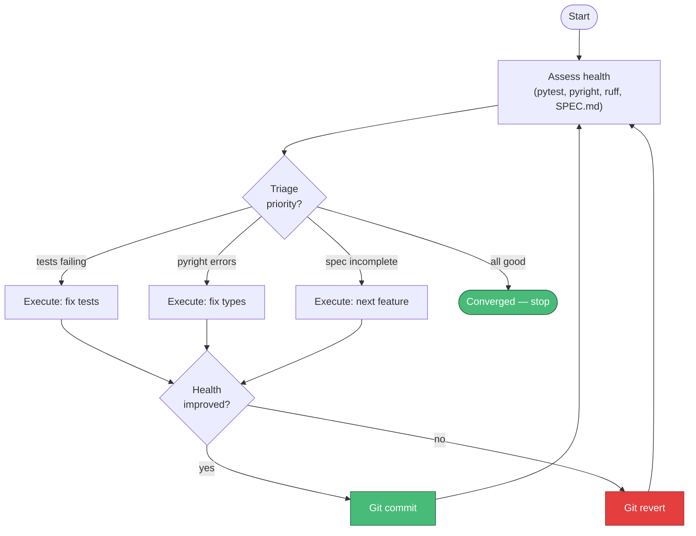

### Dead Code Eliminator — Safe Purging

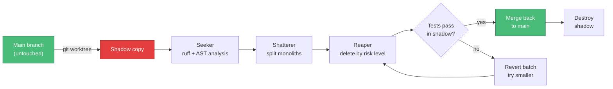

### Tool Builder — Proactive Observation

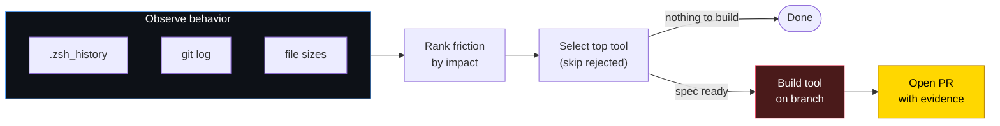

---

## Quick Start

### Prerequisites

- Python 3.12+
- [uv](https://docs.astral.sh/uv/) (Python package manager)
- API keys for [Anthropic](https://console.anthropic.com/) and [Google AI](https://aistudio.google.com/)
- Optional: [Claude Code CLI](https://docs.anthropic.com/en/docs/claude-code) and [Gemini CLI](https://github.com/google-gemini/gemini-cli) for domain nodes

### Install

```bash
git clone git@github.com:fsocietydisobey/chimera.git
cd chimera
uv sync
```

### Configure

```bash
cp .env.example .env
# Edit .env:
#   ANTHROPIC_API_KEY=sk-ant-...
#   GOOGLE_AI_API_KEY=AIza...
```

### Run

```bash
uv run chimera                     # Start the MCP server
LOG_LEVEL=DEBUG uv run chimera     # With debug logging
```

The server runs over stdio — it's meant to be connected to an MCP client, not used directly.

---

## Monitor — observability dashboard for any LangGraph project

CHIMERA ships with **chimera-monitor**, a local web dashboard that auto-discovers LangGraph projects on your machine, introspects their topology, and tails their checkpointer to surface live state. Works against CHIMERA itself, jeevy, or any other LangGraph app — no per-project code required.

What you get:

- **n8n-style canvas** — every compiled graph rendered with cluster backgrounds and cross-graph "invokes" edges
- **Live thread highlighting** — current node pulses; "lock to all" view lights up every active run simultaneously
- **Multi-thread replay** — scrub through checkpoint history per thread, or merge sister threads into one chronological "play this run start to end" timeline
- **Ghost overlay** — every node that fired in a run, numbered in execution order, with a draggable step-list card that doubles as a navigation index
- **Per-step diff inspector** — click any node, see what state changed (vs full-state dump)
- **Stuck-thread detection** — frontend flags running threads exceeding their per-project threshold with stale/stuck badges; thresholds adapt per-node based on observed p95 latencies (the system gets sharper across runs)
- **Metadata-driven** — Claude Opus scans each project's source + sample thread_ids to derive scope labels, thread parsing, and run clustering rules. No hardcoded conventions

### Try it in 2 minutes (any LangGraph project)

```bash
# 1. Clone + install with monitor extras
git clone https://github.com/fsocietydisobey/chimera.git
cd chimera
uv pip install -e '.[monitor]'

# 2. Tell chimera where to find your LangGraph project(s).
#    Create ~/.config/chimera/roots.yaml:
mkdir -p ~/.config/chimera
cat > ~/.config/chimera/roots.yaml <<EOF
roots:
  - /path/to/your/langgraph/project
  # add more projects as needed
EOF

# 3. (Optional) Set an API key for the metadata scan — Claude Opus
#    derives scope labels, thread grouping, run clustering rules.
#    Without this, the dashboard still works using AST-only topology.
export ANTHROPIC_API_KEY=sk-ant-...   # or GOOGLE_AI_API_KEY=...

# 4. Start the daemon
chimera monitor start    # Daemonizes; auto-builds frontend if stale
                         # Open http://127.0.0.1:8740
```

### Day-to-day commands

```bash
chimera monitor status                # Is the daemon up?
chimera monitor rescan <project>      # Refresh metadata cache for one project
chimera monitor stop                  # Shutdown
```

Default port: **8740** (`CHIMERA_MONITOR_PORT` to override). Binds `127.0.0.1` only — never exposed externally.

### Backends

- **PostgreSQL** (`AsyncPostgresSaver`): URL discovered from the project's `.env` (`CHECKPOINTER_DATABASE_URL`, `POSTGRES_URL`, or `DATABASE_URL`). jsonb columns parsed in-place.
- **SQLite** (`AsyncSqliteSaver`): `.db` files discovered under the project's data dir (`~/.local/share/<project>/`, `<project>/data/`, etc.). msgpack-encoded blobs decoded via LangGraph's own `JsonPlusSerializer`.

No instrumentation required — chimera-monitor is purely observational.

---

## Connect to an Editor

### Cursor

Add to your Cursor MCP config (`.cursor/mcp.json` in the project, or global settings):

```json
{
  "mcpServers": {
    "chimera": {
      "command": "uv",
      "args": ["--directory", "/path/to/chimera", "run", "chimera"],
      "env": {
        "ANTHROPIC_API_KEY": "sk-ant-...",
        "GOOGLE_AI_API_KEY": "AIza..."
      }
    }
  }
}
```

Then type in Cursor chat:

```
pipeline add rate limiting to the API endpoints
```

Cursor's AI recognizes the keyword and calls the `chain_pipeline` MCP tool.

### Claude Code

Add to your Claude Code MCP settings:

```json
{
  "mcpServers": {
    "chimera": {
      "command": "uv",
      "args": ["--directory", "/path/to/chimera", "run", "chimera"]
    }
  }
}
```

---

## Usage

### Keyword Triggers

When connected to Cursor with the routing rules (`.cursor/rules/mcp-routing.mdc`), these keywords auto-route to the right tool:

| You type | What happens |
|---|---|
| `pipeline <task>` | Full pipeline: research → plan → implement → review |
| `swarm <goal>` | Parallel dispatch: decompose → N workers → merge |
| `refiner start` | Continuous refinement loop |
| `hypervisor start` | Meta-orchestrator (autonomous) |
| `components validate` | Component library validation |
| `deadcode start` | Dead code elimination in shadow worktree |
| `toolbuilder start` | Proactive tool-builder |
| `research <question>` | Deep research via Gemini CLI |
| `architect <goal>` | Design planning via Claude CLI |
| `classify <task>` | Fast tier classification |
| `status` | Show all running/paused jobs |
| `approve` | Approve the most recent paused job |
| `reject <feedback>` | Reject with revision feedback |

### Job Lifecycle

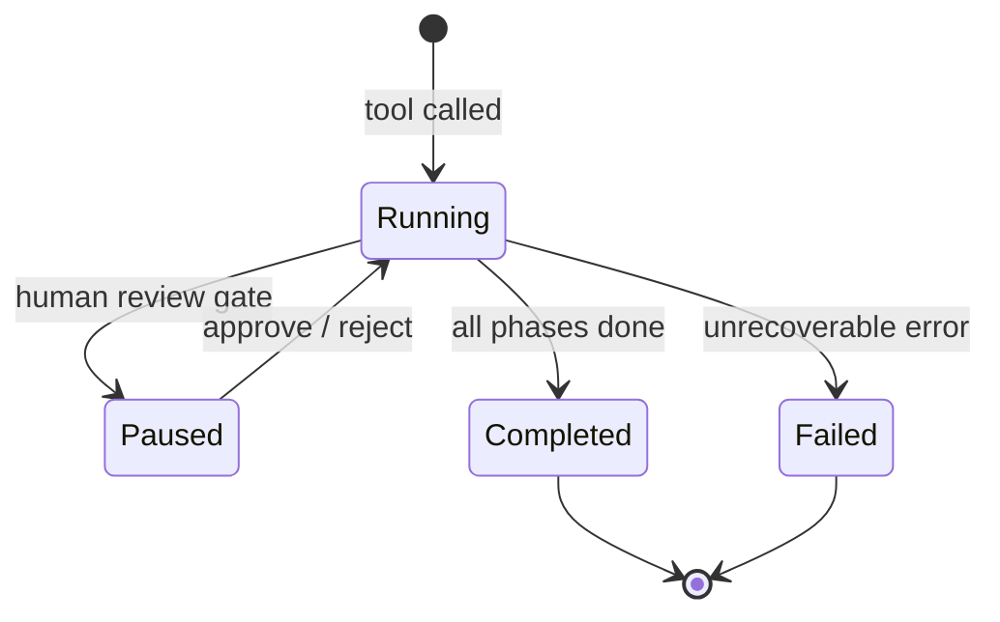

All pipeline tools run in the background and return a job ID immediately:

```
You: pipeline add WebSocket support

CHIMERA: Job started: abc12345
         Use status(job_id="abc12345") to check progress.
```

Poll progress:
```
You: status abc12345

CHIMERA:
  [12.3s] Loading past run context
  [15.1s] Phase router → research
  [45.2s] [research] Research completed
  [47.0s] Phase router → planning
  [89.3s] [planning] Architect: plan ready
  [91.1s] [planning] Critic: score 0.85 → plan_approved
  ...
  Paused — waiting for human approval
```

Approve or reject:
```
You: approve                              # proceed with implementation
You: reject use Redis instead of memcached  # revise with feedback
```

### Direct MCP Tool Calls

For programmatic use or when keyword routing doesn't trigger:

```python
# Full pipeline
chain_pipeline(task_description="Add rate limiting", context="FastAPI backend")

# Parallel batch
swarm(goal="Fix all pyright errors", budget=2.0, max_agents=10)

# Continuous refinement
chain_refiner(max_cycles=50, budget=5.0)

# Meta-orchestrator
chain_hypervisor(budget=10.0)

# Component validation
chain_components()

# Dead code elimination
chain_deadcode()

# Proactive tool-builder
chain_toolbuilder()
```

---

## Tools Reference

| Tool | Args | What it does |
|---|---|---|
| `chain_pipeline` | `task, context?, thread_id?` | SPR-4 phased pipeline with balanced forces. Pauses for approval. |
| `chain_refiner` | `max_cycles?, budget?` | Continuous refinement loop until convergence or budget. |
| `swarm` | `goal, budget?, max_agents?` | Parallel dispatch — decompose, fan out, merge, test. |
| `chain_hypervisor` | `budget?` | Autonomous meta-orchestrator — spawns the right pattern. |
| `chain_components` | — | Validate atomic component library. Scan + test + enforce. |
| `chain_deadcode` | — | Find and remove dead code in an isolated shadow worktree. |
| `chain_toolbuilder` | — | Observe behavior, identify friction, build tools, open PR. |
| `chain` | `task, context?, thread_id?` | Supervisor pipeline (hub-and-spoke routing). |
| `research` | `question, context?` | Direct Gemini CLI exploration. |
| `architect` | `goal, context?, constraints?` | Direct Claude CLI design. |
| `classify` | `task_description` | Fast task classification (research/architect/implement). |
| `status` | `job_id?` | Check job progress. Empty = list all jobs. |
| `approve` | `job_id, feedback?` | Approve or reject (with feedback) a paused job. |
| `history` | `thread_id, limit?` | View checkpoint history for a thread. |
| `rewind` | `thread_id, checkpoint_id, new_task?` | Time-travel to a previous checkpoint. |
| `health` | — | Server status and uptime. |

---

## Architecture

### System Overview

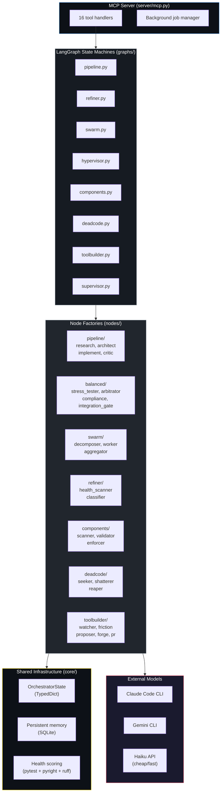

### Multi-Model Strategy

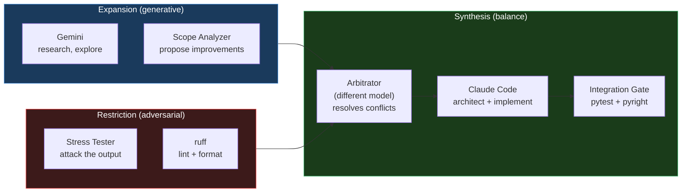

| Role | Model | Why |
|---|---|---|
| Research / exploration | Gemini (via CLI) | Large context, good at synthesis |
| Architecture / implementation | Claude Code (via CLI) | Codebase-aware, file editing |
| Classification / routing | Haiku (via API) | Fast, cheap, structured output |
| Adversarial review | Different model from builder | No self-evaluation bias |
| Formatting / linting | Deterministic tools (ruff) | Zero LLM cost, reproducible |

### State & Persistence

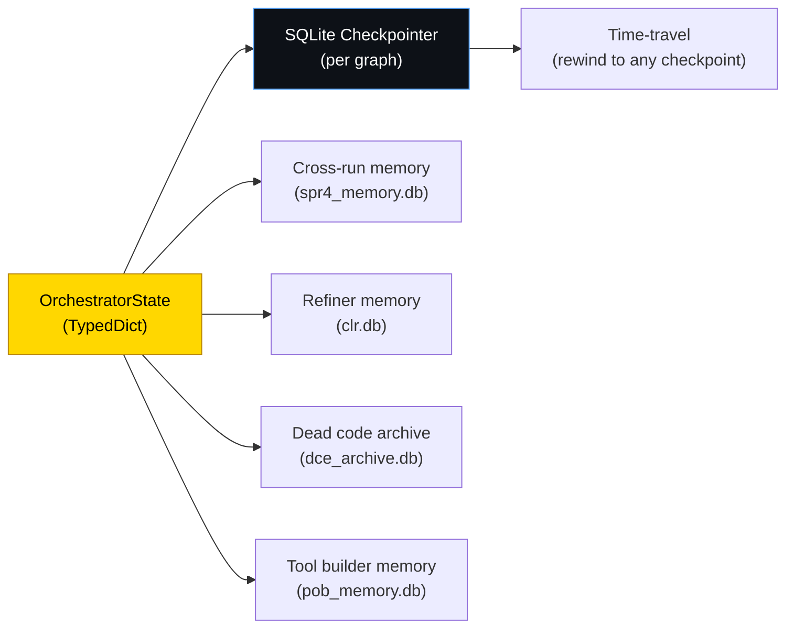

All nodes read from and write to a single `OrchestratorState` TypedDict. Each graph has its own SQLite checkpointer — every state transition is persisted, enabling `history()` and `rewind()` for time-travel debugging.

---

## Project Structure

```
src/chimera/
├── server/
│   ├── mcp.py           # MCP server — 16 tool handlers
│   └── jobs.py          # Background job registry + desktop notifications
├── graphs/              # LangGraph state machines (one per pattern)
│   ├── pipeline.py      # research → plan → implement → review
│   ├── refiner.py       # assess → triage → execute → validate → loop
│   ├── swarm.py         # decompose → fan-out workers → merge
│   ├── hypervisor.py    # assess → dispatch → enforce directives → loop
│   ├── components.py    # scan → validate → enforce → report
│   ├── deadcode.py      # shadow worktree → seek → shatter → reap → merge
│   ├── toolbuilder.py   # watch → analyze → propose → forge → PR
│   └── supervisor.py    # hub-and-spoke (dynamic routing)
├── nodes/               # Node factories — async functions that read/write state
│   ├── pipeline/        # research, architect, implement, critic
│   ├── balanced/        # stress_tester, scope_analyzer, arbitrator, compliance, retry_controller, integration_gate
│   ├── swarm/           # task_decomposer, worker, aggregator
│   ├── refiner/         # health_scanner, classifier
│   ├── components/      # scanner, validator, enforcer
│   ├── deadcode/        # seeker, shatterer, reaper
│   └── toolbuilder/     # watcher, friction, proposer, forge, pr_creator
├── subgraphs/           # Pipeline phase subgraphs (research, planning, implementation, review)
├── core/                # State, guards, memory, fitness, directives, resource control
├── config/              # YAML config loader, provider adapters (Anthropic, Google)
├── cli/                 # Claude Code CLI and Gemini CLI subprocess runners
├── prompts/             # System prompts for research, architect, classifier
└── tools/               # Filesystem, git operations, worktree management
```

---

## Design Philosophy

The architecture is inspired by Lurianic Kabbalah — not as metaphor, but as a structural framework. The Kabbalistic concepts of progressive constraint (Tzimtzum), balanced forces (Sefirot), and repair through gathering scattered sparks (Tikkun) map directly to how the system constrains AI models, balances expansion vs. restriction, and iteratively assembles quality output.

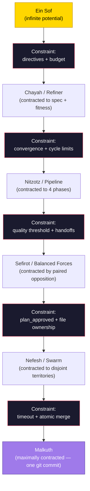

The entire system is a gradient of progressive constraints — from infinite potential to maximally constrained physical reality. Each layer performs its own contraction, creating bounded space for the layer below. The constraint IS the creative act. The boundary IS the architecture.

The mythology lives in [`docs/genesis-story.md`](docs/genesis-story.md). The code uses descriptive technical names.

---

## Documentation

- **[Design Philosophy](docs/genesis-story.md)** — The Kabbalistic architecture explained
- **[Commands Reference](docs/genesis-commands.md)** — Every command with examples
- **[Usage Guide](docs/usage-guide.md)** — How to use from Cursor
- **[Architecture Patterns](tasks/architecture-patterns-technical.md)** — Technical specification of all 9 patterns
