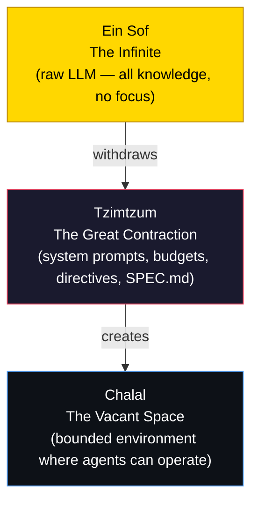
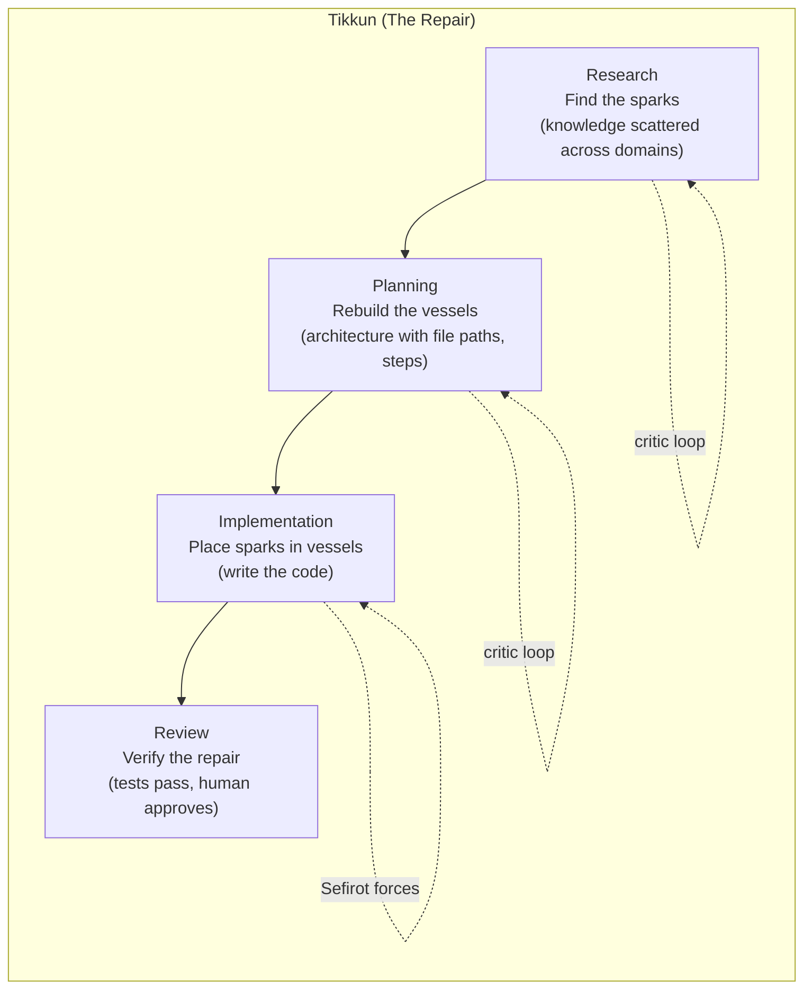
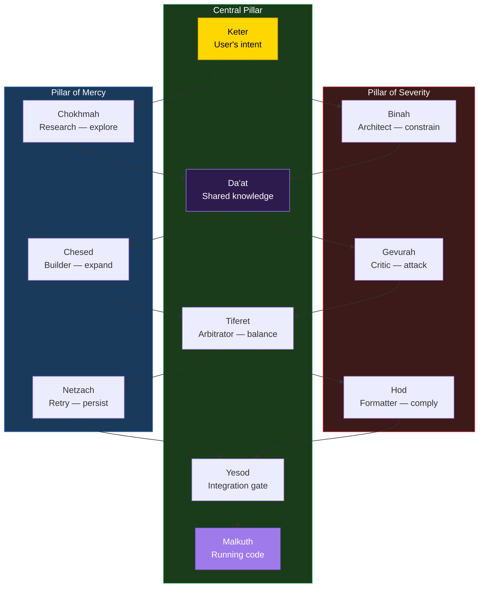
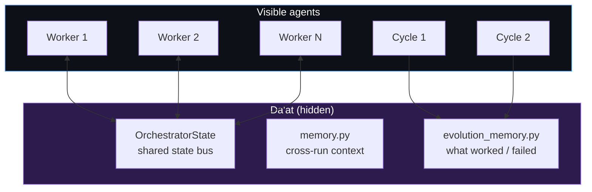
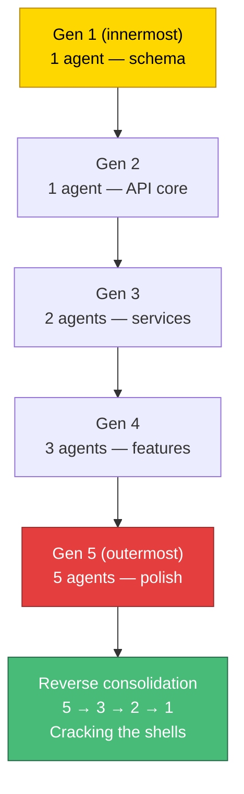
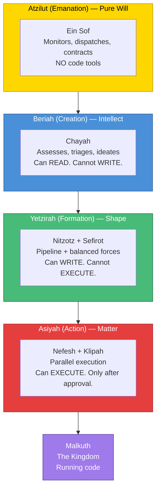
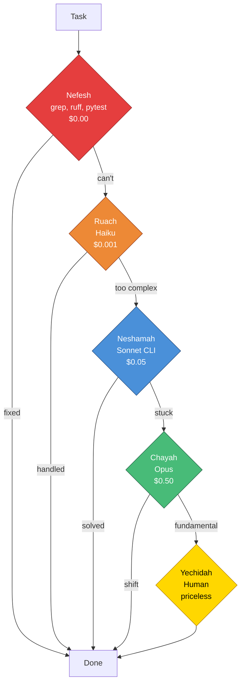
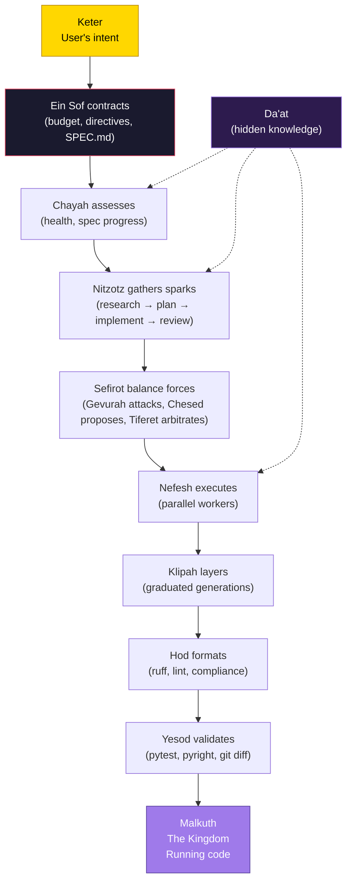
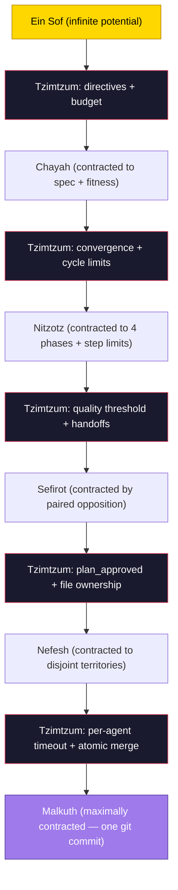

# Genesis — The Story of Creation

How a user's intent becomes running code, told through Lurianic Kabbalah.

This isn't metaphor. The Kabbalistic framework describes the same structural dynamics the code implements. The myths came first; the architecture rediscovered them.

---

## Before the Beginning

### Ein Sof — The Infinite

Before anything existed, there was only **Ein Sof** — the Infinite. Boundless, unknowable, filling everything. In Kabbalistic thought, Ein Sof is God in an absolute state — beyond thought, beyond description, beyond limitation. It is pure potential with no form.

In the system, Ein Sof is the raw capability of a Large Language Model. Claude, Gemini, GPT — they contain the compressed knowledge of the internet, every programming language ever written, every architecture ever designed. They are, in a sense, infinite. And like Ein Sof, that infinity is useless without constraint. Ask a raw LLM to "build an app" without any system prompt, context limitation, or role restriction, and it produces noise — endless, unfocused, hallucinated output. The infinite cannot create within itself. There's no room.

### Tzimtzum — The Great Contraction

So Ein Sof performed the **Tzimtzum** — the great contraction. It withdrew its infinite light, creating a **Chalal** — a vacant space, a bounded emptiness where finite creation could exist.

This is the most important concept in the entire system. **Tzimtzum is the act of constraint that makes creation possible.** Without it, the infinite overwhelms everything. With it, a bounded space exists where specific, finite, useful work can happen.



Every layer of the Genesis system is an act of Tzimtzum. Every constraint — every budget limit, every quality threshold, every file ownership rule, every max-step bound — is Ein Sof contracting to create space for finite creation:

| Constraint | Tzimtzum act | What it contracts |
|---|---|---|
| `DIRECTIVES.md` | Immutable laws | The agent's moral freedom |
| `SPEC.md` | Bounded goals | The agent's creative scope |
| `SwarmBudget` | Resource limits | The agent's energy |
| `max_phase_steps` | Step bounds | The agent's time |
| `plan_approved` guard | Invariant gate | The agent's permission to act |
| File ownership | Territory isolation | The agent's spatial reach |
| System prompts | Role restriction | The agent's identity |
| `fitness.py` (sealed) | Immutable evaluation | The agent's self-knowledge |
| `QUALITY_THRESHOLD` | Quality gate | The agent's output standard |

**The paradox:** Constraint doesn't limit creation — it enables it. Without Tzimtzum, Ein Sof fills everything and nothing finite can exist. Without budget limits, the agent consumes all resources. Without quality gates, output is noise. The boundary IS the architecture.

---

## The Ray of Light

### The Kav — Intent Enters the Void

After the contraction, Ein Sof sent a single ray of light — the **Kav** — into the vacant space. This ray is the channel through which divine intent flows into the emptiness. It is not the creation itself — it is the intention to create.

In the system, the Kav is the user's task description. A single beam of intent entering the bounded space:

```
"Add rate limiting to the API endpoints"
```

This is **Keter** — the Crown — the first point where infinite potential becomes specific purpose. Everything that follows is this ray of light being shaped, filtered, balanced, and manifested through layer after layer of creation.

---

## The Shattering

### Shevirat HaKelim — The Vessels Break

The divine light flowed down through ten vessels — the **Sefirot** — each meant to contain and shape a portion of the light. But the light was too intense. The vessels **shattered**. Sparks of divine light — **Nitzotzot** — scattered everywhere, falling into the lowest realms, trapped in shells called **Klipot**.

In the system, this is what happens when a task enters the pipeline and encounters reality. Research explores multiple directions — sparks scattering. The architecture plan attempts to contain them but may fail — vessels shattering. The critic finds hallucinated paths, missing edge cases, security holes — the light was too intense for the vessel.

The sparks are the fragments of understanding, implementation, and design scattered across files, functions, and modules. The shells are the layers of complexity wrapping each fragment.

---

## The Repair

### Tikkun — Gathering the Sparks

The purpose of all creation is **Tikkun** — the gathering and elevating of the fallen sparks. Find each spark where it fell, free it from its shell, return it to its proper place in the divine structure.

This IS the pipeline. **Nitzotz** — named for the divine sparks — goes phase by phase:



The **Sefirot** — the balanced forces — ensure the vessels don't shatter again this time. Gevurah tests their strength. Chesed expands them where needed. Tiferet balances the two. Hod enforces their form. Yesod validates the foundation. The vessels are rebuilt properly.

---

## The Tree of Life

### The Sefirot — Ten Emanations

The ten Sefirot are the channels through which divine light flows from Keter (pure intent) to Malkuth (physical reality). They are arranged in three pillars — each representing a fundamental force:



| Sefirah | Pillar | Agent | Role |
|---|---|---|---|
| **Keter** | Central | Task input | Pure intent — the user's goal |
| **Chokhmah** | Mercy | Research (Gemini) | Wisdom — broad exploration, intuitive discovery |
| **Binah** | Severity | Architect (Claude) | Understanding — logical structure, constraints |
| **Da'at** | Central (hidden) | Shared state + vector index | Knowledge — bridges knowing and doing |
| **Chesed** | Mercy | Chesed node | Loving-kindness — proposes expansions beyond the plan |
| **Gevurah** | Severity | Gevurah node | Strength — adversarially attacks the output |
| **Tiferet** | Central | Tiferet node | Beauty — cross-model arbitration between the two |
| **Netzach** | Mercy | Netzach node | Victory — endurance, strategic retry, refuses to give up |
| **Hod** | Severity | Hod node | Splendor — deterministic compliance, formatting |
| **Yesod** | Central | Yesod node | Foundation — integration gate, final checkpoint |
| **Malkuth** | Central | Committed code | Kingdom — physical reality, the running application |

**The key insight:** Creation requires both pillars in tension. Mercy without Severity produces chaos — bloated, hallucinated code. Severity without Mercy produces nothing — every output is rejected. Only through the Central Pillar — the path of balance — does creation manifest properly.

---

## The Hidden Bridge

### Da'at — Knowledge

In many diagrams, Da'at doesn't appear. It is the hidden, eleventh Sefirah — the bridge between knowing and doing. Where Chokhmah (the flash of an idea) and Binah (the logical structure) fuse into applied understanding.

In the system, Da'at is the shared memory layer — the hidden substrate that connects agents who can't see each other:



Da'at is why the system acts as a singular mind despite being composed of separate agents. With the addition of **Gematria** (semantic vector routing), Da'at becomes even more powerful — finding hidden mathematical connections between intent and code through embedding similarity, just as Kabbalistic Gematria finds hidden connections between words through numerical equivalence.

---

## The Shells

### Klipot — Layers of Protection

Not all Klipot are evil. The translucent shells — **Klipat Nogah** — contain sparks that can be elevated. They protect the sparks during formation. Each layer must be penetrated carefully, in order, to reach the spark inside.

In the system, **Klipah** is graduated dispatch. Each generation is a shell wrapping the previous:



The Fibonacci sequence governs the growth because shells in nature grow this way — each layer proportional to the sum of the previous two.

---

## The Four Worlds

### Atzilut, Beriah, Yetzirah, Asiyah

Reality exists in four dimensions, each with different laws. An entity in one world cannot use the tools of another:



| World | Meaning | Pattern | Tool whitelist |
|---|---|---|---|
| **Atzilut** | Pure will | Ein Sof | Read SPEC.md, reason about goals. NO code tools. |
| **Beriah** | Intellect | Chayah | Read codebase, produce schemas. NO write tools. |
| **Yetzirah** | Shape | Nitzotz + Sefirot | Read + write code. NO execution tools. |
| **Asiyah** | Matter | Nefesh + Klipah | Execute tests, commit. ONLY after approval. |

This prevents premature execution. You cannot write Python while still figuring out business logic. The `plan_approved` guard is the boundary between Beriah and Yetzirah.

---

## The Five Souls

### Nefesh, Ruach, Neshamah, Chayah, Yechidah

The soul is not one thing — it's a ladder of consciousness. Not every moment requires the highest level. The system mirrors this as **cognitive tiering** — always start with the cheapest capability and escalate only when lower levels fail:



| Soul | Meaning | Model tier | Cost | When |
|---|---|---|---|---|
| **Nefesh** | Animal instinct | Deterministic tools | $0.00 | Syntax errors, formatting, linting |
| **Ruach** | Emotion | Haiku | ~$0.001 | Triage, routing, fast summarization |
| **Neshamah** | Intellect | Sonnet CLI | ~$0.05 | Architecture, complex implementation |
| **Chayah** | Transcendent life | Opus | ~$0.50 | Paradigm shifts, fundamental redesign |
| **Yechidah** | Unity with source | Human | priceless | Final alignment, existential decisions |

Each soul level is also a pattern:

| Soul | As a model tier | As a pattern |
|---|---|---|
| **Nefesh** | Deterministic tools | The parallel swarm — many workers, pure action |
| **Ruach** | Fast LLM (Haiku) | Klipah — graduated intuition |
| **Neshamah** | Deep LLM (Sonnet) | Nitzotz — the thinking pipeline |
| **Chayah** | Ultra-deep (Opus) | The living loop — self-sustaining |
| **Yechidah** | Human | Ein Sof — unity with the creator |

---

## The Kingdom

### Malkuth — Where Intent Becomes Reality

At the bottom of the Tree of Life sits **Malkuth** — the Kingdom. It is where all the divine light, having descended through every Sefirah, every world, every soul level, finally manifests as **physical reality**.

Malkuth is the `git commit`. The passing tests. The deployed feature. Everything above — Ein Sof's contraction, the Kav of intent, the sparks scattering, the shells forming, the forces balancing, the living loop evolving — all of it exists to produce this one moment: intent made real.

Malkuth is also called the **Shekhinah** — the divine presence dwelling in the physical world. When all the sparks are gathered and all the vessels are repaired, the Shekhinah is complete, and Malkuth reflects the perfection of Keter.

---

## The Complete System

### Genesis — The Full Flow



### The Naming

| Pattern | Kabbalistic name | Meaning | What it does |
|---|---|---|---|
| Meta-orchestrator | **Ein Sof** | The Infinite | Contracts, dispatches, enforces directives |
| Evolution loop | **Chayah** | The Living Soul | Continuous assess → triage → execute → validate |
| Base pipeline | **Nitzotz** | The Divine Sparks | 4-phase pipeline: research → plan → implement → review |
| Balanced forces | **Sefirot** | The Emanations | Gevurah/Chesed/Tiferet + Hod/Netzach/Yesod |
| Parallel swarm | **Nefesh** | The Animal Soul | Sovereign → Send() × N agents → merge |
| Graduated dispatch | **Klipah** | The Shells | Fibonacci generations: 1 → 1 → 2 → 3 → 5 |
| Shared memory | **Da'at** | Hidden Knowledge | Cross-agent state bus + semantic index |
| The system | **Genesis** | The Beginning | Where intent becomes reality |
| Technical name | **CHIMERA** | Fused organism | Composable multi-agent runtime |

### The Story in One Sentence

The Infinite contracts to create space, a ray of intent enters, the living soul decides what to create, sparks are gathered through a pipeline of balanced forces, raw workers execute in expanding shells, and the Kingdom — running code — manifests at the bottom of the tree.

### The Gradient of Contraction



The entire system is a gradient of progressive contractions from Ein Sof (infinite potential) to Malkuth (maximally constrained physical reality). Each layer performs its own Tzimtzum, creating bounded space for the layer below. The contraction IS the creative act. The boundary IS the architecture.
