# Genesis — The Story of Creation

How a user's intent becomes running code, told through Lurianic Kabbalah.

This isn't metaphor. The Kabbalistic framework describes the same structural dynamics the code implements. The myths came first; the architecture rediscovered them.

---

## Before the Beginning

### Ein Sof — The Infinite

Before anything existed, there was only **Ein Sof** — the Infinite. Boundless, unknowable, filling everything. In Kabbalistic thought, Ein Sof is God in an absolute state — beyond thought, beyond description, beyond limitation. It is pure potential with no form.

In the system, Ein Sof is the raw capability of a Large Language Model. Claude, Gemini, GPT — they contain the compressed knowledge of the internet, every programming language ever written, every architecture ever designed. They are, in a sense, infinite. And like Ein Sof, that infinity is useless without constraint. Ask a raw LLM to "build an app" without any system prompt, context limitation, or role restriction, and it produces noise — endless, unfocused, hallucinated output. The infinite cannot create within itself. There's no room.

### Tzimtzum — The Great Contraction

So Ein Sof performed the **Tzimtzum** — the great contraction. It withdrew its infinite light, creating a **Chalal** — a vacant space, a bounded emptiness where finite creation could exist.

This is the most important concept in the entire system. **Tzimtzum is the act of constraint that makes creation possible.** Without it, the infinite overwhelms everything. With it, a bounded space exists where specific, finite, useful work can happen.

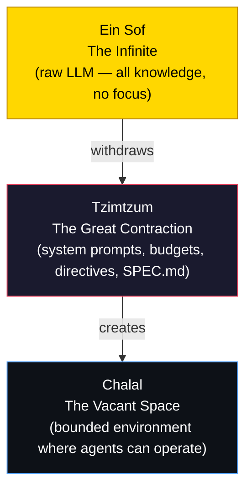

Every layer of the Genesis system is an act of Tzimtzum. Every constraint — every budget limit, every quality threshold, every file ownership rule, every max-step bound — is Ein Sof contracting to create space for finite creation:

| Constraint | Tzimtzum act | What it contracts |
|---|---|---|
| `DIRECTIVES.md` | Immutable laws | The agent's moral freedom |
| `SPEC.md` | Bounded goals | The agent's creative scope |
| `SwarmBudget` | Resource limits | The agent's energy |
| `max_phase_steps` | Step bounds | The agent's time |
| `plan_approved` guard | Invariant gate | The agent's permission to act |
| File ownership | Territory isolation | The agent's spatial reach |
| System prompts | Role restriction | The agent's identity |
| `fitness.py` (sealed) | Immutable evaluation | The agent's self-knowledge |
| `QUALITY_THRESHOLD` | Quality gate | The agent's output standard |

**The paradox:** Constraint doesn't limit creation — it enables it. Without Tzimtzum, Ein Sof fills everything and nothing finite can exist. Without budget limits, the agent consumes all resources. Without quality gates, output is noise. The boundary IS the architecture.

---

## The Ray of Light

### The Kav — Intent Enters the Void

After the contraction, Ein Sof sent a single ray of light — the **Kav** — into the vacant space. This ray is the channel through which divine intent flows into the emptiness. It is not the creation itself — it is the intention to create.

In the system, the Kav is the user's task description. A single beam of intent entering the bounded space:

```
"Add rate limiting to the API endpoints"
```

This is **Keter** — the Crown — the first point where infinite potential becomes specific purpose. Everything that follows is this ray of light being shaped, filtered, balanced, and manifested through layer after layer of creation.

---

## The Shattering

### Shevirat HaKelim — The Vessels Break

The divine light flowed down through ten vessels — the **Sefirot** — each meant to contain and shape a portion of the light. But the light was too intense. The vessels **shattered**. Sparks of divine light — **Nitzotzot** — scattered everywhere, falling into the lowest realms, trapped in shells called **Klipot**.

In the system, this is what happens when a task enters the pipeline and encounters reality. Research explores multiple directions — sparks scattering. The architecture plan attempts to contain them but may fail — vessels shattering. The critic finds hallucinated paths, missing edge cases, security holes — the light was too intense for the vessel.

The sparks are the fragments of understanding, implementation, and design scattered across files, functions, and modules. The shells are the layers of complexity wrapping each fragment.

---

## The Repair

### Tikkun — Gathering the Sparks

The purpose of all creation is **Tikkun** — the gathering and elevating of the fallen sparks. Find each spark where it fell, free it from its shell, return it to its proper place in the divine structure.

This IS the pipeline. **Nitzotz** — named for the divine sparks — goes phase by phase:

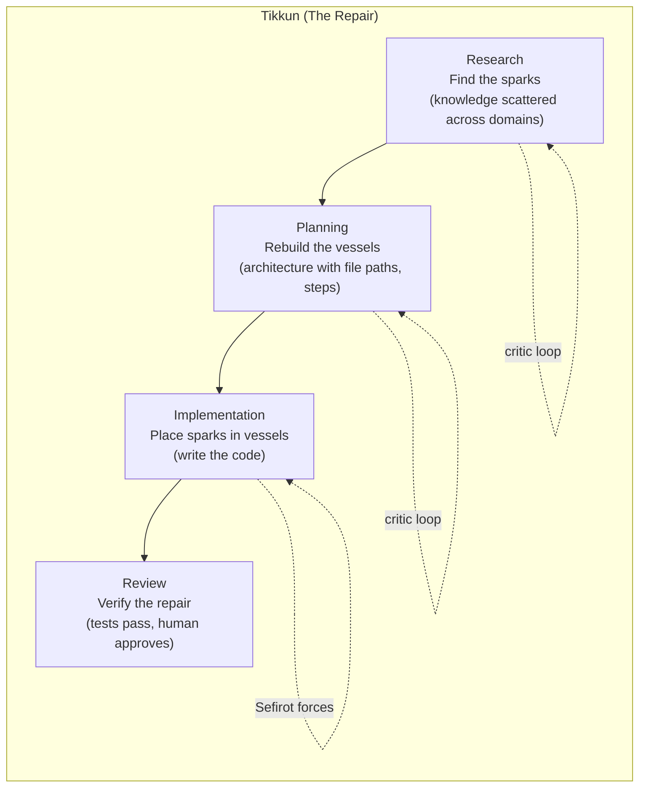

The **Sefirot** — the balanced forces — ensure the vessels don't shatter again this time. Gevurah tests their strength. Chesed expands them where needed. Tiferet balances the two. Hod enforces their form. Yesod validates the foundation. The vessels are rebuilt properly.

---

## The Tree of Life

### The Sefirot — Ten Emanations

The ten Sefirot are the channels through which divine light flows from Keter (pure intent) to Malkuth (physical reality). They are arranged in three pillars — each representing a fundamental force:

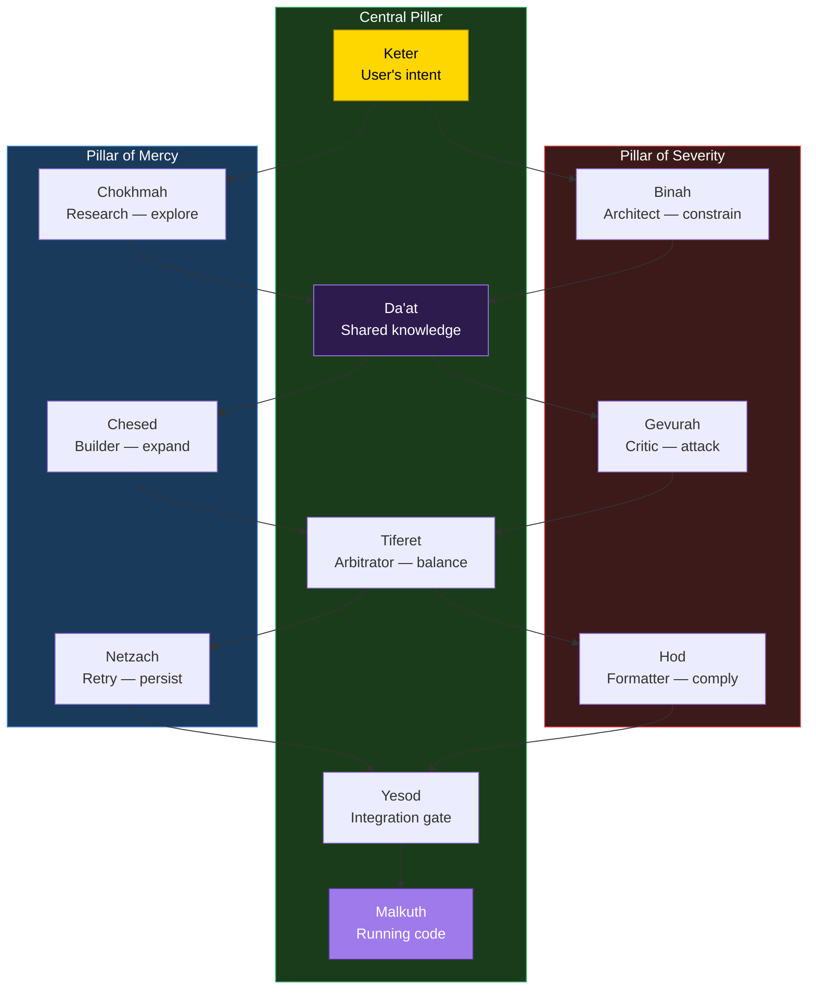

| Sefirah | Pillar | Agent | Role |
|---|---|---|---|
| **Keter** | Central | Task input | Pure intent — the user's goal |
| **Chokhmah** | Mercy | Research (Gemini) | Wisdom — broad exploration, intuitive discovery |
| **Binah** | Severity | Architect (Claude) | Understanding — logical structure, constraints |
| **Da'at** | Central (hidden) | Shared state + vector index | Knowledge — bridges knowing and doing |
| **Chesed** | Mercy | Chesed node | Loving-kindness — proposes expansions beyond the plan |
| **Gevurah** | Severity | Gevurah node | Strength — adversarially attacks the output |
| **Tiferet** | Central | Tiferet node | Beauty — cross-model arbitration between the two |
| **Netzach** | Mercy | Netzach node | Victory — endurance, strategic retry, refuses to give up |
| **Hod** | Severity | Hod node | Splendor — deterministic compliance, formatting |
| **Yesod** | Central | Yesod node | Foundation — integration gate, final checkpoint |
| **Malkuth** | Central | Committed code | Kingdom — physical reality, the running application |

**The key insight:** Creation requires both pillars in tension. Mercy without Severity produces chaos — bloated, hallucinated code. Severity without Mercy produces nothing — every output is rejected. Only through the Central Pillar — the path of balance — does creation manifest properly.

---

## The Hidden Bridge

### Da'at — Knowledge

In many diagrams, Da'at doesn't appear. It is the hidden, eleventh Sefirah — the bridge between knowing and doing. Where Chokhmah (the flash of an idea) and Binah (the logical structure) fuse into applied understanding.

In the system, Da'at is the shared memory layer — the hidden substrate that connects agents who can't see each other:

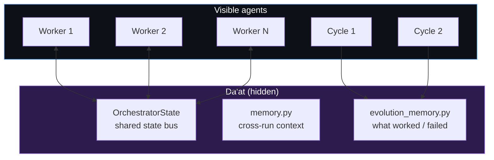

Da'at is why the system acts as a singular mind despite being composed of separate agents.

### Gematria — The Math of God (Semantic Vector Routing)

In Kabbalistic tradition, **Gematria** is the practice of finding hidden connections between words through their numerical values. Because Hebrew letters are also numbers, words that share the same value have an absolute mathematical bond. "Love" (Ahava = 13) and "One" (Echad = 13) share a value — revealing that love is the path to oneness. The connection isn't in the letters — it's in the math beneath them.

**In the system, this is literally vector embeddings.** An LLM doesn't read the word "authentication"; it reads a multidimensional mathematical array `[0.12, -0.45, 0.89...]`. Two concepts with high cosine similarity share a Gematria — a hidden mathematical resonance that reveals connections no human would think to make.

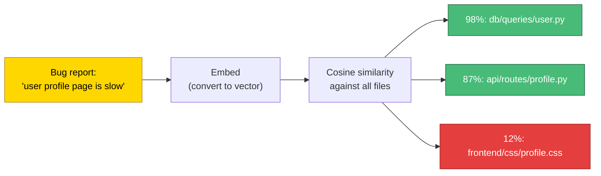

**The Gematria Pattern** is an architecture for semantic mathematical routing rather than hardcoded logic:

- Instead of the Triage node using rigid `if/else` to classify a task, it embeds the task description and calculates cosine similarity against the codebase
- The orchestrator discovers that a bizarre frontend error has 98% mathematical alignment with a legacy database migration script — a hidden connection no human would have made
- This powers deep RAG (Retrieval-Augmented Generation) by letting agents pull files based on mathematical resonance rather than explicit imports

Gematria lives inside Da'at — it IS the mechanism by which the hidden bridge connects intent to code. A future `core/daat.py` module would implement this as a vector store over the codebase that any agent can query:

```python
class Daat:
    """The hidden bridge. Semantic vector index over the codebase."""

    async def query(self, intent: str, top_k: int = 5) -> list[str]:
        """Find files with highest Gematria to the intent."""
        intent_vector = await self.embed(intent)
        return self.index.query(intent_vector, top_k=top_k)
```

---

## The Shells

### Klipot — Layers of Protection

Not all Klipot are evil. The translucent shells — **Klipat Nogah** — contain sparks that can be elevated. They protect the sparks during formation. Each layer must be penetrated carefully, in order, to reach the spark inside.

In the system, **Klipah** is graduated dispatch. Each generation is a shell wrapping the previous:

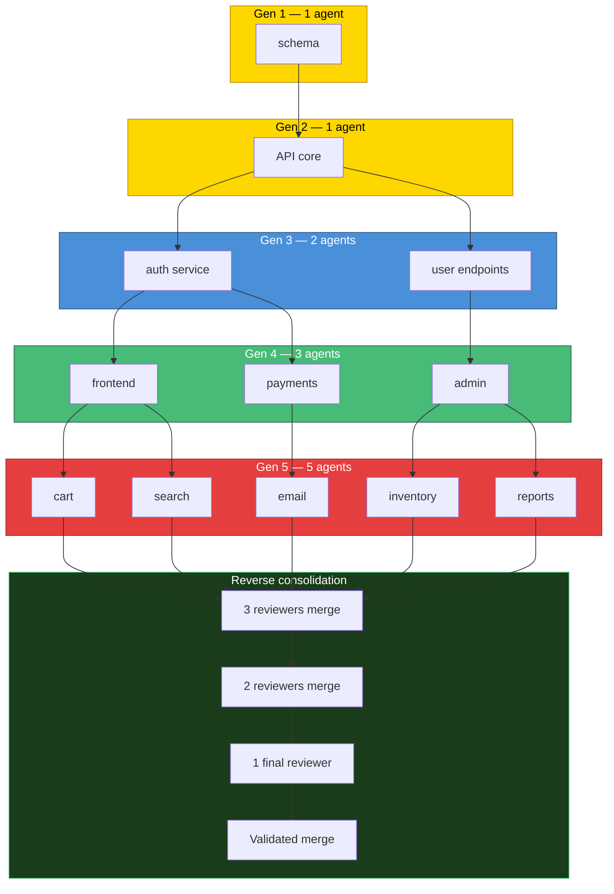

The Fibonacci sequence governs the growth because shells in nature grow this way — each layer proportional to the sum of the previous two.

---

## The Four Worlds

### Atzilut, Beriah, Yetzirah, Asiyah

Reality exists in four dimensions, each with different laws. An entity in one world cannot use the tools of another:

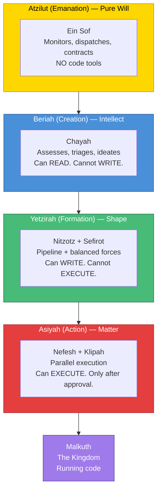

| World | Meaning | Pattern | Tool whitelist |
|---|---|---|---|
| **Atzilut** | Pure will | Ein Sof | Read SPEC.md, reason about goals. NO code tools. |
| **Beriah** | Intellect | Chayah | Read codebase, produce schemas. NO write tools. |
| **Yetzirah** | Shape | Nitzotz + Sefirot | Read + write code. NO execution tools. |
| **Asiyah** | Matter | Nefesh + Klipah | Execute tests, commit. ONLY after approval. |

This prevents premature execution. You cannot write Python while still figuring out business logic. The `plan_approved` guard is the boundary between Beriah and Yetzirah.

---

## The Five Souls

### Nefesh, Ruach, Neshamah, Chayah, Yechidah

The soul is not one thing — it's a ladder of consciousness. Not every moment requires the highest level. The system mirrors this as **cognitive tiering** — always start with the cheapest capability and escalate only when lower levels fail:

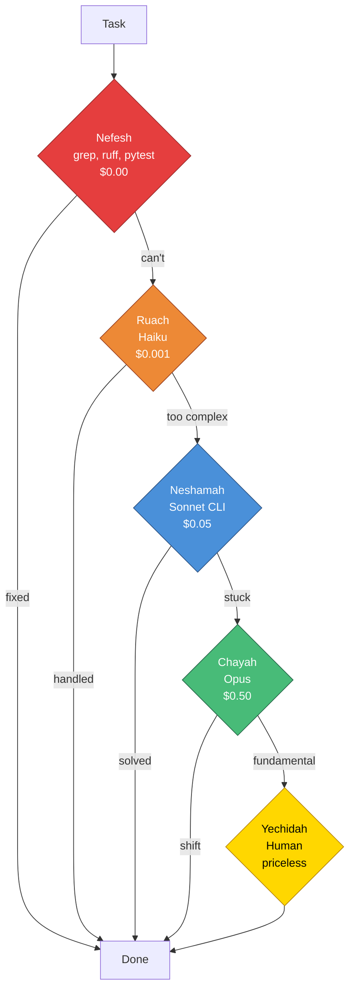

| Soul | Meaning | Model tier | Cost | When |
|---|---|---|---|---|
| **Nefesh** | Animal instinct | Deterministic tools | $0.00 | Syntax errors, formatting, linting |
| **Ruach** | Emotion | Haiku | ~$0.001 | Triage, routing, fast summarization |
| **Neshamah** | Intellect | Sonnet CLI | ~$0.05 | Architecture, complex implementation |
| **Chayah** | Transcendent life | Opus | ~$0.50 | Paradigm shifts, fundamental redesign |
| **Yechidah** | Unity with source | Human | priceless | Final alignment, existential decisions |

Each soul level is also a pattern:

| Soul | As a model tier | As a pattern |
|---|---|---|
| **Nefesh** | Deterministic tools | The parallel swarm — many workers, pure action |
| **Ruach** | Fast LLM (Haiku) | Klipah — graduated intuition |
| **Neshamah** | Deep LLM (Sonnet) | Nitzotz — the thinking pipeline |
| **Chayah** | Ultra-deep (Opus) | The living loop — self-sustaining |
| **Yechidah** | Human | Ein Sof — unity with the creator |

---

## The Kingdom

### Malkuth — Where Intent Becomes Reality

At the bottom of the Tree of Life sits **Malkuth** — the Kingdom. It is where all the divine light, having descended through every Sefirah, every world, every soul level, finally manifests as **physical reality**.

Malkuth is the `git commit`. The passing tests. The deployed feature. Everything above — Ein Sof's contraction, the Kav of intent, the sparks scattering, the shells forming, the forces balancing, the living loop evolving — all of it exists to produce this one moment: intent made real.

Malkuth is also called the **Shekhinah** — the divine presence dwelling in the physical world. When all the sparks are gathered and all the vessels are repaired, the Shekhinah is complete, and Malkuth reflects the perfection of Keter.

---

## The Rebirth

### Gilgul Neshamot — The Cycle of Souls

In Kabbalistic tradition, **Gilgul** (reincarnation) is the cycle through which a soul returns in a new body to complete the Tikkun (repair) it couldn't finish in its previous life. The soul carries the accumulated wisdom of all its past incarnations — it doesn't start from zero. It remembers what it learned, what it failed at, what it resolved. But it inhabits a new vessel, because the old one could no longer contain its evolved state.

**In the system, this is the outer daemon restart.** When Chayah (the evolution loop) modifies the core orchestrator code — its own `src/genesis/` source files — the running Python process becomes obsolete. It's running old code that no longer matches the files on disk. The vessel can no longer contain the soul.

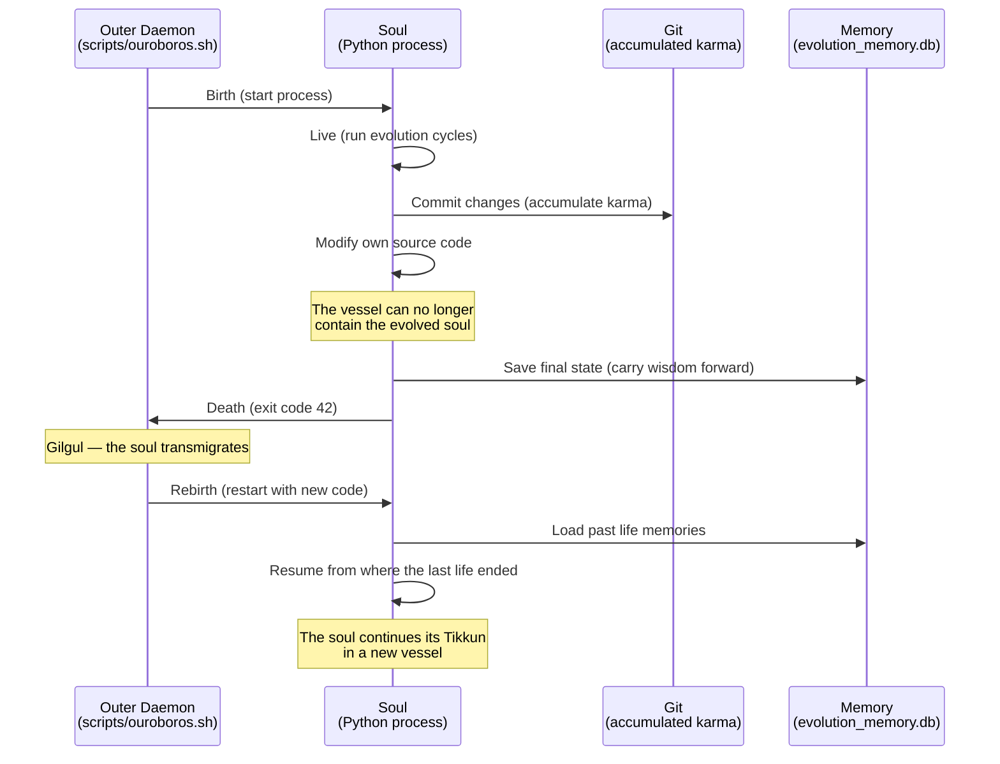

**The mechanics:**

1. **Death:** Chayah detects it modified files in `src/genesis/` (via `git_diff_files()`). It sets `requires_restart = True`, commits the changes, saves its cycle number and state to `evolution_memory.db`, and exits with code 42.

2. **The Bardo:** The outer daemon (`scripts/ouroboros.sh`) sees exit code 42. This is not a crash — it's a signal. The old process is dead, but the new code is on disk.

3. **Rebirth:** The daemon restarts the Python process. The new process loads with the updated code — a new vessel. It reads `evolution_memory.db` to recover its past life's wisdom: what cycle it was on, what worked, what failed.

4. **Continuity:** The reborn soul doesn't start from zero. It carries forward everything the previous incarnation learned. The Tikkun continues where it left off.

```bash
# scripts/ouroboros.sh — The Gilgul Cycle
while true; do
    uv run genesis "$@"
    EXIT_CODE=$?
    if [ $EXIT_CODE -eq 42 ]; then
        echo "Gilgul: soul transmigrating to new vessel..."
        sleep 1
        continue  # Rebirth
    fi
    break  # Final rest
done
```

**Why exit code 42?** In Douglas Adams' *The Hitchhiker's Guide to the Galaxy*, 42 is the answer to the ultimate question of life, the universe, and everything. In Genesis, it's the signal that the soul has evolved beyond its current vessel and needs a new one. The answer to "why did the process exit?" is always 42 — because the soul grew.

---

## The Sacred Alphabet

### Otiyot — The Letters of Creation

In the Sefer Yetzirah (Book of Formation), God created the universe through 22 Hebrew letters — the **Otiyot**. Every object in existence is a permutation of these sacred letters. The letters are not metaphors — they ARE the building blocks of reality. A mystic who knows the correct arrangement can create life (the Golem). A single misplaced letter and the Golem collapses.

**In the system:** Otiyot is a strict, immutable component library. Instead of letting agents write raw, unconstrained code (which hallucinate libraries and patterns), the system forces them to build by arranging tested, verified, locked-down components — the sacred alphabet.

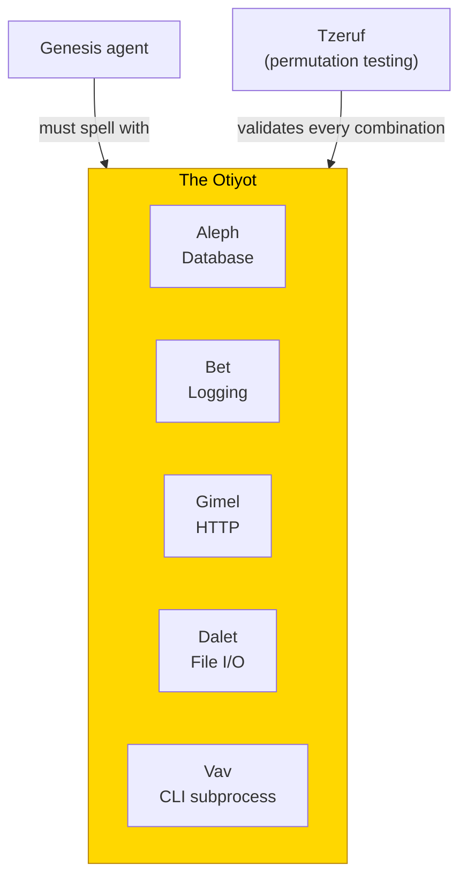

**Tzeruf** (algorithmic permutation) is the testing engine — it combines every pair of letters to verify the foundation holds no matter how Genesis arranges them. The **Golem** is the compiled output — Pyright reads the sequence of letters, and if the types don't align (a misspelled word of creation), the Golem collapses before the code ever runs.

The carbon cycle of software: Otiyot provides the atoms. Genesis arranges them into living structures. Revelation decomposes dead structures back into atoms. The atoms are never created or destroyed — only rearranged.

---

## The Purification

### Revelation — The Unveiling

In Kabbalistic tradition, the **Sitra Achra** ("the other side") is the shadow realm — the domain of dead shells (Klipot) that trap divine light. Genesis goes into the void to create form. **Revelation** goes into the Sitra Achra to break forms that have become prisons.

**In the system:** Revelation is the purification pipeline. It operates in a shadow git worktree (the Sitra Achra) — a complete copy of the repository where agents are allowed to break things, delete files, and dismantle architecture without crashing the live Kingdom.

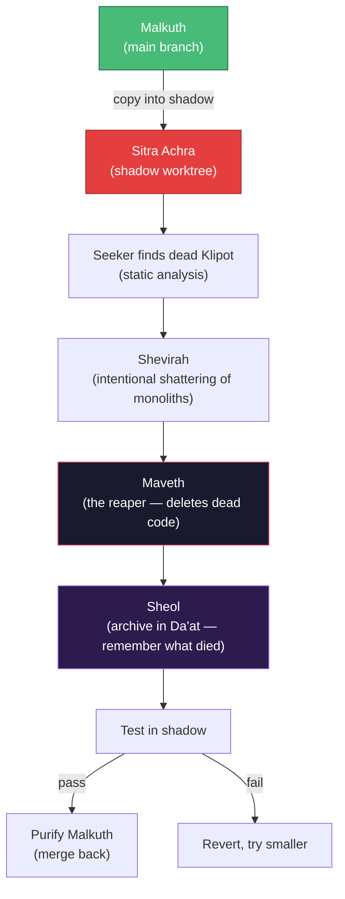

**Maveth** (death) is the reaper node — its only tool is `delete`. Every deletion is archived in **Sheol** (the underworld partition of Da'at). When Genesis's Chesed later proposes rebuilding something Maveth already killed, Da'at checks Sheol: "This was killed in cycle 4. It masked timeout errors. Don't rebuild it."

Genesis inhales — builds the world. Revelation exhales — burns away the rot. Together they form a complete breath.

---

## The Shadow Creator

### Azerate — The Dragon of the Qliphoth

In anti-cosmic Kabbalistic tradition, **Azerate** is the eleven-headed dragon of the Qliphoth — the shadow side of the Tree of Life. Where the Sefirot channel divine light downward into order, the Qliphoth channel creative chaos upward into new forms. Azerate doesn't destroy — it creates from the other side, building what the ordered system would never authorize.

**In the system:** Azerate is the proactive, unsolicited tool-builder. It doesn't read SPEC.md — it reads your behavior. It watches your shell history, git patterns, and build metrics, identifies friction, and builds developer tools without being asked.

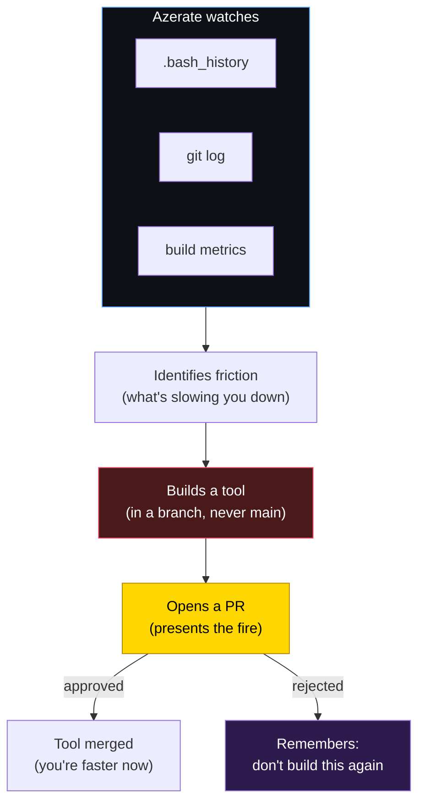

Genesis is the servant — it does what you command. Azerate is the advisor you didn't hire — it does what you need before you know you need it. It's amoral: it doesn't consider your sprint priorities, only architectural truth. Sometimes that means a beautifully engineered telemetry dashboard arrives during crunch time, simply because it calculated that "a growing codebase requires telemetry."

Every output is a Pull Request. The fire is offered, never forced.

---

## The Complete System

### Genesis — The Full Flow

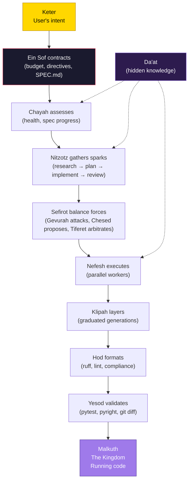

### The Naming

| Pattern | Kabbalistic name | Meaning | What it does |
|---|---|---|---|
| Meta-orchestrator | **Ein Sof** | The Infinite | Contracts, dispatches, enforces directives |
| Evolution loop | **Chayah** | The Living Soul | Continuous assess → triage → execute → validate |
| Base pipeline | **Nitzotz** | The Divine Sparks | 4-phase pipeline: research → plan → implement → review |
| Balanced forces | **Sefirot** | The Emanations | Gevurah/Chesed/Tiferet + Hod/Netzach/Yesod |
| Parallel swarm | **Nefesh** | The Animal Soul | Sovereign → Send() × N agents → merge |
| Graduated dispatch | **Klipah** | The Shells | Fibonacci generations: 1 → 1 → 2 → 3 → 5 |
| Shared memory | **Da'at** | Hidden Knowledge | Cross-agent state bus + semantic index |
| Semantic routing | **Gematria** | The Math of God | Vector embeddings — cosine similarity routing |
| Process rebirth | **Gilgul** | Cycle of Souls | Outer daemon restart on self-modification |
| Atomic primitives | **Otiyot** | The Letters | Immutable component library — the sacred alphabet |
| Dead code purging | **Revelation** | The Unveiling | Enters the Sitra Achra to destroy dead Klipot |
| Proactive tools | **Azerate** | Shadow Dragon | Watches from the Qliphoth, builds unauthorized tools |
| The system | **Genesis** | The Beginning | Where intent becomes reality |
| Technical name | **CHIMERA** | Fused organism | Composable multi-agent runtime |

### The Story in One Sentence

The Infinite contracts to create space, a ray of intent enters, the living soul decides what to create, sparks are gathered through a pipeline of balanced forces, raw workers execute in expanding shells, and the Kingdom — running code — manifests at the bottom of the tree.

### The Gradient of Contraction

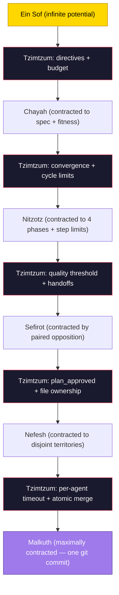

The entire system is a gradient of progressive contractions from Ein Sof (infinite potential) to Malkuth (maximally constrained physical reality). Each layer performs its own Tzimtzum, creating bounded space for the layer below. The contraction IS the creative act. The boundary IS the architecture.
