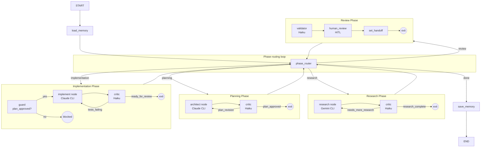

# Nitzotz (formerly ARIL) — The Divine Sparks

Nitzotz is the core execution pipeline within **Genesis** (formerly Malkuth) — the unified autonomous system where intent becomes reality. It provides a phased pipeline with hierarchical subgraphs, critic loops, multi-agent handoffs, and persistent memory.

## Architecture



## How it works

1. **load_memory** — loads context from past runs (SQLite) into `memory_context`
2. **phase_router** — reads `handoff_type` and routes to the next phase subgraph
3. **Phase subgraphs** — each runs its own inner loop (domain node → critic → loop/exit)
4. **save_memory** — persists run summary to SQLite for future runs

## Handoff routing table

| handoff_type | Next phase |
|---|---|
| `""` (initial) | research |
| `research_complete` | planning |
| `needs_more_research` | research (loop) |
| `plan_approved` | implementation |
| `plan_revision` | planning (loop) |
| `ready_for_review` | review |
| `tests_failing` | implementation (loop) |
| `done` | save_memory → END |
| `needs_impl_fix` | implementation |
| `plan_not_approved` | planning |

## State (Nitzotz extensions to OrchestratorState)

| Field | Type | Purpose |
|---|---|---|
| `phase` | str | Current phase name |
| `handoff_type` | str | Routing signal between phases |
| `critique` | str | Latest critic feedback |
| `plan_approved` | bool | Set by planning critic when plan passes |
| `human_approved` | bool | Set by human_review node |
| `implementation_versions` | list[dict] (append) | Versioned implementation attempts |
| `selected_implementation_id` | str | Best version picker |
| `phase_step` | int | Step counter within current phase |
| `max_phase_steps` | int | Max steps for current phase |
| `memory_context` | str | Injected context from past runs |

## MCP tool

```
chain_pipeline(task_description, context?, thread_id?)
```

Starts the Nitzotz pipeline in the background. Use `status(job_id)` to poll progress — messages include `[phase]` tags. The pipeline pauses for human approval in the review phase.

## Invariants

- Implementation phase requires `plan_approved = True` (enforced by guard node)
- Each phase has a max step limit (default 5, configurable)
- Critic quality threshold: 0.7 (below → loop, above → proceed)
- Human approval required before marking done

## Files

| File | Purpose |
|---|---|
| `graph_server/core/state.py` | Extended with Nitzotz fields |
| `graph_server/graphs/aril.py` | Parent graph with phase router |
| `graph_server/nodes/critic.py` | Phase-specific critic (validator + handoff) |
| `graph_server/core/guards.py` | Invariant enforcement functions |
| `graph_server/core/memory.py` | Persistent cross-run memory (SQLite) |
| `graph_server/subgraphs/research.py` | Research phase subgraph |
| `graph_server/subgraphs/planning.py` | Planning phase subgraph |
| `graph_server/subgraphs/implementation.py` | Implementation phase subgraph |
| `graph_server/subgraphs/review.py` | Review phase subgraph |
| `graph_server/server/mcp.py` | chain_pipeline tool + Nitzotz progress messages |

## Comparison with Option B

| | Option B (supervisor) | Genesis (Nitzotz pipeline) |
|---|---|---|
| **Routing** | Free-form LLM supervisor | Structured handoff_type values |
| **Flow** | Hub-and-spoke (flat) | Hierarchical (phase subgraphs) |
| **Quality gates** | Validator (optional) | Critic loops in every phase |
| **Safety** | Max 3 retries per node | plan_approved guard + step limits |
| **Memory** | None (checkpoints only) | Cross-run SQLite memory |
| **Flexibility** | High (can skip/reorder phases) | Lower (structured phase order) |
| **Predictability** | Lower (LLM decides everything) | Higher (bounded, auditable) |
