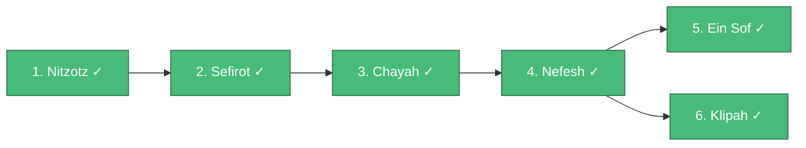

# Build Order — Genesis Implementation Roadmap

This is the master plan for building **Genesis** (formerly Malkuth) — the full autonomous orchestration system. Each pattern builds on the previous. Follow this order.

Reference docs:
- [architecture-patterns.md](architecture-patterns.md) — mythological names, symbolism, and integration
- [architecture-patterns-technical.md](architecture-patterns-technical.md) — technical designations (SPR-4, CLR, PDE, TFB, HVD)

---

## Implementation Sequence

---

## 1. Nitzotz (formerly ARIL) — The Divine Sparks (DONE)

**Status:** Implemented

**What it is:** 4-stage serial pipeline with quality-gated phases (research → planning → implementation → review). Hierarchical subgraphs with critic loops. Persistent memory. Human-in-the-loop approval.

**What was built:**
- `graph_server/core/state.py` — extended with Nitzotz fields (phase, handoff_type, plan_approved, etc.)
- `graph_server/core/guards.py` — invariant enforcement (require_plan_approved, require_human_approved)
- `graph_server/core/memory.py` — persistent cross-run memory (SQLite)
- `graph_server/nodes/critic.py` — phase-specific critic (validator + handoff routing)
- `graph_server/subgraphs/` — 4 phase subgraphs (research, planning, implementation, review)
- `graph_server/graphs/aril.py` — parent graph with phase router
- `graph_server/server/mcp.py` — `chain_aril` tool with phase-aware progress

**Task docs:** [aril/](aril/)

---

## 2. Sefirot — Differential Force Resolver (DONE)

**Status:** Implemented

**What it is:** A design philosophy applied to Nitzotz's subgraphs. Splits each phase into three active forces — generative (expand), restrictive (contract), and resolver (balance). No model judges its own output. Every creative action has a paired restrictive action.

**Depends on:** Nitzotz (implemented)

**What to build:**
1. **Adversarial Validator (AV)** — `nodes/gevurah.py` — actively tries to break the code, structured issue list with severity levels
2. **Scope Analyzer (SA)** — `nodes/chesed.py` — proposes improvements beyond the plan (max 3 per cycle)
3. **Cross-Model Arbitrator (CMA)** — `nodes/tiferet.py` — different model resolves generative vs restrictive claims
4. **Compliance Formatter (CF)** — `nodes/hod.py` — deterministic formatting, linting, documentation
5. **Adaptive Retry Controller (ARC)** — `nodes/netzach.py` — strategic retry with escalation
6. **Integration Validator (IV)** — `nodes/yesod.py` — comprehensive final validation gate
7. **Wire into Nitzotz** — install modules into implementation and review subgraphs

**Key deliverable:** Nitzotz's implementation subgraph goes from `guard → implement → critic` to `guard → implement → AV → SA → CMA → CF → loop/exit`. The critic becomes an active three-way tension instead of a passive gate.

**Task docs:** [sefirot/](sefirot/)

---

## 3. Chayah — Continuous Evolution Loop (DONE)

**Status:** Implemented

**What it is:** A continuous self-improvement loop that wraps Nitzotz. Assesses codebase health, generates tasks from a spec, executes them via Nitzotz, validates results against baseline, commits or reverts, and loops until convergence.

**Depends on:** Nitzotz (implemented) + fitness function (new)

**What to build:**
1. **Fitness function** — `core/fitness.py` — HealthReport dataclass, `assess_health()` runs pytest/pyright/lint
2. **Assess node** — `nodes/assess.py` — calls fitness function, writes health report to state
3. **Triage node** — `nodes/triage.py` — classifies priority action (fix/refactor/feature/idle)
4. **Ideation node** — `nodes/ideate.py` — reads SPEC.md, picks next unchecked item
5. **Evolution loop graph** — `graphs/ouroboros.py` — assess → triage → Nitzotz → validate → commit/revert → loop
6. **Git safety** — `tools/git_tools.py` — checkpoint, revert, diff, self-modification detection
7. **Evolution memory** — `core/evolution_memory.py` — tracks what worked/failed per cycle
8. **Convergence detection** — stop on plateau, budget exhaustion, or spec completion
9. **Outer daemon** — `scripts/ouroboros.sh` — restarts on exit code 42

**Key deliverable:** `SPEC.md` at project root. Run `uv run ouroboros` and it autonomously improves the codebase until convergence.

**Task docs:** [ouroboros/](ouroboros/)

---

## 4. Nefesh — Parallel Dispatch Engine (DONE)

**Status:** Implemented

**What it is:** A parallel swarm engine. A central planner decomposes a goal into N independent, file-disjoint tasks and dispatches them concurrently via Send(). Results are merged and validated atomically.

**Depends on:** Nitzotz (implemented). Can be built in parallel with Chayah.

**What to build:**
1. **Sovereign node** — `nodes/sovereign.py` — decomposes goal into TaskManifest with file ownership
2. **Swarm agent** — `nodes/swarm_agent.py` — thin wrapper around implement_node with scoped file access
3. **Merge node** — `nodes/swarm_merge.py` — combines results, runs tests, atomic accept/reject
4. **Nefesh graph** — `graphs/leviathan.py` — sovereign → Send() × N → merge → validate
5. **Budget control** — max agents, max cost, per-agent timeout
6. **MCP tool** — `swarm(goal, budget, max_agents)` in server/mcp.py
7. **Chayah integration** — triage dispatches to Nefesh for batch operations (> 5 independent issues)

**Key deliverable:** `swarm("fix all pyright errors", budget=2.0)` dispatches N parallel agents and merges results atomically.

**Task docs:** [leviathan/](leviathan/)

---

## 5. Ein Sof — Meta-Orchestrator (DONE)

**Status:** Implemented

**What it is:** The meta-orchestrator. A Graph of Graphs that monitors the repository, spawns the right pattern (Chayah/Nefesh/Nitzotz), enforces immutable directives, controls compute budgets, and maintains unified memory across all patterns.

**Depends on:** ALL other patterns.

**What to build:**
1. **Directives** — `DIRECTIVES.md` at project root + `core/directives.py` — immutable policy enforcement
2. **Dispatcher** — `nodes/muther_dispatch.py` — reads health + spec, selects pattern
3. **Entity lifecycle** — `core/entity_manager.py` — spawn/monitor/throttle/kill/absorb
4. **Unified memory** — `core/ocean.py` — cross-pattern SQLite with tables per pattern
5. **Resource control** — `core/resource_control.py` — global budget, throttle, suspend
6. **Ein Sof graph** — `graphs/muther.py` — scan → dispatch → monitor → enforce → absorb → loop
7. **Daemon** — `scripts/muther.sh` — outer watchdog
8. **Event triggers** — cron, git hooks, file watcher, manual MCP tool

**Key deliverable:** `scripts/muther.sh` runs the whole system. Ein Sof decides what to run, when, and for how long. Human sets the spec and budget, walks away.

**Task docs:** [muther/](muther/)

---

## 6. Klipah (formerly Fibonacci) — The Shells (AFTER NEFESH)

**Status:** Not started

**What it is:** A concurrency scaling mode inside Nefesh. Instead of fanning out all N agents at once (which fails when tasks have dependencies), Klipah dispatches in graduated generations — 1 → 1 → 2 → 3 → 5 — where each generation builds on the foundation laid by the previous one. After expansion, branches consolidate back down in reverse order (5 → 3 → 2 → 1) with integration reviewers merging at each step.

**Depends on:** Nefesh (required). Extends the Sovereign's dispatch logic.

**What to build:**
1. **Generation planner** — topological sort on task dependencies, group into Fibonacci-width layers
2. **Multi-round dispatch** — iterate generations, each round dispatches via Send() and merges before next
3. **Reverse consolidation** — fan-in spiral with integration reviewers merging pairs of branches
4. **Token budget scaling** — Fibonacci-proportional allocation per generation
5. **Sovereign integration** — Sovereign chooses flat vs Klipah based on dependency analysis

**Key deliverable:** `swarm("build REST API with auth", budget=5.0)` → Sovereign detects layered dependencies → dispatches Gen 1 (schema), Gen 2 (API core), Gen 3 (auth + endpoints), Gen 4 (frontend + admin + payments) → consolidates 4 → 2 → 1 → validated merge.

**Task docs:** [fibonacci/](fibonacci/)

---

## Summary

| # | Pattern | Designation | Status | MCP tool | Key file |
|---|---|---|---|---|---|
| 1 | Nitzotz | SPR-4 | **Done** | `chain_aril` | `graphs/aril.py` |
| 2 | Sefirot | TFB | **Done** | (inside Nitzotz) | `nodes/gevurah.py`, `nodes/tiferet.py` |
| 3 | Chayah | CLR | **Done** | `chain_ouroboros` | `graphs/ouroboros.py` |
| 4 | Nefesh | PDE | **Done** | `swarm` | `graphs/leviathan.py` |
| 5 | Ein Sof | HVD | **Done** | `chain_muther` | `graphs/muther.py` |
| 6 | Klipah | PDE-F | **Done** | (inside `swarm`) | `nodes/sovereign.py` (extended) |
