# Architecture Patterns — Technical Reference

**System name: Genesis** (formerly Malkuth) (technical designation TBD)

This document describes the execution patterns in the AI Orchestrator, their operational characteristics, and how they integrate into the Genesis system.

---

## System Overview

The orchestrator implements five complementary execution patterns, each optimized for a different workload profile. They compose hierarchically — higher-level patterns spawn and manage lower-level ones.

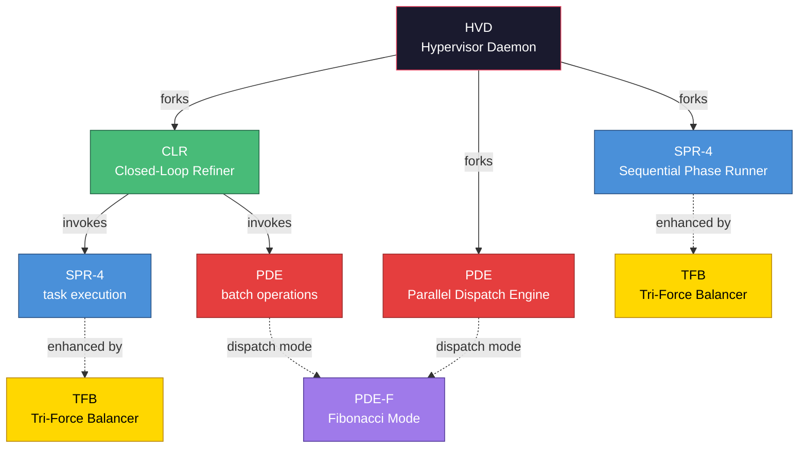

| Designation | Full name | Execution model | Workload profile |
|---|---|---|---|
| **SPR-4** | Sequential Phase Runner (4-stage) | Serial pipeline with quality gates | Single complex task |
| **CLR** | Closed-Loop Refiner | Continuous assess-execute-validate cycle | Steady autonomous improvement |
| **PDE** | Parallel Dispatch Engine | Fan-out/fan-in with central merge | Batch independent operations |
| **TFB** | Tri-Force Balancer | Paired expansion/restriction node modules | Quality enhancement (applied to SPR-4) |
| **HVD** | Hypervisor Daemon | Process-level supervisor, spawns other patterns | Autonomous meta-orchestration |
| **PDE-F** | PDE Fibonacci Mode | Graduated generation-based dispatch within PDE | Layered dependent tasks, greenfield builds |

---

## 1. SPR-4 — Sequential Phase Runner (4-Stage)

### Operational Profile

A serial pipeline that processes a complex task through four quality-gated stages. Each stage runs an internal validation loop, advancing only when output quality exceeds threshold.

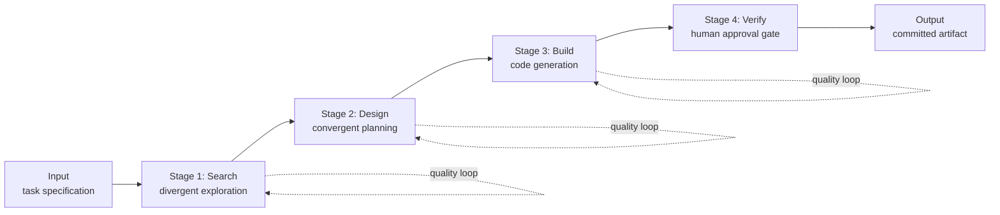

**Characteristics:**
- Four serial stages — each must pass before the next begins
- Internal quality loops — validator scores output, loops if below threshold (0.7)
- Structured inter-stage routing via explicit handoff signals
- Human approval gate required before final commit
- Bounded — configurable max iterations per stage prevent runaway execution

### Optimal workload

Single complex tasks requiring multi-phase processing. Tasks where output quality is more important than execution speed.

---

## 2. CLR — Closed-Loop Refiner

### Operational Profile

A continuous execution cycle that wraps SPR-4. Monitors system health metrics, generates tasks from a specification document, executes them, validates the delta, and persists or reverts based on objective fitness scoring.

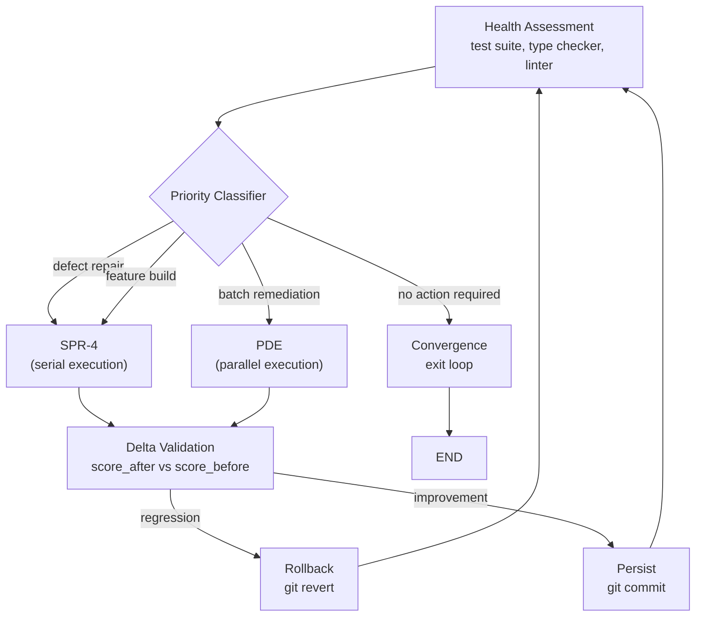

**Characteristics:**
- No terminal state — cycles until convergence, budget exhaustion, or operator interrupt
- Fitness function is read-only — the executing process cannot modify its own evaluation criteria
- Version control as checkpoint mechanism — all mutations committed before validation, reverted on regression
- Specification document is the sole task source — prevents unbounded scope generation
- Outer watchdog process handles runtime code modification (exit code 42 → process restart)

### Optimal workload

Sustained autonomous codebase improvement toward a defined target specification. Unattended long-running execution.

---

## 3. PDE — Parallel Dispatch Engine

### Operational Profile

A fan-out/fan-in execution engine. A central planner decomposes a goal into N independent, resource-disjoint tasks and dispatches them for concurrent execution. Results are merged and validated atomically.

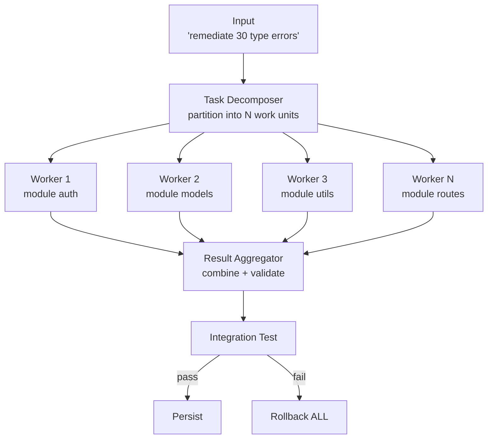

**Characteristics:**
- Resource ownership is exclusive — no two workers modify the same file (v1, pessimistic concurrency)
- Budget-gated — max worker count, max estimated cost, per-worker timeout
- Atomic batch semantics — integration test failure reverts ALL worker outputs (no partial commits)
- Task decomposer does not execute — it partitions and dispatches only
- Diminishing throughput returns beyond ~8 concurrent workers on a single repository

### Optimal workload

High-volume independent remediation across disjoint files. Type error batches, lint fixes, test generation for untested modules, API migration across endpoints.

---

## 4. TFB — Tri-Force Balancer

### Operational Profile

Not a standalone execution engine. A set of paired node modules that enhance SPR-4's build and verify stages by introducing explicit generative/restrictive/synthetic force balancing.

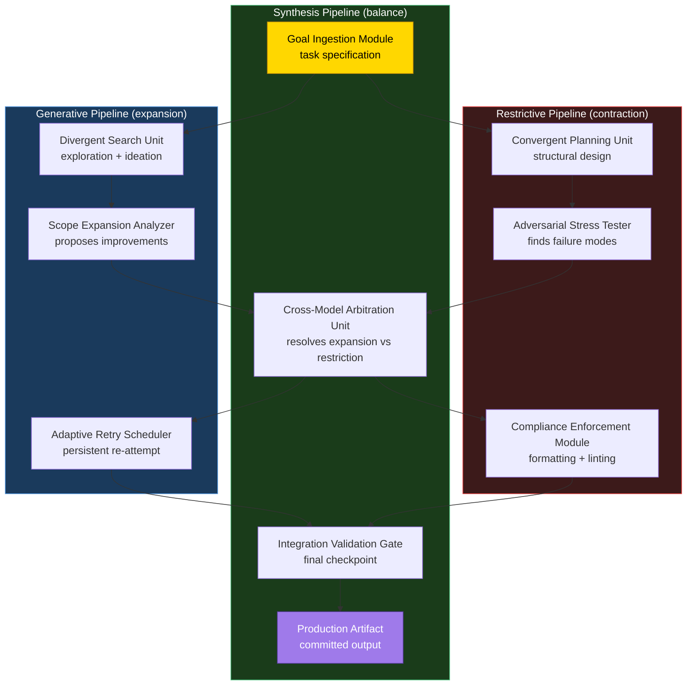

**The three forces:**

| Force | Pipeline | Role | Failure mode if unchecked |
|---|---|---|---|
| **Generative** | Expansion | Creates, explores, proposes additions | Bloated output, hallucinated artifacts, scope creep |
| **Restrictive** | Contraction | Validates, rejects, enforces constraints | Analysis paralysis, nothing gets produced |
| **Synthetic** | Balance | Arbitrates between the two, produces final output | N/A — this IS the resolution mechanism |

**Node modules:**

| Module | Designation | Pipeline | Function |
|---|---|---|---|
| Goal Ingestion | GI | Synthetic | Receives task specification |
| Divergent Search | DS | Generative | Broad exploration, multiple approaches |
| Convergent Planner | CP | Restrictive | Structured design with constraints |
| Scope Expansion Analyzer | SE | Generative | Proposes improvements beyond spec (max 3) |
| Adversarial Stress Tester | ST | Restrictive | Actively finds failure modes, security issues, hallucinations |
| Cross-Model Arbitration | CA | Synthetic | Different model resolves expansion vs restriction |
| Adaptive Retry Scheduler | AR | Generative | Strategic retry with escalation on repeated failure |
| Compliance Enforcement | CE | Restrictive | Deterministic formatting, linting, documentation |
| Integration Validation Gate | IV | Synthetic | Full test suite + type check + diff review before commit |
| Production Artifact | PA | Synthetic | The committed, validated output |

**Characteristics:**
- Every generative module has a paired restrictive module
- No model evaluates its own output (cross-model arbitration enforces this)
- Each module is independently deployable — can be added to SPR-4 incrementally
- Not a standalone graph — wired into SPR-4's existing stage subgraphs

### Optimal workload

Always applicable. Should be applied to any pipeline where output quality is a primary concern. Start with the Adversarial Stress Tester (ST) and Cross-Model Arbitration (CA) — highest ROI modules.

---

## 5. HVD — Hypervisor Daemon

### Operational Profile

A process-level supervisor that monitors system state and forks the appropriate execution pattern. Does not execute tasks directly — manages the lifecycle of child processes that do.

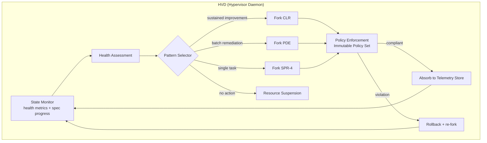

**Subsystems:**

| Subsystem | Function |
|---|---|
| **State Monitor** | Periodic health assessment (test results, type errors, spec progress) |
| **Pattern Selector** | Chooses CLR, PDE, or SPR-4 based on current state and workload profile |
| **Immutable Policy Set (IPS)** | Rules checked after every child process completes. Violations trigger rollback. Not modifiable by child processes. |
| **Unified Telemetry Store (UTS)** | SQLite database. All patterns write execution telemetry. HVD queries it when configuring child processes. |
| **Resource Suspension** | Budget tracking. Can throttle, suspend, or terminate child processes that exceed cost limits. |

**Child process lifecycle:**

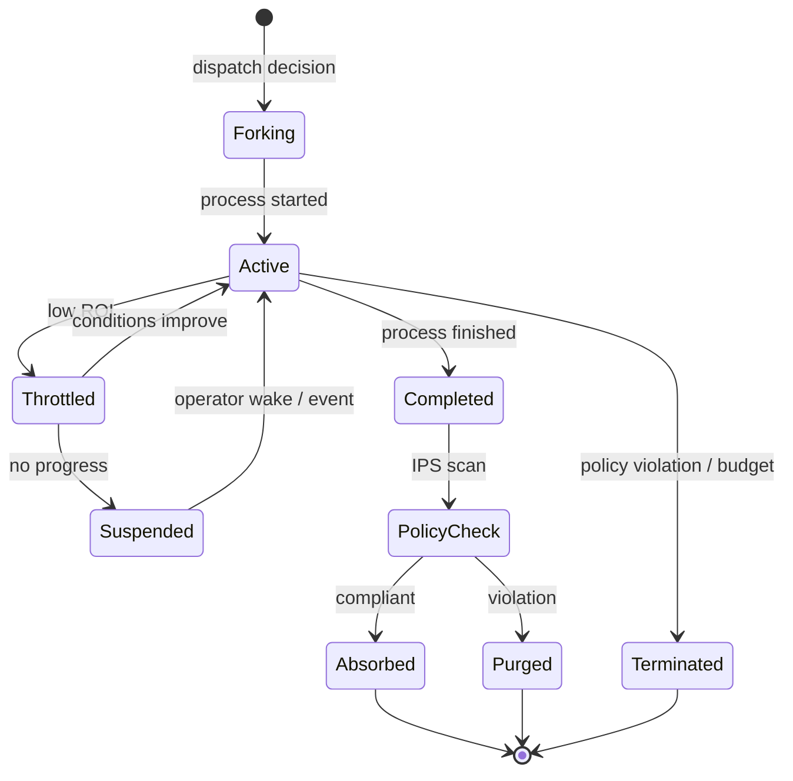

**Characteristics:**
- Does not execute tasks — forks child processes that do
- Enforces immutable policies — checked post-execution, before results are committed
- Controls resource allocation — can throttle, suspend, or terminate children
- Maintains cross-process telemetry — all patterns contribute to and draw from one store
- Outer watchdog handles HVD's own runtime code modifications

### Optimal workload

Fully autonomous operation. The operator defines the spec, sets the budget, and walks away. HVD decides what to run, when, and for how long.

---

## 6. PDE-F — Graduated Fibonacci Dispatch

### Operational Profile

An extension to PDE's Task Decomposer that dispatches workers in graduated generations rather than all at once. When tasks have layered dependencies (Gen 2 needs Gen 1's outputs), flat dispatch fails because workers lack the context they need. PDE-F sorts tasks by dependency depth, dispatches one generation at a time, and merges each generation's results into state before dispatching the next.

After all generations complete, branches are consolidated in reverse order — the widest generation's outputs are merged in pairs, then those pairs merged again, spiraling back down to a single unified result.

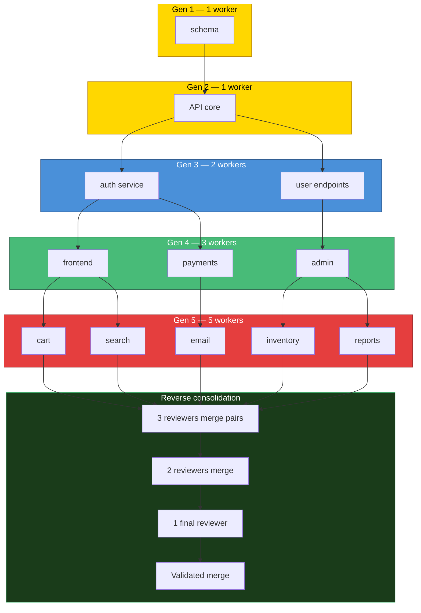

**Characteristics:**
- Generation width follows Fibonacci sequence: 1, 1, 2, 3, 5, 8...
- Each generation completes and merges before the next dispatches
- Workers in later generations receive previous generations' outputs as context
- Reverse consolidation merges branches with integration reviewers at each level
- Token budget scales proportionally: foundational work gets modest allocation, specialized work gets more
- Integrated into PDE's existing Sovereign — the Sovereign chooses flat or Fibonacci based on dependency analysis

**Dispatch mode selection:**

| Task manifest | Dispatch mode | Why |
|---|---|---|
| All tasks have empty `dependencies` | **Flat** (existing PDE) | No ordering needed, maximize parallelism |
| Some tasks depend on others | **Fibonacci** (PDE-F) | Must build foundation before parallelizing |

### Optimal workload

Greenfield builds with layered dependencies. Multi-service architectures where schema must exist before API, API before frontend, frontend before integration tests. Any task where premature parallelism would cause agents to hallucinate incompatible interfaces.

---

## Integration Architecture

### Interconnection Mechanisms

The five patterns connect through three distinct mechanisms at different levels of the process hierarchy:

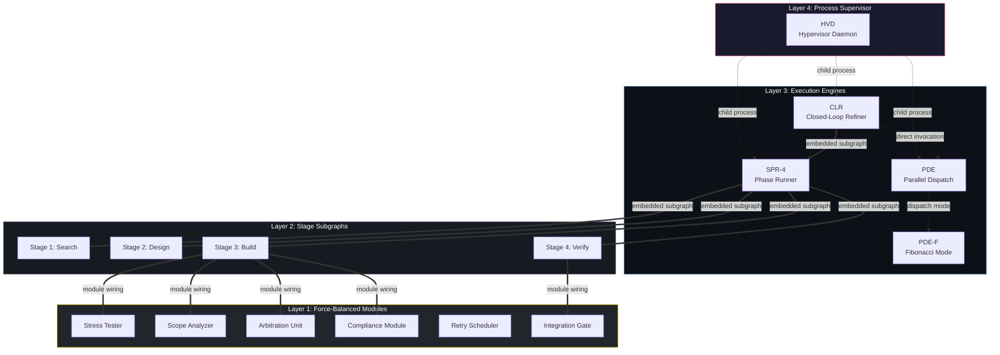

### Mechanism 1: Module wiring (TFB → SPR-4 stages)

**Coupling:** Tight. Same state graph, same state schema, direct edges.

TFB modules are factory functions added to SPR-4's stage subgraphs via `graph.add_node()`. They participate in the stage's internal processing loop. No special integration infrastructure required.

### Mechanism 2: Subgraph embedding (SPR-4 stages, SPR-4 inside CLR)

**Coupling:** Moderate. Compiled graph added as a node. Shared state schema. Child blocks parent until completion.

A compiled state graph is registered as a node in a parent graph. The runtime handles state flow — the child receives the parent's state, executes its internal nodes, and returns state deltas. Both graphs must share the same state type. The child blocks the parent.

**Used for:** SPR-4's four stage subgraphs inside the SPR-4 parent. SPR-4 inside CLR (when the priority classifier routes to serial execution).

### Mechanism 3: Child process forking (HVD → all, CLR → PDE)

**Coupling:** Loose. Separate graphs, separate checkpoint stores. Spawned as async tasks. Monitored via job registry.

The parent starts a graph as a background async task and monitors it through the job infrastructure. The parent can poll status, throttle, suspend, or terminate children independently.

**Why not subgraph embedding?** The supervisor must:
- Run multiple children concurrently
- Monitor resource consumption asynchronously
- Terminate children that exceed budget
- Continue its own monitoring loop while children execute

Subgraph embedding blocks the parent, making all of this impossible.

**Used for:** HVD forking CLR, PDE, or SPR-4. CLR invoking PDE for batch operations.

### Inter-Pattern Data Flow

| From → To | Mechanism | Payload |
|---|---|---|
| TFB ↔ SPR-4 stages | Module wiring | Full state schema via graph runtime |
| SPR-4 stages ↔ SPR-4 parent | Subgraph embedding | Full state schema via graph runtime |
| SPR-4 ↔ CLR | Subgraph embedding | Full state schema via graph runtime |
| CLR → PDE | Direct invocation | Task specification + budget configuration |
| HVD → any pattern | Child process fork | Initial state + telemetry context injection |
| Any pattern → HVD | Process completion | Final state + health score delta |
| Cross-run | Unified Telemetry Store | Execution summaries, decisions, policy violations |

### Coupling Spectrum

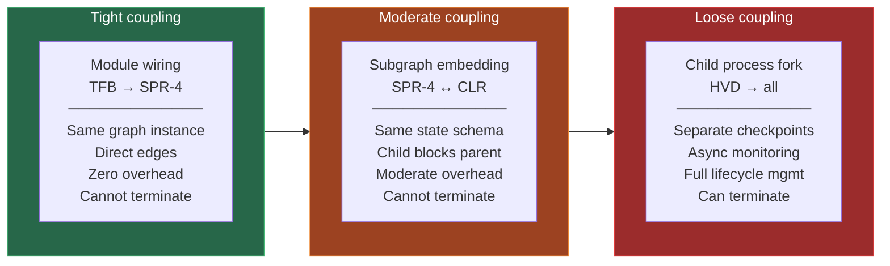

The higher in the process hierarchy, the looser the coupling. This is the correct design — the supervisor must be able to terminate children, CLR must manage PDE's budget, but SPR-4's stages just need to run in sequence.

---

## Complete System Topology

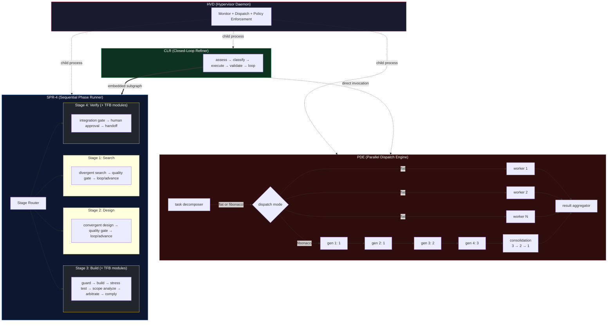

### Implementation Dependencies

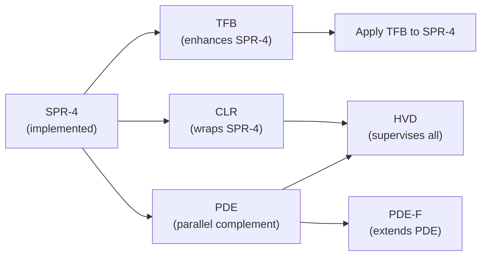

1. **SPR-4** — implemented. The base execution engine.
2. **TFB** — next. Enhances SPR-4 stages with force-balanced modules. Independent of other patterns.
3. **CLR** — after TFB. Wraps SPR-4 in a continuous loop. Requires SPR-4 + fitness function.
4. **PDE** — parallel to CLR. Independent parallel dispatch. Requires SPR-4 for comparison.
5. **HVD** — after CLR + PDE. The unifying supervisor. Requires all other patterns.
6. **PDE-F** — after PDE. Graduated Fibonacci dispatch mode for dependency-aware parallel execution.
