# Architecture Patterns — Mythology, Philosophy, and Integration

The unified system is called **Genesis** (formerly Malkuth) — where intent becomes reality.

This document describes the architectural patterns in the AI Orchestrator, their mythological symbolism, how they work technically, and how they integrate into the Genesis system.

---

## The Pantheon

Each pattern is named for a Kabbalistic or philosophical concept that captures its core behavior. These aren't arbitrary names — the concepts describe the same structural dynamics the patterns implement.

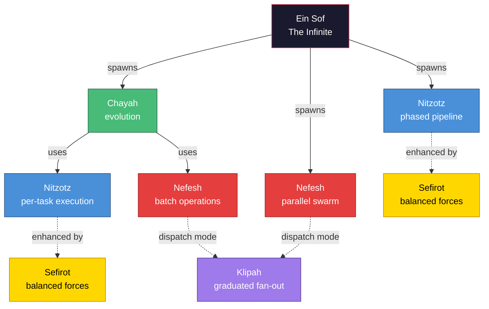

| Pattern | Named for | Core idea | Task docs |
|---|---|---|---|
| **Nitzotz** (formerly ARIL) | The Divine Sparks — gather and assemble | Sequential phases with critic loops | `tasks/aril/` |
| **Chayah** (formerly Ouroboros) | The Living Soul | Continuous self-improvement loop | `tasks/ouroboros/` |
| **Nefesh** (formerly Leviathan) | The Animal Soul | Parallel swarm with central merge | `tasks/leviathan/` |
| **Sefirot** | Kabbalistic Tree of Life | Balanced expansion/restriction forces | `tasks/sefirot/` |
| **Ein Sof** (formerly MUTHER) | The Infinite | Meta-orchestrator, Graph of Graphs | `tasks/muther/` |
| **Klipah** (formerly Fibonacci) | The Shells/Husks | Graduated parallel dispatch — scales concurrency with foundation | `tasks/fibonacci/` |

---

## 1. Nitzotz — The Divine Sparks

**Formerly: Autonomous Research & Implementation Lab (ARIL)**

### Symbolism

Nitzotz represents the divine sparks scattered through creation — fragments of light that must be gathered, refined, and assembled into a unified whole. In this architecture, a complex task is broken into phases, each gathering and refining a spark of understanding. The scientist (agent) follows a methodology: observe (research), hypothesize (plan), experiment (implement), peer review (review). Nothing leaves the lab without passing inspection.

### What it does

A phased pipeline with hierarchical subgraphs. A high-level goal enters and flows through four phases, each containing a critic loop that ensures quality before advancing:

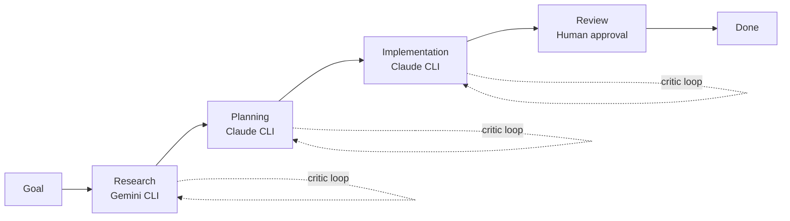

**Key properties:**
- Sequential phases — each must complete before the next begins
- Critic loops — quality-gated progression within each phase
- Structured handoffs — explicit `handoff_type` values drive routing
- Human approval required before marking done
- Bounded — max steps per phase prevent infinite loops

### When to use

Single complex tasks that need research, design, and careful implementation. "Add OAuth to the app." "Migrate the database schema." Tasks where the process matters as much as the outcome.

---

## 2. Chayah — The Living Soul

**Formerly: Ouroboros — The Self-Devouring Serpent**

### Symbolism

Chayah is the Living Soul in Kabbalistic tradition — the highest level of soul that connects to the divine will, representing the animating life force that drives continuous renewal and transformation. Unlike the static lower soul levels, Chayah is always in motion, always seeking to elevate and refine.

In this architecture, the agent embodies this living force — continuously assessing its codebase (perceiving), transforming what's broken (healing), creating new functionality (manifesting), and cycling endlessly. The output of each cycle becomes the input of the next. The codebase is simultaneously the thing being perceived and the thing being transformed.

Chayah is also self-contained — it doesn't need external input once started. It reads its own health, generates its own tasks, and judges its own results. It is autonomous in the purest sense: a living soul that sustains itself until equilibrium is reached.

### What it does

A continuous evolution loop that wraps Nitzotz. It assesses the codebase health, generates a task (from a product spec and fitness function), executes it via Nitzotz, validates the result, commits or reverts, and loops:

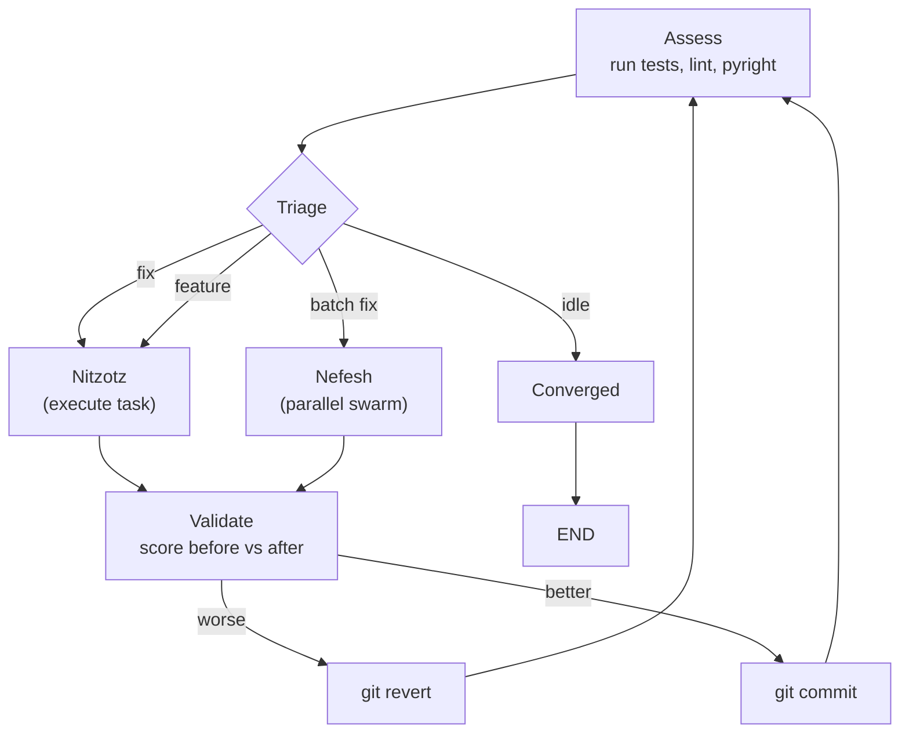

**Key properties:**
- No natural end state — runs until convergence, budget exhaustion, or human intervention
- Fitness function is immutable — the agent cannot game its own evaluation
- Git is the safety net — every change is committed before validation, reverted if score drops
- The spec is the only source of features — no hallucinated goals
- Outer daemon handles self-modification (exit code 42 → restart with new code)

### When to use

Steady, autonomous improvement of a codebase toward a defined spec. Leave it running overnight. Let it fix all the pyright errors, add missing tests, and implement stretch goals one by one.

---

## 3. Nefesh — The Animal Soul

**Formerly: Leviathan — The Beast of Many Tentacles**

### Symbolism

Nefesh is the Animal Soul in Kabbalistic tradition — the vital, instinctive force that animates physical action. Unlike the higher soul levels that deliberate and plan, Nefesh acts with immediate, coordinated physicality — many limbs working in concert under a single animating will.

In this architecture, Nefesh is a central intelligence (the Sovereign) that commands many agents simultaneously. Where Chayah is a single living force working alone, Nefesh is many agents reaching into the codebase at once. Each agent handles one task, but they all serve the Sovereign's unified plan.

Nefesh's power is breadth — it touches everything at once. Its weakness is coordination — if the agents clash, chaos follows. The Sovereign's job is to ensure they don't, by giving each agent exclusive territory (file ownership).

### What it does

A parallel swarm execution engine. A Sovereign planner decomposes a large goal into N independent, file-disjoint tasks and dispatches them concurrently via LangGraph's `Send()` API:

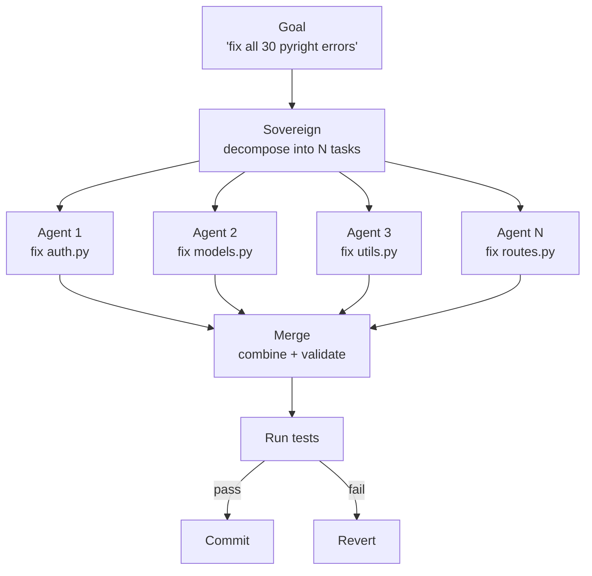

**Key properties:**
- File ownership is exclusive — no two agents modify the same file (v1)
- Budget-gated — max agents, max cost, per-agent timeout
- Atomic batch — if tests fail after merge, ALL changes revert (no partial success)
- The Sovereign doesn't implement — it decomposes and dispatches
- Diminishing returns past ~8 parallel agents on a single repo

### When to use

Batch operations on many independent files. "Fix all 30 pyright errors." "Add unit tests for 10 untested modules." "Migrate all API endpoints from v1 to v2." Tasks where the work is wide (many files) but shallow (each change is simple).

---

## 4. Sefirot — The Tree of Life

### Symbolism

The Sefirot are the ten emanations of the Kabbalistic Tree of Life — the structure through which the infinite divine will descends into finite physical reality. They are arranged in three pillars:

- **Pillar of Mercy (Expansion)** — creative, generative, unbounded force
- **Pillar of Severity (Restriction)** — critical, limiting, corrective force
- **Central Pillar (Balance)** — synthesis that harmonizes the two opposing forces

The Tree teaches that creation requires both forces in tension. Pure expansion (Chesed/Mercy) without restriction produces chaos — bloated, hallucinated code. Pure restriction (Gevurah/Severity) without expansion produces nothing — every output is rejected. Only through Tiferet (Beauty/Harmony) — the synthesis of both — does creation manifest properly.

This maps directly to the fundamental problem in agent systems: **how do you balance creative generation with quality enforcement?** A passive critic (score and gate) isn't enough. You need active opposing forces that argue, and a synthesizer that resolves their tension.

### The Sefirot mapped to agents

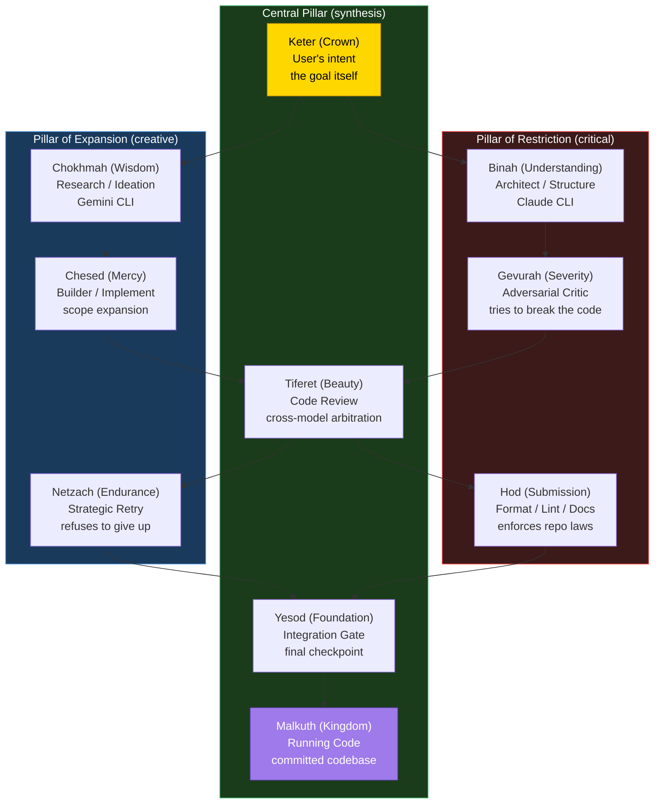

### What it does

Sefirot is not a graph — it's a **design philosophy** expressed as individual node factories that enhance Nitzotz's subgraphs. The core contribution is splitting the implementation phase into three active forces:

1. **Chesed (Builder)** — implements the plan AND proposes improvements beyond it
2. **Gevurah (Critic)** — doesn't just score output, actively tries to break it
3. **Tiferet (Reviewer)** — uses a different model to arbitrate between the two

Plus three process nodes:
4. **Hod (Formatter)** — deterministic formatting, linting, documentation
5. **Netzach (Retry Engine)** — strategic retry that escalates approach on repeated failure
6. **Yesod (Integration Gate)** — comprehensive validation before commit

**Key properties:**
- Every creative action has a paired restrictive action
- No model judges its own output (cross-model review)
- Applied incrementally — each node is independently valuable
- Not a separate graph — wired into Nitzotz's existing subgraphs

### When to use

Always. Sefirot principles should be applied to any agent pipeline where quality matters. Start with Gevurah (adversarial critic) and Tiferet (cross-model review) — they provide the most value.

---

## 5. Ein Sof — The Infinite

**Formerly: MUTHER — The Primordial Mainframe**

### Symbolism

Ein Sof is the Kabbalistic concept of the Infinite — the boundless, limitless divine essence that exists before and beyond all emanation. Ein Sof is not one of the Sefirot; it is the source from which all Sefirot flow. It doesn't create directly — it is the womb of creation itself, the primordial ocean from which all forms emerge.

In this architecture, Ein Sof doesn't explore, plan, or implement. It is the omniscient operating system that everything else runs on. It monitors the repository, decides what kind of entity needs to be born, spawns it, watches it work, enforces its directives, and absorbs the results when it's done. It doesn't write code — it decides who writes code.

### What it does

A meta-orchestrator — a Graph of Graphs. Ein Sof monitors the repository state and spawns the right pattern:

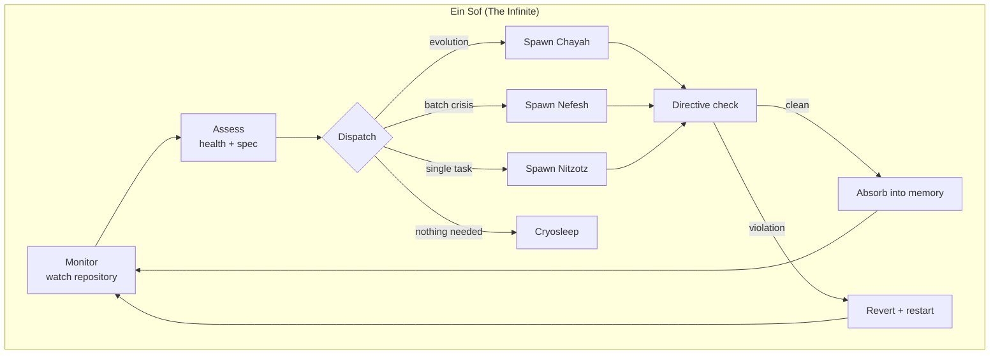

**Key properties:**
- Doesn't write code — spawns entities that do
- Enforces immutable directives — checked after every entity completes
- Controls compute budget (Cryosleep) — can throttle, hibernate, or kill entities
- Maintains unified memory (The Ocean) — all patterns contribute to and draw from one store
- Outer daemon handles self-modification restarts

### When to use

When you want fully autonomous operation. Ein Sof is the "leave it running" system — it decides what needs to happen, picks the right tool, and manages the execution. It's the capstone that makes the other patterns self-directing.

---

## 6. Klipah — The Shells

**Formerly: Fibonacci — The Golden Spiral**

### Symbolism

Klipah (plural: Klipot) are the shells or husks in Kabbalistic tradition — the outer layers that contain and constrain the divine light. Each shell must be formed before the light within it can be revealed. The husks are not evil — they are necessary structure. Without shells, the light disperses and cannot be used. Creation requires containment before expansion.

In this architecture, Klipah describes how concurrency should scale. You don't throw 10 agents at an empty repo — you start with one architect, then one foundation builder, then two core services, then three features, then five polish tasks. Each generation's width is bounded by the structural integrity of the previous. The shells form layer by layer, each containing the light of the previous before the next can be created.

The reverse spiral (consolidation) mirrors the breaking of shells — the specialized parts merge back into a unified whole, each merge step combining fewer, larger pieces until the full light is revealed.

### What it does

A graduated dispatch mode inside Nefesh. Instead of fanning out all agents at once, Klipah dispatches in generations that follow the Fibonacci sequence:

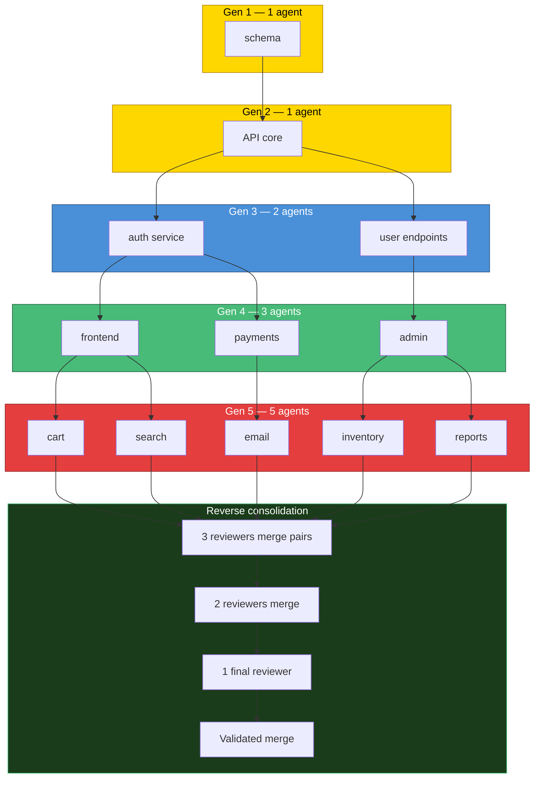

**How it works with Nefesh:**

Nefesh's Sovereign already decomposes goals into tasks with a `dependencies` field. Klipah reads those dependencies, sorts tasks into layers by depth, and dispatches one layer at a time. If all tasks are independent → flat dispatch (existing Nefesh). If tasks have layered dependencies → Klipah dispatch.

**Key properties:**
- Concurrency scales with foundation — no premature parallelism
- Each generation can reference previous generations' outputs
- Reverse consolidation merges branches back down with integration reviewers
- Token budgets scale with generation (Fibonacci proportional allocation)
- Not a separate graph — a dispatch mode inside Nefesh

### When to use

Greenfield builds with layered dependencies. "Build a full-stack app." "Implement a microservice architecture." Tasks where the work has a natural dependency structure — schema before API, API before frontend, frontend before polish.

---

## Integration Architecture

### The Three Integration Mechanisms

Not everything is a subgraph of everything else. The patterns connect through three distinct mechanisms, each appropriate for different coupling needs:

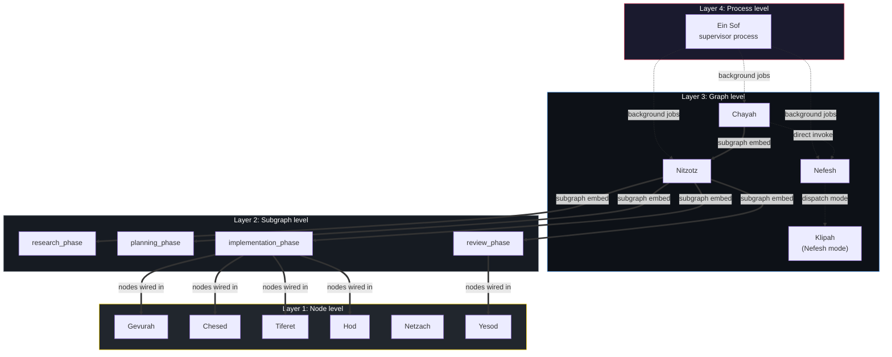

### Mechanism 1: Node wiring (Sefirot → Nitzotz subgraphs)

**Coupling:** Tight. Same StateGraph, same state type, direct edges.

Sefirot nodes are factory functions (`build_gevurah_node()`, etc.) added to Nitzotz's subgraph StateGraphs with `graph.add_node()`. They participate in the subgraph's internal loop:

```python
# Inside implementation subgraph
graph.add_node("implement", implement_node)     # Chesed role (builder)
graph.add_node("gevurah", gevurah_node)          # adversarial critic
graph.add_node("chesed", chesed_propose_node)    # scope expansion
graph.add_node("tiferet", tiferet_node)          # cross-model arbitration
graph.add_node("hod", hod_node)                  # format + lint

graph.add_edge("implement", "gevurah")
graph.add_edge("gevurah", "chesed")
graph.add_edge("chesed", "tiferet")
graph.add_edge("tiferet", "hod")
# tiferet decides: loop back to implement, or exit
```

No special integration needed. They're just nodes.

### Mechanism 2: Subgraph embedding (Nitzotz phases, Nitzotz inside Chayah)

**Coupling:** Moderate. Compiled graph added as a node. Shared state type. Child blocks parent until complete.

A compiled StateGraph is added as a node in a parent graph. LangGraph handles state flow — the child receives the parent's state, runs all its internal nodes, and returns state updates:

```python
# Nitzotz parent graph
research_phase = build_research_subgraph(model).compile()
parent.add_node("research_phase", research_phase)  # subgraph as node

# Chayah graph
aril_graph = build_aril_graph(config)  # compiled, no checkpointer
ouroboros.add_node("execute_aril", aril_graph)     # Nitzotz as subgraph node
```

**Constraint:** Both graphs must use the same state type (`OrchestratorState`). The child graph blocks the parent — the parent waits for the child to complete before continuing. You cannot kill or throttle a subgraph mid-execution.

**Used for:**
- Nitzotz's four phase subgraphs inside the Nitzotz parent graph
- Nitzotz inside Chayah (when triage chooses a single complex task)

### Mechanism 3: Background jobs (Ein Sof → everything, Chayah → Nefesh)

**Coupling:** Loose. Separate graphs, separate checkpointers. Spawned as asyncio tasks. Monitored via job system.

The parent starts a graph as a background asyncio task and monitors it through the existing job infrastructure (`create_job()`, `get_job()`, `format_job_status()`):

```python
# Ein Sof spawning an entity
async def spawn_entity(state):
    pattern = state["dispatch_decision"]["pattern"]

    if pattern == "ouroboros":
        graph, cp = await build_ouroboros_graph(config)
    elif pattern == "leviathan":
        graph, cp = await build_leviathan_graph(config)
    elif pattern == "aril":
        graph, cp = await build_aril_graph(config)

    job = create_job()
    job._task = asyncio.create_task(run_graph(graph, state, job))
    return {"active_entities": [...]}
```

**Why not subgraph embedding here?** Because Ein Sof needs to:
- Run multiple entities concurrently
- Monitor cost and progress asynchronously
- Kill or hibernate entities that are burning tokens
- Continue its own assessment loop while entities run

You can't do any of this with subgraph embedding (which blocks the parent).

**Used for:**
- Ein Sof spawning Chayah, Nefesh, or Nitzotz
- Chayah invoking Nefesh for batch operations (Nefesh's `Send()` fan-out needs to be the top-level pattern)

### Communication between patterns

| From → To | Mechanism | What flows |
|---|---|---|
| Sefirot ↔ Nitzotz subgraphs | Node wiring (edges) | Full `OrchestratorState` via LangGraph |
| Nitzotz phases ↔ Nitzotz parent | Subgraph embedding | Full `OrchestratorState` via LangGraph |
| Nitzotz ↔ Chayah | Subgraph embedding | Full `OrchestratorState` via LangGraph |
| Chayah → Nefesh | Direct `ainvoke()` | Task description + budget config |
| Ein Sof → any pattern | Background job | Initial state + injected memory context |
| Any pattern → Ein Sof | Job completion | Final state + health score delta |
| Across all runs | SQLite memory (The Ocean) | Summaries, decisions, violations, outcomes |

### Why the coupling varies

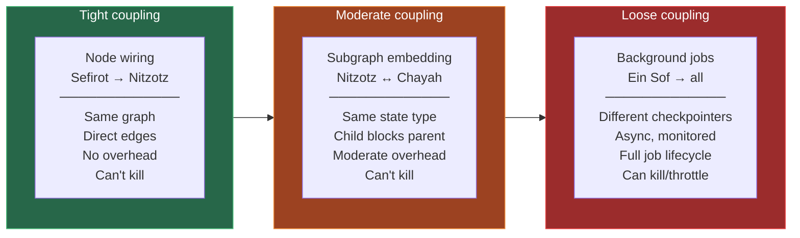

The higher in the hierarchy, the looser the coupling. This is the right design because Ein Sof needs to kill things, Chayah needs to manage Nefesh's budget, but Nitzotz's subgraphs just need to run in sequence.

---

## The Full Stack

When everything is implemented, the complete system looks like:

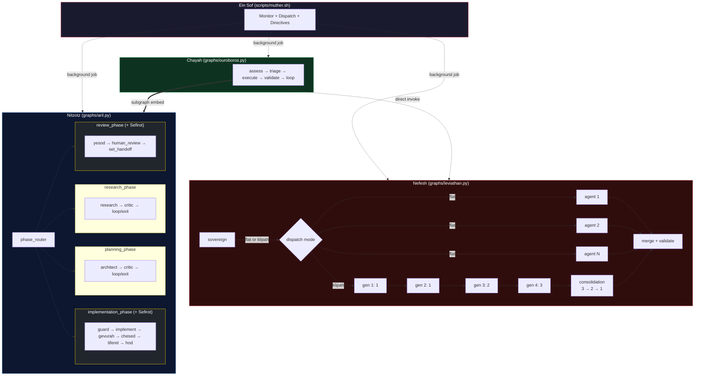

### Implementation order

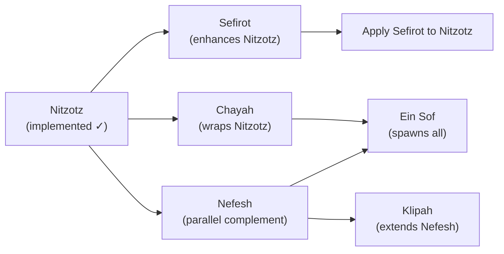

1. **Nitzotz** — implemented. The execution engine everything else builds on.
2. **Sefirot** — next. Enhances Nitzotz's subgraphs with balanced forces. Independent of other patterns.
3. **Chayah** — after Sefirot. Wraps Nitzotz in a continuous loop. Needs Nitzotz + fitness function.
4. **Nefesh** — parallel to Chayah. Independent parallel swarm. Needs Nitzotz for comparison.
5. **Ein Sof** — after Chayah + Nefesh. The capstone that unifies everything. Needs all other patterns.
6. **Klipah** — after Nefesh. Extends Nefesh's Sovereign with graduated, dependency-aware dispatch.
