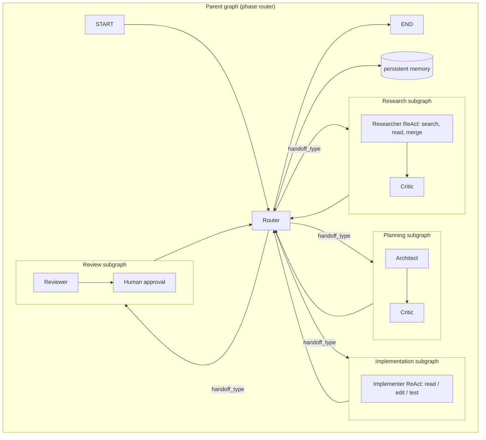
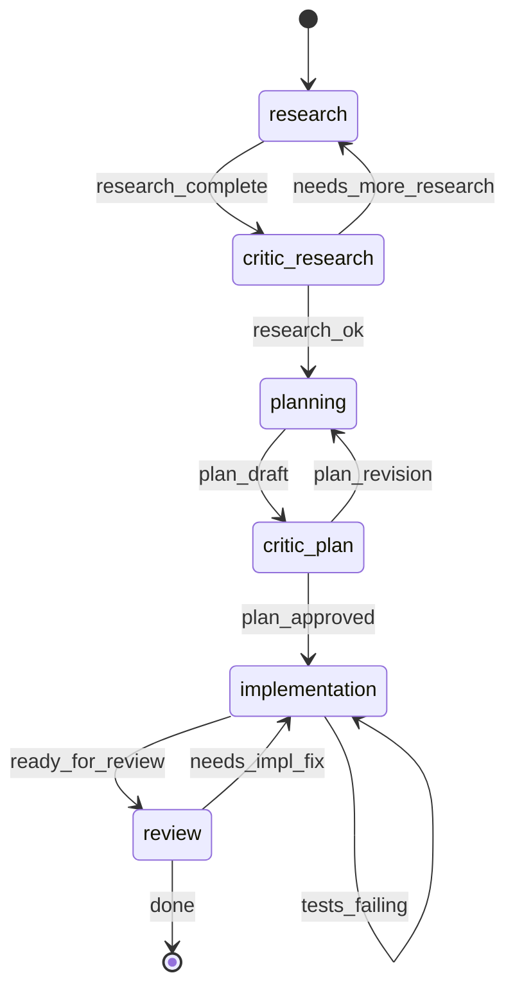
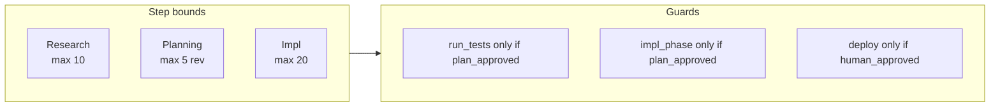

# Nitzotz (formerly ARIL) — The Divine Sparks

## One-sentence pitch

A long-horizon agent that takes a high-level goal (e.g. “add OAuth to our app” or “evaluate Rust vs Go for this service”), runs **research → planning → implementation → review** in phases, uses **multiple specialized agents**, **remembers across runs**, and **streams** everything to the user with **human checkpoints** and **guarantees**.

**Coexistence:** Nitzotz is the core pipeline within **Genesis** — a separate graph entry point (`build_aril_graph()`) and optional MCP tool (e.g. `chain_aril`). The existing Option B graph stays the default/fallback; the same server can expose both. All code paths use `src/orchestrator/graph_server/` (see IMPLEMENTATION.md).

**Tradeoff — supervisor vs phase router:** Option B's v0.5 supervisor is fully dynamic: it can skip phases, reorder them, fan-out, and terminate early based on free-form LLM reasoning. Nitzotz's phase router is more structured — routing is driven by explicit `handoff_type` values and `plan_approved`/`human_approved` booleans. This means Nitzotz is more predictable, easier to bound/audit, and safer (invariants are enforceable), but less flexible than a free-form supervisor. This is a deliberate choice: long-horizon tasks need guarantees more than they need improvisation. If a task needs the dynamic supervisor, use Option B. Nitzotz is part of the larger Genesis system (Nitzotz + Sefirot + Chayah + Nefesh + Klipah + Ein Sof).

**Building on v0.5:** Nitzotz extends the current graph server: reuse `astream(stream_mode="updates")` and job progress in server.py, `interrupt()` for HITL, `Send()` for fan-out, `output_versions` and `merge_research`, and existing node factories (build_research_node, build_architect_node, etc.). Orchestrate existing CLI-based nodes in loops; do not replace them with in-process API + tools unless we explicitly choose that later.

---

## Why Nitzotz needs each research-level feature

| Feature | Why Nitzotz needs it |
|--------|--------------------|
| **1. Subgraphs** | Each phase is a multi-step workflow: **Research subgraph** (search → read → synthesize, possibly parallel), **Planning subgraph** (architect → critic → revise), **Implementation subgraph** (read → edit → run tests in a loop). Parent graph = phase router (research → plan → implement → review). |

| **2. Multi-agent handoffs** | Researcher → Critic (quality of sources/synthesis) → Architect → Critic (plan robustness) → Implementer → Reviewer. Structured handoffs (e.g. `needs_more_research`, `plan_approved`, `tests_failing`) drive routing instead of a single supervisor doing everything. |
| **3. Richer state / reducers** | Parallel research branches must be merged (by topic/source); multiple implementation attempts or rollbacks need versioned/best-of state; critic feedback and plan versions need merge policies, not just last-writer-wins. |
| **4. Streaming** | User sees: live research snippets, then plan sections, then code edits and test results. Without streaming it feels like a black box; with it, it’s a “lab” they can watch and interrupt. |
| **5. Persistent memory** | “Continue from last time,” “same approach as the OAuth task,” “don’t repeat the mistake we made in project X.” Memory = RAG or key-value over past runs, decisions, and outcomes, so the graph has long-horizon context. |
| **6. ReAct-style tool loops** | Orchestration: multiple CLI runs per phase, merge or validate between rounds; keep current CLI design (no in-process tools unless decided separately). |
| **7. Bounds & invariants** | Max steps per phase (e.g. 10 research steps, 20 impl steps). Invariants: “no execution of user-facing code without an approved plan,” “no deploy without explicit approval.” Makes the system safe and analyzable. |

---

## High-level architecture

- **Streaming:** Every subgraph and node can emit events; server streams them (e.g. SSE) to the client.
- **Memory:** After each phase (or on demand), write summaries/decisions to a store; at START or at phase entry, inject “relevant past context” into state.
- **Invariants:** In the phase router and in the implement subgraph: “only run execution steps if `plan_approved` and (optionally) `human_approved`”; enforce max steps in each ReAct loop and in the phase router.

---

## Handoff state (multi-agent)

Structured fields used for routing between agents:

- `handoff_type`: `needs_more_research` | `plan_approved` | `plan_revision` | `tests_failing` | `ready_for_review` | `done` | …
- `critique`: Last critic feedback (for revision loops).
- `plan_approved`: Boolean; set after human or critic approval.
- `human_approved`: Set at HITL checkpoints.

---

## Bounds and invariants (formal structure)

- **Max steps per phase:** e.g. 10 research steps, 5 planning revisions, 20 implementation steps.
- **Invariants:**
  - No execution of user-facing or destructive code without an approved plan.
  - No deploy / run in production without explicit human approval.
  - Implement subgraph only enters “run tests” / “execute” after `plan_approved` (and optional `human_approved`).

Enforce in: phase router, `select_next_node`-style routers, and ReAct loop guards.

