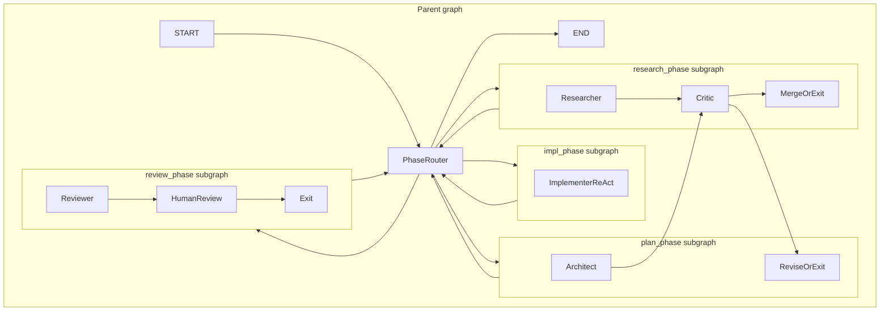
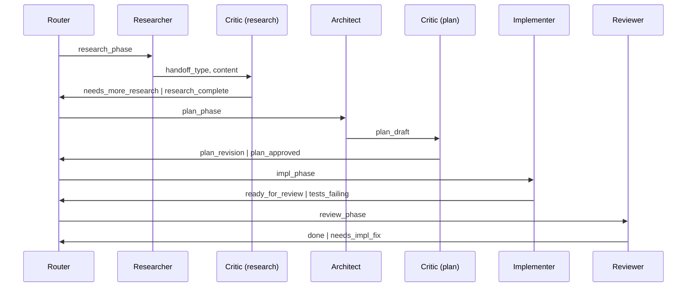
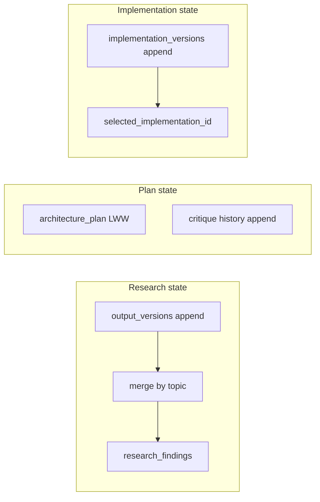
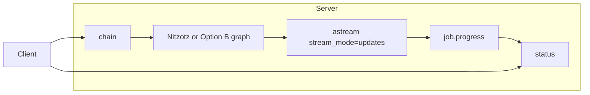
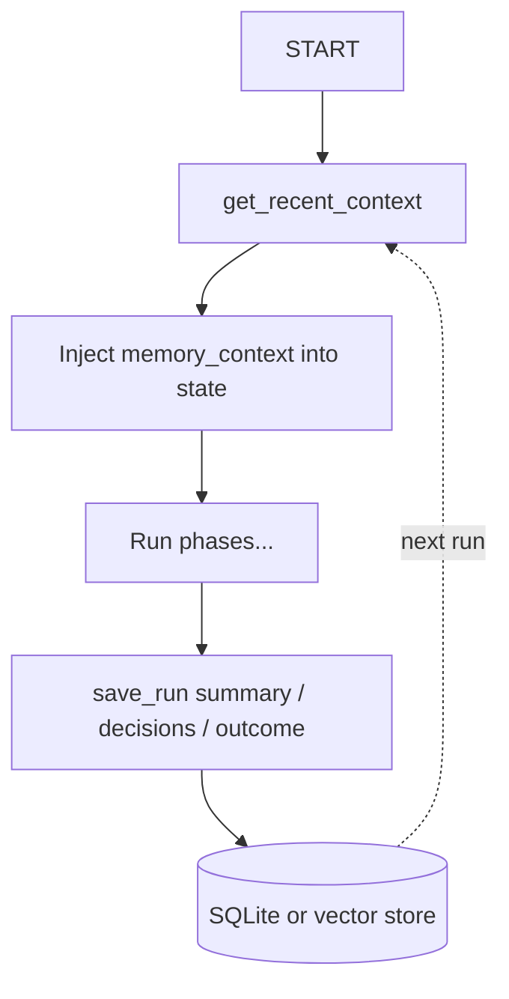
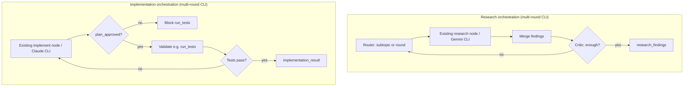
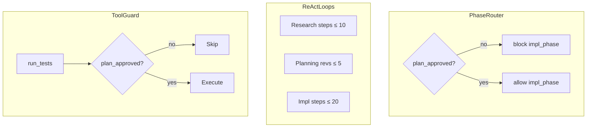
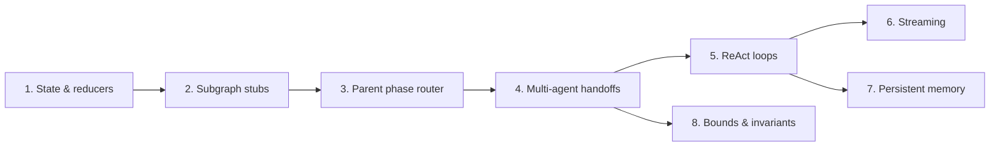

# Nitzotz (formerly ARIL) — Implementation approach

This doc describes how to implement the Nitzotz pipeline (The Divine Sparks) inside the graph server, building on the existing orchestrator graph (Option B).

**Paths:** All code lives under `src/orchestrator/`. Graph server code is in `src/orchestrator/graph_server/` organized into subdirectories: `core/` (state.py, guards.py, memory.py), `graphs/` (orchestrator.py, aril.py), `server/` (mcp.py, jobs.py), plus `config/`, `nodes/`, `subgraphs/`, `tools/`. Use these paths in tasks and file changes.

**Coexistence:** Nitzotz is the core pipeline within **Genesis** — a separate graph entry point (`build_aril_graph()`) and optional MCP tool (e.g. `chain_aril`). The existing Option B graph in `src/orchestrator/graph_server/graphs/orchestrator.py` remains the default/fallback. Same server can expose both; no replacement of Option B.

**Building on v0.5:** Reuse existing pieces: `astream(stream_mode="updates")` and job progress in server.py, `interrupt()` for HITL, `Send()` for fan-out, `output_versions` and `merge_research`, existing node factories (build_research_node, build_architect_node, etc.). Extend rather than re-implement.

---

## 1. Subgraphs (hierarchical graph)

**Goal:** Parent graph routes to phases; each phase is a compiled subgraph.

**Approach:**

- **Do not refactor the existing graph.** Add a separate parent graph `build_aril_graph()` in `src/orchestrator/graph_server/graphs/aril.py`; keep `src/orchestrator/graph_server/graphs/orchestrator.py` as Option B fallback. The Nitzotz parent is a phase router: nodes `research_phase`, `plan_phase`, `impl_phase`, `review_phase` (each a compiled StateGraph); entry START → router → subgraph.
- Build four subgraphs in `src/orchestrator/graph_server/subgraphs/` (reuse existing node factories — see Section 6 for CLI orchestration; do not rewrite nodes):
  - `research.py` — researcher (build_research_node) → critic → merge/exit.
  - `planning.py` — architect (build_architect_node) → critic → revise or exit.
  - `implementation.py` — implementer (build_implement_node) → exit.
  - `review.py` — reviewer (build_validator_node), human_review (build_human_review_node) → exit.
- Use LangGraph’s pattern for subgraphs as nodes: each subgraph is compiled with the same checkpointer (or a compatible one); parent invokes via the subgraph’s `invoke`/`astream` and maps state in/out. State schema: extend `OrchestratorState` with phase-specific and handoff fields (see below).
- Parent edges: after each phase subgraph returns, route to next phase or END based on `handoff_type` / `phase` in state.

**Files to add/change:**

- `src/orchestrator/graph_server/subgraphs/__init__.py`, `research.py`, `planning.py`, `implementation.py`, `review.py`.
- `src/orchestrator/graph_server/core/state.py` — extend to `ArilState` (or add optional fields to OrchestratorState).
- `src/orchestrator/graph_server/graphs/aril.py` — new; `build_aril_graph()` that composes subgraphs. Optionally switch in server.py via flag or separate tool.

---

## 2. Multi-agent handoffs

**Goal:** Researcher → Critic, Architect → Critic, Implementer → Reviewer with structured handoffs.

**Approach:**

- Add to state: `handoff_type: str`, `critique: str`, `plan_approved: bool`, `human_approved: bool` (and any phase-specific fields).
- In each subgraph, nodes write `handoff_type` and optional `critique`; conditional edges use these to route (e.g. critic → “revise” vs “exit”).
- Parent graph: after a phase returns, read `handoff_type` to decide next phase (e.g. `needs_more_research` → research_phase again; `plan_approved` → impl_phase).
- Reuse existing HITL for human approval; set `human_approved` when human approves in `human_review` node.

**Files to change:**

- `src/orchestrator/graph_server/core/state.py` — add handoff and approval fields.
- Each subgraph’s conditional edge logic (in `src/orchestrator/graph_server/subgraphs/*.py`).
- Parent graph’s router in `src/orchestrator/graph_server/graphs/aril.py`.

---

## 3. Richer state and reducers

**Goal:** Merge parallel research; versioned/best-of implementation state; merge policies for critic/plan.

**Approach:**

- **Research merge:** Keep an append reducer for “research output versions” (e.g. by topic/source). Add a reducer or a dedicated merge node that produces a single `research_findings` (or merged research doc) from the list, e.g. by topic with dedupe. Can reuse/extend current `merge_research` pattern.
- **Implementation versions:** Add `implementation_versions: Annotated[list[dict], operator.add]` and optional `selected_implementation_id`; implementer can push versions, reviewer or human can select “best” or rollback.
- **Critic/plan:** Use a custom reducer for `architecture_plan` that merges “revision” with “base” (e.g. keep last N revisions, or last-writer-wins with explicit version field). Start simple: last-writer-wins for plan, append-only list of critique messages for history.

**Files to change:**

- `src/orchestrator/graph_server/core/state.py` — new reducers and fields.
- `src/orchestrator/graph_server/nodes/` or subgraph nodes — write to versioned fields and merged outputs.
- Optional: `src/orchestrator/graph_server/core/reducers.py` for custom merge functions if needed.

---

## 4. Streaming

**Goal:** Server streams progress (phase, node, tokens or partial results) to the client.

**Build on what exists.** Option B already implements streaming in `src/orchestrator/graph_server/server/mcp.py`: `chain()` starts a job and runs the graph in a background task via `graph.astream(initial_state, config=graph_config, stream_mode=”updates”)`. Each node update is turned into a progress message and appended to `job.progress`; `status(job_id)` returns those messages. No separate “job runner” in jobs.py runs the graph — the run happens in server.py’s `_run()` closure. Nitzotz should **extend** this pattern, not replace it.

**Approach:**

- When the Nitzotz graph is used, keep the same flow: `chain()` (or `chain_aril()`) calls `graph.astream(..., stream_mode="updates")` and appends to `job.progress`. Extend the progress message builder to include **phase** when the update comes from a phase subgraph (e.g. `[research_phase] node X`, `[impl_phase] node Y`).
- If the parent invokes subgraphs via `astream`, forward or aggregate subgraph updates and append them with a phase tag so `status()` shows phase-aware progress.
- Optional later: add `astream_events()` for finer-grained streaming or an SSE endpoint; start by extending the existing `stream_mode="updates"` and `status()` output.

**Files to change:**

- `src/orchestrator/graph_server/server/mcp.py` — when using Nitzotz graph, include phase in progress messages; ensure subgraph updates (if any) flow into `job.progress`. No change to jobs.py for graph execution — jobs.py only holds the job registry and status formatting.

---

## 5. Persistent memory across runs

**Goal:** Remember past runs; “continue from last time”; RAG over decisions/outcomes.

**Approach:**

- Add a **memory** layer: store key-value or document store (e.g. SQLite table or vector store) keyed by `thread_id` and optionally `user_id`. After each phase or on run end, write: `summary`, `decisions`, `outcome`, `artifacts` (e.g. plan hash, research topics).
- **Memory vs checkpoints:** Memory is **cross-run** context — past decisions, outcomes, and lessons from previous runs. Checkpoints (LangGraph's `InMemorySaver`) are **within-run** state — the graph's progress within a single execution. They serve different purposes and don't overlap: checkpoints enable time-travel/rewind within a run; memory enables continuity across runs.
- At START (or at phase entry), load “relevant past context” (e.g. last run summary, or RAG over past runs) and inject into state as `memory_context: str` or extend `context` with it.
- Optional: a small “memory” node at the end of the graph that summarizes the run and writes to the store. Keep memory writes outside the critical path (fire-and-forget or async queue) so they don’t block the response.
- Implementation: new module `src/orchestrator/graph_server/core/memory.py` with `save_run(...)`, `get_recent_context(thread_id, ...)`, and optionally `search_memory(query)` for RAG. Use existing project root and config for paths.

**Files to add/change:**

- `src/orchestrator/graph_server/core/memory.py` — new.
- `src/orchestrator/graph_server/graphs/aril.py` or entry node — at entry, call `get_recent_context` and set state; at end (or after each phase), call `save_run`.
- `src/orchestrator/graph_server/core/state.py` — optional `memory_context` field.

---

## 6. ReAct-style tool loops inside nodes

**Goal:** Research and implementation nodes run multi-step agent behavior until done or max steps.

**Architectural choice (CLI vs API):** Current v0.5 uses **CLI subprocesses** (Gemini CLI, Claude CLI) for research, architect, and implement. Those CLIs already run their own tool loops internally. The filesystem tools in `src/orchestrator/graph_server/tools/filesystem.py` exist but are **not** used by the current nodes — nodes delegate to CLI. Nitzotz should **orchestrate the existing CLI-based nodes**, not replace them with in-process API + tools (that would be a regression from the current design). So:

- **Research “loop”:** Orchestration layer that calls the existing research node (Gemini CLI) **multiple times** (e.g. per subtopic or round), then merges findings. Optionally a critic node asks for more research (handoff). No replacement of CLI with in-process search/read_file tools unless we explicitly decide that later.
- **Implementation “loop”:** Orchestration layer that calls the existing implement node (Claude CLI) in **rounds**, with validation between (e.g. run tests via CLI or a thin helper). Loop until tests pass or max rounds. Guard: only run tests if `plan_approved`. If we later introduce in-process tools (e.g. run_tests, read_lints) for the implement phase, that is a separate decision and would live alongside the CLI path.

**Files to add/change:**

- `src/orchestrator/graph_server/subgraphs/research.py` — orchestration that invokes existing research node multiple times and merges (reuse existing `merge_research` pattern and `output_versions`).
- `src/orchestrator/graph_server/subgraphs/implementation.py` — orchestration that invokes existing implement node in rounds with validation; add `plan_approved` guard before any test/execute step.
- State: ensure `research_findings` and `implementation_result` (and versions) are set by these flows. Optional later: add `src/orchestrator/graph_server/tools/execution.py` (run_tests, read_lints) if we introduce in-process execution; document as a separate choice from CLI.

---

## 7. Bounds and invariants

**Goal:** Max steps per phase; no execution without approved plan; no deploy without human approval.

**Approach:**

- **Bounds:** In each ReAct loop and in phase router, enforce: max research steps (e.g. 10), max planning revisions (e.g. 5), max implementation steps (e.g. 20). Use a `step_count` in state (or loop counter); when exceeded, force exit and set `handoff_type` to a terminal state (e.g. `max_steps_reached`).
- **Invariants:** (1) In implementation subgraph, only allow “run_tests” or “execute” tool if `plan_approved` is true. (2) In phase router, only route to `impl_phase` if `plan_approved` (and optionally `human_approved`). (3) Add an explicit “deploy” or “run in production” action only when `human_approved` is set (e.g. second HITL). Enforce in code: guards in `select_next_node`-style functions and in tool execution (e.g. run_tests checks plan_approved before running).
- Document invariants in DESIGN.md and in docstrings of the router and tool runner.

**Files to change:**

- Phase router and orchestration loops — step counters and max-step checks.
- Implementation subgraph (or validation step) — check `plan_approved` (and `human_approved` if needed) before running tests or execute.
- Optional: `src/orchestrator/graph_server/core/guards.py` with small helpers `require_plan_approved(state)`, `require_human_approved(state)` used at routing and before any execute step.

---

## Dependency order

1. State and reducers (ArilState, handoff fields, versioned fields) — needed by everything.
2. Subgraphs (research, planning, implementation, review) — can start with “passthrough” nodes, then add ReAct and critic.
3. Parent graph refactor (phase router + subgraph nodes).
4. Multi-agent handoffs (conditional edges inside subgraphs and in parent).
5. ReAct loops inside research and implementation nodes.
6. Streaming (extend existing server.py pattern with phase tags).
7. Persistent memory (memory module + hooks at entry/exit).
8. Bounds and invariants (guards and step limits) — depends on handoffs (4) since it needs `handoff_type`, `plan_approved`, and routing logic in place. Does **not** depend on streaming or memory.

Implement in the order of TODO.md; each step should leave the graph runnable and testable. Phases 6 (streaming), 7 (memory), and 8 (bounds) can start as soon as their dependencies are met — 6 and 7 after phase 5, 8 after phase 4.
