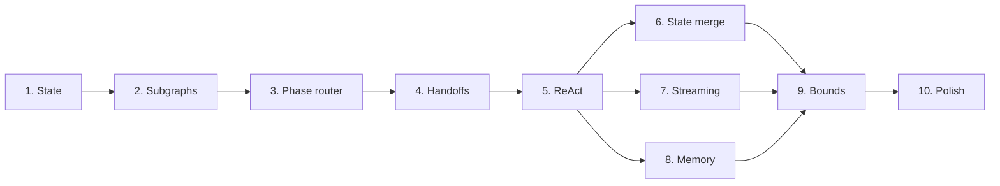

# Nitzotz (formerly ARIL) — TODO (phased implementation)

Work through in order. Each section should leave the graph runnable.

Phases 6, 7, and 8 can be parallelized after Phase 5 (see IMPLEMENTATION.md dependency diagram).

---

## Phase 1: State and schema

- [ ] Extend `OrchestratorState` (or introduce `ArilState`) with:
  - [ ] `handoff_type: str`, `critique: str`, `plan_approved: bool`, `human_approved: bool`
  - [ ] `phase: str` (current phase for router)
  - [ ] `implementation_versions: Annotated[list[dict], operator.add]` and optional `selected_implementation_id`
  - [ ] Optional `memory_context: str` for injected past context
  - [ ] Reuse existing `output_versions: Annotated[list[dict], operator.add]` for research merge (already exists in v0.5 — no new field needed)
- [ ] Add or document reducers for: research merge (by topic), plan revision history, implementation versions.
- [ ] Document ArilState in `src/orchestrator/graph_server/core/state.py` (or DESIGN.md) with field meanings.

---

## Phase 2: Subgraph modules and stub subgraphs

- [ ] Create `src/orchestrator/graph_server/subgraphs/` with `__init__.py`.
- [ ] Implement stub subgraphs (each compiles to a runnable graph). **Reuse existing nodes** — do not rewrite. Wire `build_research_node`, `build_architect_node`, `build_implement_node`, `build_validator_node`, `build_human_review_node` (from `src/orchestrator/graph_server/nodes/`) inside the subgraphs as the researcher, architect, implementer, reviewer, and human_review nodes. Stub = passthrough to these existing node factories.
  - [ ] `research.py` — single “researcher” node (passthrough via existing research node), returns to parent.
  - [ ] `planning.py` — single “architect” node (passthrough), returns to parent.
  - [ ] `implementation.py` — single “implementer” node (passthrough), returns to parent.
  - [ ] `review.py` — single “reviewer” node + optional human_review (passthrough), returns to parent.
- [ ] Define state mapping: parent state → subgraph state on entry; subgraph state → parent state on exit. Use a shared state schema (ArilState) for simplicity so no heavy mapping.
- [ ] Add unit or integration test: invoke each subgraph with minimal state and assert it returns.

---

## Phase 3: Parent graph as phase router

- [ ] Add a **separate** entry point: `build_aril_graph()` in e.g. `src/orchestrator/graph_server/graphs/aril.py` (or alongside `graph.py`). **Keep the existing graph** in `src/orchestrator/graph_server/graphs/orchestrator.py` as the fallback (Option B). Nitzotz is the core pipeline within **Genesis** — same server can expose both via a feature flag or different MCP tool (e.g. `chain_aril`).
- [ ] In the Nitzotz graph:
  - [ ] Nodes are: `research_phase`, `plan_phase`, `impl_phase`, `review_phase` (each a compiled subgraph).
  - [ ] Entry: START → router node that sets `phase` and invokes the appropriate subgraph.
  - [ ] After each subgraph returns, route to next phase or END based on `handoff_type` / `phase`.
- [ ] Keep existing checkpointer; ensure subgraph invocations use the same thread_id and checkpoint.
- [ ] In `src/orchestrator/graph_server/server/mcp.py`, `chain()` currently runs the graph via `graph.astream(..., stream_mode="updates")` inside the job’s `_run()` task and appends to `job.progress`. When Nitzotz is enabled, use the Nitzotz graph the same way (no separate jobs layer — the graph run stays in server.py).

---

## Phase 4: Multi-agent handoffs

- [ ] In research subgraph: add Critic node; researcher → critic; critic sets `handoff_type` (e.g. `needs_more_research` | `research_complete`); conditional edge to loop or exit.
- [ ] In planning subgraph: architect → critic; critic sets `handoff_type` (`plan_revision` | `plan_approved`); conditional edge to architect or exit.
- [ ] In implementation subgraph: implementer → (optional) reviewer; set `handoff_type` (e.g. `tests_failing` | `ready_for_review`).
- [ ] In review subgraph: reviewer sets score and `handoff_type` (`done` | `needs_impl_fix`); human_review sets `human_approved`.
- [ ] Parent router: read `handoff_type` after each phase and route to next phase or same phase (e.g. needs_more_research → research_phase again).

---

## Phase 5: ReAct loops inside research and implementation

**Architectural choice:** Do **not** replace the existing CLI subprocesses (Gemini/Claude CLI) with in-process API + tools. Current v0.5 nodes already delegate to CLI, which runs its own tool loop. Nitzotz’s “ReAct loop” is an **orchestration layer**: call the existing CLI (or existing node) **multiple times** in a loop (e.g. research by subtopic then merge; implement in rounds with validation between). No regression to in-process tools unless we explicitly choose that later.

- [ ] Research “loop”: orchestrate multiple research runs (e.g. by subtopic via existing `build_research_node` / Gemini CLI), then merge findings. Loop until “enough” or max rounds (e.g. 5). Output `research_findings`. Optionally add a critic step that requests more research (handoff).
- [ ] Implementation “loop”: orchestrate multiple implement runs (existing `build_implement_node` / Claude CLI) with validation between (e.g. run_tests via CLI or a small helper). Loop until tests pass or max rounds (e.g. 5). Guard: only run tests / execute if `plan_approved`. If we later add in-process tools (e.g. `src/orchestrator/graph_server/tools/filesystem.py`), that would be a separate decision.
- [ ] Add step counters to state; enforce max steps and set `handoff_type` on exit (e.g. `max_steps_reached`).

---

## Phase 6: Richer state and merge behavior

- [ ] Research: ensure parallel or multi-step research writes to an append list (e.g. `research_output_versions` or existing `output_versions`); add merge step or reducer to produce single `research_findings` (by topic/source, dedupe).
- [ ] Planning: keep last-writer-wins for `architecture_plan`; optionally append critique messages to a list for history.
- [ ] Implementation: implementer pushes to `implementation_versions`; reviewer or human can set `selected_implementation_id` for rollback/best-of. Use this in display or in next run’s context if needed.

---

## Phase 7: Streaming

**Build on v0.5.** Option B already streams in `src/orchestrator/graph_server/server/mcp.py`: `chain()` runs the graph via `graph.astream(initial_state, config=graph_config, stream_mode="updates")` inside the job’s `_run()` task and appends progress messages to `job.progress`; `status(job_id)` returns them. Do not replace this with a new pipeline.

- [ ] Extend the existing `_run()` pattern in server.py so that when the Nitzotz graph is used, progress messages include **phase** (e.g. `[research_phase] …`, `[impl_phase] …`). Reuse the same `job.progress` and `status()` behavior.
- [ ] If subgraphs are invoked as nested runs, stream their updates through the same job (e.g. when parent calls subgraph via `astream`, forward or aggregate updates and append to `job.progress` with phase tags). Optionally add `astream_events()` for finer-grained events later; start by extending `stream_mode="updates"` with phase-aware messages.
- [ ] Document in server/API how progress and phase appear in `status()` output.

---

## Phase 8: Persistent memory

- [ ] Add `src/orchestrator/graph_server/core/memory.py`: `save_run(thread_id, summary, decisions, outcome, artifacts)`, `get_recent_context(thread_id, limit=...)`. Back with SQLite or simple file store; optional vector store for RAG later.
- [ ] At graph entry (or at phase router START): call `get_recent_context(thread_id)` and set `memory_context` (or append to `context`) in state.
- [ ] After each phase or on run end: call `save_run(...)` with summary and key decisions. Prefer non-blocking (fire-and-forget or background task).
- [ ] Optional: add “memory” node before END that writes final summary.

---

## Phase 9: Bounds and invariants

- [ ] Enforce max steps in research ReAct (e.g. 10), planning revisions (e.g. 5), implementation ReAct (e.g. 20). Exit with `handoff_type` like `max_steps_reached` when exceeded.
- [ ] In implementation subgraph: before running run_tests or any execution tool, check `plan_approved`; if false, skip or return handoff “plan_not_approved”.
- [ ] In phase router: only route to `impl_phase` if `plan_approved`; optionally require `human_approved` for impl_phase.
- [ ] If “deploy” or “production” action is added later: require `human_approved` and document in DESIGN.md.
- [ ] Add `src/orchestrator/graph_server/core/guards.py` with `require_plan_approved(state)`, `require_human_approved(state)` if useful; use in router and tool runner.
- [ ] Document all invariants in DESIGN.md and in code docstrings.

---

## Phase 10: Polish and docs

- [ ] Update `docs/langgraph-in-this-project.md` (or add `docs/nitzotz.md`) with Nitzotz architecture, subgraphs, handoffs, streaming, memory, and invariants.
- [ ] Add or update MCP tool descriptions for `chain`/`status`/`approve` if behavior changes (e.g. phases in status output).
- [ ] Optional: integration test that runs a minimal Nitzotz flow (research → plan → implement → review) with mocks and asserts on state and handoff_type.
