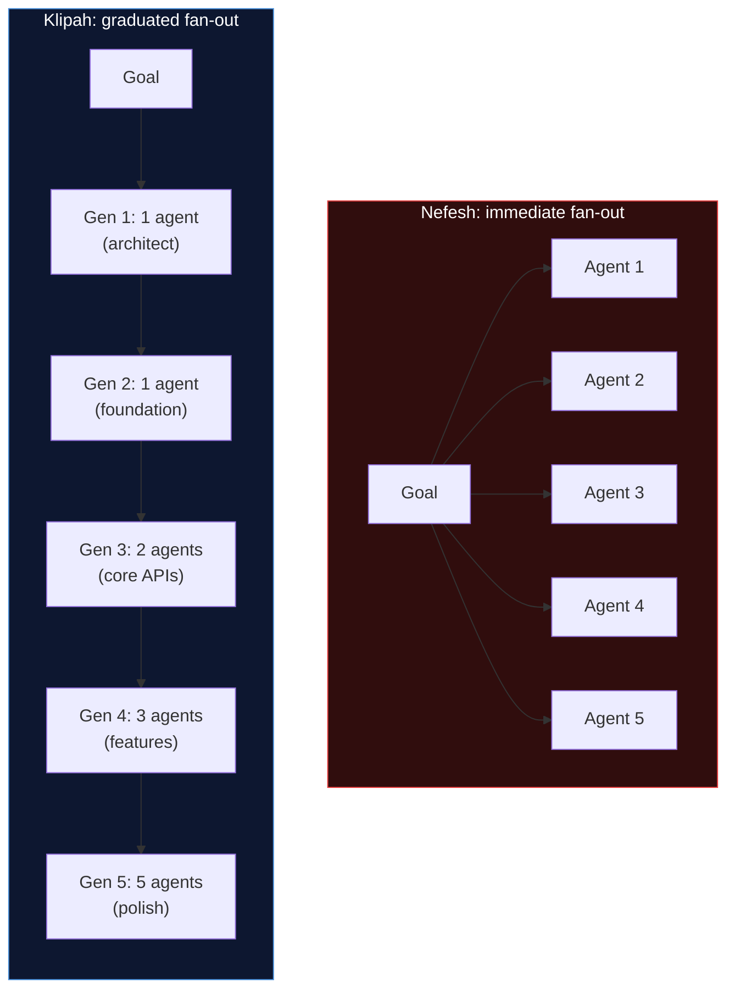
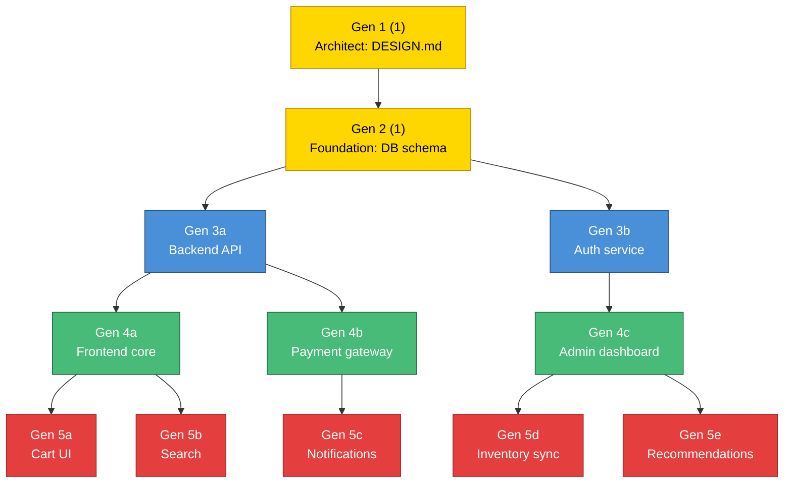
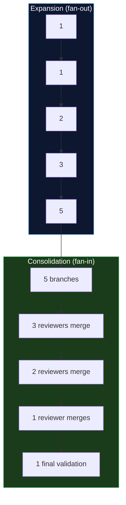
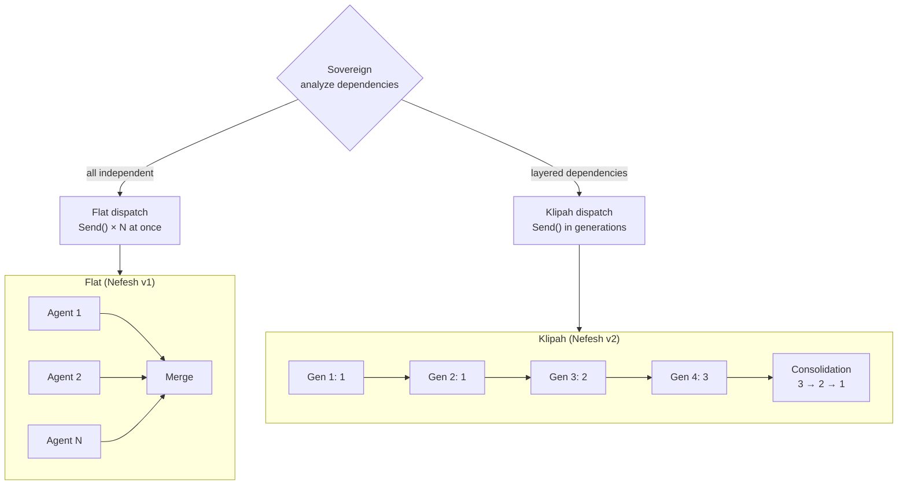

# Klipah (formerly Fibonacci) — The Shells

**Status:** Experiment. A concurrency scaling strategy that complements Nefesh (formerly Leviathan). Can be used standalone or as Nefesh's dispatch mode.

**Inspiration:** Klipah (the Shells/Husks) in Kabbalistic tradition — the outer layers that contain and constrain divine light. Each shell must be formed before the light within can be revealed. Unlike Nefesh's explosive fan-out (all N agents at once), Klipah scales concurrency in proportion to the foundation that's been laid. Each layer of parallelism builds on the previous, like shells forming layer by layer.

---

## 1. The Problem Klipah Solves

Nefesh's weakness is **premature parallelism**. If you fan out 10 agents on an empty repo, they all invent different patterns and the merge is chaos. If you fan out 5 agents to build features before the API contracts exist, they hallucinate incompatible interfaces.

Klipah says: **don't fan out until the foundation supports it.** Scale concurrency gradually as the dependency surface area expands. Each generation of agents can only be as wide as the previous generations' outputs allow.



---

## 2. The Klipah Swarm

### Phase expansion (fan-out)

Concurrency follows the Fibonacci sequence. Each generation's width is the sum of the previous two:

```
Gen 1:  1 agent   (architect: write the spec)
Gen 2:  1 agent   (foundation: build the schema/core)
Gen 3:  2 agents  (core services on top of foundation)
Gen 4:  3 agents  (features on top of core services)
Gen 5:  5 agents  (polish, tests, docs on top of features)
Gen 6:  8 agents  (integration, edge cases, optimization)
```

Each generation's agents can only start when the previous generation has completed and validated — because they depend on the outputs of the previous generation.



### Phase consolidation (fan-in)

The spiral also runs in reverse for integration. Once the wide generation finishes, branches are merged back down following the inverse sequence:

```
Gen 5:  5 branches → merged by 3 integration reviewers
Gen 4:  3 branches → merged by 2 integration reviewers
Gen 3:  2 branches → merged by 1 integration reviewer
Gen 2:  1 unified branch → final validation
Gen 1:  1 final artifact → commit
```



---

## 3. How Klipah Works With Nefesh

Klipah is not a replacement for Nefesh — it's a **dispatch mode** within Nefesh. The Sovereign planner chooses between two strategies:

| Strategy | When to use | How it dispatches |
|---|---|---|
| **Flat dispatch** (current Nefesh) | All tasks are independent | Send() × N all at once |
| **Klipah dispatch** | Tasks have layered dependencies | Send() in generations, each wider than the last |



**The Sovereign decides** by analyzing the task manifest for dependencies:
- If the dependency graph is flat (no task depends on another) → flat dispatch
- If the dependency graph has layers (some tasks depend on others' outputs) → Klipah dispatch
- The `SwarmTask.dependencies` field (already in Nefesh's design) drives this

### Implementation inside Nefesh

The change to Nefesh is minimal. Instead of one `Send()` call that fans out all tasks, the Klipah-aware Sovereign:

1. Sorts tasks by dependency depth (tasks with no dependencies = Gen 1)
2. Groups them into generations following the Fibonacci sequence
3. Dispatches Gen 1, waits for completion
4. Dispatches Gen 2 (which can now reference Gen 1's outputs), waits
5. Continues until all generations are dispatched
6. Runs the reverse consolidation (merging branches back down)

The `fan_out` conditional edge becomes a **multi-round dispatch loop** instead of a single Send():

```python
async def fibonacci_dispatch(state):
    manifest = state["swarm_manifest"]
    generations = _sort_into_generations(manifest["tasks"])

    for gen_num, gen_tasks in enumerate(generations):
        # Dispatch this generation's tasks in parallel
        results = await _dispatch_generation(graph, gen_tasks, state)
        # Merge generation results into state before next generation
        state = _merge_generation(state, results)

    # Reverse consolidation
    return await _consolidate(state, generations)
```

---

## 4. Token Budget Scaling

The Fibonacci sequence also governs resource allocation. Early generations (narrow, foundational) get modest budgets. Later generations (wide, specialized) get proportionally more because they're doing more work but each unit is simpler.

```python
def fibonacci_budget(generation: int, base_tokens: int = 2000) -> int:
    """Token budget per agent in a generation, scaled by Fibonacci."""
    a, b = 1, 1
    for _ in range(generation):
        a, b = b, a + b
    return base_tokens * a
```

| Generation | Agents | Tokens per agent | Total tokens | Cumulative |
|---|---|---|---|---|
| 1 | 1 | 2,000 | 2,000 | 2,000 |
| 2 | 1 | 2,000 | 2,000 | 4,000 |
| 3 | 2 | 4,000 | 8,000 | 12,000 |
| 4 | 3 | 6,000 | 18,000 | 30,000 |
| 5 | 5 | 10,000 | 50,000 | 80,000 |

This naturally limits spend on easy foundational work while scaling up for the complex later phases.

---

## 5. Comparison With Other Patterns

| | Nefesh (flat) | Klipah | Nitzotz |
|---|---|---|---|
| **Fan-out** | All N at once | Graduated: 1 → 1 → 2 → 3 → 5 | None (serial) |
| **Dependencies** | None allowed | Layered — each gen depends on previous | Sequential phases |
| **Risk** | High if tasks aren't truly independent | Low — foundation validated before expansion | Lowest (serial) |
| **Speed** | Fastest for independent tasks | Fast for dependent tasks | Slowest |
| **Best for** | Batch fixes across disjoint files | Greenfield builds, layered features | Single complex task |
| **Merge** | Single merge at end | Reverse spiral consolidation | No merge needed |
| **Cost** | High (N agents × budget) | Medium (graduated budget) | Low (serial) |

---

## 6. When Ein Sof Chooses Klipah

Ein Sof's (formerly MUTHER) dispatcher adds a third parallel strategy:

| Situation | Pattern | Why |
|---|---|---|
| 30 independent pyright errors | **Nefesh (flat)** | All independent, fan out immediately |
| "Build a full-stack app" | **Klipah** | Layered dependencies, must build foundation first |
| "Add OAuth" | **Nitzotz** | Single complex task, serial phases |
| Health declining, spec items remaining | **Chayah** | Continuous improvement loop |

---

## 7. What This is NOT

- **Not a new graph** — it's a dispatch mode inside Nefesh's Sovereign
- **Not always better than flat dispatch** — if tasks are truly independent, flat is faster
- **Not a replacement for Nitzotz** — Klipah parallelizes across tasks, Nitzotz handles a single task in phases
- **Not expensive by itself** — the Fibonacci sequence naturally throttles early spend
