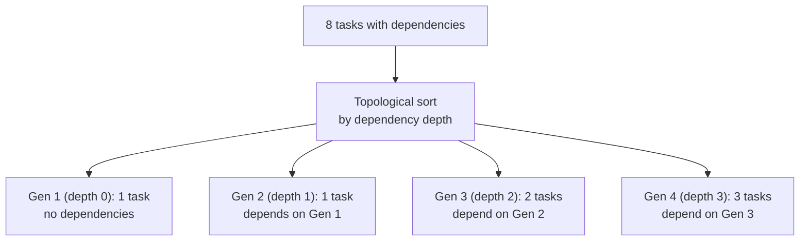
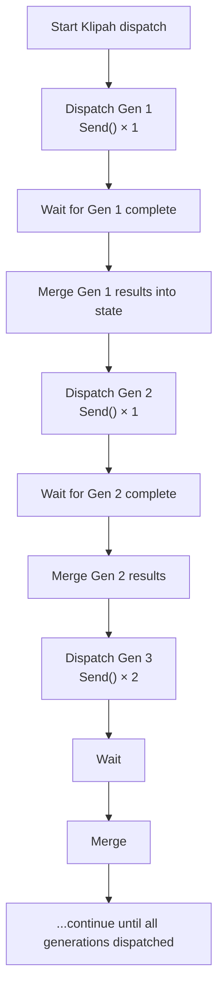
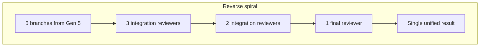
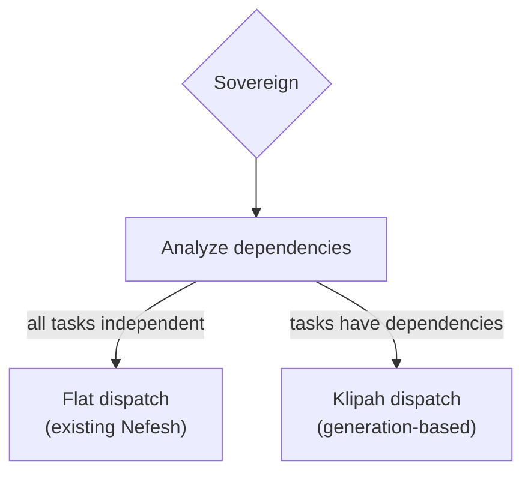
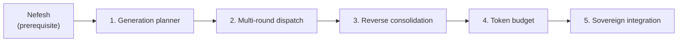

# Klipah (formerly Fibonacci) — Implementation approach

A graduated concurrency dispatch mode inside Nefesh (formerly Leviathan). Not a separate graph — an enhancement to the Sovereign's dispatch logic.

**Paths:** Modifications to `src/orchestrator/graph_server/nodes/sovereign.py` and `src/orchestrator/graph_server/graphs/leviathan.py`. New utilities in `src/orchestrator/graph_server/core/`.

**Dependency:** Requires Nefesh to be implemented. Klipah extends Nefesh's Sovereign with dependency-aware, generation-based dispatch.

---

## 1. Generation planner — sorting tasks into layers

**Goal:** Given a list of tasks with dependency edges, produce ordered generations where each generation only depends on the outputs of previous generations.



**Approach:**

- Add `_sort_into_generations()` to `src/orchestrator/graph_server/nodes/sovereign.py` (alongside existing task manifest logic).
- Algorithm:
  1. Build adjacency graph from `SwarmTask.dependencies`
  2. Topological sort — assign each task a depth (longest path from any root)
  3. Group tasks by depth → generations
  4. Cap each generation's width to the Fibonacci sequence: Gen 1 = max 1, Gen 2 = max 1, Gen 3 = max 2, Gen 4 = max 3, Gen 5 = max 5, Gen 6 = max 8
  5. If a layer exceeds its Fibonacci cap, split into sub-batches dispatched sequentially within that generation

```python
def _sort_into_generations(tasks: list[dict]) -> list[list[dict]]:
    """Group tasks into Fibonacci-width generations by dependency depth."""
    # Build dependency depth via BFS from roots
    depth: dict[str, int] = {}
    for task in tasks:
        if not task.get("dependencies"):
            depth[task["id"]] = 0

    changed = True
    while changed:
        changed = False
        for task in tasks:
            for dep_id in task.get("dependencies", []):
                if dep_id in depth:
                    new_depth = depth[dep_id] + 1
                    if task["id"] not in depth or depth[task["id"]] < new_depth:
                        depth[task["id"]] = new_depth
                        changed = True

    # Group by depth
    max_depth = max(depth.values(), default=0)
    generations: list[list[dict]] = []
    for d in range(max_depth + 1):
        gen = [t for t in tasks if depth.get(t["id"]) == d]
        generations.append(gen)

    # Cap widths to Fibonacci sequence
    fib = _fibonacci_sequence(len(generations))
    for i, gen in enumerate(generations):
        if len(gen) > fib[i]:
            # Split into sub-batches (dispatched sequentially within generation)
            # For now, just cap — sub-batching is a v2 optimization
            pass

    return generations


def _fibonacci_sequence(n: int) -> list[int]:
    """First n Fibonacci numbers (starting 1, 1, 2, 3, 5...)."""
    if n == 0:
        return []
    seq = [1, 1]
    while len(seq) < n:
        seq.append(seq[-1] + seq[-2])
    return seq[:n]
```

**Files to change:**

- `src/orchestrator/graph_server/nodes/sovereign.py` — add generation sorting

---

## 2. Multi-round dispatch loop

**Goal:** Instead of one `Send()` × N, dispatch in rounds — one round per generation, waiting for each to complete before starting the next.



**Approach:**

The Nefesh graph currently has a single `fan_out` → agents → `merge` structure. For Klipah, this becomes a loop:

```python
async def fibonacci_dispatch_node(state: OrchestratorState) -> dict:
    """Multi-round Fibonacci dispatch — one generation at a time."""
    manifest = state.get("swarm_manifest", {})
    tasks = manifest.get("tasks", [])
    generations = _sort_into_generations(tasks)

    all_results = []
    accumulated_context = ""

    for gen_num, gen_tasks in enumerate(generations):
        # Inject previous generations' outputs as context
        for task in gen_tasks:
            task["context"] = accumulated_context

        # Dispatch this generation (parallel within generation)
        gen_results = await _dispatch_single_generation(gen_tasks, state, gen_num)
        all_results.extend(gen_results)

        # Accumulate outputs for next generation's context
        for result in gen_results:
            if result.get("status") == "success":
                accumulated_context += f"\n\n## {result['task_id']}\n{result['output']}"

    return {
        "swarm_results": all_results,
        "history": [...],
    }
```

**The key difference from flat Nefesh:** Each generation's results are merged into state *before* the next generation starts. This means Gen 3 agents can read Gen 2's outputs (API contracts, schema definitions, etc.) as context. In flat Nefesh, all agents run with only the original goal as context.

**LangGraph mechanics:** Each generation uses the same `Send()` fan-out → fan-in pattern that Nefesh already has. The difference is that instead of one fan-out round, there are N rounds (one per generation). Between rounds, the dispatch node updates state and re-enters the fan-out.

This can be implemented as:
- **Option A:** A loop inside a single node (the node calls `Send()` per generation and awaits)
- **Option B:** The Nefesh graph has a `generation_router` that conditionally edges back to `dispatch` after each generation completes

Option B is more LangGraph-native (the loop is in the graph edges, not inside a node). The `generation_router` reads `current_generation` from state and either dispatches the next generation or routes to consolidation.

**Files to change:**

- `src/orchestrator/graph_server/graphs/leviathan.py` — add generation loop (either via internal node loop or graph-level conditional edges)
- `src/orchestrator/graph_server/core/state.py` — add `current_generation: int`, `generation_results: Annotated[list[dict], operator.add]`

---

## 3. Reverse consolidation (fan-in spiral)

**Goal:** After all generations complete, merge branches back down in reverse Fibonacci order.



**Approach:**

After the last generation completes, the consolidation phase runs:

1. Take all branches from the widest generation
2. Group into pairs (or groups of ~Fibonacci(N-1) size)
3. Each group gets one integration reviewer agent:
   - Reads the diffs from its assigned branches
   - Checks for conflicts (interfaces, shared state, naming conventions)
   - Produces a merged output or flags irreconcilable conflicts
4. The merged outputs become the input for the next consolidation round
5. Repeat until a single unified branch remains
6. Final unified branch runs the full test suite (same as Nefesh's existing merge node)

The integration reviewer is a lightweight LLM call (Haiku or Sonnet) — it doesn't write code, it reviews and merges. Its prompt:

```
You are an integration reviewer. You have two code changes that were developed in parallel.
Check for: conflicting interfaces, incompatible naming, duplicate functionality, broken contracts.
Produce a merged summary and flag any conflicts that require human intervention.
```

**Files to add:**

- `src/orchestrator/graph_server/nodes/consolidation_reviewer.py` — integration reviewer node
- Consolidation logic added to `graphs/leviathan.py` after the dispatch loop

---

## 4. Token budget scaling

**Goal:** Allocate tokens proportionally to generation — foundational work gets modest budgets, specialized work gets more.

**Approach:**

```python
def fibonacci_budget(generation: int, base_tokens: int = 2000) -> int:
    """Token budget per agent in a generation."""
    a, b = 1, 1
    for _ in range(generation):
        a, b = b, a + b
    return base_tokens * a
```

| Gen | Agents | Tokens/agent | Total |
|---|---|---|---|
| 1 | 1 | 2,000 | 2,000 |
| 2 | 1 | 2,000 | 2,000 |
| 3 | 2 | 4,000 | 8,000 |
| 4 | 3 | 6,000 | 18,000 |
| 5 | 5 | 10,000 | 50,000 |

Integrated with Nefesh's `SwarmBudget`:
- `max_cost_usd` still enforced globally
- Fibonacci scaling determines per-agent allocation within the global cap
- If the cumulative budget at generation N would exceed the global cap, stop dispatching further generations and go directly to consolidation with whatever was completed

**Files to change:**

- `src/orchestrator/graph_server/nodes/sovereign.py` — add budget scaling to generation planning

---

## 5. Sovereign integration — choosing flat vs Klipah

**Goal:** The Sovereign analyzes the task manifest and automatically picks the right dispatch mode.



**Approach:**

Add `dispatch_mode` to the `TaskManifest` Pydantic model:

```python
class TaskManifest(BaseModel):
    goal: str
    tasks: list[SwarmTask]
    dispatch_mode: Literal["flat", "fibonacci"] = "flat"
    reasoning: str
```

The Sovereign's prompt is updated to understand both modes:

```
When decomposing tasks, analyze dependencies:
- If ALL tasks are independent (can run simultaneously with no shared state) → dispatch_mode: "flat"
- If some tasks depend on others' outputs (e.g. "build API" must complete before "build frontend that calls API") → dispatch_mode: "fibonacci", and populate the `dependencies` field for each task
```

The `fan_out` function in `graphs/leviathan.py` reads `dispatch_mode` and routes to either the existing flat `Send()` or the new Klipah generation loop.

**Files to change:**

- `src/orchestrator/graph_server/nodes/sovereign.py` — update `TaskManifest` and prompt
- `src/orchestrator/graph_server/graphs/leviathan.py` — route between flat and Klipah dispatch

---

## Dependency order



All phases are sequential. The generation planner must exist before the dispatch loop, consolidation must exist before budget scaling matters, and the Sovereign integration ties it all together.
