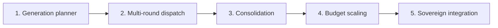

# Klipah (formerly Fibonacci) — TODO

Implemented as a dispatch mode inside Nefesh (formerly Leviathan). Depends on Nefesh being built first.

---

## Phase 1: Generation planner

- [ ] Add `_sort_into_generations(tasks: list[SwarmTask]) → list[list[SwarmTask]]` to `nodes/sovereign.py`
- [ ] Algorithm: topological sort on `SwarmTask.dependencies`, group into layers by dependency depth
  - [ ] Layer 0 (depth 0): tasks with no dependencies → Gen 1
  - [ ] Layer 1 (depth 1): tasks that depend only on Layer 0 → Gen 2
  - [ ] Layer N: tasks that depend on Layer N-1 → Gen N+1
- [ ] Cap generation widths to Fibonacci sequence: Gen 1 = max 1, Gen 2 = max 1, Gen 3 = max 2, Gen 4 = max 3, Gen 5 = max 5
  - [ ] If a layer has more tasks than the Fibonacci cap, split into sub-batches dispatched sequentially within the generation
- [ ] Validate: no circular dependencies (topological sort fails → error)
- [ ] Test: give 8 tasks with dependencies → verify correct generation grouping

---

## Phase 2: Multi-round dispatch loop

- [ ] Add `fibonacci_dispatch` mode to `graphs/leviathan.py` (alongside existing flat dispatch)
- [ ] Instead of one `Send()` call, iterate through generations:
  - [ ] For each generation: dispatch via `Send()` × gen_width, wait for all to complete
  - [ ] After each generation completes: merge results into state so next generation can reference them
  - [ ] The research_findings / architecture_plan / implementation_result from earlier gens become context for later gens
- [ ] Use LangGraph's existing fan-in barrier (same as flat Nefesh) per generation
- [ ] Track `current_generation: int` and `generation_results: list[list[dict]]` in state
- [ ] Test: dispatch 3 generations (1 → 1 → 2 agents), verify each gen starts only after previous completes

---

## Phase 3: Reverse consolidation

- [ ] After all generations complete, run the reverse spiral for integration
- [ ] Consolidation algorithm:
  - [ ] Take the N branches from the widest generation
  - [ ] Group into pairs (or small groups matching the previous Fibonacci number)
  - [ ] Each group gets one integration reviewer agent that merges and validates the pair
  - [ ] Repeat until a single unified branch remains
- [ ] Integration reviewer = LLM that reads two diffs, checks for conflicts, validates combined result
- [ ] Final unified branch runs the full integration test (same as Nefesh's existing merge)
- [ ] Test: 5 branches → consolidate to 3 → 2 → 1, verify final branch is coherent

---

## Phase 4: Token budget scaling

- [ ] Add `fibonacci_budget(generation: int, base_tokens: int = 2000) → int`
- [ ] Early generations (foundational, narrow) get base budget
- [ ] Later generations (wide, specialized) get proportionally more
- [ ] Integrate with Nefesh's existing `SwarmBudget`:
  - [ ] `max_cost_usd` still enforced globally
  - [ ] Fibonacci scaling determines per-agent allocation within the global cap
- [ ] If global budget would be exceeded at generation N, stop dispatching further generations
- [ ] Test: verify budget allocation follows Fibonacci scaling, verify global cap is respected

---

## Phase 5: Sovereign integration

- [ ] Modify Nefesh's Sovereign to choose between flat and Klipah dispatch:
  - [ ] Analyze `SwarmTask.dependencies` — if any task has dependencies → Klipah mode
  - [ ] If all tasks have empty dependencies → flat mode (existing behavior, unchanged)
- [ ] Add `dispatch_mode: "flat" | "fibonacci"` to `TaskManifest`
- [ ] The Sovereign's prompt should understand both modes:
  - [ ] "These tasks are all independent" → flat dispatch, file-disjoint ownership
  - [ ] "Task X depends on Task Y" → Klipah dispatch, populate dependencies
- [ ] Test: give Sovereign "fix 20 pyright errors" → verify flat. Give "build a REST API with auth" → verify Klipah with dependencies
