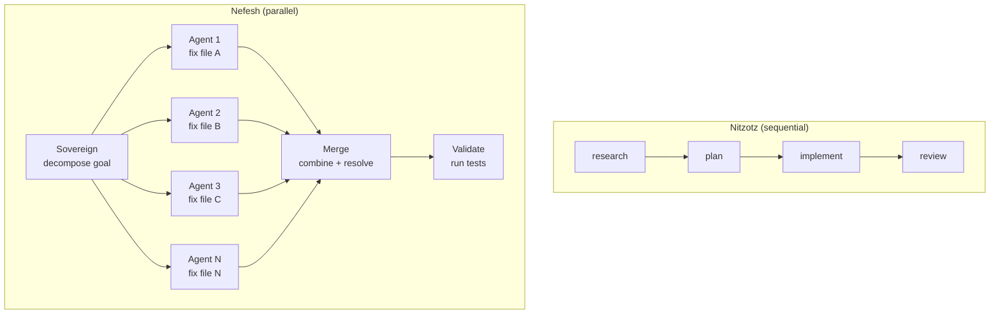
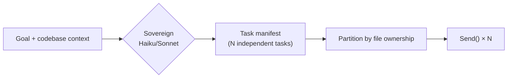
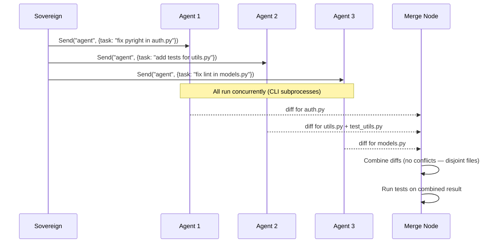
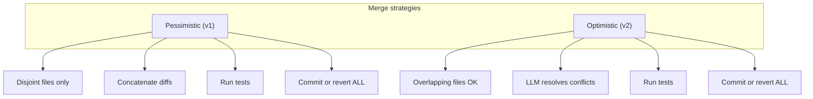
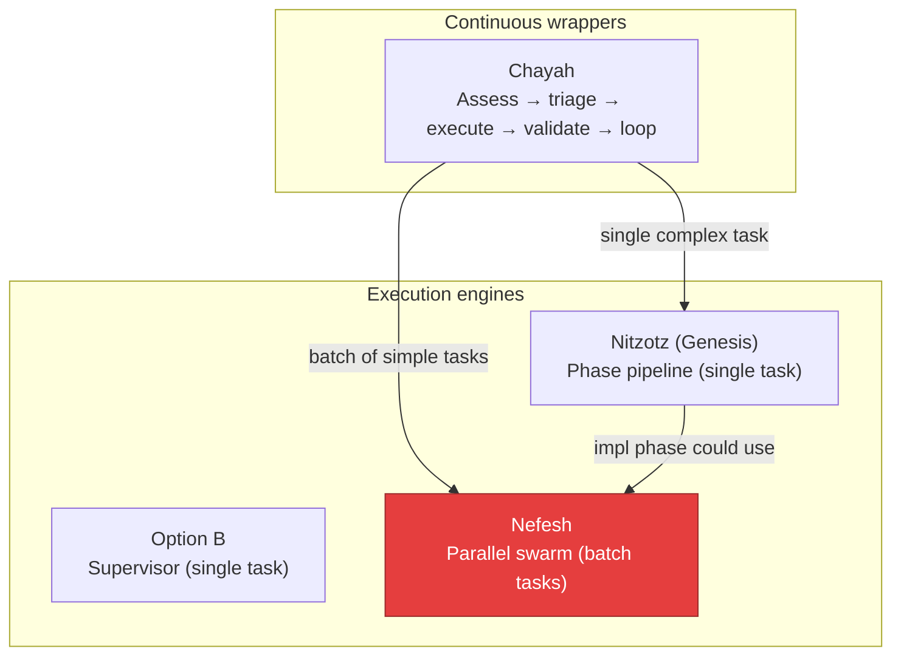

# Nefesh (formerly Leviathan) — The Animal Soul

**Status:** Experiment. Part of the **Genesis** system. Builds on Nitzotz (formerly ARIL). Can complement Chayah (formerly Ouroboros).

**Inspiration:** Nefesh is the Animal Soul in Kabbalistic tradition — the vital, instinctive force that animates physical action with immediate, coordinated physicality. In this architecture, a Sovereign planner decomposes a large goal into many independent tasks, dispatches a swarm of parallel agents via `Send()`, then merges and validates the combined result.

---

## 1. The Goal

Move from sequential task execution (Nitzotz: research → plan → implement → review, one at a time) to **parallel batch execution** — decompose a large goal into N independent tasks and execute them concurrently, then merge the results.

| | Nitzotz | Nefesh |
|---|---|---|
| **Execution** | Sequential phases, one task | Parallel swarm, many tasks |
| **Pacing** | Slow, safe, one change at a time | Fast, aggressive, batch changes |
| **Best for** | Complex features needing research + design | Batch refactors, test gaps, lint fixes |
| **Cost** | Low (linear API calls) | Higher (concurrent API calls, bounded by budget) |
| **Risk** | Low (one change, easy to revert) | Higher (merge conflicts between agents) |



---

## 2. The Architecture

### 2.1 The Sovereign (Decomposition + Dispatch)

The Sovereign is a planner node that takes a high-level goal and the current codebase state, then produces a **task manifest** — a list of independent, parallelizable sub-tasks.



**Key constraint: file ownership.** Two agents cannot modify the same file concurrently. The Sovereign must partition work so each agent "owns" a set of files. If two tasks touch the same file, they must be serialized or merged by the Sovereign before dispatch.

**Task manifest structure:**
```python
class SwarmTask(BaseModel):
    id: str                    # e.g. "fix-pyright-auth-module"
    description: str           # What the agent should do
    files: list[str]           # Files this task will modify (ownership claim)
    estimated_complexity: str  # "trivial" | "simple" | "moderate"
    dependencies: list[str]   # Other task IDs that must complete first (empty = independent)
```

**Independence validation:** Before dispatching, the Sovereign checks for file ownership conflicts. If task A claims `auth.py` and task B also claims `auth.py`, either merge them into one task or serialize them.

### 2.2 The Swarm (Parallel Execution via Send())

Each independent task is dispatched as a `Send("agent", payload)` — reusing LangGraph's existing fan-out mechanism (same pattern as parallel research in Option B).

Each agent is a thin wrapper around the existing `build_implement_node()` or `build_architect_node()` — no new execution engine needed. The agent receives its task description and file ownership list, runs the CLI subprocess, and returns its changes.



**Budget gate:** Each agent has a token/cost estimate. The Sovereign tracks cumulative estimated cost and stops spawning agents when the budget ceiling is reached.

### 2.3 The Merge (Conflict Resolution + Validation)

The merge node is the hardest part. It collects all agent outputs and combines them into a single coherent changeset.

**Pessimistic merge (v1 — start here):**
- Only dispatch tasks with disjoint file ownership
- Merge is trivial: concatenate non-overlapping diffs
- If any agent failed, exclude its changes and log the failure
- Run the test suite on the combined result
- If tests pass → commit; if tests fail → revert all

**Optimistic merge (v2 — future):**
- Allow overlapping file ownership
- Merge node is an LLM that reads all diffs for a conflicting file and produces a combined version
- Much more powerful but much harder to get right



---

## 3. The Sovereign's Decision Model

The Sovereign needs structured output to produce the task manifest:

```python
class TaskManifest(BaseModel):
    """Sovereign's decomposition of a goal into parallel tasks."""
    goal: str
    tasks: list[SwarmTask]
    estimated_total_cost: str  # "low" | "medium" | "high"
    reasoning: str             # Why these tasks, why this partition

class SwarmTask(BaseModel):
    id: str
    description: str
    files: list[str]           # Claimed file ownership
    estimated_complexity: str  # "trivial" | "simple" | "moderate"
    dependencies: list[str]   # Empty = fully independent
```

**Sovereign prompt strategy:**

The Sovereign reads:
1. The goal (e.g. "fix all 30 pyright errors")
2. The codebase structure (file tree, relevant file contents)
3. The specific items to address (e.g. pyright error list, failing test list)
4. The budget constraint

It outputs a TaskManifest with independent, file-disjoint tasks. The prompt explicitly forbids overlapping file ownership in v1.

---

## 4. Budget Control

Nefesh is expensive by nature. Budget control is a first-class concern, not an afterthought.

```python
@dataclass
class SwarmBudget:
    max_agents: int = 10          # Max concurrent agents
    max_cost_usd: float = 2.0    # Total estimated cost ceiling
    timeout_per_agent: int = 300  # Seconds per agent (5 min)
    timeout_total: int = 600      # Total swarm timeout (10 min)
```

**Enforcement:**
- Sovereign estimates cost per task based on complexity
- Dispatch stops when cumulative estimate hits `max_cost_usd`
- Remaining tasks are queued for the next swarm cycle (or dropped)
- Each agent has a hard timeout — if it hangs, kill and mark as failed
- Total swarm timeout prevents runaway execution

---

## 5. Use Cases (when Nefesh beats Nitzotz)

| Use case | Why Nefesh | Why not Nitzotz |
|---|---|---|
| Fix 30 pyright errors across 20 files | Each fix is independent, parallelizable | Nitzotz would fix them one by one (30 cycles) |
| Add unit tests for 10 untested modules | Each test file is independent | Nitzotz would write one test suite per cycle |
| Migrate API endpoints from v1 to v2 | Each endpoint is independent if disjoint | Nitzotz would migrate one at a time |
| Fix lint warnings across the codebase | Each file is independent | Nitzotz would lint one file per cycle |
| Rename a variable across 50 files | Single `sed` — don't even need Nefesh | Overkill for simple refactors |
| Add a new feature requiring design | **Don't use Nefesh** — use Nitzotz | Needs research → plan → implement |

**Rule of thumb:** Nefesh for **breadth** (many independent changes). Nitzotz for **depth** (one complex change needing multiple phases).

---

## 6. How Nefesh Fits in the Stack



**Nefesh is an execution strategy, not a replacement:**
- Chayah triages: "30 pyright errors" → dispatches to Nefesh
- Chayah triages: "add OAuth" → dispatches to Nitzotz
- Nitzotz's implementation phase could internally use Nefesh for batch file changes

---

## 7. Guardrails

| Rule | Why |
|------|-----|
| File ownership is exclusive (v1) | Prevents merge conflicts entirely |
| Budget ceiling per swarm | Prevents runaway API costs |
| Per-agent timeout | Prevents hanging CLI subprocesses |
| Total swarm timeout | Hard cap on wall-clock time |
| Revert ALL if tests fail | Atomic batch — partial success is not allowed |
| Sovereign cannot modify itself | Same as Chayah — fitness.py, guards.py are off-limits |
| Max agents capped at 10-15 | Diminishing returns past ~8 parallel agents on a single repo |

---

## 8. What This is NOT

- **Not a distributed system** — all agents run locally, same machine, same repo
- **Not a replacement for Nitzotz** — Nefesh is for batch parallelism, Nitzotz is for deep sequential work
- **Not always faster** — for a single complex task, Nitzotz is better. Nefesh shines on N independent tasks
- **Not production-ready** — experiment to explore parallel agent coordination patterns
