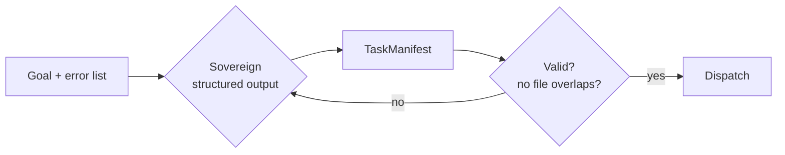
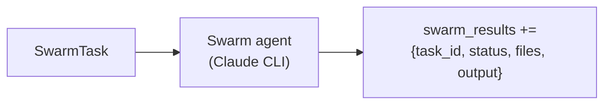
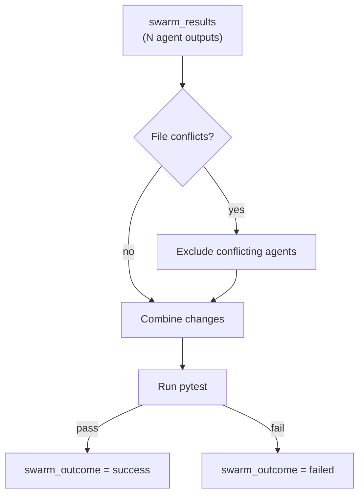
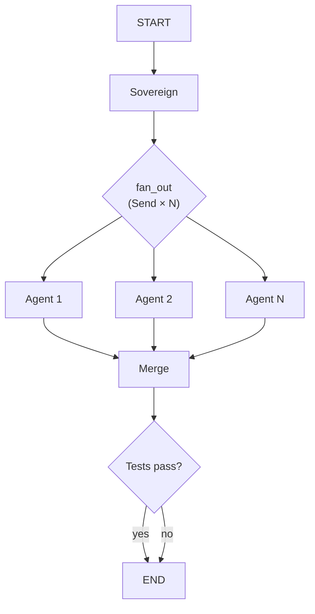
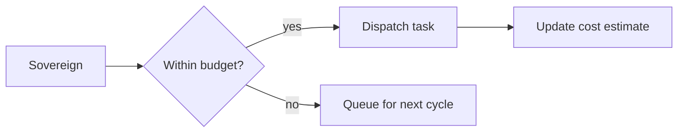
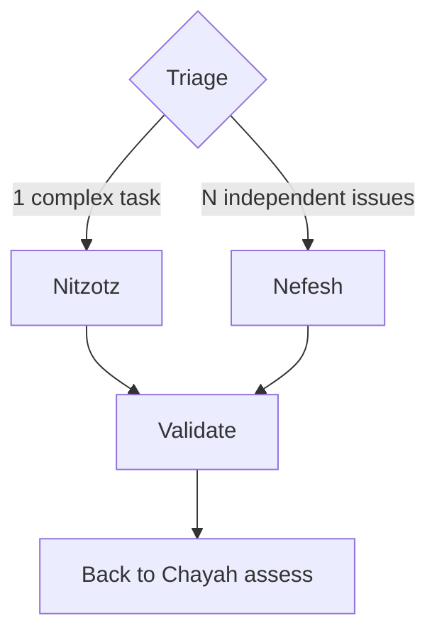
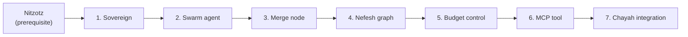

# Nefesh (formerly Leviathan) — Implementation approach

Parallel swarm execution engine. Builds on Nitzotz (formerly ARIL), integrates with Chayah (formerly Ouroboros).

**Paths:** All code under `src/orchestrator/graph_server/`. New files follow the organized directory structure (nodes/, graphs/, core/, server/, tools/).

**Dependency:** Requires Nitzotz to be implemented (Nefesh uses the same state, node factories, and CLI subprocess wrappers). Can integrate with Chayah as an execution strategy.

---

## 1. The Sovereign — task decomposition

**Goal:** Take a high-level goal and decompose it into N independent, file-disjoint tasks.



**Approach:**

- New node `src/orchestrator/graph_server/nodes/sovereign.py` (not to be confused with the existing `supervisor.py` — supervisor routes in Option B's hub-and-spoke, sovereign decomposes for parallel dispatch).
- Uses Pydantic structured output (same pattern as `RouterDecision` in supervisor):
  ```python
  class SwarmTask(BaseModel):
      id: str                    # "fix-pyright-auth"
      description: str           # What to do
      files: list[str]           # Files this task will touch
      estimated_complexity: str  # "trivial" | "simple" | "moderate"

  class TaskManifest(BaseModel):
      tasks: list[SwarmTask]
      reasoning: str
  ```
- File ownership validation: after the LLM produces a manifest, check that no two tasks share a file. If they do, merge the conflicting tasks into one or re-prompt.
- The sovereign reads: goal, file tree (via `list_dir`), specific items to fix (e.g. pyright error output, failing test names).

**State additions:**

```python
# --- Leviathan (swarm) ---
swarm_manifest: dict                           # TaskManifest as dict
swarm_results: Annotated[list[dict], operator.add]  # Per-agent results (append)
swarm_outcome: str                             # "success" | "failed" | "partial"
swarm_test_output: str                         # Test output after merge
swarm_budget: dict                             # Budget config
swarm_cost_estimate: float                     # Running cost estimate
```

**Files to add/change:**

- `src/orchestrator/graph_server/nodes/sovereign.py` — new
- `src/orchestrator/graph_server/core/state.py` — add swarm fields

---

## 2. The Swarm Agent — parallel execution

**Goal:** Execute a single task from the manifest using the existing CLI subprocess infrastructure.



**Approach:**

- New node `src/orchestrator/graph_server/nodes/swarm_agent.py`.
- Wraps `build_implement_node()` logic — same CLI subprocess call, same `run_claude()`, same timeout.
- The agent is specialized: it receives a narrow task description and a file ownership list. The prompt tells it to ONLY modify the listed files.
- Returns structured result: `{task_id, status, files_changed, output, error}`.
- Writes to `swarm_results` (append reducer) so all agent results accumulate.
- Each agent runs in its own `Send()` branch — LangGraph handles concurrency.

**Key difference from implement_node:** The swarm agent is scoped to specific files and a narrow task. The implement node takes a full architecture plan and has free reign. The swarm agent's prompt explicitly constrains it.

**Files to add:**

- `src/orchestrator/graph_server/nodes/swarm_agent.py`

---

## 3. The Merge — combining results

**Goal:** Collect all agent outputs, validate no conflicts, run tests on combined result.



**Approach:**

- New node `src/orchestrator/graph_server/nodes/swarm_merge.py`.
- **Pessimistic merge (v1):** since the sovereign guarantees file-disjoint ownership, there should be no conflicts. The merge node verifies this and combines.
- If any agent failed (status != "success"), exclude its changes and log the failure. The combined result is a "partial success" if some agents succeeded.
- After combining: run `uv run pytest` via `asyncio.create_subprocess_exec` to validate the combined changes don't break anything.
- The merge node does NOT use an LLM — it's deterministic. Only the validation (test run) is external.

**Files to add:**

- `src/orchestrator/graph_server/nodes/swarm_merge.py`

---

## 4. The Nefesh graph

**Goal:** Wire sovereign → fan-out → agents → merge → validate into a single graph.



**Approach:**

- New graph `src/orchestrator/graph_server/graphs/leviathan.py` with `build_leviathan_graph()`.
- `fan_out` is a conditional edge function (same pattern as `select_next_node` in orchestrator.py):
  ```python
  def fan_out(state) -> list[Send]:
      manifest = state.get("swarm_manifest", {})
      tasks = manifest.get("tasks", [])
      return [Send("swarm_agent", {**state_subset, **task}) for task in tasks]
  ```
- All agents converge at the merge node — LangGraph handles the fan-in barrier automatically.
- Checkpointer: separate SQLite DB (`leviathan_checkpoints.db`) or shared with Nitzotz.

**Files to add:**

- `src/orchestrator/graph_server/graphs/leviathan.py`
- `src/orchestrator/graph_server/graphs/__init__.py` — add export

---

## 5. Budget enforcement

**Goal:** Prevent runaway costs from massive parallel execution.



**Approach:**

- `SwarmBudget` dataclass in `src/orchestrator/graph_server/core/state.py` or inline in the sovereign:
  ```python
  @dataclass
  class SwarmBudget:
      max_agents: int = 10
      max_cost_usd: float = 2.0
      timeout_per_agent: int = 300
      timeout_total: int = 600
  ```
- Sovereign estimates cost per task: trivial (~$0.05), simple (~$0.15), moderate (~$0.40).
- The `fan_out` function caps the number of `Send()` calls at `max_agents` and cumulative cost at `max_cost_usd`.
- Remaining tasks are stored in state for a potential second pass (or dropped with a warning in the result).

**Files to change:**

- `src/orchestrator/graph_server/nodes/sovereign.py` — cost estimation
- `src/orchestrator/graph_server/graphs/leviathan.py` — budget enforcement in fan_out

---

## 6. MCP integration

**Goal:** Expose Nefesh as a tool alongside `chain` and `chain_aril`.

**Approach:**

- Add `swarm(goal, budget, max_agents)` tool to `src/orchestrator/graph_server/server/mcp.py`.
- Same background job pattern as `chain()` — starts graph in asyncio.Task, returns job_id.
- Progress messages:
  - `Sovereign: decomposed into N tasks`
  - `Agent 1/N: completed (files: auth.py, auth_test.py)`
  - `Agent 2/N: failed (timeout)`
  - `Merge: combining 4/5 successful agents`
  - `Validate: tests passed`
- Use existing `status(job_id)` and `approve(job_id)` infrastructure.

**Files to change:**

- `src/orchestrator/graph_server/server/mcp.py` — add `swarm` tool
- `src/orchestrator/graph_server/graphs/__init__.py` — export `build_leviathan_graph`

---

## 7. Chayah integration

**Goal:** Chayah can dispatch batch tasks to Nefesh instead of Nitzotz when appropriate.



**Decision rule in triage node:**
- If the action is "fix" and there are > 3 independent issues that touch different files → Nefesh
- If the action is "feature" or "refactor" → Nitzotz
- If there are ≤ 3 issues → Nitzotz (not worth the swarm overhead)

**Files to change:**

- `src/orchestrator/graph_server/nodes/triage.py` (Chayah) — add Nefesh dispatch path

---

## Dependency order



All phases are sequential. The sovereign must exist before agents can be dispatched, agents before merge, etc. Chayah integration is optional and comes last.
