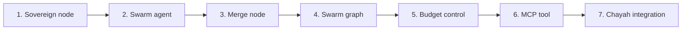

# Nefesh (formerly Leviathan) — TODO

Experimental. Depends on Nitzotz (formerly ARIL) being implemented. Can integrate with Chayah (formerly Ouroboros).



---

## Phase 1: Sovereign node (task decomposition)

- [ ] Create `src/orchestrator/graph_server/nodes/sovereign.py`
- [ ] Define `SwarmTask(BaseModel)`: id, description, files (ownership), estimated_complexity, dependencies
- [ ] Define `TaskManifest(BaseModel)`: goal, tasks list, estimated_total_cost, reasoning
- [ ] Build sovereign node that takes a goal + codebase context → produces `TaskManifest` via structured output
- [ ] Sovereign prompt: read goal, file tree, error list (if applicable), budget → output independent, file-disjoint tasks
- [ ] Add file ownership validation: reject manifests where two tasks claim the same file
- [ ] Add to state: `swarm_manifest: dict`, `swarm_results: Annotated[list[dict], operator.add]`
- [ ] Test: invoke sovereign with "fix all pyright errors" + error list, verify manifest has disjoint file ownership

---

## Phase 2: Swarm agent wrapper

- [ ] Create `src/orchestrator/graph_server/nodes/swarm_agent.py`
- [ ] Swarm agent = thin wrapper around existing `build_implement_node()` (reuse CLI subprocess)
- [ ] Agent receives: task description, file ownership list, supervisor_instructions
- [ ] Agent returns: result + list of files actually modified + success/failure status
- [ ] Each agent writes to `swarm_results` (append reducer) with: task_id, status, files_changed, output
- [ ] Add per-agent timeout (default 300s, configurable)
- [ ] Test: invoke a single swarm agent with a simple task, verify it returns structured result

---

## Phase 3: Merge node

- [ ] Create `src/orchestrator/graph_server/nodes/swarm_merge.py`
- [ ] **Pessimistic merge (v1):** collect all `swarm_results`, verify no file overlaps, combine
- [ ] If any agent failed: exclude its changes, log failure, continue with successful agents
- [ ] Run validation: `uv run pytest` on the combined result (via `asyncio.create_subprocess_exec`)
- [ ] If tests pass: set `swarm_outcome: "success"`
- [ ] If tests fail: set `swarm_outcome: "failed"`, include test output in state for debugging
- [ ] Add to state: `swarm_outcome: str`, `swarm_test_output: str`
- [ ] Test: merge 3 successful agent results + 1 failed, verify combined output excludes failure

---

## Phase 4: Swarm graph

- [ ] Create `src/orchestrator/graph_server/graphs/leviathan.py` with `build_leviathan_graph()`
- [ ] Graph structure:
  ```
  START → sovereign → fan_out → [agent × N] → merge → validate → END
  ```
- [ ] `fan_out` conditional edge: read `swarm_manifest`, return `Send("swarm_agent", payload)` for each task
- [ ] All agents converge at merge node (LangGraph handles fan-in barrier)
- [ ] Validate node: if `swarm_outcome == "failed"`, optionally retry failed tasks (max 1 retry)
- [ ] Use same checkpointer pattern as Nitzotz (AsyncSqliteSaver, separate DB)
- [ ] Test: run full graph with 3 mock tasks, verify fan-out/fan-in/merge works

---

## Phase 5: Budget control

- [ ] Define `SwarmBudget` dataclass: max_agents, max_cost_usd, timeout_per_agent, timeout_total
- [ ] In sovereign node: estimate cost per task based on complexity, stop adding tasks when budget hit
- [ ] In fan_out: cap number of Send() calls at `max_agents`
- [ ] Queue remaining tasks in state for a second swarm cycle (or drop with warning)
- [ ] Add total swarm timeout: if wall-clock exceeds `timeout_total`, kill remaining agents
- [ ] Add to state: `swarm_budget: dict`, `swarm_cost_estimate: float`
- [ ] Test: set budget to allow only 3 agents, give 5 tasks, verify only 3 are dispatched

---

## Phase 6: MCP tool

- [ ] Add `swarm(goal, budget, max_agents)` tool to `src/orchestrator/graph_server/server/mcp.py`
- [ ] Starts leviathan graph in background (same pattern as `chain()` and `chain_aril()`)
- [ ] Progress messages show: sovereign decomposition, agent dispatch count, per-agent completion, merge result
- [ ] Use `status(job_id)` to poll — same job infrastructure
- [ ] Test: invoke via MCP inspector, verify progress streaming and final result

---

## Phase 7: Chayah integration (optional)

- [ ] In Chayah triage node: when action is "fix" and there are N independent issues (e.g. pyright errors), dispatch to Nefesh instead of Nitzotz
- [ ] Decision rule: if `count(issues) > 3` and issues are file-disjoint → use Nefesh; else → use Nitzotz
- [ ] Pass the Chayah health report to the Sovereign as context
- [ ] After Nefesh completes, Chayah runs its normal validate → commit/rollback cycle
- [ ] Test: Chayah triage dispatches to Nefesh for batch pyright fixes, then validates
