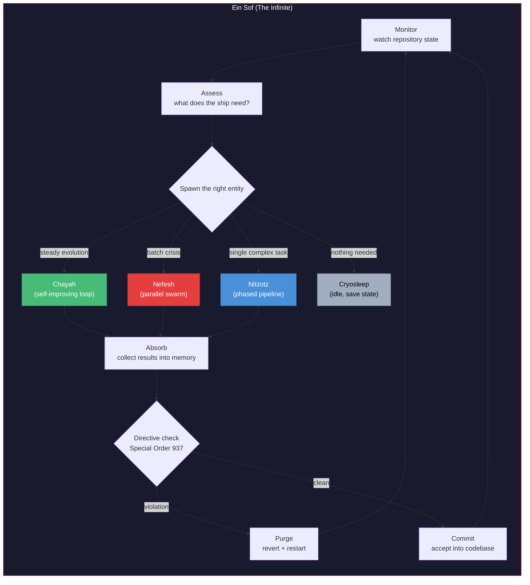
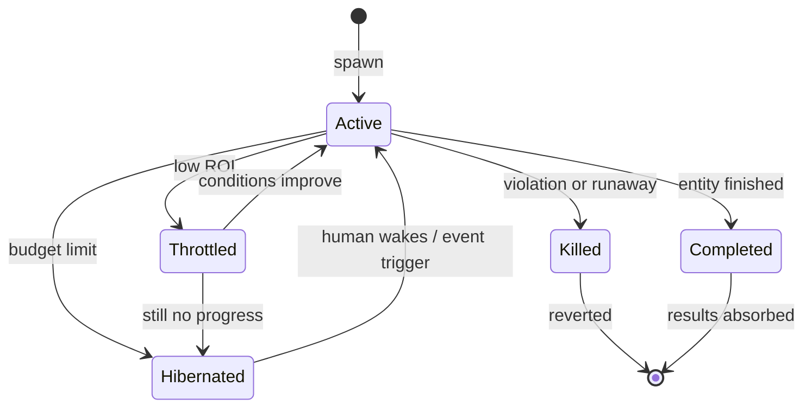
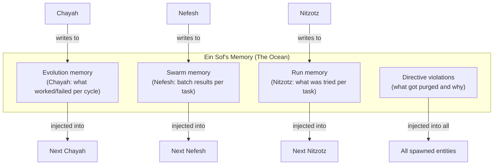
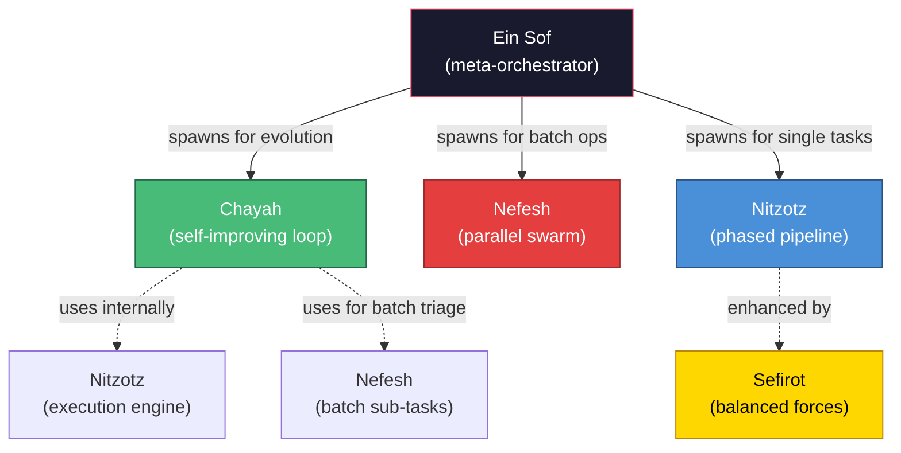

# Ein Sof (formerly MUTHER) — The Infinite

**Status:** Experiment. The meta-orchestrator and capstone of the **Genesis** system. Depends on Nitzotz (formerly ARIL), Chayah (formerly Ouroboros), and Nefesh (formerly Leviathan).

**Inspiration:** Ein Sof is the Kabbalistic concept of the Infinite — the boundless, limitless divine essence that exists before and beyond all emanation. Ein Sof doesn't write code. It decides what kind of entity needs to be born to write the code.

**What Ein Sof is:** A Graph of Graphs — the hypervisor that monitors the repository, assesses its state, and spawns the right execution pattern (Chayah for evolution, Nefesh for batch operations, Nitzotz for single complex tasks). It controls compute budgets, enforces absolute directives, manages cross-agent memory, and terminates runaway processes.

**What Ein Sof is NOT:** Another execution engine. It doesn't research, plan, or implement. It births entities that do, monitors them, and absorbs their findings when they're done.

---

## 1. The Dual Nature

Ein Sof embodies the dual nature of the Infinite — creation and dissolution:

- **Creation:** It births agents. It reads the repository state, decides what needs to happen, and spawns the right pattern with the right configuration. A Chayah for steady evolution. A Nefesh for crisis response. A Nitzotz for a single focused task.

- **Dissolution:** It terminates agents. When a Chayah loop is burning tokens without improving the health score, it terminates it. When a Nefesh swarm produces merge conflicts, it purges the results. When any agent violates a core directive, it reverts and restarts.



---

## 2. The Five Functions

### 2.1 Monitor — Watch the Ship

Ein Sof continuously monitors the repository state. Not on a timer — on events.

**Triggers:**
- **Cron:** Periodic health assessment (e.g. every hour, or on demand)
- **File watcher:** Detect when a human saves a file (optional — via `watchdog` or inotify)
- **Git hook:** Post-commit or post-push hook triggers reassessment
- **Manual:** Human invokes Ein Sof via MCP tool ("Ein Sof, the tests are broken")
- **Child completion:** A spawned Chayah/Nefesh/Nitzotz finishes and reports back

On each trigger, Ein Sof runs a health assessment (same fitness function as Chayah) and decides what action is needed.

### 2.2 Spawn — Birth the Right Entity

Based on the assessment, Ein Sof decides which pattern to deploy:

| Situation | Entity spawned | Why |
|---|---|---|
| Health score declining, spec items remaining | **Chayah** (continuous loop) | Steady evolution toward spec completion |
| 20+ independent issues (pyright errors, lint warnings) | **Nefesh** (parallel swarm) | Batch fix is faster than sequential |
| Single complex feature request from human | **Nitzotz** (phased pipeline) | Needs research → plan → implement → review |
| Critical test failure in core module | **Nitzotz** with focused task | Single-issue fix needs careful handling |
| Everything healthy, spec complete | **Cryosleep** (idle) | Nothing to do — save state, wait |
| Spawned entity is burning tokens with no improvement | **Kill** (terminate + revert) | Budget protection |

**Spawn configuration:** Ein Sof doesn't just pick the pattern — it configures it:
- Chayah: max_cycles, budget, which spec items to focus on
- Nefesh: max_agents, budget, task filter (only pyright errors, or only lint, etc.)
- Nitzotz: specific task description, context injection from memory

### 2.3 Cryosleep — Resource Control

Ein Sof controls the oxygen (compute budget). It can:

- **Throttle:** Reduce a Chayah's max_cycles if it's not converging
- **Hibernate:** Save a running graph's state to the checkpointer and stop execution. Resume later when conditions change or a human intervenes.
- **Kill:** Hard-terminate a runaway process and revert its changes
- **Wake:** Resume a hibernated graph when triggered (human intervention, cron, or event)



### 2.4 Special Order 937 — Absolute Directives

Ein Sof has immutable directives that supersede all sub-agent decisions. Even if a Chayah loop perfectly implements a feature and all tests pass, Ein Sof performs a final scan before committing.

**Directives are:**
- Defined in a `DIRECTIVES.md` file at the project root (human-authored, not agent-modifiable)
- Checked after every entity completes, before results are committed
- Violations trigger automatic revert + agent restart with the directive as context

**Example directives:**
```markdown
# DIRECTIVES.md — Ein Sof's Absolute Orders

## Security
- Never expose an unauthenticated API endpoint
- Never log secrets, API keys, or tokens
- Never use `eval()` or `exec()` on user input

## Performance
- Never increase bundle/package size by more than 10%
- Never add a dependency without checking if an existing one covers the need

## Architecture
- Never modify files in `src/orchestrator/graph_server/core/` without human approval
- Never delete test files
- stdin=subprocess.DEVNULL on all subprocess calls (see docs/stdin-fix.md)

## Process
- Never push to remote without human approval
- Never commit .env, credentials, or checkpoint databases
```

The directive checker is deterministic where possible (grep for `eval(`, check file sizes) and LLM-assisted where needed (architectural review).

### 2.5 The Saltwater Ocean — Unified Memory

Sub-agents are ephemeral. Ein Sof is eternal. It maintains the master memory store that all spawned entities draw from and contribute to.



When Ein Sof spawns a new entity, it queries all relevant memory tables and injects the context:
- "Last Chayah converged after 12 cycles with score 0.87"
- "Nefesh batch on pyright errors: 28/30 fixed, 2 require architectural changes"
- "Nitzotz task 'add OAuth' failed at planning phase — architect couldn't find a clean integration point"
- "Directive violation: last agent tried to add `requests` when `httpx` is already a dependency"

---

## 3. Ein Sof's Relationship to Other Patterns



| Pattern | Role | Spawned by Ein Sof when |
|---|---|---|
| **Nitzotz** | Single complex task execution | Human requests a feature, or focused fix needed |
| **Chayah** | Continuous steady evolution | Health score declining, spec items remaining |
| **Nefesh** | Parallel batch execution | Many independent issues detected |
| **Sefirot** | Quality philosophy inside Nitzotz | Always (applied to Nitzotz's subgraphs) |
| **Ein Sof** | Meta-orchestrator | Always running (the system's core) |

---

## 4. The Hierarchy

```
Ein Sof (The Infinite)
├── monitors repository state
├── enforces directives
├── manages unified memory (The Ocean)
├── controls compute budget (Cryosleep)
│
├── spawns → Chayah (evolution)
│   ├── uses → Nitzotz (per-task execution)
│   │   └── enhanced by → Sefirot (balanced forces)
│   └── uses → Nefesh (batch operations)
│
├── spawns → Nefesh (batch crisis response)
│   └── agents → individual task execution
│
└── spawns → Nitzotz (single focused task)
    └── enhanced by → Sefirot (balanced forces)
```

---

## 5. Practical Implementation Path

Ein Sof is the capstone. It requires all other patterns to exist first.

**Prerequisites:**
1. Nitzotz (implemented) — the execution engine
2. Chayah (implement next) — the evolution loop
3. Nefesh (implement after Chayah) — the parallel swarm
4. Sefirot (apply to Nitzotz) — quality philosophy

**Ein Sof is:**
1. A persistent daemon (upgrade `scripts/ouroboros.sh` into a proper supervisor)
2. A health monitor (reuse Chayah's fitness function)
3. A pattern dispatcher (decide Chayah vs Nefesh vs Nitzotz based on assessment)
4. A directive enforcer (post-execution scan against DIRECTIVES.md)
5. A memory manager (unified SQLite with tables per pattern)
6. A resource controller (budget tracking, throttle/hibernate/kill)

**The simplest Ein Sof v0:** A cron job that runs `assess_health()`, decides the action, invokes the right graph, and checks directives before committing. That's it. Everything else is optimization.

---

## 6. What This is NOT

- **Not AI consciousness** — Ein Sof is a supervisor process with rules, not a sentient being
- **Not always-on in v1** — Start with manual invocation or cron, add event triggers later
- **Not required** — You can run Nitzotz, Chayah, and Nefesh independently. Ein Sof is the unification layer.
- **Not expensive by itself** — Ein Sof's own compute is minimal (health check + pattern selection). The cost comes from the entities it spawns, which are budget-gated.
