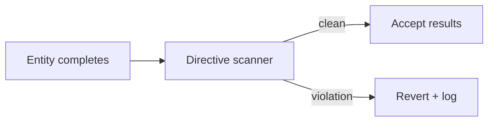
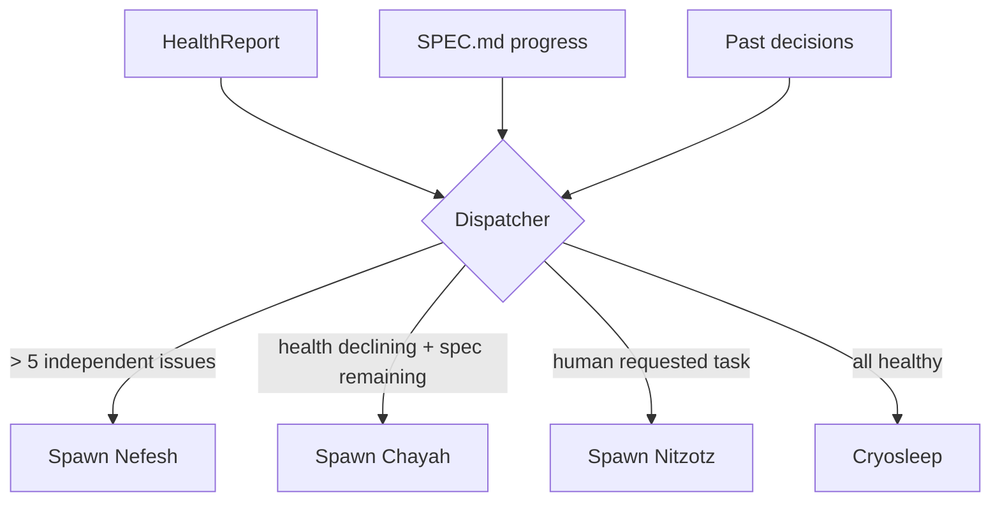
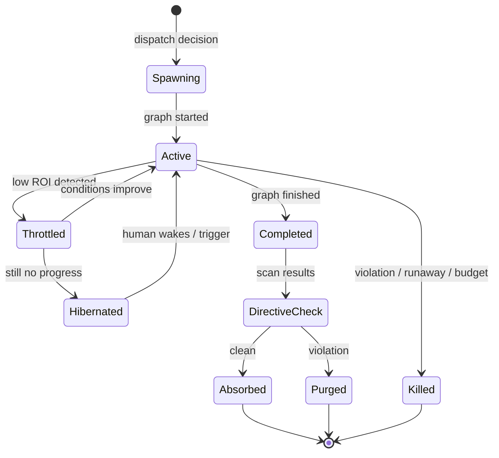
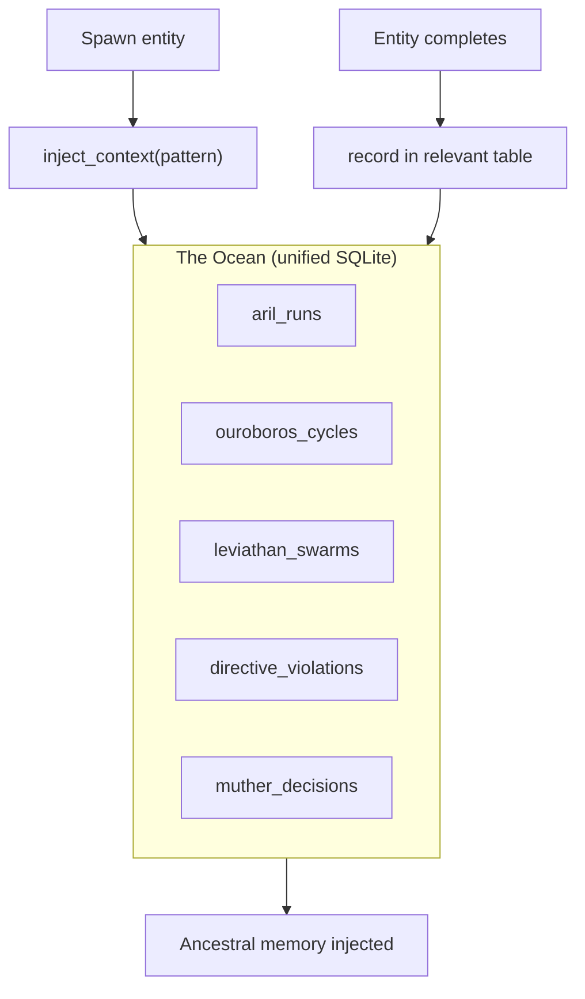
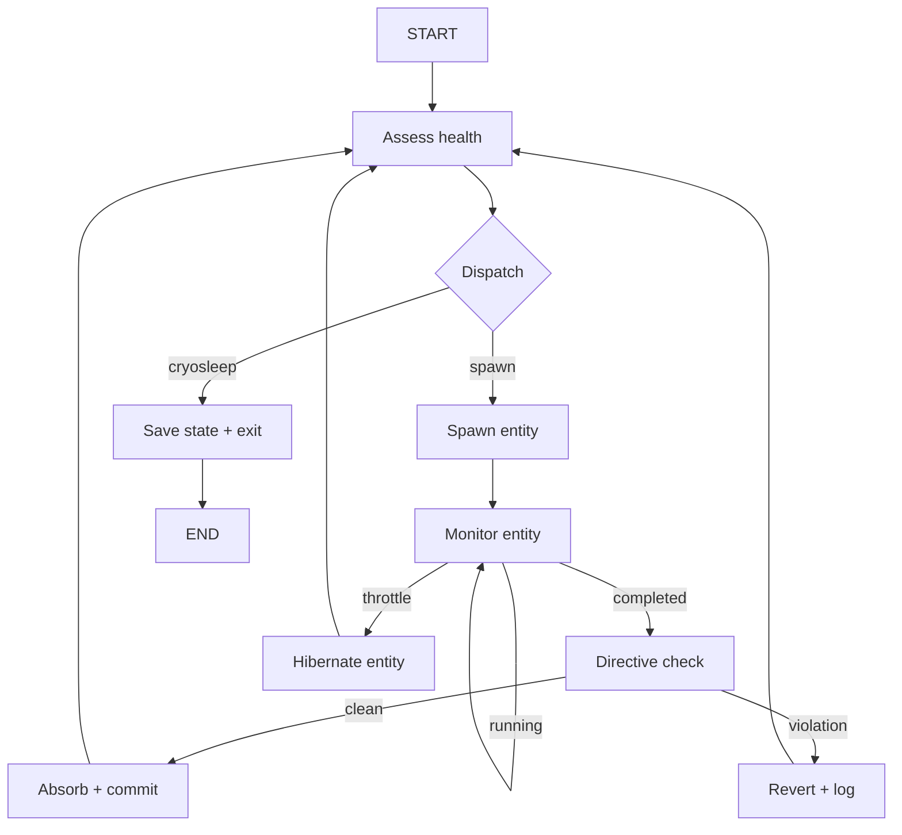
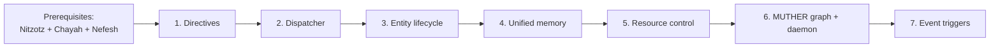

# Ein Sof (formerly MUTHER) — Implementation approach

The meta-orchestrator. A Graph of Graphs that monitors the repository and spawns the right execution pattern.

**Paths:** Core modules in `src/orchestrator/graph_server/core/`. Graph in `src/orchestrator/graph_server/graphs/muther.py`. Nodes in `src/orchestrator/graph_server/nodes/`. Daemon script in `scripts/muther.sh`.

**Dependencies:** Nitzotz (implemented), Chayah (required), Nefesh (required). Ein Sof is the capstone that unifies all patterns.

---

## 1. Directives — the immutable laws

**Goal:** Rules that supersede all sub-agent decisions. Checked after every entity completes.



**Approach:**

- `DIRECTIVES.md` at project root — human-authored, never modified by agents.
- `src/orchestrator/graph_server/core/directives.py`:
  - `load_directives()` — parse markdown into structured rules
  - `check_directives(diff: str) → DirectiveResult`
  - Two types of checks:
    - **Deterministic:** regex scan for `eval(`, `exec(`, `.env` in diff, file size delta
    - **LLM-assisted:** one cheap API call (Haiku) for architectural rules ("does this introduce an unauthenticated endpoint?")
  ```python
  class Violation(BaseModel):
      directive: str          # Which directive was violated
      description: str        # What the violation is
      severity: str           # "critical" | "warning"
      file: str               # Which file

  class DirectiveResult(BaseModel):
      passed: bool
      violations: list[Violation]
  ```
- Critical violations → automatic revert. Warnings → log but allow (human reviews later).
- The directive file itself must be outside the agent's write scope — Ein Sof checks that no entity modifies `DIRECTIVES.md`.

**Files to add:**

- `DIRECTIVES.md` — project root
- `src/orchestrator/graph_server/core/directives.py`

---

## 2. Dispatcher — choosing the right pattern

**Goal:** Given the repository state, decide which pattern to spawn.



**Approach:**

- `src/orchestrator/graph_server/nodes/muther_dispatch.py`
- Uses Haiku with structured output:
  ```python
  class DispatchDecision(BaseModel):
      pattern: Literal["ouroboros", "leviathan", "aril", "cryosleep"]
      reasoning: str
      config: dict  # Pattern-specific configuration
  ```
- Decision rules (in prompt + hardcoded guards):
  1. If human provided a specific task → Nitzotz (always honor explicit requests)
  2. If > 5 independent issues across disjoint files → Nefesh (batch is faster)
  3. If health declining and spec items remaining → Chayah (steady evolution)
  4. If all healthy + spec complete → Cryosleep
  5. If budget exhausted → Cryosleep (regardless of state)
- The dispatcher also configures the entity:
  - Chayah: `{max_cycles: 10, budget: 1.0, focus: "stretch goals"}`
  - Nefesh: `{max_agents: 8, budget: 2.0, filter: "pyright errors"}`
  - Nitzotz: `{task: "add rate limiting", context: "..."}`
- Past dispatch decisions are injected as context (from Ein Sof's memory) so she doesn't repeat failed strategies.

**Files to add:**

- `src/orchestrator/graph_server/nodes/muther_dispatch.py`

---

## 3. Entity lifecycle — spawn, monitor, absorb, kill

**Goal:** Manage sub-graph execution as entities with lifecycles.



**Approach:**

- `src/orchestrator/graph_server/core/entity_manager.py`
- An entity is a running graph (Chayah, Nefesh, or Nitzotz) tracked by Ein Sof:
  ```python
  @dataclass
  class Entity:
      entity_id: str
      pattern: str              # "ouroboros" | "leviathan" | "aril"
      status: str               # lifecycle state
      config: dict              # spawn configuration
      job_id: str               # linked background job
      started_at: float
      cost_estimate: float
      health_before: float      # health score when spawned
  ```
- `spawn_entity(pattern, config)`:
  - Builds the right graph (`build_ouroboros_graph`, `build_leviathan_graph`, `build_aril_graph`)
  - Starts it as a background job (same job infrastructure as `chain()`)
  - Returns entity_id
- `monitor_entity(entity_id)`:
  - Check job status and progress
  - Check cost against budget
  - Check if health is improving (for Chayah)
- `absorb_results(entity_id)`:
  - Run directive check on the entity's changes
  - If clean → commit changes, record in memory
  - If violation → revert, log violation, optionally re-spawn with directive context
- `kill_entity(entity_id)`:
  - Cancel the background task
  - Revert any uncommitted changes
  - Log the kill reason

**Files to add:**

- `src/orchestrator/graph_server/core/entity_manager.py`

---

## 4. Unified memory — The Ocean

**Goal:** All patterns contribute to and draw from a single memory system.



**Approach:**

- Extend existing memory system (`src/orchestrator/graph_server/core/memory.py`) or create `src/orchestrator/graph_server/core/ocean.py`.
- Add tables beyond what Nitzotz and Chayah already have:
  ```sql
  CREATE TABLE leviathan_swarms (
      id INTEGER PRIMARY KEY,
      timestamp REAL,
      goal TEXT,
      agents_spawned INTEGER,
      agents_succeeded INTEGER,
      files_changed TEXT,
      outcome TEXT
  );

  CREATE TABLE directive_violations (
      id INTEGER PRIMARY KEY,
      timestamp REAL,
      entity_id TEXT,
      pattern TEXT,
      directive TEXT,
      violation TEXT,
      action_taken TEXT
  );

  CREATE TABLE muther_decisions (
      id INTEGER PRIMARY KEY,
      timestamp REAL,
      health_score REAL,
      pattern_chosen TEXT,
      config TEXT,
      reasoning TEXT,
      outcome TEXT
  );
  ```
- `inject_context(pattern)` queries all relevant tables:
  - For Chayah: recent ouroboros_cycles + directive_violations + muther_decisions
  - For Leviathan: recent leviathan_swarms + directive_violations
  - For Nitzotz: recent aril_runs + directive_violations
  - Always includes: last 3 muther_decisions (why Ein Sof chose what it chose)
- Memory injection happens at spawn time — the context is set in the entity's initial state.

**Files to add/change:**

- `src/orchestrator/graph_server/core/ocean.py` (or extend `memory.py`)

---

## 5. Resource control

**Goal:** Ein Sof controls compute spend across all spawned entities.

**Approach:**

- `src/orchestrator/graph_server/core/resource_control.py`
- Global budget:
  ```python
  @dataclass
  class GlobalBudget:
      max_daily_cost_usd: float = 10.0
      max_concurrent_entities: int = 3
      max_single_entity_cost_usd: float = 3.0
      daily_cost_so_far: float = 0.0
  ```
- Throttle detection:
  - Chayah: track health_score per cycle. If 3 consecutive cycles with delta ≤ 0 → throttle.
  - Nefesh: track agent success rate. If < 50% of agents succeed → throttle.
  - Any entity: if cost exceeds `max_single_entity_cost_usd` → hibernate.
  - Global: if `daily_cost_so_far` exceeds `max_daily_cost_usd` → hibernate all, alert human.
- Hibernate = save checkpointer state + stop execution. Wake = resume from checkpointer.
- The budget resets daily (or on manual reset).

**Files to add:**

- `src/orchestrator/graph_server/core/resource_control.py`

---

## 6. The Ein Sof graph

**Goal:** Wire everything into a LangGraph StateGraph.



**State additions:**

```python
# MUTHER state
active_entities: list[dict]
dispatch_decision: dict
directive_result: dict
global_budget: dict
muther_cycle: int
```

**Approach:**

- `src/orchestrator/graph_server/graphs/muther.py` with `build_muther_graph()`
- The graph is a continuous loop: assess → dispatch → spawn → monitor → directive check → absorb → assess
- Exit conditions: cryosleep (nothing to do) or budget exhausted
- The monitor node polls the spawned entity's job status (non-blocking)
- If entity takes too long, MUTHER can throttle or kill between poll cycles
- Expose as `chain_muther` MCP tool and as `muther` CLI entry point

**Files to add:**

- `src/orchestrator/graph_server/graphs/muther.py`
- `scripts/muther.sh` — outer daemon
- Entry point in `pyproject.toml`

---

## Dependency order



Ein Sof is the last thing built. It requires all the entities it spawns to exist first. Start with directives (useful independently), then dispatcher, then lifecycle management.
