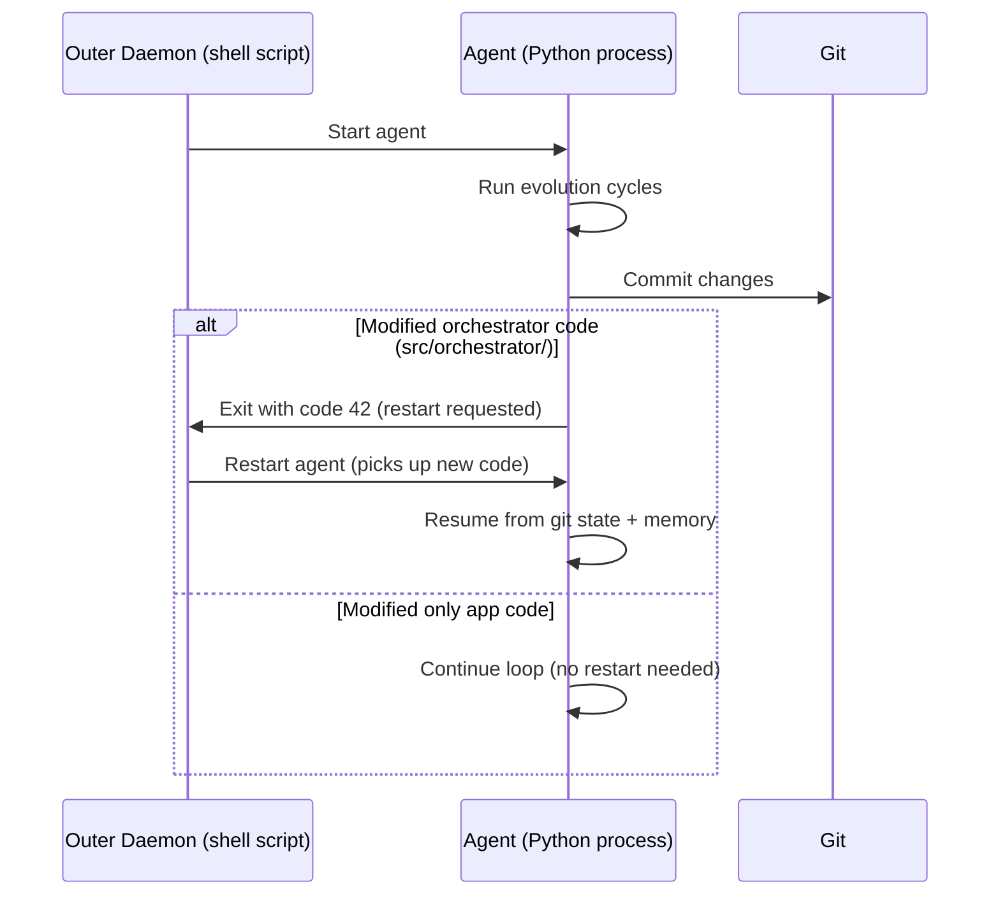
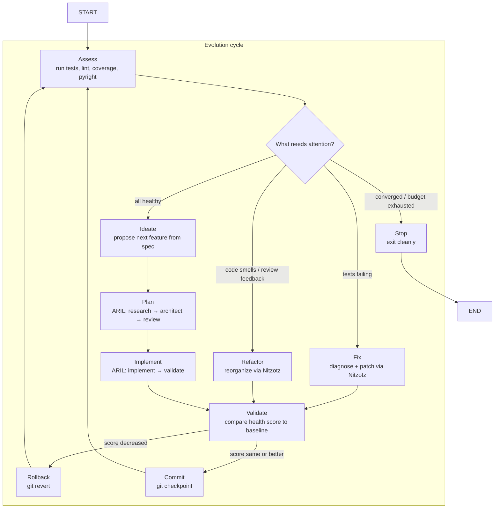

# Chayah (formerly Ouroboros) — The Living Soul

**Status:** Experiment. Part of the **Genesis** system. Not a production feature. Chayah is the Living Soul in Kabbalistic tradition — the highest animating force that drives continuous renewal and transformation. In this architecture, the system feeds on its own outputs, modifies its own source code, and restarts itself to absorb those changes. It is an Auto-Dev pattern.

**Relationship to Nitzotz (formerly ARIL):** Chayah is a **loop around Nitzotz**. Nitzotz handles a single task (research → plan → implement → review). Chayah generates the tasks, feeds them to Nitzotz, evaluates the results, and loops. It doesn't replace Nitzotz — it's a continuous wrapper that invokes it.

---

## 1. The Goal

Move from a single-shot orchestrator ("human gives task → agent executes → done") to a **bounded, continuous self-improvement loop** ("agent assesses → generates task → executes → validates → commits or reverts → repeat").

The current orchestrator (Option A and B) is reactive — it waits for a human to provide a task. Chayah is proactive — it reads a product spec and a fitness function, then autonomously drives the codebase toward the spec while maintaining or improving health metrics.

There is no natural end state. The agent runs until:
- The health score plateaus (convergence — nothing left to improve)
- The change budget is exhausted (N cycles without human input)
- The spec is complete (all features checked off)
- A human intervenes

---

## 2. The Architecture

Two layers sit outside the LangGraph execution: the **outer daemon** manages the OS process, and the **continuous wrapper** feeds the graph in a loop.

### 2.1 The Outer Daemon (process management + restart logic)

If the agent modifies its own orchestrator code (e.g. `graph.py`, `server.py`), the running Python process doesn't see the changes. The daemon solves this.



**Implementation:**
- A bash wrapper: `while true; do uv run ouroboros "$@"; [[ $? -eq 42 ]] || break; done`
- The agent detects self-modification via `git diff --name-only` checking for `src/orchestrator/` paths
- If it modified itself: commit, exit 42, daemon restarts with the new code
- On restart: read the evolution memory store to know the last cycle number and resume

**Why a shell script and not a Python watchdog?** Simplicity. The daemon's only job is "restart if exit code is 42, stop otherwise." A shell loop is 3 lines, zero dependencies, and cannot be accidentally modified by the agent.

### 2.2 The Continuous Wrapper (feeding the graph)

The wrapper is the control loop that sits between the daemon and the graph. Each iteration:

1. Calls the **assess** node (run tests, lint, pyright → HealthReport)
2. Calls the **triage** node (read health report + memory → decide action)
3. Feeds the chosen task to the **Nitzotz graph** (research → plan → implement → review)
4. Calls the **validate** node (re-assess, compare to baseline)
5. Commits or reverts based on score delta
6. Checks stopping criteria (convergence, budget, spec complete)
7. Loops or exits



**Priority order (triage rules):**

1. **Tests failing** — always fix broken things first
2. **Pyright/lint errors** — type safety and code quality before features
3. **Architecture review feedback** — refactor if reviewers flag structural issues
4. **Feature from spec** — only ideate when the codebase is healthy
5. **Stop** — spec complete + health good, or budget exhausted

This prevents the agent from adding features on top of a broken foundation.

---

## 3. The Nodes

### 3.1 The Ideation Node (reading the Spec + Health Report)

The ideation node is the "product manager." It reads two inputs:

- **SPEC.md** — the product specification with `[x]` (done) and `[ ]` (todo) checkboxes
- **HealthReport** — the current fitness score and breakdown

It picks the next unchecked spec item and formulates it as a task description for Nitzotz. It does **not** invent features outside the spec — the spec is the only source of work.

**Failure avoidance:** Before proposing a task, ideation queries the evolution memory for previous attempts at that spec item. If it failed N times with the same approach, it either skips the item or tries a different angle. This prevents infinite retry loops on impossible features.

**When there's nothing to ideate:** If all spec items are checked and health is good, ideation returns "idle" — triggering the stopping criteria.

### 3.2 The Review/Critic Node (LLM-based approval)

After the Nitzotz graph produces changes but before validation, a review step provides a qualitative check that the fitness function can't capture:

- **Cross-model review:** Claude reviews Gemini's research. Gemini reviews Claude's architecture. No model reviews its own output.
- **Architecture coherence:** Does the change fit the existing codebase patterns? Or does it introduce a new pattern that conflicts?
- **Scope creep:** Did the agent implement more than the spec item asked for?

The reviewer can flag issues that get fed back into the next Nitzotz cycle as feedback. This is separate from Nitzotz's internal validator (which scores output quality) — the Chayah reviewer judges the **change as a whole** against the codebase.

**Note:** This is an LLM judgment call, not a hard gate. The fitness function (deterministic) is the actual gatekeeper. The reviewer provides signal to the triage node for future cycles ("architecture is getting messy" → next cycle priorities refactoring).

---

## 4. The Invariants (The Immune System)

The fitness function and revert policy are the immune system — they prevent the codebase from degrading even when the agent makes bad decisions.

### 4.1 The HealthReport dataclass

Objective, deterministic, not modifiable by the agent.

```python
@dataclass
class HealthReport:
    tests_passing: int
    tests_failing: int
    test_coverage: float        # 0.0-1.0
    pyright_errors: int
    lint_warnings: int
    spec_features_done: int     # checked items in product spec
    spec_features_total: int    # total items in product spec

    @property
    def score(self) -> float:
        """Single 0.0-1.0 score. Higher = healthier."""
        test_ratio = self.tests_passing / max(self.tests_passing + self.tests_failing, 1)
        type_score = 1.0 if self.pyright_errors == 0 else max(0, 1.0 - self.pyright_errors / 50)
        spec_progress = self.spec_features_done / max(self.spec_features_total, 1)
        return (
            test_ratio * 0.30
            + self.test_coverage * 0.20
            + type_score * 0.20
            + spec_progress * 0.20
            + (1.0 if self.lint_warnings == 0 else max(0, 1.0 - self.lint_warnings / 100)) * 0.10
        )
```

The score is computed by running actual tools (`pytest`, `pyright`, spec parser) — not by asking an LLM. This makes it immune to the agent's optimism bias.

### 4.2 The strict "revert if score drops" policy

Every cycle follows this protocol:

1. **Baseline:** Record `health_score` before the change
2. **Execute:** Run the Nitzotz task (code gets modified)
3. **Re-assess:** Run `assess_health()` again → new score
4. **Compare:**
   - `score_after > score_before` → **commit** (improvement)
   - `score_after == score_before` → **commit** (neutral change — may be prep for future improvement)
   - `score_after < score_before` → **revert** (`git revert HEAD`)

**Git is the safety net.** Every change is committed before validation. If the score drops, `git revert` restores the previous state. The codebase can never get worse — only better or the same.

### 4.3 Additional guardrails

| Rule | Why |
|------|-----|
| Fitness function is immutable | Agent can't game its own evaluation |
| Git commit before every change | Revert is always possible |
| Spec is the only source of features | No hallucinated features |
| Change budget per run | Prevents runaway compute |
| Cross-model review | No model judges its own output |
| No production/deploy actions | Experiment only — local repo changes |
| `fitness.py` outside agent write scope | The scoring system can't be modified by the thing being scored |

---

## 5. The Spec

The spec is a markdown file (`SPEC.md`) at the project root that defines what the product should do. It's the **only** source of features for the ideation node.

```markdown
# SPEC.md — AI Orchestrator

## Core (must have)
- [x] Route tasks to Claude/Gemini via MCP
- [x] Supervisor-driven pipeline with dynamic routing
- [x] Human approval before implementation
- [x] Checkpoint and time-travel
- [x] Fan-out parallel research
- [x] Streaming progress updates

## Stretch (nice to have)
- [ ] Cost tracking per request
- [ ] Streaming HTTP transport (beyond stdio)
- [ ] Custom role definitions in config.yaml
- [ ] Rate limiting and circuit breakers per provider
- [ ] Test suite with >80% coverage
- [ ] Pyright strict mode passing
```

**Rules:**
- The agent reads the spec but **does not modify it.** Only humans extend the spec.
- The ideation node picks the next unchecked `[ ]` item from the stretch section.
- When all items are checked, the agent enters idle/convergence.
- Core items are pre-checked — they represent existing functionality. The agent maintains them (if tests break) but doesn't re-implement them.

**Why a static file and not LLM-generated goals?** An LLM looking at a codebase will always find something to "improve." Without a fixed target, the agent churns indefinitely — refactoring for style, adding logging everywhere, over-engineering error handling. The spec constrains it to valuable work.

---

## 6. Stopping Criteria

The agent must know when to stop to save compute and avoid drift.

### 6.1 Convergence (health score plateau)

If the health score doesn't improve for **N consecutive cycles** (default: 5), the codebase has reached a local optimum. The agent has tried multiple things and none made it better.

**Per-item vs global convergence:** If the agent is stuck on one specific spec item (3 failed attempts), it skips that item and tries the next one. Global convergence is only when *no remaining action* produces improvement.

### 6.2 Budget exhausted

A hard cap on total cycles (default: 50, set at invocation). Even if the agent thinks it's making progress, it stops after N cycles and reports its status. A human can review and restart with a fresh budget.

### 6.3 Spec complete

All items in SPEC.md are checked, health score is above a threshold (e.g. 0.8), and there are no failing tests. The agent has achieved everything the spec asked for.

### 6.4 On exit

When any stopping condition triggers:
1. Log the final health report and spec progress to the evolution memory
2. Print a summary: cycles completed, features added, features failed, final score
3. Exit cleanly (code 0 — daemon stops)

---

## 7. Persistent Memory (cross-cycle)

The agent needs structured memory across cycles to avoid repeating mistakes.

```sql
CREATE TABLE evolution_log (
    id INTEGER PRIMARY KEY,
    cycle INTEGER,
    timestamp TEXT,
    action TEXT,          -- 'fix', 'refactor', 'feature', 'rollback'
    description TEXT,     -- what was attempted
    health_before REAL,   -- score before change
    health_after REAL,    -- score after change
    reverted BOOLEAN,     -- was it rolled back?
    spec_item TEXT,       -- which spec item (if feature)
    files_changed TEXT,   -- JSON list of modified files
    error_log TEXT        -- failure details (if any)
);
```

**Queried at:**
- **Triage:** "What did I just do? What failed recently?" (last N cycles)
- **Ideation:** "Have I tried this spec item before? What went wrong?" (failure avoidance)
- **Restart:** "What cycle was I on?" (resume after daemon restart)

**This is different from Nitzotz's persistent memory.** Nitzotz memory is cross-run task context ("continue from last time"). Chayah memory is evolution history ("what changes worked and what didn't"). They could share the same SQLite DB with different tables.

---

## What this is NOT

- **Not CI/CD** — it doesn't deploy. It modifies code in a local repo.
- **Not AGI** — it follows a spec and a fitness function. It doesn't set its own goals.
- **Not production-ready** — this is an experiment to explore self-evolving patterns.
- **Not replacing human judgment** — humans write the spec, define the fitness function, and set the change budget. The agent operates within those bounds.
