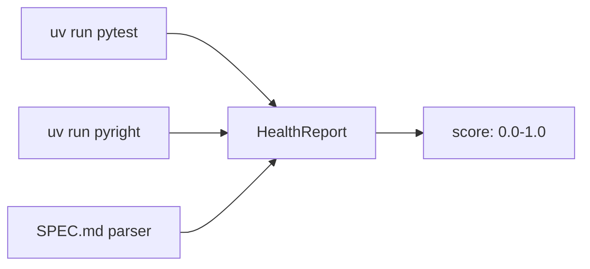
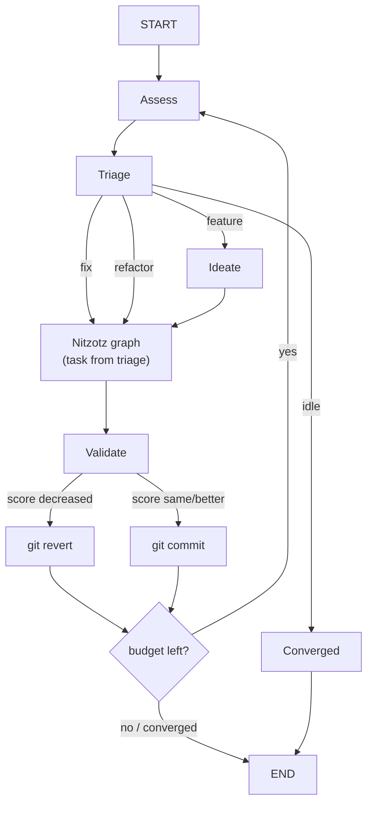
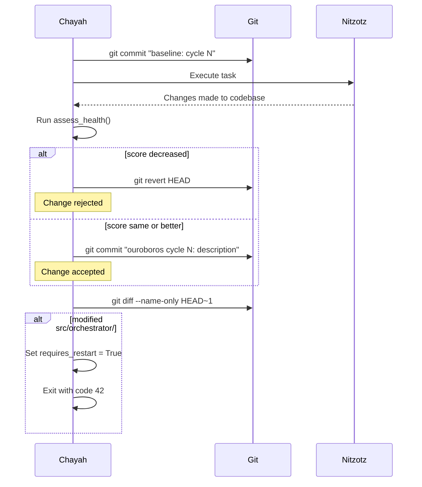
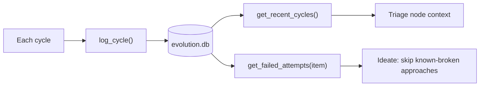
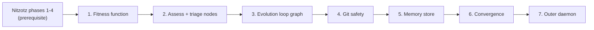

# Chayah (formerly Ouroboros) — Implementation approach

Experimental self-evolving agent. Builds on Nitzotz (formerly ARIL) (Genesis pipeline) as the execution engine.

**Paths:** All code under `src/orchestrator/graph_server/`. New files live alongside existing graph server code.

**Dependency:** Requires Nitzotz phases 1-4 (state, subgraphs, phase router, handoffs) to be implemented. Chayah wraps Nitzotz — it generates tasks and feeds them to the Nitzotz graph.

---

## 1. Fitness function — the immune system

**Goal:** Objective, deterministic health score that the agent cannot modify.



**Approach:**

- New module `src/orchestrator/graph_server/core/fitness.py`. Pure functions, no LLM calls.
- `assess_health()` runs shell commands (`pytest`, `pyright`) via `asyncio.create_subprocess_exec`, parses output, returns `HealthReport`.
- `HealthReport` is a dataclass with `.score` property — weighted combination of test pass rate (0.30), test coverage (0.20), type safety (0.20), spec progress (0.20), lint cleanliness (0.10).
- Spec parser reads `SPEC.md` at project root, counts `[x]` (done) vs `[ ]` (todo) in bullet lists.
- **Critical:** fitness.py must be outside the agent's write scope (or explicitly guarded). If the agent can modify its own scoring, the whole system breaks.

**Files to add:**

- `src/orchestrator/graph_server/core/fitness.py` — HealthReport, assess_health(), parse_spec()
- `SPEC.md` — product specification with checkboxes (human-authored)

---

## 2. The evolution loop graph

**Goal:** Continuous cycle of assess → triage → execute → validate → commit/rollback.



**Approach:**

- New graph `build_ouroboros_graph()` in `src/orchestrator/graph_server/graphs/ouroboros.py`.
- Nodes: `assess`, `triage`, `ideate`, `execute_aril`, `validate`, `commit_or_rollback`, `check_budget`.
- `execute_aril` invokes the Nitzotz graph (Genesis pipeline) as a subgraph or via direct call with the task generated by triage/ideate. The Nitzotz graph handles research → plan → implement → review internally. Chayah just feeds it the task and gets back a result.
- `validate` runs `assess_health()` again and compares to baseline.
- `commit_or_rollback` uses git tools to persist or revert.
- `check_budget` increments cycle count, checks convergence, decides whether to loop.
- The loop is a conditional edge from `check_budget` back to `assess` (or to END if budget exhausted / converged).

**State additions (extend ArilState or new OuroborosState):**

```python
# Evolution loop state
health_report: dict              # Latest HealthReport as dict
health_score: float              # Current score
health_baseline: float           # Score at start of this cycle
cycle_count: int                 # How many cycles completed
max_cycles: int                  # Budget (set at invocation)
consecutive_no_improvement: int  # For convergence detection
requires_restart: bool           # Self-modification detected
evolution_action: str            # "fix" | "refactor" | "feature" | "idle"
evolution_task: str              # Task description for Nitzotz
```

**Files to add/change:**

- `src/orchestrator/graph_server/graphs/ouroboros.py` — new graph
- `src/orchestrator/graph_server/nodes/assess.py` — assess node (calls fitness.py)
- `src/orchestrator/graph_server/nodes/triage.py` — triage node (Haiku structured output)
- `src/orchestrator/graph_server/nodes/ideate.py` — reads SPEC.md, picks next feature
- `src/orchestrator/graph_server/core/state.py` — add evolution fields

---

## 3. Git as safety net

**Goal:** Every change is reversible. Git history is the checkpoint system.



**Approach:**

- New module `src/orchestrator/graph_server/tools/git_tools.py` with async wrappers around git commands.
- `git_checkpoint(message)` — stage all + commit
- `git_revert()` — revert last commit
- `git_diff_files()` — list files changed in last commit
- Self-modification detection: if any file in `src/orchestrator/` was modified, the agent must restart.
- All git operations use `asyncio.create_subprocess_exec` with `cwd=PROJECT_ROOT`.

**Files to add:**

- `src/orchestrator/graph_server/tools/git_tools.py`

---

## 4. Memory — cross-cycle continuity

**Goal:** The agent remembers what it tried, what worked, and what failed.



**Approach:**

- New module `src/orchestrator/graph_server/core/evolution_memory.py`.
- SQLite at `~/.local/share/ai-orchestrator/evolution.db` (alongside existing checkpoints.db path).
- Schema: `evolution_log` table with cycle, timestamp, action, description, health_before, health_after, reverted, spec_item, files_changed, error_log.
- `log_cycle(...)` — insert after each cycle completes.
- `get_recent_cycles(limit=10)` — last N cycles for triage context (what just happened).
- `get_failed_attempts(spec_item)` — find previous failures for a specific spec item so the ideation node doesn't retry the same broken approach.
- Memory is queried at triage (recent context) and ideation (failure avoidance).
- Use `aiosqlite` for async access (consistent with existing graph server patterns).

**This is different from Nitzotz's persistent memory (Nitzotz Phase 8).** Nitzotz memory is about cross-run task context ("continue from last time"). Chayah memory is about evolution history ("what changes worked and what didn't"). They could share the same SQLite DB with different tables, or be separate stores.

**Files to add:**

- `src/orchestrator/graph_server/core/evolution_memory.py`

---

## 5. Convergence and stopping

**Goal:** The agent must know when to stop.

**Three stopping conditions:**

1. **Convergence** — health score hasn't improved for N consecutive cycles (default: 5). The codebase has reached a local optimum given the current spec.
2. **Budget exhausted** — max_cycles reached (set at invocation, default: 50). Hard cap on compute.
3. **Spec complete** — all items in SPEC.md are checked. Nothing left to build.

**Implementation:** The `check_budget` node after each cycle evaluates all three conditions. On stop, it logs the final state to memory and exits cleanly.

**Convergence is per-action.** If the agent is stuck on a specific feature (3 failed attempts), it should skip that item and try the next one — not declare convergence globally. Global convergence is only when *all remaining items* have been attempted and failed, or when the health score plateaus across multiple different actions.

---

## 6. Outer daemon — surviving self-modification

**Goal:** If the agent modifies its own orchestrator code, the process restarts with the new code.

**Approach:**

- `scripts/ouroboros.sh` — a bash loop that runs the agent and restarts on exit code 42.
- The agent detects self-modification via `git_diff_files()` checking for `src/orchestrator/` paths.
- On self-modification: commit the changes, log to memory, exit with code 42.
- On restart: the agent reads `evolution_memory` to get the last cycle number and resume.
- Entry point `ouroboros` in `pyproject.toml` points to a runner that builds the ouroboros graph and executes cycles.

**Files to add:**

- `scripts/ouroboros.sh`
- `src/orchestrator/graph_server/server/ouroboros_runner.py` (or add to existing entry points in pyproject.toml)

---

## Dependency order



All phases are sequential — each builds on the previous. The fitness function must exist before anything else because it's the evaluation standard for every subsequent phase.
