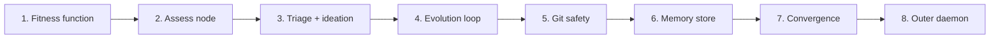

# Chayah (formerly Ouroboros) — TODO

Experimental. Depends on Nitzotz (formerly ARIL) being at least partially implemented (phases 1-4).



---

## Phase 1: Fitness function

- [ ] Create `src/orchestrator/graph_server/core/fitness.py` with `HealthReport` dataclass
- [ ] Implement `assess_health()` that runs: `uv run pytest --tb=short`, `uv run pyright`, collects pass/fail/coverage/error counts
- [ ] Parse test output into structured `HealthReport`
- [ ] Implement `HealthReport.score` property (weighted 0.0-1.0)
- [ ] Add `SPEC.md` to project root with core/stretch feature checklist
- [ ] Implement spec parser: count checked `[x]` vs total `[ ]` items
- [ ] Test: run `assess_health()` on current codebase, verify score is reasonable

---

## Phase 2: Assess node

- [ ] Create `src/orchestrator/graph_server/nodes/assess.py` — node that calls `assess_health()` and writes `HealthReport` to state
- [ ] Add to state: `health_report: dict`, `health_score: float`, `health_baseline: float` (score before current cycle)
- [ ] Node runs shell commands via `asyncio.create_subprocess_exec` (not CLI runners — these are local tools, not LLM calls)
- [ ] Test: invoke assess node with current codebase, verify state has valid health report

---

## Phase 3: Triage + ideation

- [ ] Create `src/orchestrator/graph_server/nodes/triage.py` — LLM node (Haiku) that reads health report and decides action
- [ ] Triage output: `action: "fix" | "refactor" | "feature" | "idle"` + `task_description: str`
- [ ] Priority logic (enforce in prompt + structured output):
  1. Tests failing → fix
  2. Pyright/lint errors → fix
  3. Architecture review feedback → refactor
  4. All healthy + spec items remaining → feature (read SPEC.md, pick next unchecked item)
  5. All healthy + spec complete → idle
- [ ] Create `src/orchestrator/graph_server/nodes/ideate.py` — reads SPEC.md, proposes the next feature as a task description
- [ ] Test: invoke triage with various health reports, verify correct action selection

---

## Phase 4: Evolution loop graph

- [ ] Create `src/orchestrator/graph_server/graphs/ouroboros.py` with `build_ouroboros_graph()`
- [ ] Wire the loop: assess → triage → (fix|refactor|feature via Nitzotz) → validate → commit/rollback → assess
- [ ] Triage conditional edges route to different Nitzotz invocations (or direct fix for simple cases)
- [ ] Validate node: run `assess_health()` again, compare `health_score` to `health_baseline`
- [ ] If score decreased: set `action: "rollback"`
- [ ] If score same or better: set `action: "commit"`
- [ ] Add `cycle_count: int` to state, increment each loop
- [ ] Expose as `chain_ouroboros(spec_path, max_cycles)` MCP tool (or standalone script)

---

## Phase 5: Git safety

- [ ] Create `src/orchestrator/graph_server/tools/git_tools.py`:
  - [ ] `git_checkpoint(message)` — `git add -A && git commit -m "ouroboros: {message}"`
  - [ ] `git_revert()` — `git revert HEAD --no-edit`
  - [ ] `git_diff_files()` — returns list of modified files since last commit
- [ ] Before every Nitzotz invocation: `git_checkpoint("baseline before cycle N")`
- [ ] After validate: if rollback, call `git_revert()`; if commit, call `git_checkpoint("cycle N: {description}")`
- [ ] Detect self-modification: check if `git_diff_files()` includes anything in `src/orchestrator/`
- [ ] If self-modified: set `requires_restart: True` in state

---

## Phase 6: Memory store

- [ ] Create `src/orchestrator/graph_server/core/evolution_memory.py`:
  - [ ] SQLite table `evolution_log` (cycle, action, description, health_before, health_after, reverted, spec_item, files_changed)
  - [ ] `log_cycle(...)` — insert a row after each cycle
  - [ ] `get_recent_cycles(limit)` — last N cycles for triage context
  - [ ] `get_failed_attempts(spec_item)` — find previous failures for a spec item (avoid retrying same broken approach)
- [ ] Inject recent cycle history into triage node's context
- [ ] Store at `~/.local/share/ai-orchestrator/evolution.db` (alongside existing checkpoints.db)

---

## Phase 7: Convergence detection

- [ ] After each cycle: check if health score improved
- [ ] Track `consecutive_no_improvement: int` in state
- [ ] If `consecutive_no_improvement >= 5`: set triage action to `idle`, exit loop
- [ ] If `cycle_count >= max_cycles`: exit loop (change budget exhausted)
- [ ] On exit: log final health report and spec progress to memory store
- [ ] Report: print summary of all cycles (what was done, what was reverted, final score)

---

## Phase 8: Outer daemon (self-modification support)

- [ ] Create `scripts/ouroboros.sh` — bash wrapper:
  ```bash
  while true; do
      uv run ouroboros "$@"
      EXIT_CODE=$?
      if [ $EXIT_CODE -ne 42 ]; then break; fi
      echo "Agent requested restart (self-modification). Restarting..."
  done
  ```
- [ ] In the ouroboros graph: if `requires_restart` is set after validate+commit, exit process with code 42
- [ ] On restart: read `evolution_memory` to resume from last cycle
- [ ] Add `ouroboros` entry point to `pyproject.toml`
- [ ] Test: simulate a self-modification cycle, verify daemon restarts and agent resumes
