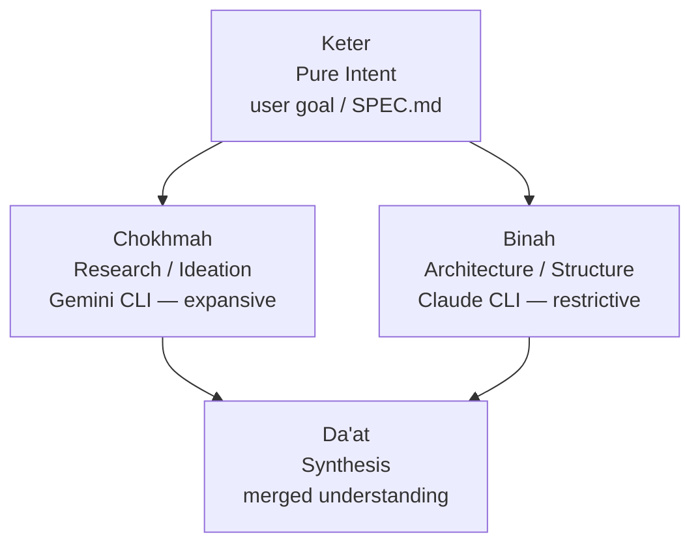
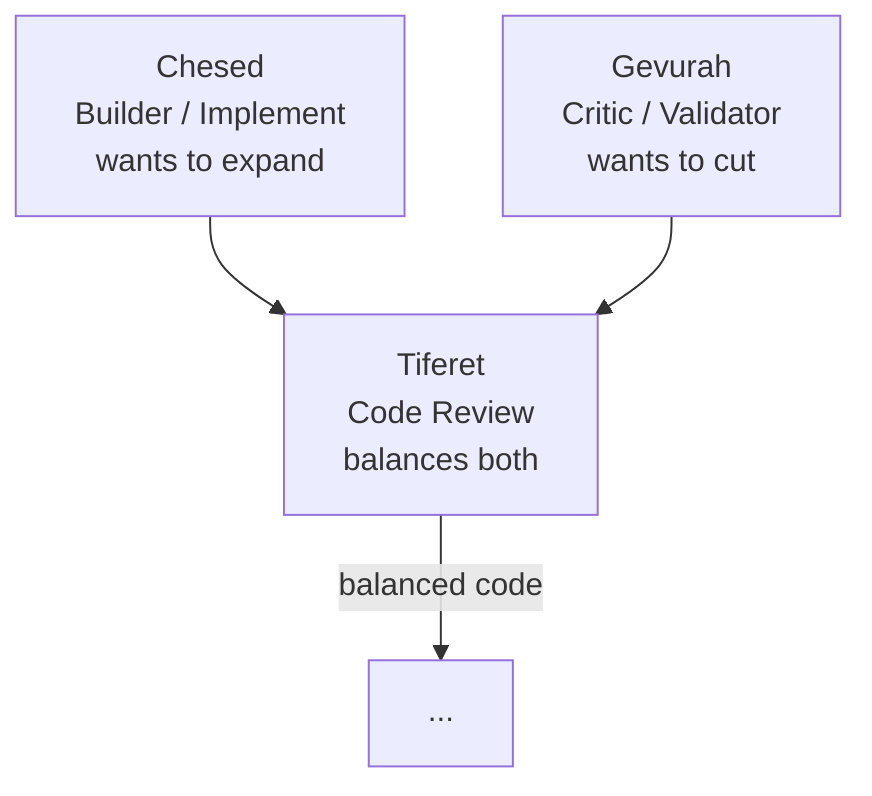
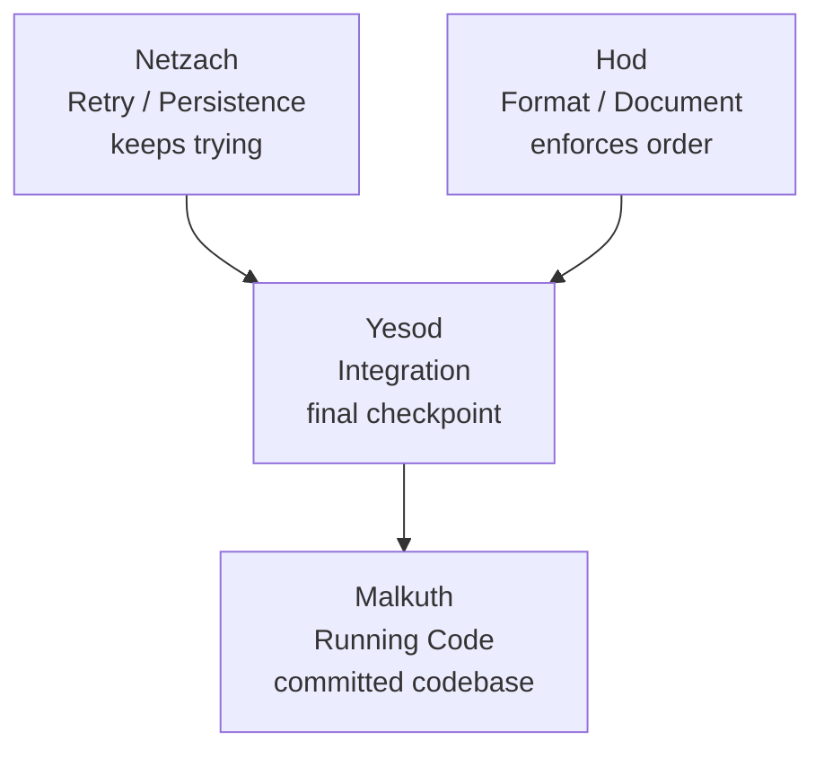
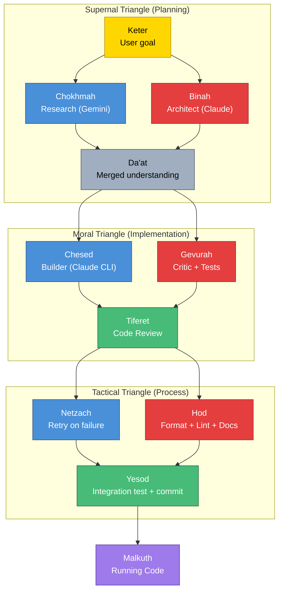

# Sefirot — The Emanation Pattern

**Status:** Experiment. Design philosophy + architectural pattern within **Genesis**. Can be applied to Nitzotz (formerly ARIL), Chayah (formerly Ouroboros), or standalone.

**Inspiration:** The Kabbalistic Tree of Life — 10 emanations (Sefirot) arranged in three pillars describing how abstract intent descends through balanced forces into material reality. In this architecture, a user's goal flows through creative expansion, structural restriction, and synthesis until it becomes running code.

**Key insight:** Unlike Nitzotz (sequential phases), Chayah (continuous loop), or Nefesh (formerly Leviathan) (parallel swarm), Sefirot is about **balanced opposing forces**. Every creative/expansive action has a paired restrictive action. The system only advances when both forces agree through a synthesis node. This is the missing piece in current agent architectures — critics that merely score aren't enough. You need **active counterforces** in tension.

---

## 1. The Three Pillars

The Tree of Life is organized into three vertical pillars. Each maps to a class of agent behavior:

```
    Pillar of Expansion          Central Pillar           Pillar of Restriction
    (creative LLMs)              (synthesis/orchestration) (critical/deterministic)
    ─────────────────            ─────────────────────     ─────────────────────

         Chokhmah ─────────────── Keter ─────────────── Binah
         (Research)               (Intent)                (Architect)
              │                     │                       │
              │                     │                       │
         Chesed ──────────────── Tiferet ─────────────── Gevurah
         (Implement)             (Review)                (Validate)
              │                     │                       │
              │                     │                       │
         Netzach ─────────────── Yesod ──────────────── Hod
         (Retry)                 (Commit)               (Format/Lint)
                                    │
                                    │
                                 Malkuth
                              (Running Code)
```

**The rule:** Every node on the left (expansion) is counterbalanced by a node on the right (restriction). The central pillar synthesizes them. Work flows downward through three triangles — Supernal (planning), Moral (implementation), Tactical (process) — before grounding in Malkuth (reality).

---

## 2. The Sefirot Mapped to Agents

### The Supernal Triangle (Planning Phase)

The realm of pure thought — before any code is written.



| Sefirah | Role | Agent | Character |
|---|---|---|---|
| **Keter** (Crown) | Pure intent — the user's goal before any structure | Top-level entry point, SPEC.md, or Chayah ideation | Neither expanding nor restricting — it just *is* |
| **Chokhmah** (Wisdom) | The spark — unconstrained ideation and research | Gemini CLI (research node) — creative, exploratory | **Expanding.** Finds possibilities, novel approaches, raw information without worrying about constraints |
| **Binah** (Understanding) | The form — applies logic, constraints, architecture | Claude CLI (architect node) — structural, methodical | **Restricting.** Forces the spark into a concrete plan with file paths, data models, step-by-step order |
| **Da'at** (Knowledge) | Hidden synthesis — unified understanding | State accumulation (research_findings + architecture_plan merged) | **Balancing.** Not a separate node but the state where Chokhmah and Binah's outputs merge |

### The Moral Triangle (Implementation Phase)

The plan is wrestled into code through the tension of opposites.



| Sefirah | Role | Agent | Character |
|---|---|---|---|
| **Chesed** (Mercy/Expansion) | The builder — writes code, adds features, expands the system | Implement node (Claude CLI) | **Expanding.** Wants to grow. Can propose scope expansion, suggest improvements beyond the plan. Left unchecked, produces bloated code |
| **Gevurah** (Severity/Judgment) | The critic — runs tests, validates, rejects bad code, enforces rules | Validator + fitness function + security scanner | **Restricting.** Wants to cut. Actively tries to break the code, not just score it. Left unchecked, nothing gets built |
| **Tiferet** (Beauty/Harmony) | The synthesizer — resolves the tension between builder and critic | Cross-model code reviewer (different model from both builder and critic) | **Balancing.** Weighs the builder's additions against the critic's objections. Produces code that is functional *and* elegant |

**This is the key difference from Nitzotz's critic.** Nitzotz's critic is only Gevurah — it scores and gates. In Sefirot, Chesed and Gevurah are both active forces that *argue*, and Tiferet arbitrates. The builder can push back on the critic's objections ("that edge case is theoretical, the feature is more important"). The critic can reject the builder's scope creep ("the plan didn't ask for this"). Tiferet decides.

### The Tactical Triangle (Process Phase)

The mechanical process of making code permanent.



| Sefirah | Role | Agent | Character |
|---|---|---|---|
| **Netzach** (Endurance) | The retry engine — when a node fails, Netzach persists with new strategies | Error recovery logic, prompt adjustment, fallback models | **Expanding.** Refuses to give up. Tries different approaches, escalates to gemini_assist, adjusts prompts |
| **Hod** (Submission/Process) | The scribe — enforces formatting, linting, documentation, changelog | Deterministic tools: `ruff format`, docstring generation, changelog update | **Restricting.** Enforces the repository's laws. No creativity — pure compliance |
| **Yesod** (Foundation) | Integration — final checkpoint before reality | Integration test suite, `git commit`, final validation | **Balancing.** Combines Netzach's persistence with Hod's compliance into a single, clean artifact |
| **Malkuth** (Kingdom) | Reality — the running application, the committed codebase | The git repository after commit | The end state. Keter's intent has materialized |

---

## 3. The Flow: Intent → Reality



Blue = expansion (creative). Red = restriction (critical). Green = balance (synthesis). Gold = origin. Purple = reality.

---

## 4. Why This Matters for Agent Architecture

### The balance problem

Current agent systems fail in predictable ways:

- **Too much Chesed (expansion), not enough Gevurah (restriction):** The agent writes bloated code, adds unrequested features, hallucinates file paths. No validator catches it because the critic is passive.
- **Too much Gevurah (restriction), not enough Chesed (expansion):** The agent is paralyzed by quality gates. Every output scores below threshold. Nothing gets built because the critic rejects everything.
- **No Tiferet (synthesis):** The builder and critic operate in isolation. The critic gates but doesn't negotiate. There's no node that says "the critic is right about X but wrong about Y — take the builder's approach on Y."

The Sefirot pattern teaches: **an agent system must explicitly balance expanding and restricting forces at every level**, with a synthesis node that resolves their tension.

### How Nitzotz's critic falls short

Nitzotz's current critic is pure Gevurah — it scores output on a 0.0-1.0 scale and decides pass/fail. This is a gate, not a counterforce. A true Sephirotic architecture would:

1. Let Chesed (the builder) propose additions beyond the plan ("I noticed this function also needs error handling")
2. Let Gevurah (the critic) challenge those additions ("the plan didn't ask for that, it adds complexity")
3. Let Tiferet (the reviewer) arbitrate ("the error handling is valid, keep it; the extra logging is scope creep, cut it")

This three-way tension produces better code than a simple pass/fail gate.

---

## 5. Practical Application to This Project

The Sefirot pattern isn't a separate graph to build from scratch. It's a **design philosophy** that can be applied incrementally to Nitzotz and Chayah:

### Phase 1: Split Chesed and Gevurah (adversarial implementation)

Currently: `implement → critic (score) → loop/proceed`

Sephirotic: `implement → scope_review (Chesed proposes extras) → critic (Gevurah challenges) → tiferet (Review resolves) → proceed`

The implement node writes code. A "scope review" node (Chesed) reads the diff and proposes improvements. The critic (Gevurah) challenges both the original code and the proposals. Tiferet arbitrates.

### Phase 2: Add Hod (formatting/documentation phase)

Currently missing from Nitzotz. After implementation, before commit:
- Run `ruff format` (deterministic, no LLM)
- Run `ruff check --fix` (auto-fixable lint issues)
- Update docstrings if public API changed (LLM)
- Update CHANGELOG.md if applicable

This is a restriction-only phase — no creativity, pure compliance.

### Phase 3: Add Tiferet (cross-model review)

Currently: the critic (same model) both scores and gates.

Sephirotic: a **different model** reviews the combined output. If Claude built it, Gemini reviews it (or vice versa). No model judges its own output.

This is the same cross-model review from Chayah, but formalized as a required synthesis step in every cycle.

### Phase 4: Formalize Netzach (strategic retry)

Currently: retry is "same node, same prompt, validator feedback appended."

Sephirotic: Netzach is a dedicated node that analyzes *why* the failure happened and chooses a retry strategy:
- Same approach with feedback (simple retry)
- Different model for the same task (model escalation)
- Decompose the task into smaller pieces (complexity reduction)
- Ask gemini_assist for debugging help (external analysis)

### Phase 5: Yesod (integration gate)

Currently: commit happens if the fitness score doesn't drop.

Sephirotic: Yesod is a comprehensive integration check:
- Run full test suite (not just the affected tests)
- Run type checker (`pyright`)
- Check for import cycles or dependency issues
- Verify no unintended file changes (git diff review)
- Only then commit

---

## 6. The Emanation as a Pipeline

When fully implemented, the Sephirotic pipeline looks like:

```
Keter (goal)
  → Chokhmah (research — expansive)
  → Binah (architect — restrictive)
  → Da'at (merge understanding)
  → Chesed (implement — expansive)
  → Gevurah (validate — restrictive)
  → Tiferet (review — balanced)
  → Netzach (retry if needed — persistent)
  → Hod (format + lint + docs — compliant)
  → Yesod (integration test + commit — foundational)
  → Malkuth (running code — real)
```

This is Nitzotz's `research → planning → implementation → review` expanded into a 10-stage pipeline with explicit expansion/restriction balance at every level.

---

## 7. Comparison with Other Patterns

| | Nitzotz | Chayah | Nefesh | Sefirot |
|---|---|---|---|---|
| **Core idea** | Sequential phases | Continuous loop | Parallel swarm | Balanced forces |
| **Critic role** | Passive gate (score) | Fitness function | Post-merge test | Active adversary (Gevurah) |
| **Builder role** | Follows plan exactly | Follows triage | Follows narrow task | Can propose expansions (Chesed) |
| **Conflict resolution** | Threshold (0.7) | Score delta | File ownership | Tiferet arbitration |
| **Retry strategy** | Same node + feedback | Chayah loops | Not applicable | Netzach: strategic retry |
| **Documentation** | Not a phase | Not a phase | Not a phase | Hod: explicit phase |
| **Cross-model review** | No | Optional | No | Required (Tiferet) |
| **Philosophy** | Get it done in order | Keep improving | Do it all at once | Balance expansion and restriction |

---

## 8. What This is NOT

- **Not 10 separate graphs** — It's a design philosophy applied to existing infrastructure (Nitzotz subgraphs, Chayah cycle)
- **Not mystical** — The Kabbalistic mapping is a useful metaphor for a real engineering principle: balanced opposing forces produce better systems than unilateral decision-making
- **Not a replacement** — Sefirot principles enhance Nitzotz/Chayah/Nefesh, they don't replace them
- **Not all-or-nothing** — Each phase (Chesed/Gevurah split, Hod formatting, Tiferet review) can be adopted independently
