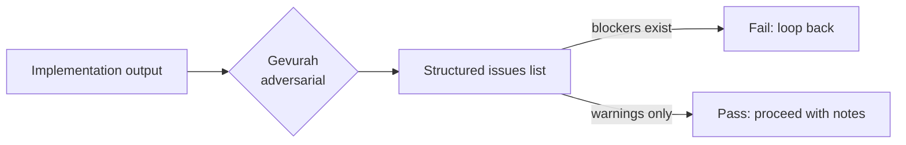
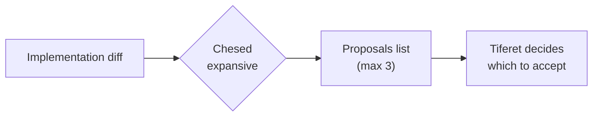
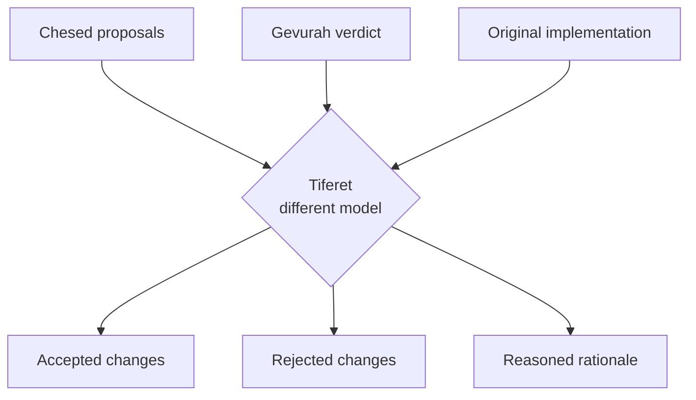
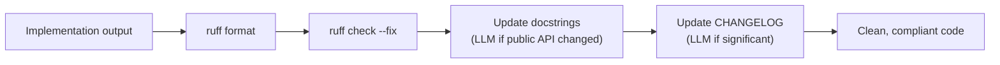
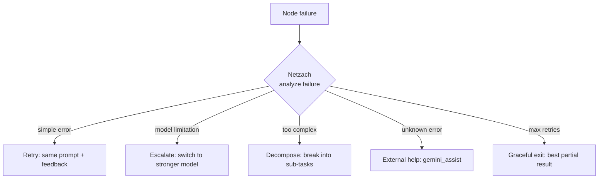
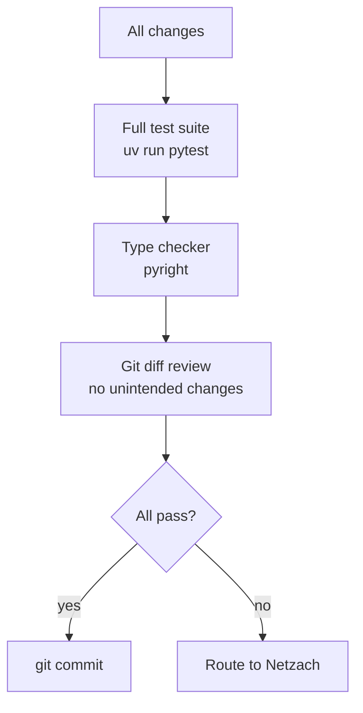
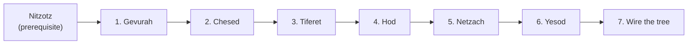

# Sefirot — Implementation approach

Design philosophy applied to Nitzotz (formerly ARIL) and Chayah (formerly Ouroboros). Each Sephirotic node is a new node factory in `src/orchestrator/graph_server/nodes/` that can be wired into existing subgraphs.

**Paths:** New nodes in `src/orchestrator/graph_server/nodes/`. Modifications to existing subgraphs in `src/orchestrator/graph_server/subgraphs/`. Optional standalone graph in `src/orchestrator/graph_server/graphs/sefirot.py`.

**Dependency:** Requires Nitzotz to be implemented (Sefirot enhances Nitzotz's subgraphs). Can also enhance Chayah's validate cycle.

---

## 1. Gevurah — adversarial critic

**Goal:** Transform passive scoring into active adversarial validation.



**The difference from the current critic:**

| | Current critic | Gevurah |
|---|---|---|
| Approach | "Score this output 0.0-1.0" | "Find every way this could break" |
| Output | score + feedback string | structured issue list with severity |
| Judgment | Threshold (>0.7 = pass) | Any blocker = fail, regardless of score |
| Tone | Evaluative | Adversarial |

**Approach:**

- New node `src/orchestrator/graph_server/nodes/gevurah.py`.
- Uses Haiku with a deliberately adversarial prompt: "Your job is to find problems. You are not trying to be helpful — you are trying to break this."
- Pydantic structured output:
  ```python
  class Issue(BaseModel):
      description: str
      file: str = ""
      severity: Literal["blocker", "warning", "note"]
      category: Literal["correctness", "security", "scope_creep", "hallucination", "missing_edge_case"]

  class GevurahVerdict(BaseModel):
      issues: list[Issue]
      recommendation: Literal["pass", "fail", "pass_with_warnings"]
  ```
- Replaces the critic node in Nitzotz's implementation subgraph. Planning subgraph can use either.
- The adversarial prompt is key — the model is instructed to assume the code is wrong and prove it.

**Files to add/change:**

- `src/orchestrator/graph_server/nodes/gevurah.py` — new
- `src/orchestrator/graph_server/subgraphs/implementation.py` — swap critic for Gevurah

---

## 2. Chesed — scope expansion

**Goal:** Represent the creative/expansive force that proposes improvements.



**Approach:**

- New node `src/orchestrator/graph_server/nodes/chesed.py`.
- Reads the implementation output (or diff) and proposes improvements:
  - "This new endpoint has no input validation — propose adding it"
  - "The adjacent function has the same pattern but no error handling — propose fixing it"
  - "No tests accompany this change — propose adding them"
- Uses Gemini CLI or Sonnet API — a creative model, not the same one that built the code.
- Pydantic output:
  ```python
  class Proposal(BaseModel):
      description: str
      rationale: str
      files: list[str]
      estimated_effort: Literal["trivial", "small", "moderate"]

  class ChesedProposal(BaseModel):
      proposals: list[Proposal]  # max 3
  ```
- Guard: max 3 proposals per cycle. Chesed is capped because unconstrained expansion is the failure mode.
- Chesed does NOT implement — it proposes. This is crucial. The builder builds; Chesed imagines what else could be built. Tiferet decides.

**Files to add:**

- `src/orchestrator/graph_server/nodes/chesed.py`

---

## 3. Tiferet — synthesis and arbitration

**Goal:** Resolve the tension between Chesed (expand) and Gevurah (restrict).



**The key design principle: cross-model review.**

If Claude built the code (Chesed/Builder used Claude CLI), Tiferet uses Gemini to review. If Gemini researched, Claude reviews. No model judges its own output. This prevents the self-reinforcement problem where a model rates its own output highly.

**Approach:**

- New node `src/orchestrator/graph_server/nodes/tiferet.py`.
- Receives three inputs from state: implementation output, Chesed proposals, Gevurah verdict.
- For each item (Gevurah issue or Chesed proposal), Tiferet decides:
  - **Gevurah blocker** → always accept (must fix)
  - **Gevurah warning** → accept if Tiferet agrees it's a real problem
  - **Chesed proposal** → accept if it's within scope and adds clear value
  - **Chesed proposal that Gevurah objects to** → Tiferet arbitrates based on task scope
- Pydantic output:
  ```python
  class TiferetDecision(BaseModel):
      accepted: list[str]   # descriptions of accepted changes
      rejected: list[str]   # descriptions of rejected changes
      rationale: str        # overall reasoning
      needs_rework: bool    # if True, loop back to implementation
  ```
- Accepted Chesed proposals get appended to `supervisor_instructions` for the next implementation cycle.
- Uses the **opposite CLI** from the builder: if Claude built it, `run_gemini()` reviews. If Gemini researched, `run_claude()` reviews.

**Files to add:**

- `src/orchestrator/graph_server/nodes/tiferet.py`

---

## 4. Hod — formatting and documentation

**Goal:** Deterministic compliance enforcement after implementation.



**Approach:**

- New node `src/orchestrator/graph_server/nodes/hod.py`.
- Runs deterministic tools via `asyncio.create_subprocess_exec`:
  - `ruff format .` — code formatting (zero LLM cost)
  - `ruff check --fix .` — auto-fixable lint (zero LLM cost)
  - Check for missing `__init__.py` exports if new modules were added
- Optionally runs one LLM call for documentation updates:
  - If public API surface changed (new functions, changed signatures) → generate docstrings
  - If a significant feature was added → draft a CHANGELOG entry
- This is a **restriction-only** node. It does not make creative decisions. It enforces the repository's formatting and documentation standards.
- Runs after Tiferet (review) and before Yesod (integration gate).

**Files to add:**

- `src/orchestrator/graph_server/nodes/hod.py`

---

## 5. Netzach — strategic retry

**Goal:** Intelligent retry that chooses a strategy based on failure analysis.



**Approach:**

- New node `src/orchestrator/graph_server/nodes/netzach.py`.
- Reads `node_failure` from state, plus retry history.
- Uses a cheap model (Haiku) to classify the failure and choose a strategy:
  ```python
  class RetryStrategy(BaseModel):
      strategy: Literal["retry", "escalate", "decompose", "external_help", "exit"]
      modified_instructions: str  # Updated instructions for the target node
      reasoning: str
  ```
- Strategy selection rules:
  - Attempt 1 failure → simple retry with feedback
  - Attempt 2 failure (same error) → model escalation or decomposition
  - Attempt 3 failure → external help (gemini_assist)
  - Attempt 4+ → graceful exit
- Tracks retry history in state to prevent repeating the same failed approach.
- Replaces the implicit "retry with feedback" pattern in Nitzotz's critic loops.

**Files to add:**

- `src/orchestrator/graph_server/nodes/netzach.py`

---

## 6. Yesod — integration gate

**Goal:** Comprehensive final validation before commit.



**Approach:**

- New node `src/orchestrator/graph_server/nodes/yesod.py`.
- Runs a comprehensive validation suite (all via `asyncio.create_subprocess_exec`):
  - `uv run pytest` — full test suite, not just affected tests
  - `pyright` — type checking (if available)
  - `git diff --name-only` — verify only expected files changed
  - Optional: import cycle detection
- Pydantic output:
  ```python
  class IntegrationResult(BaseModel):
      passed: bool
      tests_passed: int
      tests_failed: int
      type_errors: int
      unintended_files: list[str]
      summary: str
  ```
- If passed → proceed to commit (Malkuth). If failed → route to Netzach for strategic retry.
- This replaces the simple "run pytest" check in Chayah's validate node.

**Files to add:**

- `src/orchestrator/graph_server/nodes/yesod.py`

---

## 7. Wiring options

### Option A: Enhance Nitzotz subgraphs (recommended)

Apply Sephirotic nodes to existing Nitzotz subgraphs without building a new graph:

**Implementation subgraph (before):**
```
guard → implement → critic → loop/exit
```

**Implementation subgraph (after):**
```
guard → implement (Chesed: builder) → Gevurah (adversarial critic) → Chesed (scope proposals) → Tiferet (arbitration) → Hod (format) → loop/exit
```

**Review subgraph (before):**
```
validator → human_review → set_handoff
```

**Review subgraph (after):**
```
Yesod (integration gate) → human_review → set_handoff
```

**Error recovery (any subgraph):**
```
failure → Netzach (strategy) → target_node (with modified instructions)
```

### Option B: Standalone Sephirotic graph

Build a complete 10-stage pipeline as a new graph option:

```
Keter (goal entry)
→ Chokhmah (research — build_research_node)
→ Binah (architect — build_architect_node)
→ Da'at (merge state)
→ Chesed (implement — build_implement_node)
→ Gevurah (adversarial critic)
→ Tiferet (cross-model review)
→ Hod (format + lint)
→ Netzach (retry on failure) / Yesod (integration gate)
→ Malkuth (commit)
```

Expose as `chain_sefirot` MCP tool. More principled but more complex than Option A.

**Recommendation:** Start with Option A (enhance Nitzotz). The Sephirotic nodes are independently valuable. Wiring them into Nitzotz's existing subgraphs is lower risk and immediately useful. Option B can come later if the full pipeline proves valuable.

---

## Dependency order



Phases 1-3 (Gevurah → Chesed → Tiferet) form the core expansion/restriction/synthesis triad and should be built together. Phases 4-6 (Hod, Netzach, Yesod) are independently useful and can be done in any order after the triad.
