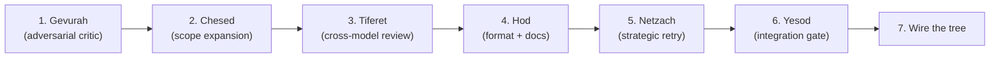

# Sefirot — TODO

Experimental. Applied incrementally to Nitzotz (formerly ARIL) and Chayah (formerly Ouroboros). Each phase is independently valuable.

---

## Phase 1: Gevurah — adversarial critic

Transform the passive critic (scores and gates) into an active adversary that tries to break the code.

- [ ] Create `src/orchestrator/graph_server/nodes/gevurah.py` — adversarial validator
- [ ] Gevurah doesn't just score — it actively looks for:
  - [ ] Missing edge cases and error handling
  - [ ] Security vulnerabilities (injection, unvalidated input)
  - [ ] Breaking changes to existing interfaces
  - [ ] Hallucinated file paths or function names
  - [ ] Scope creep (changes not requested by the plan)
- [ ] Output: structured `GevurahVerdict(BaseModel)` with `issues: list[Issue]`, `severity: str`, `recommendation: str`
- [ ] Each issue has: description, file, severity ("blocker" | "warning" | "note")
- [ ] If any blocker exists → handoff_type = fail; else → pass with warnings attached
- [ ] Replaces or augments the existing critic in Nitzotz's planning and implementation subgraphs
- [ ] Test: give Gevurah a plan with a hallucinated file path → verify it catches it

---

## Phase 2: Chesed — scope expansion proposer

Add a node that proposes improvements beyond the plan, representing the creative/expansive force.

- [ ] Create `src/orchestrator/graph_server/nodes/chesed.py` — scope expansion node
- [ ] Chesed reads the implementation diff and proposes:
  - [ ] Additional error handling the plan didn't mention
  - [ ] Tests that should accompany the changes
  - [ ] Related improvements ("while we're here, this adjacent function has the same bug")
- [ ] Output: `ChesedProposal(BaseModel)` with `proposals: list[Proposal]`, each with description, rationale, estimated_effort
- [ ] Chesed does NOT implement — it proposes. Tiferet decides which proposals to accept.
- [ ] Guard: max 3 proposals per cycle to prevent infinite expansion
- [ ] Test: give Chesed an implementation of a new endpoint → verify it proposes tests and error handling

---

## Phase 3: Tiferet — cross-model review and synthesis

Add a synthesis node that arbitrates between Chesed's expansions and Gevurah's restrictions.

- [ ] Create `src/orchestrator/graph_server/nodes/tiferet.py` — synthesis/review node
- [ ] Tiferet receives: the implementation, Chesed's proposals, Gevurah's verdict
- [ ] Uses a **different model** from the builder (if Claude built, Gemini reviews — or vice versa)
- [ ] Tiferet decides for each item:
  - [ ] Gevurah blocker → accept (code must be fixed)
  - [ ] Gevurah warning + Chesed agrees → accept
  - [ ] Chesed proposal + Gevurah approves → accept
  - [ ] Chesed proposal + Gevurah objects → Tiferet arbitrates based on task scope
- [ ] Output: `TiferetDecision(BaseModel)` with `accepted_changes: list`, `rejected_changes: list`, `rationale: str`
- [ ] The decision feeds back into the implementation loop (accepted proposals become new tasks)
- [ ] Test: give Tiferet a Chesed proposal and a Gevurah objection → verify it produces a reasoned decision

---

## Phase 4: Hod — formatting, linting, documentation

Add a deterministic compliance phase after implementation, before commit.

- [ ] Create `src/orchestrator/graph_server/nodes/hod.py` — formatting and compliance node
- [ ] Hod runs deterministic tools (no LLM calls):
  - [ ] `ruff format` — code formatting
  - [ ] `ruff check --fix` — auto-fixable lint issues
  - [ ] Check for missing `__init__.py` exports if new modules were added
- [ ] Hod also runs one LLM call for documentation:
  - [ ] If public API changed → generate/update docstrings
  - [ ] If significant feature added → update CHANGELOG.md entry
- [ ] Output: list of files modified by formatting, list of lint fixes applied
- [ ] This is a **restriction-only** phase — no creative decisions, pure compliance
- [ ] Add as a phase between implementation and review in Nitzotz, or before Yesod in the Sephirotic pipeline
- [ ] Test: introduce a badly formatted file → verify Hod fixes it

---

## Phase 5: Netzach — strategic retry engine

Replace naive retry (same prompt + feedback) with a dedicated retry strategy node.

- [ ] Create `src/orchestrator/graph_server/nodes/netzach.py` — strategic retry
- [ ] When a node fails, Netzach analyzes the failure and chooses a strategy:
  - [ ] **Simple retry**: same prompt with error feedback appended (current behavior)
  - [ ] **Model escalation**: switch to a more capable model (Haiku → Sonnet → Opus)
  - [ ] **Decomposition**: break the failing task into smaller sub-tasks
  - [ ] **External help**: route to gemini_assist for debugging analysis
  - [ ] **Graceful exit**: if max retries exhausted, exit with best partial result
- [ ] Output: `RetryStrategy(BaseModel)` with `strategy: str`, `modified_prompt: str`, `target_node: str`
- [ ] Track retry history in state to avoid repeating the same failed approach
- [ ] Wire into Nitzotz subgraphs: on failure, route to Netzach before retrying the domain node
- [ ] Test: simulate 3 failures with the same error → verify Netzach escalates strategy

---

## Phase 6: Yesod — integration gate

Add a comprehensive integration check as the final gate before commit.

- [ ] Create `src/orchestrator/graph_server/nodes/yesod.py` — integration gate
- [ ] Yesod runs a complete validation suite:
  - [ ] Full test suite (`uv run pytest`) — not just affected tests
  - [ ] Type checker (`pyright` or `uv run pyright`)
  - [ ] Git diff review — verify no unintended file changes
  - [ ] Import cycle check (optional)
  - [ ] Verify all new files have proper `__init__.py` exports
- [ ] Output: `IntegrationResult(BaseModel)` with `passed: bool`, `test_results: str`, `type_errors: int`, `unintended_changes: list`
- [ ] If passed → commit; if failed → route back to Netzach for strategic retry
- [ ] This replaces the simple "run pytest" validation in Chayah
- [ ] Test: introduce a type error → verify Yesod catches it and blocks commit

---

## Phase 7: Wire the Tree

Connect all Sephirotic nodes into Nitzotz's subgraphs and/or create a standalone Sephirotic graph.

- [ ] **Option A (incremental):** Add Sephirotic nodes to existing Nitzotz subgraphs:
  - [ ] Planning subgraph: architect → Gevurah → (loop/proceed)
  - [ ] Implementation subgraph: implement → Chesed → Gevurah → Tiferet → (loop/proceed)
  - [ ] Review subgraph: Hod → Yesod → human_review
  - [ ] Error paths: any failure → Netzach → retry with strategy
- [ ] **Option B (standalone):** Create `src/orchestrator/graph_server/graphs/sefirot.py` with `build_sefirot_graph()`
  - [ ] Full 10-node pipeline: Keter → Chokhmah → Binah → Da'at → Chesed → Gevurah → Tiferet → Netzach/Hod → Yesod → Malkuth
  - [ ] Expose as `chain_sefirot` MCP tool
- [ ] Prefer Option A — apply principles to existing Nitzotz rather than building a parallel graph
- [ ] Test: run a full Nitzotz pipeline with Sephirotic nodes, verify expansion/restriction balance produces better output
