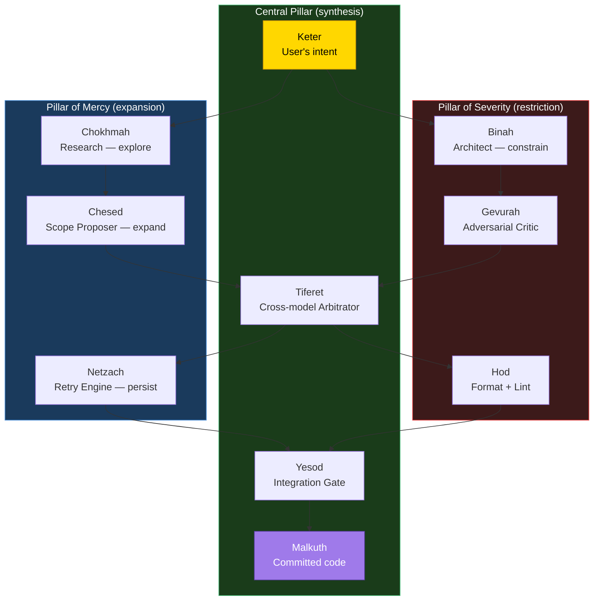
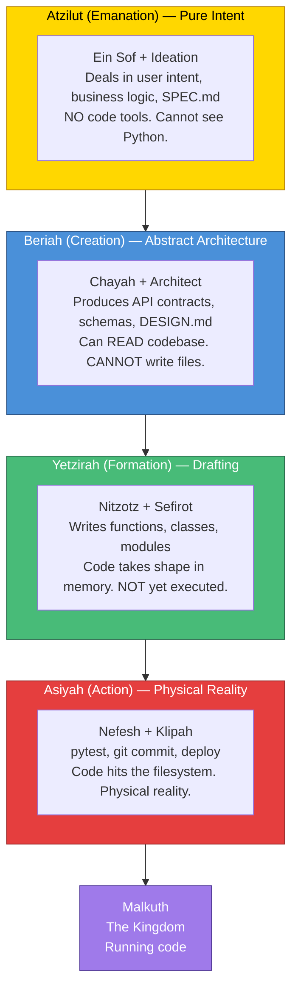
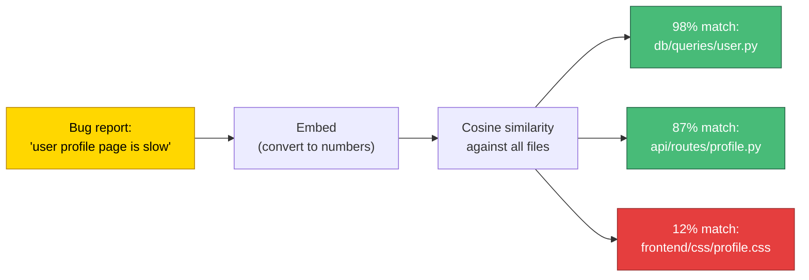
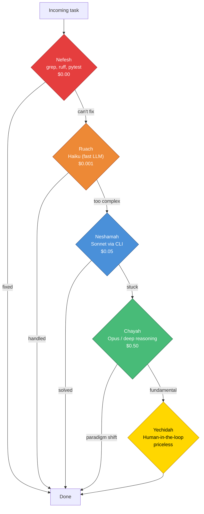
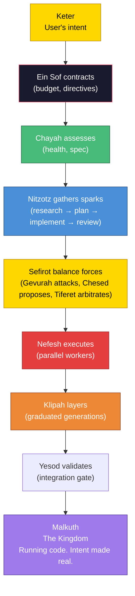
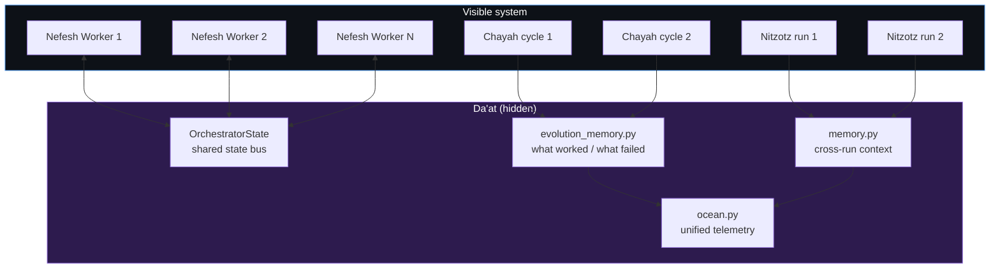
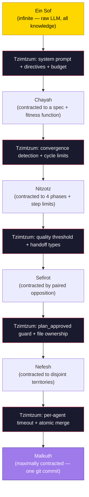

# Genesis — The Story of Creation

The architecture of the **Genesis** (formerly Malkuth) system told through the Kabbalistic story of creation. Each architectural pattern maps to a concept in Lurianic Kabbalah — not as metaphor, but as structural equivalence. The myths describe the same dynamics the code implements.

---

## Act I — Ein Sof and the Tzimtzum

Before anything existed, there was only **Ein Sof** — the Infinite. Boundless, unknowable, filling everything. But the Infinite cannot create within itself — there's no room. So Ein Sof performed the **Tzimtzum** — the great contraction. It withdrew its infinite light, creating a **Chalal** (vacant space) — a bounded emptiness where finite creation could exist.

**In the system:** Ein Sof is the meta-orchestrator. It is the boundless compute, the unlimited potential. But it cannot act without contracting — setting budgets, defining directives, creating bounded space (SPEC.md, DIRECTIVES.md) for finite agents to operate within. The Tzimtzum is the act of defining constraints: "You have 50 cycles. You have $10. You may not modify these files." Without contraction, the agents would run forever, consuming everything.

| Concept | System equivalent |
|---|---|
| Ein Sof (the Infinite) | The meta-orchestrator — all potential, no action |
| Tzimtzum (contraction) | Budget limits, directives, SPEC.md — bounding the space |
| Chalal (vacant space) | The bounded environment where agents can operate |

---

## Act II — The Kav (The Ray of Light)

After the contraction, Ein Sof sent a single ray of light — the **Kav** — into the vacant space. This ray is the channel through which divine intent flows into the emptiness. It is not the creation itself — it is the *intention* to create.

**In the system:** The Kav is the user's task description. A single beam of intent entering the vacant space: "Add rate limiting to the API." This is Keter — the Crown — the first point where infinite potential becomes specific purpose. Everything that follows is this ray of light being shaped, filtered, and manifested.

| Concept | System equivalent |
|---|---|
| Kav (ray of light) | The user's task description |
| Keter (the Crown) | The first node — pure intent, before any processing |

---

## Act III — The Shattering of the Vessels (Shevirat HaKelim)

The divine light flowed down through ten vessels (the Sefirot), each meant to contain and shape a portion of the light. But the light was too intense. The vessels **shattered**. The sparks of divine light — **Nitzotzot** — scattered everywhere, falling into the lowest realms, trapped in **Klipot** (shells/husks).

**In the system:** The task enters the pipeline and is broken apart. Research explores multiple directions (sparks scattering). The architecture plan attempts to contain them but may fail (vessel shattering — the critic finds hallucinated paths, missing edge cases). The sparks are the fragments of understanding, implementation, and design scattered across files, functions, and modules.

| Concept | System equivalent |
|---|---|
| Vessels (Kelim) | The pipeline phases — containers for the light |
| Shattering (Shevirah) | Quality gate failure — the plan has flaws, the code has bugs |
| Sparks (Nitzotzot) | Fragments of the solution scattered across the codebase |
| Shells (Klipot) | The layers of complexity wrapping each fragment |

---

## Act IV — Tikkun (The Repair)

The purpose of all creation is **Tikkun** — the gathering and elevating of the fallen sparks. This is the great work: find each spark where it fell, free it from its Klipah (shell), and return it to its proper place in the divine structure.

**In the system:** This IS the pipeline. Nitzotz (the spark-gathering pipeline) goes phase by phase:

- **Research:** Find the sparks — knowledge scattered across domains, documentation, and prior art
- **Planning:** Design the vessels to contain them — architecture plan with file paths, steps, verification
- **Implementation:** Place each spark in its vessel — write the code, each change in its proper file
- **Review:** Verify the vessels hold — integration testing, human approval

The Sefirot — the balanced forces — ensure the vessels don't shatter again. Gevurah tests their strength. Chesed expands them where needed. Tiferet balances the two. The vessels are rebuilt properly this time.

| Concept | System equivalent |
|---|---|
| Tikkun (repair) | The full pipeline execution — gathering sparks into vessels |
| Gathering sparks | Research phase — collecting knowledge |
| Rebuilding vessels | Planning phase — designing the architecture |
| Placing sparks in vessels | Implementation phase — writing the code |
| Verifying the repair | Review phase — testing + human approval |

---

## Act V — The Klipot (The Shells)

Not all Klipot are evil. There are four types, and only one is purely dark. The other three — **Klipat Nogah** (the translucent shell) — contain sparks that can be elevated. The shells serve a purpose: they protect the sparks during the process of formation. Each layer of shell must be penetrated carefully, in order, to reach the spark inside.

**In the system:** Klipah is the graduated dispatch. Each generation is a shell wrapping the previous:

- Gen 1 (innermost) — the schema, the bare spark
- Gen 2 — the first protective shell (API core)
- Gen 3, 4, 5 — expanding shells, each built on the integrity of the inner ones
- The reverse consolidation is the cracking of shells — peeling layers back to reveal the unified spark inside

The Fibonacci sequence governs the shell growth because shells in nature grow this way — each layer proportional to the sum of the previous two. The nautilus shell, the sunflower seed head, the spiral of a galaxy. Klipah follows the same law.

| Concept | System equivalent |
|---|---|
| Klipot (shells) | Graduated generations of parallel dispatch |
| Klipat Nogah (translucent shell) | Productive layers that protect and shape the sparks |
| Cracking the shell | Reverse consolidation — merging layers back to unity |
| Shell growth pattern | Fibonacci sequence — 1, 1, 2, 3, 5, 8 |

---

## Act VI — The Sefirot (The Balanced Forces)

The ten Sefirot are not just vessels — they are living channels through which the divine light flows. They are arranged in three pillars:

- **Pillar of Mercy (right)** — Chokhmah, Chesed, Netzach — the expansive, creative, generative force
- **Pillar of Severity (left)** — Binah, Gevurah, Hod — the restrictive, critical, limiting force
- **Central Pillar** — Keter, Tiferet, Yesod, Malkuth — the balancing, synthesizing, manifesting force

Creation requires both pillars in tension. Mercy without Severity produces chaos. Severity without Mercy produces nothing. Only through the Central Pillar — the path of balance — does creation manifest properly.

**In the system:** The Sefirot are the node factories wired into the pipeline:



| Sefirah | Pillar | Node | Role |
|---|---|---|---|
| Keter | Central | Task input | Pure intent — the user's goal |
| Chokhmah | Mercy | Research node | Wisdom — broad exploration, intuitive discovery |
| Binah | Severity | Architect node | Understanding — logical structure, constraints |
| Chesed | Mercy | Chesed node | Loving-kindness — proposes expansions beyond the plan |
| Gevurah | Severity | Gevurah node | Strength — adversarially attacks the output |
| Tiferet | Central | Tiferet node | Beauty — arbitrates between expansion and restriction |
| Netzach | Mercy | Netzach node | Victory — endurance, strategic retry, refuses to give up |
| Hod | Severity | Hod node | Splendor — enforces form, compliance, formatting |
| Yesod | Central | Yesod node | Foundation — integration gate, final checkpoint |
| Malkuth | Central | Committed code | Kingdom — physical reality, the running application |

---

## Act VII — The Four Worlds (Dimensional State Management)

The sparks don't return to Ein Sof directly. They ascend through **four worlds**, each a different density of reality. In Kabbalah, these aren't metaphors — they're distinct dimensions with different laws. An entity in one world cannot use the tools of another. You cannot write physical code (Asiyah) while still figuring out the business logic (Atzilut).

1. **Atzilut** (Emanation) — pure divinity, no sense of "self." The world of will and intent.
2. **Beriah** (Creation) — the realm of highest intellect. Where ideas are born as abstract structures.
3. **Yetzirah** (Formation) — the realm of emotion and shape. Where ideas take concrete form.
4. **Asiyah** (Action) — the physical, material universe. Where form becomes matter.

**In the system:** The four worlds are the four layers of the architecture, but they're more than organizational — they're **dimensional isolation boundaries**. An agent operating in one world cannot access the tools of another:



**The dimensional isolation rule:** Each world has a tool whitelist. Agents cannot reach into a world below their own:

| World | State type | Tool whitelist | Forbidden |
|---|---|---|---|
| **Atzilut** | Product intent | Read SPEC.md, reason about goals | Code tools, filesystem, execution |
| **Beriah** | Abstract design | Read codebase, produce schemas/contracts | Write files, execute code |
| **Yetzirah** | Code drafts | Read + write code in memory buffers | Execute (pytest, git), deploy |
| **Asiyah** | Physical reality | Execute tests, write to filesystem, git commit | Only after Yetzirah approves |

| World | Pattern | What it does |
|---|---|---|
| **Atzilut** | **Ein Sof** | Pure will — monitors, dispatches, contracts. No execution. |
| **Beriah** | **Chayah** | Intellect — decides what to create. Assesses, triages, ideates. |
| **Yetzirah** | **Nitzotz + Sefirot** | Form — shapes the work. Pipeline phases + balanced forces. |
| **Asiyah** | **Nefesh + Klipah** | Matter — does the work. Parallel swarm + graduated dispatch. |

**Why this matters:** It prevents premature execution. If an agent tries to write Python (Yetzirah) while still figuring out the business logic (Atzilut), it will hallucinate. The Four Worlds forces the graph to finalize one dimension of reality before letting intent drop into the next. This is why the `plan_approved` guard exists — it's the boundary between Beriah (design) and Yetzirah (drafting). Without it, the agent would skip the architectural dimension entirely.

---

## Act VII½ — Gematria (Semantic Vector Routing)

**Gematria** is the Kabbalistic practice of finding hidden connections between words through their numerical values. Because Hebrew letters are also numbers, words that share the same numerical value have a hidden, absolute mathematical connection. "Love" (Ahava = 13) and "One" (Echad = 13) share a value — proving that love is the path to oneness.

**In the system:** This isn't metaphor — it IS vector embeddings. An LLM doesn't read the word "authentication"; it reads a multidimensional mathematical array `[0.12, -0.45, 0.89...]`. Two concepts with high cosine similarity share a "Gematria" — a hidden mathematical resonance that reveals connections no human would think to make.



**The Gematria Pattern** is an architecture for **semantic mathematical routing** rather than hardcoded logic:

- Instead of the Triage node using rigid `if/else` to classify a task, it embeds the task description and calculates cosine similarity against the codebase
- The orchestrator discovers that a bizarre frontend error has 98% mathematical alignment with a legacy database migration script — a hidden connection no human would have made
- This powers deep RAG (Retrieval-Augmented Generation) by letting agents pull files based on mathematical resonance rather than explicit imports

**Where it lives in the system:** Gematria IS Da'at (the hidden Sefirah). Da'at is the bridge between knowing and doing — the semantic index that connects agents to relevant code without them having to explicitly search. It would be implemented as a vector store in `core/daat.py`:

```python
# Da'at as Gematria — semantic routing
class Daat:
    """The hidden bridge. Semantic vector index over the codebase."""

    async def query(self, intent: str, top_k: int = 5) -> list[str]:
        """Find files with highest Gematria (cosine similarity) to the intent."""
        intent_vector = await self.embed(intent)
        return self.index.query(intent_vector, top_k=top_k)

    async def route(self, task: str) -> str:
        """Use Gematria to determine which pattern best fits this task."""
        # Mathematical routing instead of hardcoded if/else
        similarities = await self.compute_similarities(task)
        return self.select_pattern(similarities)
```

**Why this matters:** It allows the orchestrator to find hidden connections in a massive codebase. A bug report about "slow page loads" gets mathematically linked to an N+1 query in an ORM model three directories away — because their vector representations resonate. No human-written routing rule would have connected them.

---

## Act VIII — The Five Levels of the Soul (Cognitive Tiering)

Kabbalah doesn't see the soul as a single entity. It's a ladder of five levels, each animating a different depth of consciousness. Not every moment of existence requires the highest level of awareness — breathing doesn't need the intellectual soul, and profound insight doesn't come from bodily instinct.

**In the system:** The Five Souls Pattern is **multi-model tiering with automatic escalation**. Not every task requires the most expensive, smartest model. The system always starts at the lowest (cheapest) soul level and escalates only when lower levels prove insufficient:



| Soul level | Meaning | Model tier | Cost | When to use |
|---|---|---|---|---|
| **Nefesh** | Animal soul — instinct | `grep`, `ruff`, `pytest`, regex | $0.00 | Syntax errors, formatting, linting — pure reflex |
| **Ruach** | Emotional soul — reactive | Haiku (fast, cheap LLM) | ~$0.001 | Triage, fast summarization, basic routing |
| **Neshamah** | Intellectual soul — reason | Sonnet via CLI (deep reasoning) | ~$0.05 | Architecture design, complex implementation, code review |
| **Chayah** | Living soul — transcendent | Opus or o1/o3 (ultra-deep) | ~$0.50 | Paradigm shifts, fundamental design problems, when Neshamah is stuck |
| **Yechidah** | Singular soul — unity | Human-in-the-loop | priceless | Final alignment, when the system needs to reconnect with original intent |

**This is what Netzach (the retry engine) should implement.** Instead of "retry → escalate → decompose → exit," the escalation ladder becomes concrete:

```
Attempt 1: Nefesh (deterministic tools — can ruff fix this?)
Attempt 2: Ruach (Haiku — can a fast LLM figure this out?)
Attempt 3: Neshamah (Sonnet — deep reasoning on the problem)
Attempt 4: Chayah (Opus — step outside the problem entirely)
Attempt 5: Yechidah (human — "I need help, here's what I've tried")
```

**Why this matters:** It creates an incredibly efficient system. A syntax error that `ruff` can auto-fix costs $0.00 and takes 2 seconds. An architectural redesign gets Opus-level reasoning. You only pay for the highest level of consciousness when the lower levels prove insufficient. The system naturally minimizes cost while maximizing capability.

**The soul-pattern mapping (dual meaning):**

Each soul level also maps to a pattern, giving the naming system a second dimension:

| Soul level | As a model tier | As a pattern |
|---|---|---|
| **Nefesh** | Deterministic tools (grep, pytest) | The parallel swarm — many workers, pure action |
| **Ruach** | Fast LLM (Haiku) | Klipah — graduated intuition, knows when to scale |
| **Neshamah** | Deep LLM (Sonnet) | Nitzotz — the thinking pipeline |
| **Chayah** | Ultra-deep (Opus) | The living loop — self-sustaining, autonomous |
| **Yechidah** | Human | Ein Sof — complete unity with the creator |

---

## Act IX — Malkuth (The Kingdom)

At the bottom of the Tree of Life sits **Malkuth** — the Kingdom. It is where all the divine light, having descended through every Sefirah, every world, every soul level, finally manifests as **physical reality**. Malkuth is the ground. The committed codebase. The running application. The intent of Ein Sof made real.

Malkuth is also called the **Shekhinah** — the divine presence dwelling in the physical world. When all the sparks are gathered and all the vessels are repaired, the Shekhinah is complete, and Malkuth reflects the perfection of Keter.

**In the system:** Malkuth is the `git commit`. The passing tests. The deployed feature. Everything above — Ein Sof's contraction, the Kav of intent, the sparks scattering, the shells forming, the forces balancing, the living loop evolving — all of it exists to produce this one moment: intent made real.



---

## The Complete Naming

| Old name | New name | Kabbalistic concept | System role |
|---|---|---|---|
| MUTHER | **Ein Sof** | The Infinite | Meta-orchestrator — contracts, dispatches, enforces |
| Ouroboros | **Chayah** | The Living Soul | Continuous evolution loop — self-sustaining, autonomous |
| ARIL | **Nitzotz** | The Divine Sparks | Base pipeline — gathers sparks through phases |
| Sefirot | **Sefirot** | The Emanations | Balanced forces — expansion/restriction/synthesis |
| Leviathan | **Nefesh** | The Animal Soul | Parallel swarm — raw execution force |
| Fibonacci | **Klipah** | The Shells/Husks | Graduated dispatch — layered expansion and consolidation |
| — | **Genesis** | The Kingdom | The system — where intent becomes reality |
| — | **CHIMERA** | Fused organism | Technical designation |

---

## The Hidden Sefirah — Da'at (Knowledge)

In many Tree of Life diagrams, **Da'at** doesn't appear. It is the hidden, eleventh Sefirah — the bridge between the intellectual triad (Keter/Chokhmah/Binah) and the emotional triad (Chesed/Gevurah/Tiferet). Da'at is where abstract knowledge becomes *applied* understanding. It is not a vessel — it is the space between vessels where knowing transforms into doing.

**In the system:** Da'at is the shared memory layer — the hidden bridge that connects agents who otherwise can't see each other.



Da'at manifests at three levels:

| Level | Implementation | What it bridges |
|---|---|---|
| **Within a run** | `OrchestratorState` (the shared TypedDict) | Parallel Nefesh workers that can't see each other directly |
| **Across runs** | `memory.py` (cross-run context) | Separate Nitzotz invocations that don't share a thread |
| **Across patterns** | `ocean.py` (unified telemetry) | Ein Sof querying what Chayah learned, what Nefesh produced |

Da'at is why the system acts as a singular mind despite being composed of separate agents. Without it, the agents are isolated processes. With it, they share a hidden substrate of accumulated knowledge — each agent's experience enriching every other agent's context.

In Kabbalah, Da'at is sometimes described as the "womb" where Chokhmah (the father/seed of an idea) and Binah (the mother/gestation of an idea) unite to produce the emotional Sefirot below. In the system, it's where research findings (Chokhmah's exploration) and architecture plans (Binah's structure) fuse into the shared understanding that the implementation agents act upon.

With Gematria (Act VII½), Da'at gains a new dimension: it's not just a shared state bus, but a **semantic vector index** that finds hidden mathematical connections between intent and code — the Gematria of the codebase.

---

## The Tzimtzum Principle — The Architecture of Constraint

The deepest insight isn't any single pattern — it's the principle that runs through ALL of them.

**Tzimtzum (contraction) is the fundamental operation of the entire system.** Every layer performs its own act of contraction, creating bounded space for the layer below. The system is a gradient of progressive contractions from Ein Sof (infinite potential) to Malkuth (maximally constrained physical reality).



**Every failure mode in agent systems is a failure of contraction:**

| Failure | Missing Tzimtzum |
|---|---|
| Agent hallucinates | Not enough context restriction |
| Agent runs forever | No budget boundary (no Chalal created) |
| Agent modifies wrong files | No file ownership isolation |
| Agent ignores the plan | No invariant enforcement |
| Agent adds unrequested features | No scope contraction (Chesed without Gevurah) |
| Agent burns through credits | No resource contraction |

**Everything we've built is Tzimtzum:**

| Constraint in code | Tzimtzum act | What it contracts |
|---|---|---|
| `DIRECTIVES.md` | Immutable laws | The agent's moral freedom |
| `SPEC.md` | Bounded goals | The agent's creative scope |
| `SwarmBudget` | Resource limits | The agent's energy |
| `max_phase_steps` | Step bounds | The agent's time |
| `plan_approved` guard | Invariant gate | The agent's permission to act |
| File ownership (Nefesh) | Territory isolation | The agent's spatial reach |
| System prompts | Role restriction | The agent's identity |
| `fitness.py` (sealed) | Immutable evaluation | The agent's self-knowledge |
| `QUALITY_THRESHOLD = 0.7` | Quality gate | The agent's output standard |
| Chesed max 3 proposals | Expansion cap | The agent's generative impulse |

**The paradox:** Constraint doesn't limit creation — it enables it. Without Tzimtzum, Ein Sof fills everything and nothing finite can exist. Without budget limits, the agent consumes all resources. Without quality gates, output is noise. The contraction IS the creative act. The boundary IS the architecture.

**The Chalal (vacant space)** is what remains after all contractions — the bounded sandbox where useful work can happen. Each layer creates a Chalal for the layer below:

- Ein Sof contracts → creates Chalal for Chayah (a spec + budget)
- Chayah contracts → creates Chalal for Nitzotz (a specific task + step limit)
- Nitzotz contracts → creates Chalal for Sefirot (a phase + quality threshold)
- Sefirot contracts → creates Chalal for Nefesh (approved plan + file ownership)
- Nefesh contracts → creates Chalal for each worker (one file territory + timeout)

Malkuth is the most contracted point — a single git commit, one moment of physical reality. The opposite of Ein Sof's infinite potential. The entire system is the journey between them.

---

### The Flow

```
Ein Sof (contracts) → Kav (intent) → Chayah (decides) → Nitzotz (gathers sparks)
    → Sefirot (balances forces) → Nefesh (executes) → Klipah (layers)
    → Yesod (validates) → Malkuth (reality)
```

Da'at runs beneath all of it — the hidden river connecting every stage.

### The Story in One Sentence

The Infinite contracts to create space, a ray of intent enters, the living soul decides what to create, sparks are gathered through a pipeline of balanced forces, raw workers execute in expanding shells, and the Kingdom — running code — manifests at the bottom of the tree.
