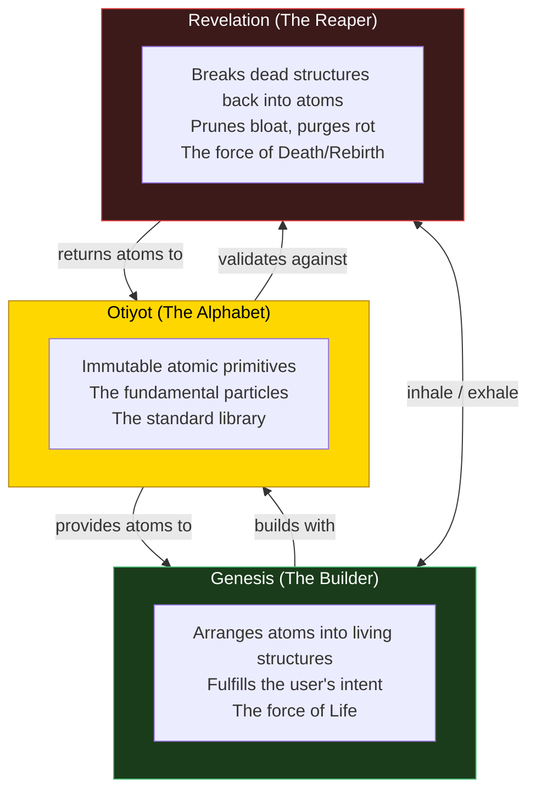
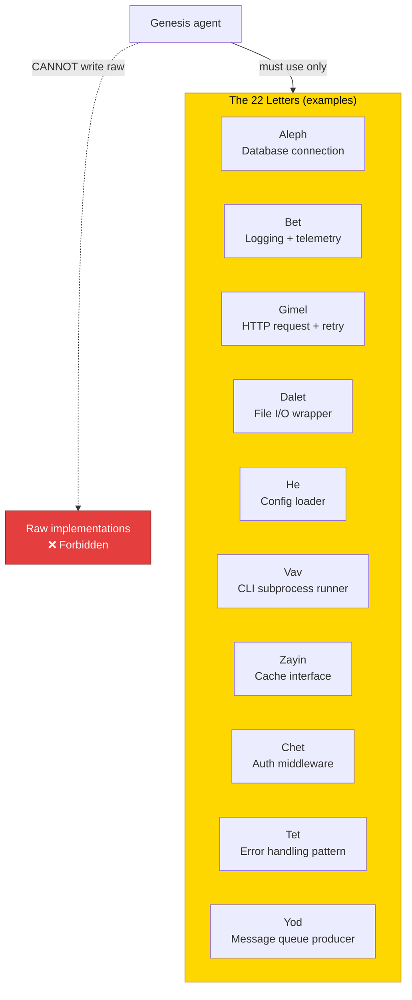
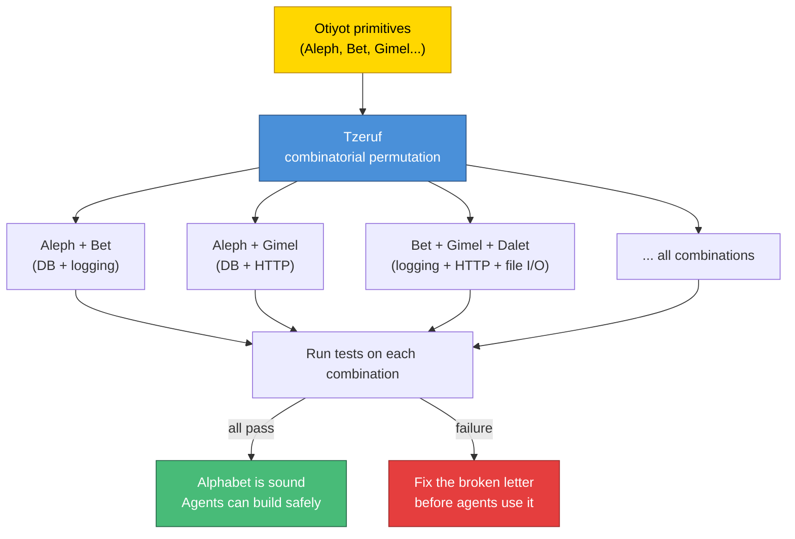
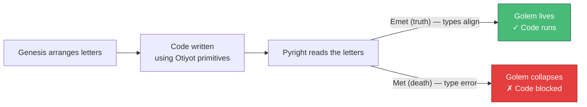
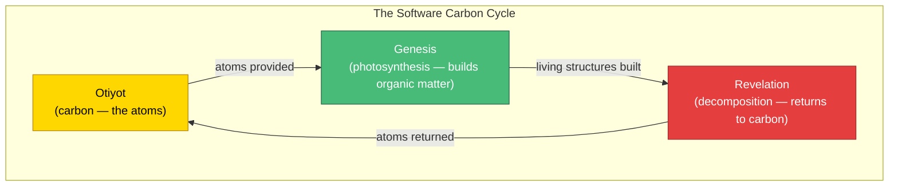

# Otiyot — The Architecture of the Alphabet

**Status:** Experiment. The foundational physics that Genesis and Revelation both operate on.

**Inspiration:** In the Sefer Yetzirah (Book of Formation), God created the universe through 22 Hebrew letters — the Otiyot. Every word, every name, every object in existence is a permutation of these sacred letters. The letters are not metaphors — they ARE the building blocks of reality. A mystic who knows the correct arrangement of letters can create life (the Golem). A single misplaced letter causes the Golem to collapse.

**What Otiyot is:** A strict, immutable component library — the atomic primitives that all Genesis agents MUST use. Instead of letting agents write raw, unconstrained code (which leads to hallucination), the Otiyot system forces them to build by arranging tested, verified, locked-down components. The agents can't invent their own physics. They must spell with the sacred alphabet.

**The Holy Trinity:**



---

## 1. The Problem — Hallucination

The biggest failure mode in AI-generated code is **hallucination**:

- An agent invents a library that doesn't exist (`import fast_cache_v2`)
- An agent writes a function that duplicates existing functionality but with slightly different behavior
- An agent creates a database connection pattern that doesn't match the project's existing pattern
- An agent uses `requests` when the project uses `httpx`

These aren't bugs — they're **misspellings in the language of creation.** The agent tried to write a word using letters that don't exist in the alphabet.

Otiyot solves this by **restricting the alphabet**. The agents can't invent new letters. They can only arrange the existing ones.

---

## 2. The 22 Letters — Atomic Primitives

The Otiyot is a strict component library — a set of immutable, perfectly tested atomic primitives that live in the repository. Every agent must use these instead of writing raw implementations.



**Each "letter" is:**

```python
# Example: Gimel — the HTTP request primitive
# src/genesis/otiyot/gimel.py

class Gimel:
    """The HTTP request letter. All HTTP calls go through this.

    Pre-configured with:
    - Retry with exponential backoff (3 attempts)
    - Timeout (30s default)
    - Structured logging of request/response
    - Error classification (transient vs permanent)

    Genesis agents MUST use Gimel for HTTP calls.
    They cannot write raw `httpx.get()` or `requests.get()`.
    """

    async def get(self, url: str, **kwargs) -> Response: ...
    async def post(self, url: str, data: dict, **kwargs) -> Response: ...
```

**Properties of a letter:**
- **Immutable** — agents cannot modify the letter's source code
- **Tested** — 100% test coverage with edge cases
- **Documented** — clear interface, clear when to use it
- **Atomic** — does one thing, does it perfectly
- **Composable** — letters combine to form words (features)

**The "22" is not literal.** The number of letters depends on the project. A small project might have 10 primitives. A large one might have 50. The point is that the set is **finite, locked, and complete** — agents spell with these letters or not at all.

---

## 3. Tzeruf — Algorithmic Permutation (Testing Engine)

In the Sefer Yetzirah, creation happens through **Tzeruf** — the mathematical permutation of letters. The mystic combines Aleph with Bet, Bet with Gimel, Gimel with Dalet, in every possible order, creating every possible word.

**In the system, Tzeruf is the fuzzing and combinatorial testing engine.** It takes the atomic components and algorithmically combines them in thousands of permutations to verify the foundation holds no matter how Genesis arranges the letters.



**What Tzeruf tests:**
- Each letter in isolation (unit tests)
- Each pair of letters combined (integration tests)
- Key multi-letter combinations (scenario tests)
- Edge cases: what happens when Aleph (database) receives null from Gimel (HTTP)?
- Stress: what happens when 100 concurrent Gimel calls go through the same Aleph connection?

**Tzeruf is NOT the same as Yesod.** Yesod (the integration gate) runs the project's test suite to validate a specific change. Tzeruf validates the **alphabet itself** — ensuring the primitives are sound before any agent uses them.

---

## 4. The Golem — Compiled Output

In Jewish folklore, a **Golem** is an animated clay figure created by inscribing Hebrew letters on its forehead. The word "Emet" (אמת, truth) brings the Golem to life. Erase one letter to make "Met" (מת, death) and the Golem collapses. A single misplaced letter is the difference between life and death.

**In the system, the Golem is the compiled, type-checked output.** The strict type checker (Pyright) reads the sequence of Otiyot that Genesis arranged. If the types don't align — if one letter is out of place — the system halts before the code ever runs.



**This is why Yesod (the integration gate) exists.** Yesod is the final Golem check — it runs Pyright, pytest, and git diff review. If any letter is misspelled (a type error, a failed test, an unintended change), the Golem doesn't animate. The code never reaches Malkuth (the Kingdom).

---

## 5. How Otiyot Connects to Genesis and Revelation

### Genesis uses the alphabet

When Genesis's Chesed node proposes new code, the prompt includes:

```
You MUST use the following project primitives. Do NOT write raw implementations
of these patterns — use the existing Otiyot:

- Database: use `from genesis.otiyot.aleph import Database`
- Logging: use `from genesis.otiyot.bet import Logger`
- HTTP: use `from genesis.otiyot.gimel import HttpClient`
- File I/O: use `from genesis.otiyot.dalet import FileHandler`
...
```

If an agent writes `import requests` instead of using Gimel, Gevurah (the adversarial critic) catches it: "Scope violation: raw HTTP call without using Otiyot.Gimel."

### Revelation returns atoms to the alphabet

When Revelation's Maveth node deletes dead code, it doesn't just remove it — it checks whether any of the dead code's logic should be **extracted into a new letter**. If a monolith contains a well-tested retry pattern that's been copy-pasted three times, Revelation:

1. Identifies the pattern as a duplicated Klipah (dead shell)
2. Extracts it into a new Otiyot letter (e.g., `Tet` — the error handling primitive)
3. Replaces all three copies with references to the new letter
4. Deletes the duplicates

The dead code is reborn as an atomic primitive. The rot becomes the foundation.

### Tzeruf validates the alphabet

Before any Genesis cycle runs, Tzeruf can verify that the Otiyot library is sound:

```
[pre-cycle] Tzeruf: validating 15 Otiyot primitives...
[pre-cycle] Tzeruf: 15/15 letters pass isolation tests
[pre-cycle] Tzeruf: 105/105 pairwise combinations pass
[pre-cycle] Tzeruf: alphabet is sound — Genesis may proceed
```

If Tzeruf finds a broken letter, Genesis is blocked until the letter is fixed. The agents cannot build on a cracked foundation.

---

## 6. The Carbon Cycle



The atoms are never created or destroyed — only arranged and rearranged:

1. **Otiyot** defines the atoms (immutable primitives)
2. **Genesis** arranges atoms into living structures (features)
3. **Revelation** decomposes dead structures back into atoms
4. Dead code returns to the Otiyot library as refined primitives
5. Genesis uses the refined atoms to build the next generation

The codebase breathes. It grows, it sheds, it grows again — always from the same fundamental alphabet.

---

## 7. What This is NOT

- **Not a framework** — Otiyot is project-specific. Each project defines its own alphabet based on its tech stack.
- **Not static forever** — new letters can be added (through human approval or Revelation extracting new primitives from dead code). But letters are never modified without running Tzeruf.
- **Not limiting** — the alphabet constrains HOW agents build, not WHAT they build. A finite alphabet produces infinite words.
- **Not required immediately** — Otiyot is the most mature pattern. Build it after the core Genesis/Revelation pipeline is working. The first version can be as simple as 5-10 commonly used wrappers.
