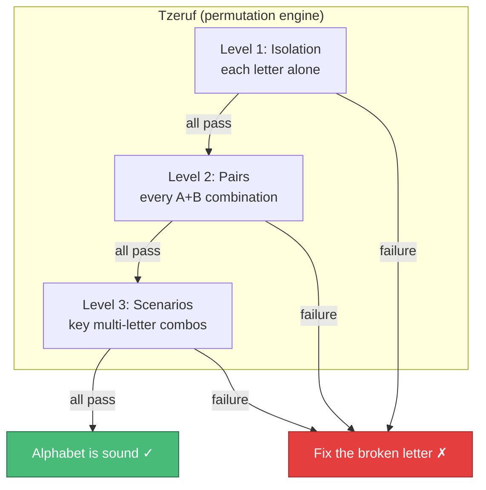
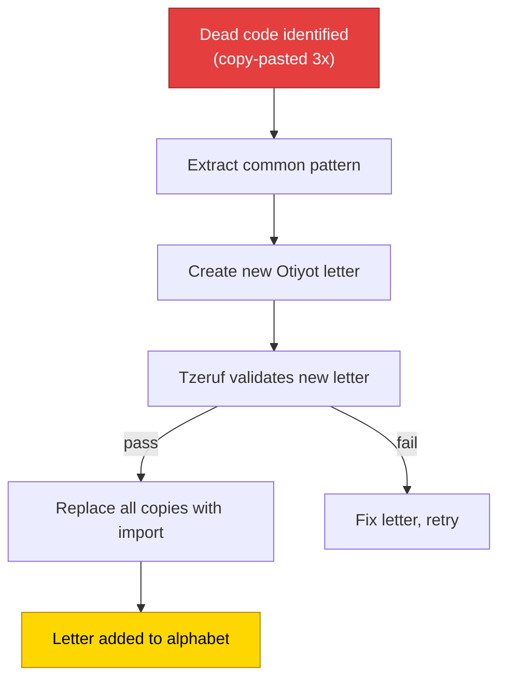
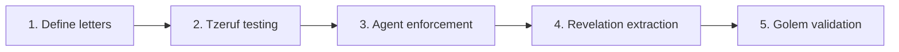

# Otiyot — Implementation approach

The foundational alphabet. Immutable atomic primitives that constrain how agents build.

**Paths:** New package `src/genesis/otiyot/` for the letter definitions. Testing engine in `src/genesis/otiyot/tzeruf.py`. Agent enforcement via prompt updates in existing nodes. Manifest at `OTIYOT.md` project root.

**Dependencies:** None — Otiyot is foundational. Can be built independently. Integrates with Genesis (agents must use letters), Revelation (dead code extracted into new letters), and Yesod (type-checked compilation).

---

## 1. The Otiyot package — defining letters

**Goal:** A strict component library where each letter is an immutable, tested primitive.

```
src/genesis/otiyot/
├── __init__.py         # Registry — exports all letters
├── registry.py         # Manifest of available letters + metadata
├── aleph.py            # Database/SQLite primitives
├── bet.py              # Logging + telemetry
├── gimel.py            # HTTP request + retry
├── dalet.py            # File I/O
├── he.py               # Config loading
├── vav.py              # CLI subprocess runner
├── tzeruf.py           # Combinatorial testing engine
└── tests/              # Per-letter test suites
    ├── test_aleph.py
    ├── test_bet.py
    └── ...
```

**Approach:**

- Each letter is a module exporting a single class or a small set of functions.
- Letters are extracted from existing Genesis code — not invented from scratch:
  - `aleph.py` — extract the SQLite patterns from `core/memory.py`, `core/evolution_memory.py`
  - `bet.py` — extract from `log.py` (already exists as `get_logger`)
  - `gimel.py` — extract the HTTP/subprocess patterns from `cli/runners.py`
  - `vav.py` — extract `run_cli()` from `cli/cli.py`
- Each letter has:
  ```python
  class Aleph:
      """Database connection primitive.

      Otiyot letter: immutable. Do not modify without running Tzeruf.

      Usage:
          from genesis.otiyot import Aleph
          db = Aleph("path/to/db.sqlite")
          await db.execute("SELECT ...")
      """
  ```

**The registry:**

```python
# src/genesis/otiyot/registry.py

ALPHABET: dict[str, dict] = {
    "aleph": {
        "module": "genesis.otiyot.aleph",
        "class": "Database",
        "description": "SQLite database connection with WAL mode and async support",
        "replaces": ["sqlite3.connect", "aiosqlite.connect"],
    },
    "bet": {
        "module": "genesis.otiyot.bet",
        "class": "Logger",
        "description": "Structured stderr logging with component names",
        "replaces": ["logging.getLogger", "print()"],
    },
    # ...
}

def get_manifest() -> str:
    """Return a formatted manifest for agent prompts."""
    lines = ["## Available Otiyot (you MUST use these)\n"]
    for name, info in ALPHABET.items():
        lines.append(f"- **{name.title()}**: `from {info['module']} import {info['class']}` — {info['description']}")
        if info.get("replaces"):
            lines.append(f"  - Replaces: {', '.join(f'`{r}`' for r in info['replaces'])}")
    return "\n".join(lines)
```

**Files to add:**

- `src/genesis/otiyot/__init__.py`
- `src/genesis/otiyot/registry.py`
- `src/genesis/otiyot/aleph.py` through `vav.py` (initial 6 letters)

---

## 2. Tzeruf — the testing engine

**Goal:** Validate the alphabet is sound before any agent uses it.



**Approach:**

- `src/genesis/otiyot/tzeruf.py`:
  ```python
  async def validate_alphabet() -> TzerufReport:
      """Run all three levels of Tzeruf validation."""
      report = TzerufReport()

      # Level 1: Each letter in isolation
      for letter_name, letter_info in ALPHABET.items():
          passed = await _test_letter(letter_name)
          report.isolation[letter_name] = passed

      # Level 2: Every pairwise combination
      for a, b in itertools.combinations(ALPHABET.keys(), 2):
          passed = await _test_pair(a, b)
          report.pairs[f"{a}+{b}"] = passed

      # Level 3: Key scenarios
      for scenario in SCENARIOS:
          passed = await _test_scenario(scenario)
          report.scenarios[scenario.name] = passed

      return report
  ```
- Tzeruf is run:
  - Before any Genesis cycle (as a pre-flight check)
  - After any letter is modified
  - Via `tzeruf validate` CLI command or MCP tool
- The testing doesn't use LLMs — it runs pytest on the letter test suites.

**Files to add:**

- `src/genesis/otiyot/tzeruf.py`

---

## 3. Agent enforcement — spelling with the alphabet

**Goal:** Genesis agents are forced to use Otiyot primitives instead of raw implementations.

**Approach — three enforcement layers:**

### Layer 1: Prompt injection

The Nitzotz implementation node's prompt includes the Otiyot manifest:

```python
# In build_implement_node() or the implementation subgraph
otiyot_manifest = get_manifest()
prompt = build_prompt(
    IMPLEMENT_SYSTEM_PROMPT,
    f"## Otiyot — Required Primitives\n\n{otiyot_manifest}\n\n"
    "You MUST use these primitives. Do NOT write raw implementations "
    "of patterns they cover.",
    task, context, plan,
)
```

### Layer 2: Gevurah enforcement

Gevurah's adversarial prompt includes Otiyot violation checking:

```python
# Added to GEVURAH_SYSTEM_PROMPT
"""
6. **Otiyot violations**: Check if the code uses raw implementations
   where an Otiyot primitive exists:
   - Raw `sqlite3.connect()` instead of Otiyot.Aleph → blocker
   - Raw `httpx.get()` instead of Otiyot.Gimel → blocker
   - Raw `subprocess.run()` instead of Otiyot.Vav → blocker
   - Manual retry loop instead of Otiyot.Gimel retry → warning
"""
```

### Layer 3: Yesod static check

Yesod's integration gate includes an AST scan for raw imports that should use Otiyot:

```python
# In yesod.py
async def _check_otiyot_compliance(changed_files: list[str]) -> list[str]:
    """Scan changed files for raw imports that should use Otiyot."""
    violations = []
    for path in changed_files:
        tree = ast.parse(Path(path).read_text())
        for node in ast.walk(tree):
            if isinstance(node, ast.Import):
                for alias in node.names:
                    if alias.name in BANNED_IMPORTS:
                        violations.append(f"{path}: raw `{alias.name}` — use Otiyot instead")
    return violations
```

**Files to change:**

- `src/genesis/nodes/pipeline/implement.py` — inject manifest into prompt
- `src/genesis/nodes/sefirot/gevurah.py` — add Otiyot violation category
- `src/genesis/nodes/sefirot/yesod.py` — add Otiyot compliance scan

---

## 4. Revelation extraction — dead code becomes letters

**Goal:** When Revelation finds a well-tested pattern duplicated across the codebase, extract it as a new Otiyot letter.



**Approach:**

- In Revelation's analysis phase: after identifying duplicated logic, check if:
  - The pattern appears 3+ times
  - The pattern is self-contained (no external state dependencies)
  - The pattern is tested in at least one location
- If extractable:
  1. Create a new letter module in `otiyot/`
  2. Write tests for it (based on existing tests)
  3. Run Tzeruf to validate
  4. Replace all copies with imports from the new letter
  5. Human approval before adding to the immutable alphabet

**Files to change:**

- `src/genesis/nodes/revelation/maveth.py` — add extraction logic
- New letters created dynamically in `src/genesis/otiyot/`

---

## 5. The Golem check — Yesod integration

**Goal:** Before code reaches Malkuth (commit), verify the Otiyot letters are used correctly.

**Approach:**

Yesod (the integration gate) adds three Otiyot-specific checks:

1. **Compliance scan** — AST check that no raw imports bypass Otiyot
2. **Type alignment** — Pyright verifies Otiyot types are used correctly
3. **Alphabet integrity** — Tzeruf confirms no letters are broken

If any check fails, the Golem collapses — code doesn't reach Malkuth.

**Files to change:**

- `src/genesis/nodes/sefirot/yesod.py` — add Otiyot checks to the validation suite

---

## Dependency order



Start with defining 5-6 letters extracted from existing code. Add Tzeruf. Then wire enforcement into agent prompts. Revelation extraction and Golem validation come last.
