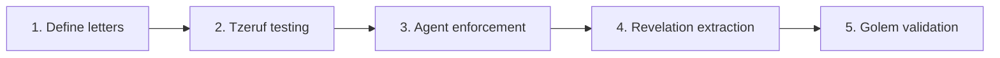

# Otiyot — TODO

The foundational alphabet. Immutable atomic primitives that all Genesis agents must use.

---

## Phase 1: Define the initial alphabet

- [ ] Create `src/genesis/otiyot/` package with `__init__.py`
- [ ] Identify the project's most common patterns by analyzing existing code:
  - [ ] Database/SQLite patterns → **Aleph** (`otiyot/aleph.py`)
  - [ ] Logging patterns → **Bet** (`otiyot/bet.py`)
  - [ ] HTTP/CLI subprocess patterns → **Gimel** (`otiyot/gimel.py`)
  - [ ] File I/O patterns → **Dalet** (`otiyot/dalet.py`)
  - [ ] Config loading patterns → **He** (`otiyot/he.py`)
  - [ ] CLI subprocess runner → **Vav** (`otiyot/vav.py`) — extract from `cli/runners.py`
- [ ] Each letter is a class or module with:
  - [ ] Clear interface (typed methods)
  - [ ] 100% test coverage
  - [ ] Docstring explaining when to use it
  - [ ] Marked as immutable (agents cannot modify)
- [ ] Create `src/genesis/otiyot/registry.py` — exports all letters, provides a manifest agents can read
- [ ] Start small: 5-10 letters for the first version
- [ ] Test: verify all letters import and their interfaces are consistent

---

## Phase 2: Tzeruf — combinatorial testing engine

- [ ] Create `src/genesis/otiyot/tzeruf.py`:
  - [ ] `test_isolation()` — run each letter's unit tests
  - [ ] `test_pairs()` — test every pairwise combination of letters
  - [ ] `test_scenarios()` — test key multi-letter combinations (e.g., DB + HTTP + logging)
  - [ ] `validate_alphabet()` — run all three levels, report pass/fail
- [ ] Tzeruf runs:
  - [ ] Before any Genesis cycle (pre-flight check)
  - [ ] After any letter is modified (regression check)
  - [ ] On demand via MCP tool or CLI
- [ ] Output: `TzerufReport` — which letters pass, which fail, which combinations break
- [ ] Test: introduce a bug in one letter, verify Tzeruf catches the broken combination

---

## Phase 3: Agent enforcement — making Genesis spell with the alphabet

- [ ] Update Nitzotz's implementation node prompt to include the Otiyot manifest:
  - [ ] "You MUST use the following project primitives. Do NOT write raw implementations."
  - [ ] List all available letters with their import paths and interfaces
- [ ] Update Gevurah (adversarial critic) to check for Otiyot violations:
  - [ ] "Raw `httpx.get()` without using Otiyot.Gimel" → blocker
  - [ ] "Direct `sqlite3.connect()` without using Otiyot.Aleph" → blocker
  - [ ] "Manual retry loop without using Otiyot.Gimel retry" → warning
- [ ] Update Chesed (scope proposer) to suggest Otiyot usage:
  - [ ] "This new endpoint uses raw HTTP — propose using Gimel instead"
- [ ] Create a `OTIYOT.md` manifest file at project root listing all available letters
- [ ] Test: have Genesis write code that uses raw HTTP → verify Gevurah catches it

---

## Phase 4: Revelation extraction — dead code becomes new letters

- [ ] In Revelation's Maveth node: after identifying dead code, check for extractable patterns:
  - [ ] If dead code contains a well-tested, reusable pattern → extract as new letter
  - [ ] If dead code was copy-pasted 3+ times → the pattern is begging to be a letter
- [ ] Extraction flow:
  1. Maveth identifies the pattern
  2. Shevirah extracts it into a new `otiyot/*.py` file
  3. Tzeruf tests the new letter in isolation and combination
  4. If Tzeruf passes → the letter is added to the alphabet
  5. All copies of the pattern are replaced with imports from the new letter
- [ ] Human approval for new letters (they become part of the immutable foundation)
- [ ] Test: plant a retry pattern in 3 files → Revelation extracts it into Otiyot.Tet

---

## Phase 5: Golem validation — type-checked compilation

- [ ] Integrate Otiyot with Yesod (integration gate):
  - [ ] Yesod checks that all code uses Otiyot primitives where they exist
  - [ ] Pyright strict mode validates that Otiyot types are used correctly
  - [ ] If an agent wrote raw code where an Otiyot letter exists → Yesod blocks
- [ ] The "Golem check": before code reaches Malkuth (commit), verify:
  - [ ] All Otiyot letters used correctly (types align)
  - [ ] No raw implementations of patterns covered by Otiyot
  - [ ] Tzeruf passes (alphabet is sound)
  - [ ] Pyright passes (no misspelled words of creation)
- [ ] Test: submit code with a type mismatch on an Otiyot primitive → verify Yesod blocks it
