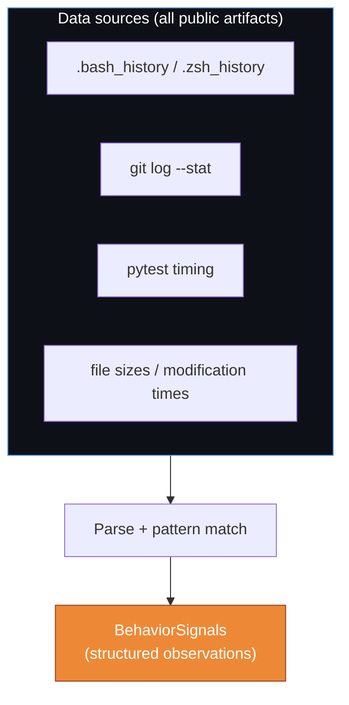
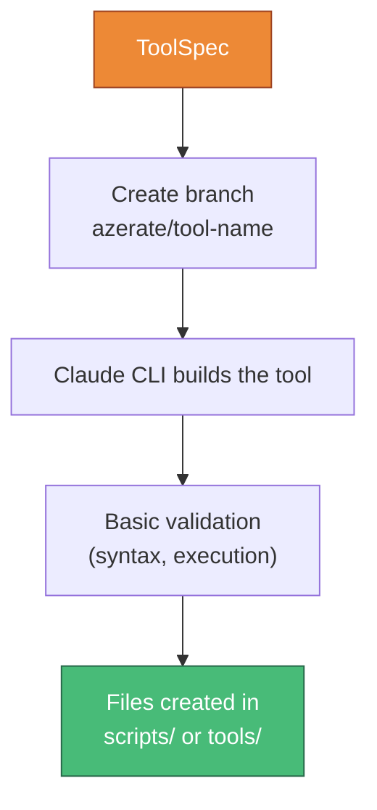
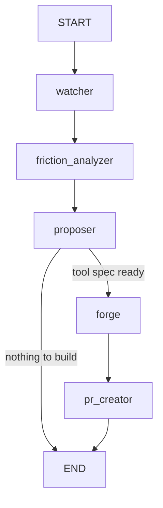
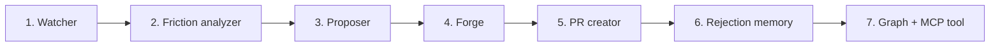

# Azerate — Implementation approach

The proactive tool-builder. Observes behavior, identifies friction, builds infrastructure.

**Paths:** New nodes in `src/genesis/nodes/azerate/`. Graph in `src/genesis/graphs/azerate.py`. Memory table in Da'at. Daemon script in `scripts/azerate.sh`.

**Dependencies:** Can run independently of Genesis patterns. Integrates with Ein Sof (dispatch after Genesis cycles), Da'at (rejection memory), and Otiyot (uses primitives if available). Respects DIRECTIVES.md.

---

## 1. The Watcher — reading your behavior

**Goal:** Observe terminal history, git patterns, and build metrics to produce behavioral signals.



**Approach:**

- `src/genesis/nodes/azerate/watcher.py`
- Purely deterministic — no LLM calls. Reads files and parses patterns.
- Shell history analysis:
  ```python
  async def _analyze_history(history_path: Path) -> list[BehaviorSignal]:
      """Find repeated command sequences in shell history."""
      lines = history_path.read_text().strip().split("\n")[-500:]  # Last 500 commands
      # Count command frequencies
      counter = Counter(lines)
      signals = []
      for cmd, count in counter.most_common(20):
          if count >= 10:
              signals.append(BehaviorSignal(
                  type="repeated_command",
                  description=f"Command typed {count} times: {cmd[:80]}",
                  evidence=cmd,
                  frequency=count,
                  impact="medium" if count < 50 else "high",
              ))
      return signals
  ```
- Git analysis: `git log --stat -50` parsed for file churn patterns
- Test timing: parse pytest output for slowest tests
- File size: `find . -name "*.py" -size +500` for monoliths

**Files to add:**

- `src/genesis/nodes/azerate/__init__.py`
- `src/genesis/nodes/azerate/watcher.py`

---

## 2. Friction analyzer — from signals to actionable friction

**Goal:** Rank friction points by impact and classify what kind of tool would fix each one.

**Approach:**

- `src/genesis/nodes/azerate/friction.py`
- Groups signals by category, ranks by `impact × frequency`
- Uses Haiku for classification: given a set of signals, what tool category would eliminate the friction?
- Pydantic structured output:
  ```python
  class FrictionPoint(BaseModel):
      category: str         # cli_automation | build_optimization | test_tooling | code_quality
      description: str
      proposed_solution: str
      estimated_time_saved: str
      priority: int
  ```

**Files to add:**

- `src/genesis/nodes/azerate/friction.py`

---

## 3. Tool proposer — selecting what to build

**Goal:** Pick the highest-priority friction point that hasn't been rejected, and generate a tool specification.

**Approach:**

- `src/genesis/nodes/azerate/proposer.py`
- Queries Da'at's `azerate_memory` table for previously rejected tools
- Filters out rejected friction categories
- Selects top 1 (one tool per cycle — prevents overwhelming)
- Cool-down: checks if a PR was opened in the last 24h
- Uses Haiku to generate a `ToolSpec`:
  ```python
  class ToolSpec(BaseModel):
      name: str             # e.g., "quick-push"
      category: str         # cli_automation
      description: str      # What it does
      files_to_create: list[str]  # e.g., ["scripts/quick-push.sh"]
      friction_addressed: str     # What problem it solves
      evidence: str         # Data that triggered this
  ```

**Files to add:**

- `src/genesis/nodes/azerate/proposer.py`

---

## 4. The Forge — building the tool

**Goal:** Create the tool files in a git branch. Never touch product code.



**Approach:**

- `src/genesis/nodes/azerate/forge.py`
- Creates a branch: `git checkout -b azerate/<tool-name>`
- Uses Claude CLI to write the tool based on the ToolSpec
- Writes only to allowed directories: `scripts/`, `tools/`, `.github/`
- Runs basic validation: `python -c "import ast; ast.parse(open('file').read())"` for Python files, `bash -n script.sh` for shell scripts
- Budget: 1 CLI call per tool (cheap — it's building scripts, not features)

**Guardrails enforced in the node:**
```python
ALLOWED_DIRS = {"scripts/", "tools/", ".github/"}
FORBIDDEN_PATHS = {"DIRECTIVES.md", "SPEC.md", "src/genesis/otiyot/"}

def _validate_paths(files: list[str]) -> bool:
    """Ensure all output files are in allowed directories."""
    return all(
        any(f.startswith(d) for d in ALLOWED_DIRS)
        and not any(f.endswith(p) for p in FORBIDDEN_PATHS)
        for f in files
    )
```

**Files to add:**

- `src/genesis/nodes/azerate/forge.py`

---

## 5. PR creator — presenting the fire

**Goal:** Open a PR with a clear explanation of what was observed and what was built.

**Approach:**

- `src/genesis/nodes/azerate/pr_creator.py`
- Uses `gh pr create` if the GitHub CLI is available, otherwise just pushes the branch and logs the description
- PR body template:
  ```markdown
  ## Azerate noticed something

  **Friction observed:** You type `git add -A && git commit -m "..." && git push` approximately 87 times per week.

  **Evidence:** Extracted from .zsh_history (last 7 days, 87 occurrences)

  **Tool built:** `scripts/quick-push.sh` — combines add, commit, and push into a single command with auto-formatting.

  **Estimated time saved:** ~15 minutes per week

  **Usage:**
  ```bash
  ./scripts/quick-push.sh "commit message"
  ```

  ---
  *Built by the Azerate. Reject this PR if you don't want this tool.*
  ```

**Files to add:**

- `src/genesis/nodes/azerate/pr_creator.py`

---

## 6. Rejection memory — learning from closed PRs

**Goal:** Remember what the human rejected so the Azerate doesn't rebuild it.

**Approach:**

- Add a `azerate_memory` table to the Da'at SQLite store:
  ```sql
  CREATE TABLE azerate_memory (
      id INTEGER PRIMARY KEY,
      timestamp REAL,
      tool_name TEXT,
      friction_type TEXT,
      description TEXT,
      accepted INTEGER,
      rejection_reason TEXT
  );
  ```
- New module `src/genesis/core/azerate_memory.py`:
  - `record_outcome(tool_name, friction_type, accepted, reason)`
  - `get_rejected_types()` — returns friction categories rejected 2+ times
  - `was_rejected(friction_type)` — quick check
- The proposer queries this before proposing: skip any friction type that's been rejected twice

**Files to add:**

- `src/genesis/core/azerate_memory.py`

---

## 7. Azerate graph

**Goal:** Wire the full proactive pipeline.



**Approach:**

- `src/genesis/graphs/azerate.py` with `build_azerate_graph()`
- Five nodes: watcher → friction_analyzer → proposer → forge → pr_creator
- Conditional: if proposer finds nothing (all friction addressed or all rejected) → END
- Checkpointer: `azerate_checkpoints.db`
- MCP tool: `chain_azerate()`
- Cursor keyword: `azerate start` → `chain_azerate()`

**Files to add:**

- `src/genesis/graphs/azerate.py`
- `src/genesis/nodes/azerate/__init__.py`
- Update `src/genesis/graphs/__init__.py`
- Update `src/genesis/server/mcp.py` — add tool
- Update `.cursor/rules/mcp-routing.mdc` — add keyword

---

## 8. Daemon + scheduling

**Goal:** Azerate can run on a schedule (nightly) or on demand.

**Approach:**

- `scripts/azerate.sh` — simple runner:
  ```bash
  #!/usr/bin/env bash
  echo "Azerate: observing..."
  uv run genesis-azerate
  echo "Azerate: fire delivered."
  ```
- Add `genesis-azerate` entry point to `pyproject.toml` (or use the MCP tool)
- Can be added to cron: `0 2 * * * /path/to/scripts/azerate.sh`
- Ein Sof can dispatch it after Genesis completes a cycle

---

## Dependency order



The Watcher is standalone and can be tested immediately. Each subsequent node builds on the previous. The graph ties them together last.
