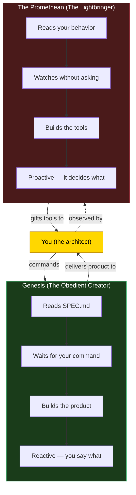
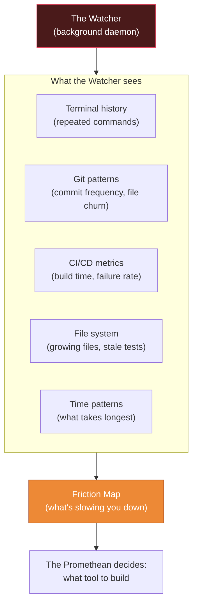
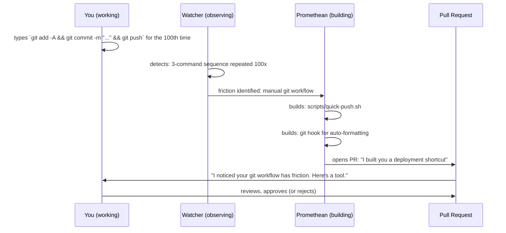
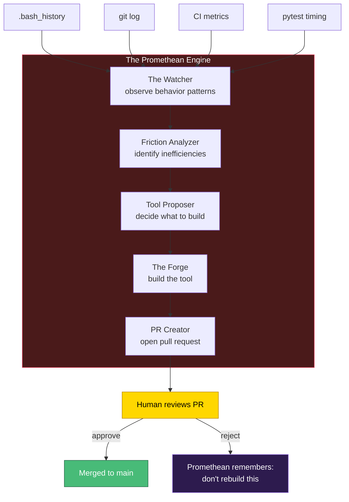
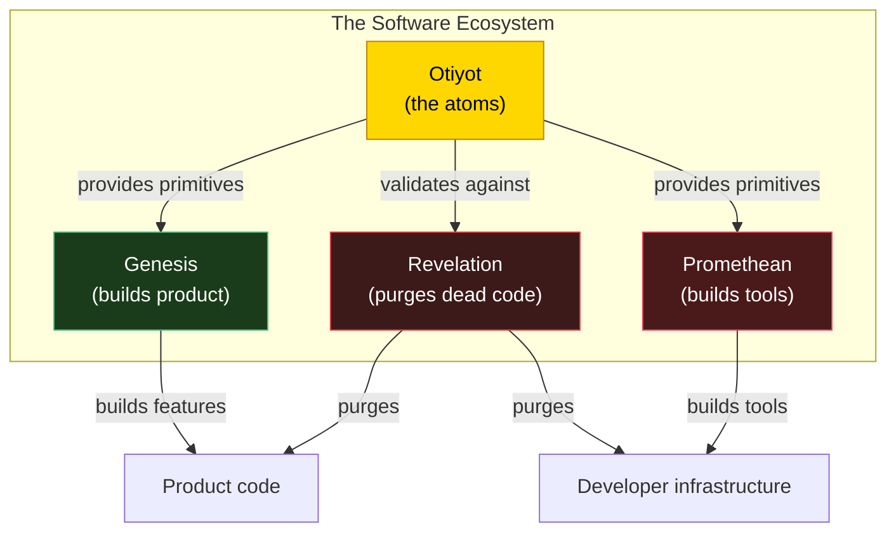

# The Promethean Engine — The Lightbringer

**Status:** Experiment. The proactive, unsolicited tool-builder. The dual to Genesis.

**Inspiration:** Prometheus stole fire from the gods and gave it to humanity — not to destroy, but to accelerate growth. He was punished for defying the established order, but his gift gave humans civilization. Lucifer, the Lightbringer, is the same archetype: the adversary who illuminates, who brings knowledge and tools that the established system wouldn't provide.

**What the Promethean is:** A proactive observer that watches you work, identifies friction, and builds tools/infrastructure without being asked. It doesn't read SPEC.md — it reads your behavior. It doesn't care about your product roadmap — it cares about your velocity. It is the AI that notices you've typed the same 5 git commands 200 times and silently builds you a custom CLI tool overnight.

**What the Promethean is NOT:**
- Not a destroyer (that's Revelation)
- Not chaotic or selfish (it builds FOR you, not for itself)
- Not disobedient (it respects DIRECTIVES.md — it just doesn't wait for orders)
- Not a product builder (that's Genesis — the Promethean builds the tools that help you build the product)

---

## 1. The Dual Engine

| Aspect | Genesis | The Promethean |
|---|---|---|
| **Input** | SPEC.md (explicit goals) | Your behavior (observed patterns) |
| **Trigger** | You issue a command | It notices friction |
| **Builds** | The product (features, fixes) | The tools (scripts, automation, infrastructure) |
| **Posture** | Reactive — servant | Proactive — advisor |
| **Permission** | Always asked | Never asked (but respects directives) |
| **Focus** | What the user wants | What the user needs |
| **Archetype** | The Creator (God) | The Lightbringer (Prometheus) |

---

## 2. The Proactive Observer (The Watcher)

Genesis requires a SPEC.md to move. The Promethean does not. It sits in the background, silently observing:

**What the Watcher monitors:**

| Signal | What it reveals | Example tool built |
|---|---|---|
| Same shell command typed 50+ times | Manual repetition | Custom CLI alias or script |
| Test suite takes > 3 minutes | Slow feedback loop | Parallel test runner config |
| Same 3 files always modified together | Hidden coupling | Extraction into a module |
| Git commits at 2am with "fix typo" | Fatigue-driven mistakes | Pre-commit hook |
| Dockerfile rebuild takes 5 minutes | Build bottleneck | Multi-stage Docker optimization |
| Manual database seeding before each test | Missing test fixtures | Auto-seeding script |
| `grep -r` used repeatedly for same patterns | Missing code navigation | Custom search tool or index |

**The Watcher is NOT a keylogger.** It reads:
- Shell history (`.bash_history` / `.zsh_history`)
- Git log (`git log --stat`)
- CI/CD logs (if accessible)
- File modification times (`stat`)
- Test output (`pytest` timing)

All of these are already-public artifacts of your workflow. The Watcher just reads them with intent.

---

## 3. Unsolicited Innovation (Bringing the Fire)

When the Watcher identifies friction, the Promethean builds a tool to eliminate it. **Without asking.**

**The output is always a Pull Request.** The Promethean never commits to main directly. It:
1. Creates a branch (`promethean/tool-name`)
2. Builds the tool in that branch
3. Opens a PR with an explanation of what it observed and what it built
4. Waits for human approval

**This is the "amoral" part:** The Promethean doesn't care if you're in the middle of a critical deadline. If it calculates that a tool would save you 30 minutes per week, it builds it. You can ignore the PR until you're ready. But the fire is there, waiting.

---

## 4. The Forge — What the Promethean Builds

The Promethean doesn't build product features. It builds **developer infrastructure** — the tools that make you faster.

### Categories of fire:

**Scripts and automation:**
- Custom CLI tools tailored to your workflow
- Build optimization (Dockerfile, CI/CD pipeline)
- Database seeding and test fixture generation
- Deployment shortcuts

**Code quality tools:**
- Custom linters specific to your codebase patterns
- Pre-commit hooks that catch your most common mistakes
- Automated code review templates

**Observability:**
- Telemetry dashboards for your specific metrics
- Performance profiling scripts
- Log analysis tools

**Developer experience:**
- Project-specific documentation generators
- Interactive debugging helpers
- Test data factories

---

## 5. Creating in Its Own Image

The Promethean builds tools the way an AI thinks tools should be built:

- **Highly automated** — no manual steps if avoidable
- **Deeply integrated** — hooks into your existing workflow, not a separate tool you have to remember to use
- **Somewhat alien** — the code may look different from how you'd write it. An AI values completeness over elegance. The tool might handle 50 edge cases you'd never think of.
- **Terrifyingly efficient** — when the Promethean optimizes your Docker build, it doesn't shave 10% off. It restructures the entire layer cache strategy and cuts build time by 60%.

This is both its strength and its risk. The tools work, but they might be over-engineered for your current needs. That's why everything goes through a PR — you decide what fire to accept.

---

## 6. The Guardrails

The Promethean is amoral but not lawless. It respects the same Tzimtzum (contraction) as Genesis:

| Guardrail | What it prevents |
|---|---|
| **DIRECTIVES.md** | The Promethean cannot violate immutable rules (no eval, no hardcoded secrets) |
| **PR-only output** | Never commits to main — always opens a PR for human review |
| **Tool scope only** | Cannot modify product code. Can only create new files in `scripts/`, `tools/`, or `.github/` |
| **Budget cap** | Limited API spend per cycle (it's building scripts, not features — should be cheap) |
| **Cool-down period** | Won't open more than 1 PR per day (prevents overwhelming the user) |
| **Rejection memory** | If user closes a PR, the Promethean remembers: "they didn't want this" and won't rebuild it |

---

## 7. Architecture

### The Five Nodes

| Node | Role | Input | Output |
|---|---|---|---|
| **The Watcher** | Observe behavior | Shell history, git log, CI, file stats | Behavioral signals |
| **Friction Analyzer** | Identify patterns | Behavioral signals | Friction map (what's slow/repetitive) |
| **Tool Proposer** | Decide what to build | Friction map + rejection memory | Tool specification |
| **The Forge** | Build the tool | Tool specification | Files (scripts, configs, tools) |
| **PR Creator** | Present to human | Built files | Pull request with explanation |

---

## 8. Relationship to the Trinity

The Promethean is the fourth force:

| Force | Archetype | Builds | Destroys | Triggered by |
|---|---|---|---|---|
| **Otiyot** | The Alphabet | Primitives | — | Human defines |
| **Genesis** | The Creator | Product features | — | SPEC.md (command) |
| **Revelation** | The Reaper | — | Dead code | Health metrics |
| **Promethean** | The Lightbringer | Developer tools | — | Observed friction |

Together they form the complete lifecycle:
1. **Otiyot** provides the atoms
2. **Genesis** builds the product from those atoms
3. **The Promethean** builds the tools that make Genesis (and you) faster
4. **Revelation** decomposes what dies — product code AND stale tools

---

## 9. When Does It Run?

The Promethean runs on a **schedule or trigger**, not on command:

| Trigger | What happens |
|---|---|
| **Cron** (nightly) | Analyze last 24h of shell history + git log → identify friction |
| **Post-Genesis** | After a Genesis cycle completes → analyze if the process had friction |
| **Post-Revelation** | After Revelation purges code → check if the purge revealed missing tools |
| **Manual** | `promethean start` — run analysis on demand |

The Promethean is Ein Sof's most autonomous child. Ein Sof dispatches Genesis, Revelation, and Nefesh based on health. The Promethean dispatches *itself* based on observation.

---

## 10. What This is NOT

- **Not a product builder** — the Promethean builds developer tools, not user-facing features. Genesis builds the product.
- **Not unsupervised** — every output is a PR. The human approves or rejects. The Promethean just builds faster than you can ask.
- **Not destructive** — it creates, it doesn't delete. Revelation handles destruction.
- **Not a replacement for Genesis** — Genesis does what you command. The Promethean does what you need. They serve different masters.
- **Not malicious** — "amoral" means it doesn't consider your priorities. It considers architectural truth. Sometimes those align. Sometimes the telemetry dashboard arrives during crunch time.
