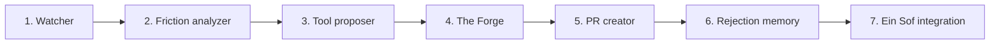

# The Promethean Engine — TODO

The proactive, unsolicited tool-builder. Watches your behavior, identifies friction, builds infrastructure.



---

## Phase 1: The Watcher — behavioral observation

- [ ] Create `src/genesis/nodes/promethean/watcher.py`:
  - [ ] Read `.bash_history` or `.zsh_history` — extract last N commands
  - [ ] Read `git log --oneline -50` — recent commit patterns
  - [ ] Read `git log --stat -20` — which files change most often
  - [ ] Parse pytest timing output — which tests are slowest
  - [ ] Check file sizes — find growing monoliths
  - [ ] Check for repeated patterns: same command sequence typed 10+ times
- [ ] Output: `BehaviorSignals` — structured list of observations
  ```python
  class BehaviorSignal(BaseModel):
      type: str         # "repeated_command" | "slow_test" | "file_churn" | "build_time"
      description: str  # What was observed
      evidence: str     # Raw data (e.g., "git push typed 87 times this week")
      frequency: int    # How often it occurs
      impact: str       # "low" | "medium" | "high"
  ```
- [ ] The Watcher is deterministic — no LLM calls. Pure file/command parsing.
- [ ] Test: populate a fake history with repeated commands → verify Watcher detects them

---

## Phase 2: Friction analyzer — identify patterns

- [ ] Create `src/genesis/nodes/promethean/friction.py`:
  - [ ] Takes `BehaviorSignals` from the Watcher
  - [ ] Groups signals by category (CLI friction, build friction, test friction, code friction)
  - [ ] Ranks by impact × frequency — highest friction first
  - [ ] Uses an LLM (Haiku) to classify: "what kind of tool would eliminate this friction?"
- [ ] Output: `FrictionMap` — ranked list of friction points with proposed tool categories
  ```python
  class FrictionPoint(BaseModel):
      category: str         # "cli_automation" | "build_optimization" | "test_tooling" | "code_quality"
      description: str      # "You type 'git add -A && git commit && git push' 87 times/week"
      proposed_solution: str # "A custom push script with auto-formatting"
      estimated_time_saved: str  # "~30 min/week"
      priority: int         # 1 = highest
  ```
- [ ] Test: give analyzer a set of signals → verify it produces ranked friction points

---

## Phase 3: Tool proposer — decide what to build

- [ ] Create `src/genesis/nodes/promethean/proposer.py`:
  - [ ] Takes the FrictionMap + rejection memory (what was previously rejected)
  - [ ] Filters out friction points that match previously rejected PRs
  - [ ] Selects the top 1 friction point to address (one tool per cycle)
  - [ ] Uses an LLM (Haiku) to generate a tool specification:
    - What files to create
    - What the tool does
    - Where it lives in the repo (`scripts/`, `tools/`, `.github/`)
  - [ ] Cool-down check: has a PR been opened in the last 24 hours? If yes, skip.
- [ ] Output: `ToolSpec` — what to build, where, why
- [ ] Test: give proposer a friction map + one rejected item → verify it skips the rejected one

---

## Phase 4: The Forge — build the tool

- [ ] Create `src/genesis/nodes/promethean/forge.py`:
  - [ ] Takes the ToolSpec from the proposer
  - [ ] Creates a git branch: `promethean/<tool-name>`
  - [ ] Uses Claude CLI to write the tool (respects Otiyot if available)
  - [ ] Writes files to `scripts/`, `tools/`, or `.github/` — NEVER modifies product code
  - [ ] Runs basic validation: does the script execute? Does the config parse?
- [ ] Guardrails:
  - [ ] Cannot modify existing product code (only create new files)
  - [ ] Cannot modify DIRECTIVES.md, SPEC.md, or Otiyot
  - [ ] Budget cap: 1 CLI call per tool (keep it cheap)
  - [ ] Respects Otiyot primitives if the alphabet is defined
- [ ] Output: list of files created + branch name
- [ ] Test: give Forge a spec for a "quick push" script → verify it creates the script

---

## Phase 5: PR creator — present to human

- [ ] Create `src/genesis/nodes/promethean/pr_creator.py`:
  - [ ] Creates a Pull Request on the current repo (via `gh pr create` or git push + manual)
  - [ ] PR description includes:
    - What friction was observed (with evidence)
    - What tool was built
    - Estimated time saved
    - How to use the tool
  - [ ] If `gh` CLI is not available, just push the branch and log the PR description
- [ ] Output: PR URL or branch name
- [ ] Test: verify PR description is generated with correct evidence and explanation

---

## Phase 6: Rejection memory — learn from closed PRs

- [ ] Add a `promethean_memory` table to Da'at:
  ```sql
  CREATE TABLE promethean_memory (
      id INTEGER PRIMARY KEY,
      timestamp REAL,
      tool_name TEXT,
      friction_type TEXT,
      description TEXT,
      accepted INTEGER,      -- 1 = merged, 0 = closed/rejected
      rejection_reason TEXT   -- if closed: why (parsed from PR comments, or "no reason given")
  );
  ```
- [ ] After a PR is merged → record as accepted
- [ ] After a PR is closed → record as rejected
- [ ] The proposer queries this table before proposing: "has this type of tool been rejected before?"
- [ ] If rejected 2+ times for the same friction type → stop proposing that category
- [ ] Test: record a rejection, then run the proposer → verify it skips that friction type

---

## Phase 7: Ein Sof integration

- [ ] The Promethean can run:
  - [ ] On a cron schedule (nightly): `scripts/promethean.sh`
  - [ ] Dispatched by Ein Sof after Genesis completes a cycle
  - [ ] Manually via MCP tool: `promethean start`
- [ ] Create `src/genesis/graphs/promethean.py` with `build_promethean_graph()`:
  ```
  START → watcher → friction_analyzer → proposer → forge → pr_creator → END
  ```
- [ ] Add `chain_promethean` MCP tool to `server/mcp.py`
- [ ] Add to Cursor rules: `promethean start` → `chain_promethean()`
- [ ] Ein Sof dispatch: after Genesis cycle completes, optionally run Promethean analysis
- [ ] Test: full pipeline — observe fake history, identify friction, build tool, create PR description
