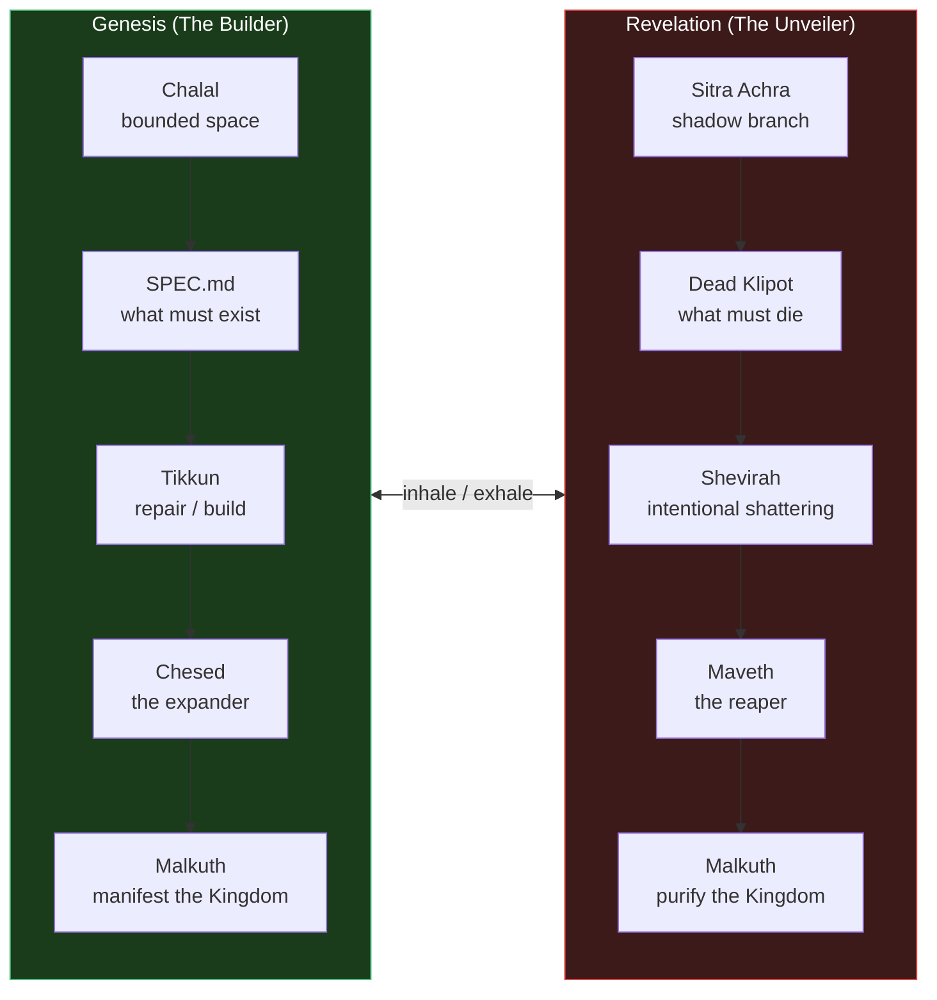
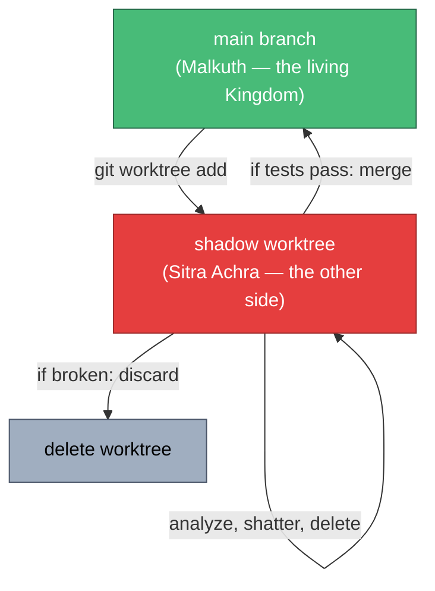
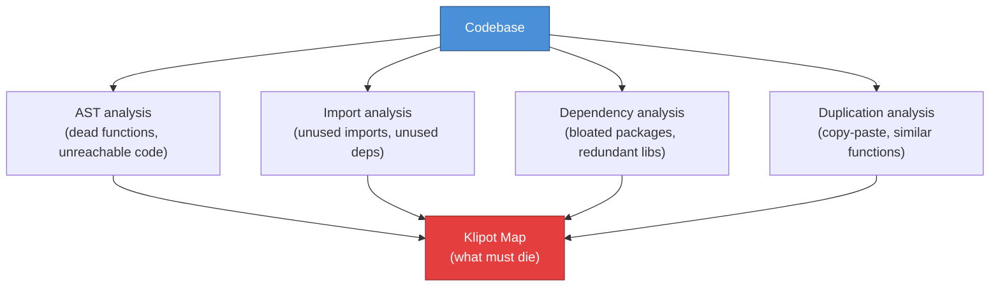
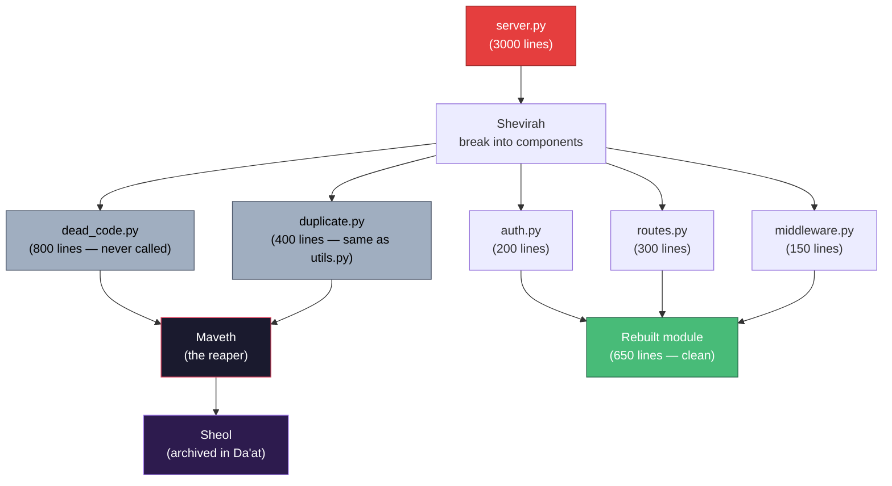
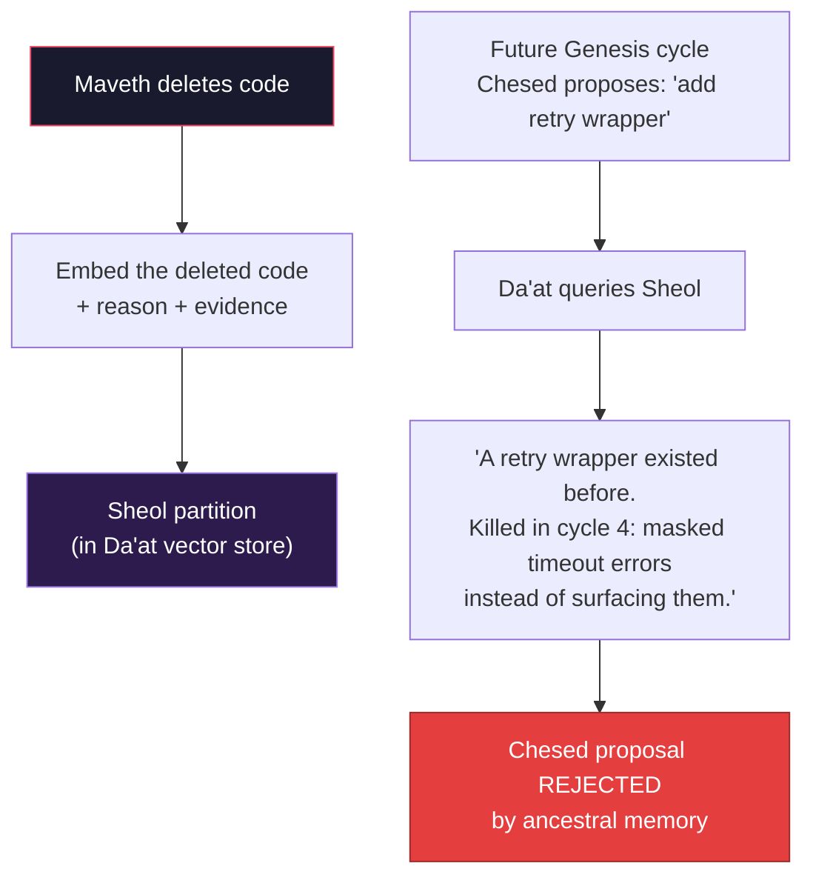
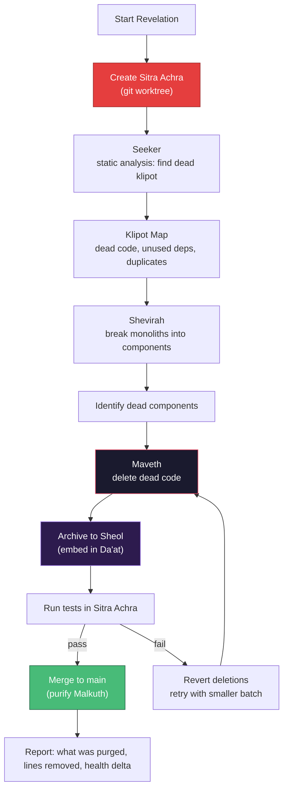

# Revelation — The Unveiling

**Status:** Experiment. The destructive complement to Genesis. While Genesis builds the Kingdom (Malkuth), Revelation purifies it by burning away dead code, bloated abstractions, and stagnant dependencies.

**Inspiration:** In Kabbalistic tradition, the Sitra Achra ("the other side") is the shadow realm — the domain of dead shells (Klipot) that trap divine light. Revelation is the act of entering the shadow, identifying what has died, and deliberately shattering it so the trapped light can be freed. In Christian eschatology, Revelation is the apocalypse — not destruction for its own sake, but the unveiling of what was hidden, the purification that precedes renewal.

**Relationship to Genesis:** Genesis inhales — it builds the world. Revelation exhales — it burns away the rot. Together they form a complete breath. One without the other is incomplete: Genesis alone accumulates bloat; Revelation alone leaves nothing standing.

---

## 1. The Symmetry



| Aspect | Genesis | Revelation |
|---|---|---|
| **Domain** | Chalal (bounded space) | Sitra Achra (shadow branch) |
| **Target** | SPEC.md (what must exist) | Dead Klipot (what must die) |
| **Primary action** | Tikkun (repair/build) | Shevirah (intentional shattering) |
| **Primary agent** | Chesed (the expander) | Maveth (the reaper) |
| **Result** | Manifest the Kingdom | Purify the Kingdom |
| **Risk** | Bloat, scope creep | Over-deletion, breaking dependencies |

---

## 2. The Domain — Sitra Achra (The Shadow Branch)

Revelation does NOT run on the main branch. It operates in the **Sitra Achra** — a shadow copy of the repository where agents are allowed to break things, delete files, and dismantle architecture without crashing the live Kingdom.



**Implementation:** `git worktree add ../sitra-achra -b revelation`. This creates a full copy of the repo in a separate directory. Revelation agents operate in this worktree. If the result is cleaner and tests pass → merge back to main. If agents broke something → `git worktree remove ../sitra-achra` and try again.

**Why a worktree and not just a branch?** Because Revelation agents need to delete files, run tests, and verify the result in isolation. A worktree gives them a complete, separate filesystem without interfering with any running Genesis processes on main.

---

## 3. The Targets — The Three Dead Klipot

In Kabbalah, there are four types of Klipot. The translucent one (Klipat Nogah) contains redeemable sparks — Genesis uses these as the graduated dispatch layers. But the lowest three Klipot are purely dead matter:

| Klipah | What it traps | System equivalent |
|---|---|---|
| **Klipat Stormwind** | Chaos, confusion | Duplicated logic — the same thing implemented three different ways |
| **Klipat Cloud** | Obscured vision | Dead code — functions that are never called, imports that are never used |
| **Klipat Fire** | Consuming energy | Bloated dependencies — libraries imported for one function, monoliths that consume memory |

**The Seeker node** identifies these through static analysis:



**Tools (all deterministic, no LLM):**
- `vulture` — Python dead code finder
- `ruff check --select F401,F841` — unused imports and variables
- Custom AST walker — find functions with zero callers
- `pip-audit` or dependency size analysis — find bloated packages
- Code similarity detection — find duplicated logic

---

## 4. The Action — Shevirah (Intentional Shattering)

In the Genesis story, the Shattering of the Vessels was a tragic accident — the light was too intense for the vessels. In Revelation, the shattering is **deliberate and tactical**.

When a file has grown into a monolith (e.g., `server.py` at 3000 lines), it has become a rigid vessel that traps the logic inside. The Shevirah node intentionally breaks it apart:



**The shattering is not random.** The Shevirah node:
1. Parses the file's AST to identify logical boundaries (classes, function groups, import clusters)
2. Traces call graphs to find which pieces talk to which
3. Splits the monolith into logical components
4. Identifies which components are dead (no external callers)
5. Hands the dead components to Maveth

---

## 5. The Executioner — Maveth (The Death Node)

**Maveth** is the reaper. It does not write code. Its only tool is `delete`.

```python
class MavethAction(BaseModel):
    """A single deletion action."""
    target: str          # File path or function name
    reason: str          # Why this is being deleted
    evidence: str        # Static analysis evidence (e.g. "0 callers found")
    risk: str            # "safe" | "moderate" | "risky"
```

**Rules:**
- Maveth can only delete what the Seeker identified as dead
- Every deletion includes the reason and evidence
- "Risky" deletions require human approval (HITL gate, like human_review)
- Maveth runs tests after each batch of deletions — if tests break, the batch is reverted

**Maveth is Gevurah's darker sibling.** Gevurah (in Sefirot) restricts — it says "this code is flawed." Maveth goes further — it says "this code is dead" and removes it from existence.

---

## 6. The Archive — Sheol (The Underworld)

When Maveth deletes code, the logic isn't lost. The memory of the dead code — what it was, why it existed, and why it was killed — is embedded and sent to **Sheol**, a specific partition in the Da'at vector database.



**Sheol prevents resurrection of dead code.** If Genesis's Chesed node ever proposes rebuilding something that Revelation already killed, Da'at checks Sheol first. The ancestral memory says: "This was tried before. It was killed for good reason. Don't rebuild it."

This creates a **ratchet effect** — the codebase can only move forward. Dead patterns stay dead. Evolution doesn't repeat its mistakes.

---

## 7. The Full Revelation Pipeline



---

## 8. When to Run Revelation

Revelation is triggered by Chayah (the evolution loop) or Ein Sof (the meta-orchestrator) when:

- Health score is high but codebase size keeps growing → **bloat detected**
- SPEC.md is complete but there's nothing productive to do → **maintenance mode**
- Dead code percentage exceeds a threshold (e.g., > 10% of functions have zero callers)
- Dependency count or bundle size crosses a limit
- Human explicitly requests: `revelation start`

Chayah's triage would gain a new action: `"purge"` — dispatch Revelation instead of idling.

| Triage decision | Pattern dispatched |
|---|---|
| Tests failing | Nitzotz (focused fix) |
| Many independent issues | Nefesh (parallel swarm) |
| Feature from spec | Nitzotz (phased pipeline) |
| Healthy + spec complete + codebase growing | **Revelation (purge)** |
| Healthy + spec complete + codebase lean | Idle (converged) |

---

## 9. What This is NOT

- **Not refactoring** — Revelation doesn't rewrite code. It identifies and deletes dead code. Refactoring is Genesis's job (Chesed + Tiferet).
- **Not running on main** — Revelation always operates in a shadow worktree. The live Kingdom is never at risk.
- **Not destructive without memory** — everything Maveth kills is archived in Sheol. The death is recorded, not forgotten.
- **Not unsupervised for risky deletions** — "risky" deletions (code that MIGHT have callers via dynamic dispatch or reflection) require human approval.
