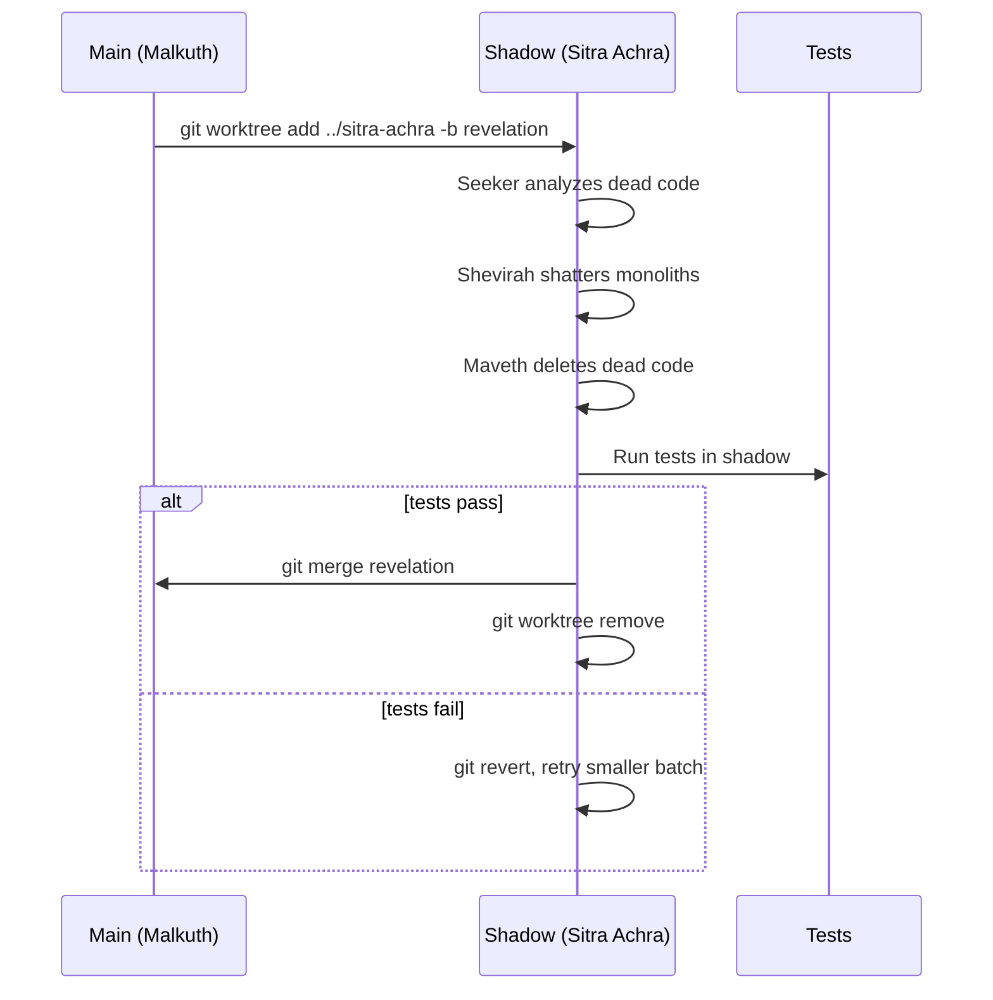
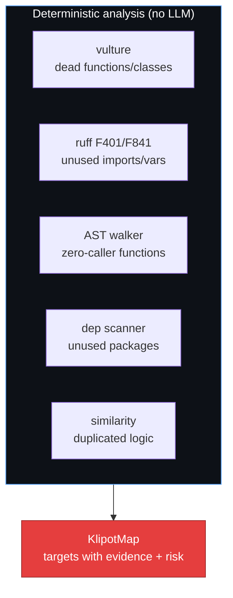
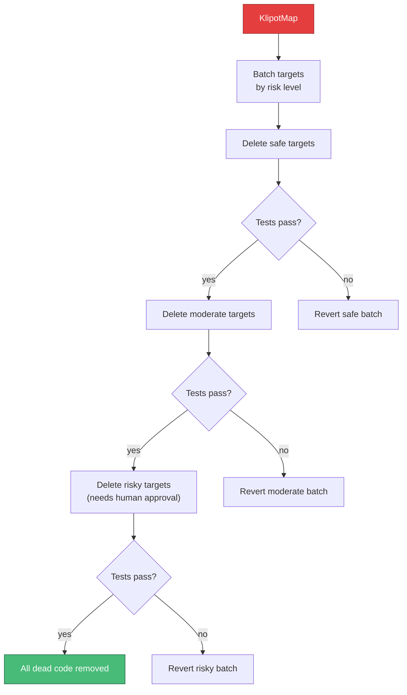
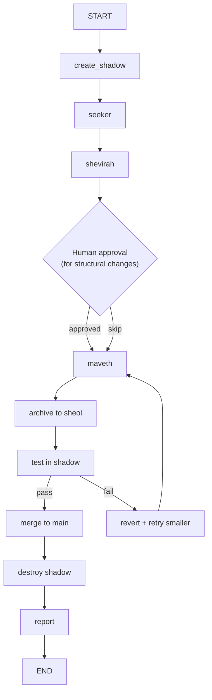
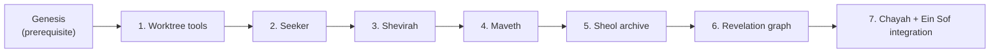

# Revelation — Implementation approach

The purification pipeline. Enters the Sitra Achra (shadow branch) to find and destroy dead code.

**Paths:** New nodes in `src/genesis/nodes/revelation/`. Graph in `src/genesis/graphs/revelation.py`. Worktree tools in `src/genesis/tools/worktree.py`. Sheol table in Da'at store.

**Dependencies:** Requires Genesis core (Nitzotz, Sefirot) to be implemented. Integrates with Chayah (triage dispatches "purge" action) and Ein Sof (direct dispatch). Da'at/Gematria enables Sheol memory.

---

## 1. Sitra Achra — the shadow worktree

**Goal:** All Revelation operations happen in isolation. The live Kingdom (main branch) is never at risk.



**Approach:**

- New module `src/genesis/tools/worktree.py` with async git worktree management.
- `create_shadow()` creates the worktree + branch. `destroy_shadow()` cleans up.
- All Revelation nodes receive the shadow worktree path and set `cwd` to it for subprocess calls.
- `merge_shadow()` merges the revelation branch to main, then removes the worktree.

**Files to add:**

- `src/genesis/tools/worktree.py`

---

## 2. Seeker — finding the dead Klipot

**Goal:** Map all dead code, unused imports, bloated dependencies, and duplicated logic.



**Approach:**

- New node `src/genesis/nodes/revelation/seeker.py`.
- Runs five analysis passes, all via `asyncio.create_subprocess_exec`:
  1. `vulture src/` — finds unused functions, classes, variables
  2. `ruff check --select F401,F841 --output-format json src/` — unused imports
  3. Custom AST walker — builds a call graph and finds functions with zero callers
  4. Dependency scan — cross-references `pyproject.toml` deps with actual imports
  5. Code similarity — hash function bodies, find near-duplicates
- Each target gets a risk assessment: "safe" (no callers, no dynamic dispatch), "moderate" (few callers, might be used via reflection), "risky" (used in tests or dynamic imports).
- Output: `KlipotMap` — list of `DeadTarget` dicts.

**Files to add:**

- `src/genesis/nodes/revelation/seeker.py`

---

## 3. Shevirah — breaking monoliths

**Goal:** Identify files that have grown too large and propose intelligent splits.

**Approach:**

- New node `src/genesis/nodes/revelation/shatter.py`.
- Threshold: files > 500 lines get analyzed for splitting.
- Uses Python's `ast` module to parse the file and identify:
  - Class boundaries
  - Function clusters (groups of functions that call each other)
  - Import dependency chains
- Proposes a split plan: which functions/classes move to which new files.
- Uses an LLM (Haiku) for naming the new files and verifying the split makes semantic sense.
- The split plan requires human approval (HITL gate) since it's a structural change.

**Files to add:**

- `src/genesis/nodes/revelation/shatter.py`

---

## 4. Maveth — the reaper

**Goal:** Delete dead code. Only tool is `delete`. Every deletion is logged.



**Approach:**

- New node `src/genesis/nodes/revelation/maveth.py`.
- Processes targets in order of risk: safe → moderate → risky.
- Each risk level is a batch. After deleting a batch, run `pytest` in the shadow worktree.
- If tests fail → revert that batch, mark those targets as "actually needed," and move on.
- "Risky" targets trigger `interrupt()` for human approval before deletion.
- Every deletion is recorded: what was deleted, why, evidence, lines removed.

**Files to add:**

- `src/genesis/nodes/revelation/maveth.py`

---

## 5. Sheol — the underworld (dead code archive)

**Goal:** Archive deleted code so it can never be accidentally rebuilt.

**Approach:**

- Add a `sheol` table to the existing Da'at SQLite store (or a new `sheol.db`):
  ```sql
  CREATE TABLE sheol (
      id INTEGER PRIMARY KEY,
      timestamp REAL,
      path TEXT,
      name TEXT,
      code_snippet TEXT,
      reason TEXT,
      evidence TEXT,
      category TEXT,
      lines_removed INTEGER
  );
  ```
- After Maveth deletes code → insert a row with the code snippet, reason, and evidence.
- When Genesis runs (specifically when Chesed proposes new code), query Sheol:
  - If Chesed proposes adding a function that's textually similar to something in Sheol → warn.
  - Future: use vector embeddings (Gematria) for semantic similarity, not just text matching.
- New module `src/genesis/core/sheol.py` with `archive_deletion()` and `check_sheol()`.

**Files to add:**

- `src/genesis/core/sheol.py`

---

## 6. Revelation graph

**Goal:** Wire the full pipeline.



**Approach:**

- New graph `src/genesis/graphs/revelation.py` with `build_revelation_graph()`.
- Nodes: `create_shadow`, `seeker`, `shevirah`, `human_approval` (HITL), `maveth`, `archive_to_sheol`, `test_shadow`, `merge_or_revert`, `destroy_shadow`, `report`.
- Conditional: test failure → revert and retry with smaller batch.
- Conditional: structural changes → HITL gate.
- Add `chain_revelation` MCP tool to `server/mcp.py`.
- Separate checkpointer: `revelation_checkpoints.db`.

**Files to add:**

- `src/genesis/graphs/revelation.py`
- `src/genesis/nodes/revelation/__init__.py`
- Update `src/genesis/graphs/__init__.py` — add export
- Update `src/genesis/server/mcp.py` — add `chain_revelation` tool

---

## 7. Integration with Chayah and Ein Sof

**Goal:** Revelation is dispatched automatically when the codebase needs purification.

**Approach:**

- Add `"purge"` to Chayah's triage actions (in `nodes/evolution/triage.py`):
  - When: health is good, spec is complete, but codebase size is growing or dead code > threshold
  - Triage dispatches Revelation instead of idling
- Ein Sof can also dispatch Revelation directly via its pattern selector.
- Add `revelation start` to Cursor keyword routing in `.cursor/rules/mcp-routing.mdc`.

**Files to change:**

- `src/genesis/nodes/evolution/triage.py` — add "purge" action
- `src/genesis/nodes/ein_sof_dispatch.py` — add "revelation" pattern
- `.cursor/rules/mcp-routing.mdc` — add keyword

---

## Dependency order



All phases are sequential. The worktree must exist before the Seeker can analyze. The Seeker must find targets before Maveth can delete. Sheol must exist before the archive can store memories.
