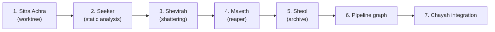

# Revelation — TODO

The purification pipeline. Complements Genesis by removing dead code, bloated dependencies, and stagnant abstractions.



---

## Phase 1: Sitra Achra — shadow worktree management

- [ ] Create `src/chimera/tools/worktree.py`:
  - [ ] `create_shadow()` — `git worktree add ../sitra-achra -b revelation`
  - [ ] `destroy_shadow()` — `git worktree remove ../sitra-achra`
  - [ ] `merge_shadow()` — merge revelation branch back to main if tests pass
  - [ ] `is_shadow_clean()` — check if shadow worktree exists and has no conflicts
- [ ] All Revelation operations run in the shadow worktree (cwd set to `../sitra-achra`)
- [ ] Test: create worktree, make a change, merge back, destroy worktree

---

## Phase 2: Seeker — static analysis to find dead Klipot

- [ ] Create `src/chimera/nodes/revelation/seeker.py`:
  - [ ] Run `vulture` for dead code detection (functions, classes, variables with zero references)
  - [ ] Run `ruff check --select F401,F841` for unused imports and variables
  - [ ] Custom AST walker: find functions with zero callers across the project
  - [ ] Dependency analysis: find packages in pyproject.toml not imported anywhere
  - [ ] Code duplication: find functions with > 80% similarity (simple hash or AST comparison)
- [ ] Output: `KlipotMap` — structured list of dead code targets with evidence
  ```python
  class DeadTarget(BaseModel):
      path: str           # file path
      name: str           # function/class/import name
      category: str       # "dead_code" | "unused_import" | "unused_dep" | "duplicate"
      evidence: str       # e.g. "0 callers found via AST analysis"
      lines: int          # lines that would be removed
      risk: str           # "safe" | "moderate" | "risky"
  ```
- [ ] Test: run seeker on the genesis codebase, verify it finds real dead code (or reports clean)

---

## Phase 3: Shevirah — intentional shattering of monoliths

- [ ] Create `src/chimera/nodes/revelation/shatter.py`:
  - [ ] Identify files exceeding a size threshold (e.g., > 500 lines)
  - [ ] Parse AST to identify logical boundaries (class groups, function clusters, import blocks)
  - [ ] Trace internal call graph to find which pieces depend on which
  - [ ] Propose a split: which functions move to which new files
  - [ ] Uses LLM (Haiku) for naming the new files and deciding groupings
- [ ] Output: `ShatterPlan` — list of proposed file splits with before/after
- [ ] Human approval gate for shattering (this is a big structural change)
- [ ] Test: give shatter a 500+ line file, verify it proposes sensible splits

---

## Phase 4: Maveth — the reaper (deletion engine)

- [ ] Create `src/chimera/nodes/revelation/maveth.py`:
  - [ ] Takes KlipotMap from Seeker + ShatterPlan from Shevirah
  - [ ] Deletes identified dead code targets
  - [ ] Removes unused imports and dependencies
  - [ ] Removes duplicate implementations (keeps the canonical one)
  - [ ] Each deletion logged with reason and evidence
  - [ ] "Risky" targets require human approval before deletion
- [ ] After each batch of deletions: run `uv run pytest` in the shadow worktree
  - [ ] If tests pass → continue
  - [ ] If tests fail → revert last batch, mark targets as "risky", try smaller batch
- [ ] Output: `ReapReport` — what was deleted, why, lines removed, test results
- [ ] Test: plant dead code in a test file, run Maveth, verify it's removed and tests pass

---

## Phase 5: Sheol — archive deleted code in Da'at

- [ ] Add a `sheol` table to the Da'at vector store:
  ```sql
  CREATE TABLE sheol (
      id INTEGER PRIMARY KEY,
      timestamp REAL,
      path TEXT,
      name TEXT,
      code_snippet TEXT,       -- first 500 chars of deleted code
      reason TEXT,
      evidence TEXT,
      embedding BLOB           -- vector embedding of the code (for future Gematria queries)
  );
  ```
- [ ] After Maveth deletes code → embed it and insert into Sheol
- [ ] When Genesis's Chesed proposes new code → query Sheol for similar patterns
  - [ ] If Sheol has a match: warn "this pattern was killed before — reason: ..."
- [ ] Test: delete a retry wrapper, then have Chesed propose a retry wrapper → verify Sheol blocks it

---

## Phase 6: Revelation pipeline graph

- [ ] Create `src/chimera/graphs/revelation.py` with `build_revelation_graph()`:
  ```
  START → create_shadow → seeker → shevirah → maveth → sheol → test → merge_or_revert → END
  ```
- [ ] Conditional: if tests fail after Maveth → revert and retry with smaller batch
- [ ] Conditional: if shatter plan needs human approval → interrupt (HITL)
- [ ] Progress messages: `[revelation] Seeker: found 12 dead functions`, `[revelation] Maveth: removed 340 lines`
- [ ] Add `chain_deadcode` MCP tool to server/mcp.py
- [ ] Checkpointer: separate `revelation_checkpoints.db`
- [ ] Test: run full pipeline on a codebase with planted dead code

---

## Phase 7: Chayah + Ein Sof integration

- [ ] Add `"purge"` action to Chayah's triage node
  - [ ] When: health is good, spec is complete, but codebase size is growing or dead code > 10%
  - [ ] Triage dispatches to Revelation instead of idling
- [ ] Ein Sof can dispatch Revelation directly when it detects bloat
- [ ] Add Revelation to the Cursor keyword routing: `revelation start` → `chain_deadcode()`
- [ ] Test: Chayah triage with healthy codebase + growing size → verify it dispatches Revelation
